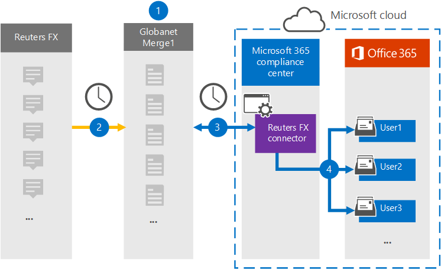

# Configurar un conector para archivar datos de Reuters FX

Use un conector Globanet en el Centro de cumplimiento de Microsoft 365 para importar y archivar datos desde la plataforma Reuters FX a los buzones de usuario de su organización de Microsoft 365. Globanet proporciona un conector [Reuters FX](https://globanet.com/reuters-fx/) que está configurado para capturar elementos del origen de datos de terceros (de forma regular) y, a continuación, importar esos elementos a Microsoft 365. El conector convierte las monedas y las tasas de cambio de la cuenta de Reuters FX en un formato de mensaje de correo electrónico y, a continuación, importa esos elementos al buzón del usuario en Microsoft 365.

Después de almacenar los datos fx de Reuters en buzones de usuario, puede aplicar características de cumplimiento de Microsoft 365, como retención por juicio, exhibición de documentos electrónicos, directivas de retención y etiquetas de retención, y cumplimiento de comunicaciones. El uso de un conector Fx de Reuters para importar y archivar datos en Microsoft 365 puede ayudar a su organización a cumplir con las directivas gubernamentales y reglamentarias.

## Información general sobre el archivado de datos fx de Reuters

En la siguiente introducción se explica el proceso de uso de un conector para archivar datos de Reuters FX en Microsoft 365.

1. Su organización trabaja con Reuters FX para configurar y configurar un sitio de Reuters FX.

2. Una vez cada 24 horas, los elementos fx de Reuters se copian en el sitio de Globanet Merge1. El conector también convierte los elementos a un formato de mensaje de correo electrónico.

3. El conector Fx de Reuters que crea en el Centro de cumplimiento de Microsoft 365, se conecta al sitio de Globanet Merge1 todos los días y transfiere el contenido a una ubicación segura de Azure Storage en la nube de Microsoft.

4. El conector importa los elementos a los buzones de usuarios específicos mediante el valor de la propiedad *Email* de la asignación automática de usuarios, tal como se describe en [el paso 3.](#step-3-map-users-and-complete-the-connector-setup) Se crea una subcarpeta en la carpeta Bandeja de entrada denominada **Reuters FX** en los buzones de usuario y los elementos se importan a esa carpeta. El conector determina a qué buzón se importarán los elementos mediante el valor de la *propiedad Email.* Cada elemento fx de Reuters contiene esta propiedad, que se rellena con la dirección de correo electrónico de todos los participantes del elemento.

## Antes de empezar

- Cree una cuenta de Globanet Merge1 para los conectores de Microsoft. Para crear una cuenta, póngase en contacto [con el servicio de soporte al cliente de Globanet.](https://globanet.com/contact-us) Debe iniciar sesión en esta cuenta cuando cree el conector en el paso 1.

- El usuario que crea el conector FX de Reuters en el paso 1 (y lo completa en el paso 3) debe estar asignado al rol importar o exportar buzones en Exchange Online. Este rol es necesario para agregar conectores en la página **Conectores** de datos en el Centro de cumplimiento de Microsoft 365. De forma predeterminada, este rol no se asigna a ningún grupo de roles en Exchange Online. Puede agregar el rol De importación y exportación de buzones al grupo de roles Administración de la organización en Exchange Online. O bien, puede crear un grupo de roles, asignar el rol de importación y exportación de buzones de correo y, a continuación, agregar los usuarios adecuados como miembros. Para obtener más información, consulte  las secciones Crear grupos de [roles](https://docs.microsoft.com/Exchange/permissions-exo/role-groups#create-role-groups) o Modificar grupos de roles en el artículo "Administrar grupos de roles en Exchange Online".

## Paso 1: Configurar el conector Fx de Reuters

El primer paso es acceder a la página **Conectores** de datos en Microsoft 365 y crear un conector para los datos fx de Reuters.

1. Vaya a [https://compliance.microsoft.com](https://compliance.microsoft.com/) y, a continuación, **haga clic en Conectores de** datos  >  **Reuters FX**.

2. En la página **de descripción del producto Reuters FX,** haga clic en Agregar **conector.**

3. En la **página Términos de** servicio, haga clic **en Aceptar.**

4. Escriba un nombre único que identifique el conector y, a continuación, haga clic en **Siguiente**.

5. Inicie sesión en su cuenta merge1 para configurar el conector.

## Paso 2: Configurar el conector FX de Reuters en el sitio de Globanet Merge1

El segundo paso es configurar el conector Reuters FX en el sitio de Globanet Merge1. Para obtener información acerca de cómo configurar el conector Fx de Reuters, vea la Guía del usuario de [Conectores de terceros Merge1.](https://docs.ms.merge1.globanetportal.com/Merge1%20Third-Party%20Connectors%20Reuters%20FX%20User%20Guide%20.pdf)

Después de hacer clic en &  **finalizar,** se muestra la página Asignación de usuarios en el Asistente para conectores en el Centro de cumplimiento de Microsoft 365.

## Paso 3: Asignar usuarios y completar la configuración del conector

Para asignar usuarios y completar la configuración del conector en el Centro de cumplimiento de Microsoft 365, siga los pasos siguientes:

1. En la página Asignar usuarios de Reuters FX a usuarios de **Microsoft 365,** habilite la asignación automática de usuarios.

   Los elementos FX de Reuters incluyen una propiedad denominada *Correo* electrónico, que contiene direcciones de correo electrónico para los usuarios de su organización. Si el conector puede asociar esta dirección con un usuario de Microsoft 365, los elementos se importan al buzón de ese usuario.

2. Haga **clic en** Siguiente, revise  la configuración y vaya a la página Conectores de datos para ver el progreso del proceso de importación para el nuevo conector.

## Paso 4: Supervisar el conector Reuters FX

Después de crear el conector Fx de Reuters, puede ver el estado del conector en el Centro de cumplimiento de Microsoft 365.

1. Vaya a <https://compliance.microsoft.com/> conectores de **datos y haga clic en** conectores de datos en el panel de navegación izquierdo.

2. Haga clic **en la pestaña Conectores** y, a continuación, seleccione el conector **Fx de Reuters** para mostrar la página desplegable, que contiene las propiedades y la información sobre el conector.

3. En Estado del conector  **con origen,** haga clic en el vínculo Descargar registro para abrir (o guardar) el registro de estado del conector. Este registro contiene datos que se han importado a la nube de Microsoft.

## Problemas conocidos

- En este momento, no se admite la importación de datos adjuntos o elementos de más de 10 MB. La compatibilidad con elementos más grandes estará disponible en una fecha posterior.
