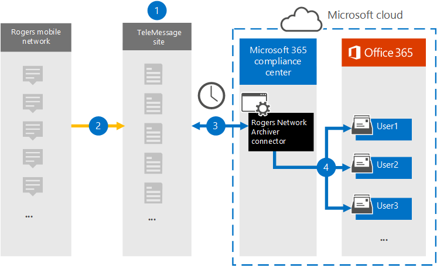

# Configuración de un conector para archivar datos de Rogers Network

[!include[Purview banner](../includes/purview-rebrand-banner.md)]

Use el conector TeleMessage en el portal de cumplimiento de Microsoft Purview para importar y archivar datos DE SMS y MMS desde la red móvil de Rogers. Después de configurar y configurar un [conector de Rogers Network Archiver](https://www.telemessage.com/mobile-archiver/network-archiver/rogers/), se conecta a la red móvil de Rogers de su organización e importa datos SMS y MMS a buzones de Microsoft 365.

Una vez que los datos de la red móvil de Rogers se almacenan en buzones de usuario, puede aplicar a los datos características de Microsoft Purview, como suspensión por juicio, búsqueda de contenido y directivas de retención de Microsoft 365. Por ejemplo, puede buscar mensajes SMS y MMS desde la red móvil de Rogers mediante la búsqueda de contenido o una búsqueda asociada a un caso de exhibición de documentos electrónicos (estándar) de Microsoft Purview. El uso de un conector de Rogers Network Archiver para importar y archivar datos en Microsoft 365 puede ayudar a su organización a cumplir las normas de gobernanza corporativa y las directivas reglamentarias.

## Información general sobre el archivado de datos de red móvil de Rogers

En la información general siguiente se explica el proceso de uso de un conector para archivar los datos DE SMS y MMS de Rogers en Microsoft 365.

1. Su organización trabaja con TeleMessage para configurar un conector de Rogers Network Archiver. Para obtener más información, consulte [Activación del archivador de red de TeleMessage Rogers para Microsoft 365](https://www.telemessage.com/microsoft-365-activation-for-the-rogers-network-archiver/).

2. En tiempo real, los datos de red móvil de Rogers de su organización se copian en el sitio de TeleMessage.

3. El conector rogers network archiver que se crea en el portal de cumplimiento se conecta al sitio de TeleMessage todos los días y transfiere los mensajes de correo electrónico de las 24 horas anteriores a un área de Azure Storage segura en la nube de Microsoft.

4. El conector importa los elementos de comunicación móviles al buzón de un usuario específico. Se creará una nueva carpeta denominada Rogers SMS/MMS Network Archiver en el buzón de correo del usuario específico y los elementos se importarán en él. El conector realiza la asignación mediante el valor de la propiedad Dirección *de correo electrónico del usuario* . Cada mensaje de correo electrónico contiene esta propiedad, que se rellena con la dirección de correo electrónico de cada participante del mensaje de correo electrónico.

   Además de la asignación automática de usuarios mediante el valor de la propiedad Dirección *de correo electrónico del usuario* , también puede definir una asignación personalizada mediante la carga de un archivo de asignación CSV. Este archivo de asignación debe contener el número de móvil del usuario y la dirección de buzón de Microsoft 365 correspondiente para cada usuario. Si habilita la asignación automática de usuarios y proporciona una asignación personalizada, para cada elemento de correo electrónico, el conector examinará primero el archivo de asignación personalizado. Si no encuentra un usuario de Microsoft 365 válido que se corresponda con el número de móvil de un usuario, el conector usará la propiedad de dirección de correo electrónico del usuario del elemento de correo electrónico. Si el conector no encuentra un usuario Microsoft 365 válido en el archivo de asignación personalizado o en la propiedad de *dirección de correo electrónico del usuario* del elemento de correo electrónico, el elemento no se importará.

## Antes de configurar un conector

- Pida el [servicio Rogers Network Archiver desde TeleMessage](https://www.telemessage.com/mobile-archiver/order-mobile-archiver-for-o365/) y obtenga una cuenta de administración válida para su organización. Tendrá que iniciar sesión en esta cuenta al crear el conector en el centro de cumplimiento.

- Registre todos los usuarios que requieran el archivado de Rogers Network en la cuenta de TeleMessage. Al registrar usuarios, asegúrese de usar la misma dirección de correo electrónico que se usa para su cuenta de Microsoft 365.

- Los empleados deben tener teléfonos móviles corporativos y corporativos responsables en la red móvil de O2. El archivado de mensajes en Microsoft 365 no está disponible para dispositivos propiedad de los empleados o "Traiga sus propios dispositivos (BYOD).

- Obtenga la cuenta de Rogers y los detalles de contacto de facturación de su organización para que pueda completar los formularios de incorporación y solicitar el servicio de archivado de mensajes de Rogers.

- Al usuario que crea un conector de Rogers Network Archiver en el paso 3 se le debe asignar el rol Administrador del conector de datos. Este rol es necesario para agregar conectores en la página **Conectores de datos** del portal de cumplimiento. Este rol se agrega de forma predeterminada a varios grupos de roles. Para obtener una lista de estos grupos de roles, consulte la sección "Roles en los centros de seguridad y cumplimiento" de [Permisos en el Centro de cumplimiento de & seguridad](../security/office-365-security/permissions-in-the-security-and-compliance-center.md#roles-in-the-security--compliance-center). Como alternativa, un administrador de su organización puede crear un grupo de roles personalizado, asignar el rol Administrador del conector de datos y, a continuación, agregar los usuarios adecuados como miembros. Para obtener instrucciones, consulte la sección "Crear un grupo de roles personalizado" en [Permisos en el portal de cumplimiento de Microsoft Purview](microsoft-365-compliance-center-permissions.md#create-a-custom-role-group).

- Este conector de datos de TeleMessage está disponible en entornos de GCC en la nube Microsoft 365 administración pública de EE. UU. Las aplicaciones y servicios de terceros pueden implicar almacenar, transmitir y procesar los datos de clientes de su organización en sistemas de terceros que están fuera de la infraestructura de Microsoft 365 y, por tanto, no están cubiertos por los compromisos de protección de datos y Microsoft Purview. Microsoft no hace ninguna representación de que el uso de este producto para conectarse a aplicaciones de terceros implica que esas aplicaciones de terceros son compatibles con FEDRAMP.

## Creación de un conector de Rogers Network Archiver

Después de completar los requisitos previos descritos en la sección anterior, puede crear el conector de Rogers Network Archiver en el portal de cumplimiento. El conector usa la información que proporciona para conectarse al sitio de TeleMessage y transferir los datos de Rogers SMS/MMS a los cuadros de buzón de usuario correspondientes en Microsoft 365.

1. Vaya a y, a <https://compliance.microsoft.com> continuación, haga clic en **Conectores** >  de **datosRogers Network Archiver**.

2. En la página de descripción del producto **Rogers Network Archiver** , haga clic en **Agregar conector**.

3. En la página **Términos de servicio** , haga clic en **Aceptar**.

4. En la página **Iniciar sesión en TeleMessage** , en el paso 3, escriba la información necesaria en los cuadros siguientes y, a continuación, haga clic en **Siguiente**.

    - **Nombre de usuario:** Nombre de usuario de TeleMessage.

    - **Contraseña:** La contraseña de TeleMessage.

5. Una vez creado el conector, puede cerrar la ventana emergente y ir a la página siguiente.

6. En la página **Asignación de** usuarios, habilite la asignación automática de usuarios. Para habilitar la asignación personalizada, cargue un archivo CSV que contenga la información de asignación de usuarios y, a continuación, haga clic en **Siguiente**.

7. Revise la configuración y, a continuación, haga clic en **Finalizar** para crear el conector.

8. Vaya a la pestaña Conectores de la página **Conectores de datos** para ver el progreso del proceso de importación del nuevo conector.

## Problemas conocidos

- En este momento, no se admiten la importación de datos adjuntos o elementos que superen los 10 MB. La compatibilidad con elementos más grandes estará disponible en una fecha posterior.
