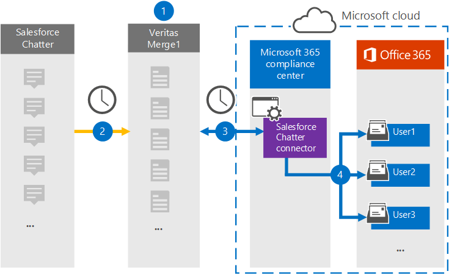

# Configurar un conector para archivar datos de chatter chatter (versión preliminar)Set up a connector to archive Salesforce Chatter data (preview)

Use un conector de Globanet en el centro de cumplimiento de Microsoft 365 para importar y archivar datos desde la plataforma de Salesforce chatter a los buzones de usuario de la organización 365 de Microsoft.Use a Globanet connector in the Microsoft 365 compliance center to import and archive data from the Salesforce Chatter platform to user mailboxes in your Microsoft 365 organization. Globanet proporciona un conector [chatter de Salesforce](http://globanet.com/chatter/) que captura elementos de un origen de datos de terceros e importa esos elementos a Microsoft 365.Globanet provides a [Salesforce Chatter](http://globanet.com/chatter/) connector that captures items from the third-party data source and imports those items to Microsoft 365. El conector convierte el contenido como chats, datos adjuntos y publicaciones de Salesforce chatter a un formato de mensaje de correo electrónico y, a continuación, importa esos elementos al buzón del usuario en Microsoft 365.The connector converts the content such as chats, attachments, and posts from Salesforce Chatter to an email message format and then imports those items to the user’s mailbox in Microsoft 365.

Una vez que los datos de Salesforce chatter se almacenan en buzones de usuario, puede aplicar las características de cumplimiento de Microsoft 365, como retención por juicio, eDiscovery, directivas de retención y etiquetas de retención.After Salesforce Chatter data is stored in user mailboxes, you can apply Microsoft 365 compliance features such as Litigation Hold, eDiscovery, retention policies and retention labels. El uso de un conector chatter de Salesforce para importar y archivar datos en Microsoft 365 puede ayudar a su organización a cumplir las directivas gubernamentales y regulatorias.Using a Salesforce Chatter connector to import and archive data in Microsoft 365 can help your organization stay compliant with government and regulatory policies.

## Información general sobre el archivado de datos chatter de SalesforceOverview of archiving Salesforce Chatter data

La información general siguiente explica el proceso de uso de un conector para archivar los datos de chatter de Salesforce en Microsoft 365.The following overview explains the process of using a connector to archive the Salesforce Chatter data in Microsoft 365.

1. Su organización trabaja con Salesforce chatter para instalar y configurar un sitio de Salesforce chatter.Your organization works with Salesforce Chatter to set up and configure a Salesforce Chatter site.

2. Una vez cada 24 horas, los elementos de la chatter de Salesforce se copian en el sitio de Merge1 de Globanet.Once every 24 hours, Salesforce Chatter items are copied to the Globanet Merge1 site. El conector también fuerza la Salesforce a los elementos a un formato de mensaje de correo electrónico.The connector also Salesforce Chatter items to an email message format.

3. El conector chatter de Salesforce que crea en el centro de cumplimiento de Microsoft 365, se conecta al sitio de Globanet Merge1 todos los días y transfiere el contenido de chatter a una ubicación de almacenamiento seguro de Azure en la nube de Microsoft.The Salesforce Chatter connector that you create in the Microsoft 365 compliance center, connects to the Globanet Merge1 site every day and transfers the Chatter content to a secure Azure Storage location in the Microsoft cloud.

4. El conector importa los elementos convertidos a los buzones de usuarios específicos usando el valor de la propiedad *email* de la asignación automática de usuarios, como se describe en el [paso 3](#step-3-map-users-and-complete-the-connector-setup).The connector imports the converted items to the mailboxes of specific users using the value of the *Email* property of the automatic user mapping as described in [Step 3](#step-3-map-users-and-complete-the-connector-setup). Se crea una subcarpeta en la carpeta Bandeja de entrada denominada **Salesforce chatter** en los buzones de usuario y los elementos se importan a esa carpeta.A subfolder in the Inbox folder named **Salesforce Chatter** is created in the user mailboxes, and items are imported to that folder. El conector determina a qué buzón se importarán los elementos mediante el valor de la propiedad *email* .The connector determines which mailbox to import items to by using the value of the *Email* property. Cada elemento de chatter contiene esta propiedad, que se rellena con la dirección de correo electrónico de cada participante del elemento.Every Chatter item contains this property, which is populated with the email address of every participant of the item.

## Antes de empezarBefore you begin

- Cree una cuenta de Merge1 para Microsoft Connectors.Create a Merge1 account for Microsoft connectors. Para crear una cuenta, póngase en contacto [con el soporte técnico de Globanet](https://globanet.com/contact-us/).To create an account, contact [Globanet Customer Support](https://globanet.com/contact-us/). Debe iniciar sesión en esta cuenta cuando cree el conector en el paso 1.You need to sign into this account when you create the connector in Step 1.

- Cree una aplicación de Salesforce y adquiera un token en [https://salesforce.com](https://salesforce.com) .Create a Salesforce application and acquire a token at [https://salesforce.com](https://salesforce.com). Deberá iniciar sesión en la cuenta de Salesforce como administrador y obtener un token personal de usuario para importar datos.You'll need to log into the Salesforce account as an admin and get a user personal token to import data. Además, los desencadenadores deben publicarse en el sitio chatter para capturar actualizaciones, eliminaciones y ediciones.Also, triggers need to be published on the Chatter site to capture updates, deletes, and edits. Estos desencadenadores crearán una publicación en un canal y Merge1 capturarán la información del canal.These triggers will create a post on a channel, and Merge1 will capture the information from the channel. Para obtener instrucciones paso a paso sobre cómo crear la aplicación y adquirir el token, consulte la [Guía del usuario de conectores de terceros de Merge1](https://docs.ms.merge1.globanetportal.com/Merge1%20Third-Party%20Connectors%20SalesForce%20Chatter%20User%20Guide%20.pdf).For step-by-step instructions about how to create the application and acquire the token, see [Merge1 Third-Party Connectors User Guide](https://docs.ms.merge1.globanetportal.com/Merge1%20Third-Party%20Connectors%20SalesForce%20Chatter%20User%20Guide%20.pdf).

- El usuario que crea el conector chatter de Salesforce en el paso 1 (y lo completa en el paso 3) debe asignarse a la función importación y exportación de buzones de correo en Exchange Online.The user who creates the Salesforce Chatter connector in Step 1 (and completes it in Step 3) must be assigned to the Mailbox Import Export role in Exchange Online. Este rol es necesario para agregar conectores en la página **conectores de datos** del centro de cumplimiento de Microsoft 365.This role is required to add connectors on the **Data connectors** page in the Microsoft 365 compliance center. De forma predeterminada, este rol no está asignado a ningún grupo de roles en Exchange Online.By default, this role isn’t assigned to any role group in Exchange Online. Puede Agregar el rol importación y exportación de buzones al grupo de funciones de administración de la organización en Exchange Online.You can add the Mailbox Import Export role to the Organization Management role group in Exchange Online. O bien, puede crear un grupo de roles, asignar el rol de importación y exportación de buzones de correo y, a continuación, agregar los usuarios adecuados como miembros.Or you can create a role group, assign the Mailbox Import Export role, and then add the appropriate users as members. Para obtener más información, vea las secciones [crear grupos](https://docs.microsoft.com/Exchange/permissions-exo/role-groups#create-role-groups) de roles o [modificar grupos de roles](https://docs.microsoft.com/Exchange/permissions-exo/role-groups#modify-role-groups) en el artículo sobre la administración de grupos de roles en Exchange Online.For more information, see the [Create role groups](https://docs.microsoft.com/Exchange/permissions-exo/role-groups#create-role-groups) or [Modify role groups](https://docs.microsoft.com/Exchange/permissions-exo/role-groups#modify-role-groups) sections in the article "Manage role groups in Exchange Online".

## Paso 1: configurar el conector chatter de SalesforceStep 1: Set up the Salesforce Chatter connector

El primer paso es obtener acceso a la página **conectores de datos** en el centro de cumplimiento de Microsoft 365 y crear un conector para los datos de chatter.The first step is to access to the **Data Connectors** page in the Microsoft 365 compliance center and create a connector for Chatter data.

1. Vaya a [https://compliance.microsoft.com](https://compliance.microsoft.com/) y haga clic en **conectores de datos** de  >  **Salesforce chatter**.Go to [https://compliance.microsoft.com](https://compliance.microsoft.com/) and then click **Data connectors** > **Salesforce Chatter**.

2. En la página de Descripción del producto de **Salesforce chatter** , haga clic en **Agregar conector**.On the **Salesforce Chatter** product description page, click **Add connector**.

3. En la página **condiciones de servicio** , haga clic en **Aceptar**.On the **Terms of service** page, click **Accept**.

4. Escriba un nombre único que identifique el conector y, a continuación, haga clic en **siguiente**.Enter a unique name that identifies the connector, and then click **Next**.

5. Inicie sesión en su cuenta de Merge1 para configurar el conector.Sign in to your Merge1 account to configure the connector.

## Paso 2: configurar el sitio de Salesforce chatter en el sitio de Merge1 de GlobanetStep 2: Configure the Salesforce Chatter on the Globanet Merge1 site

El segundo paso consiste en configurar el conector chatter de Salesforce en el sitio de Merge1 de Globanet.The second step is to configure the Salesforce Chatter connector on the Globanet Merge1 site. Para obtener información acerca de cómo configurar el conector chatter de Salesforce, consulte la [Guía del usuario de conectores de terceros de Merge1](https://docs.ms.merge1.globanetportal.com/Merge1%20Third-Party%20Connectors%20SalesForce%20Chatter%20User%20Guide%20.pdf).For information about how to configure the Salesforce Chatter connector, see [Merge1 Third-Party Connectors User Guide](https://docs.ms.merge1.globanetportal.com/Merge1%20Third-Party%20Connectors%20SalesForce%20Chatter%20User%20Guide%20.pdf).

Después de hacer clic en **guardar & finalizar,** se muestra la página **asignación de usuarios** en el Asistente para conectores del centro de cumplimiento de Microsoft 365.After you click **Save & Finish,** the **User mapping** page in the connector wizard in the Microsoft 365 compliance center is displayed.

## Paso 3: asignar usuarios y completar la configuración del conectorStep 3: Map users and complete the connector setup

Para asignar usuarios y completar la configuración del conector en el centro de cumplimiento de Microsoft 365, siga estos pasos:To map users and complete the connector setup in the Microsoft 365 compliance center, follow these steps:

1. En la página **asignar usuarios de Salesforce chatter a los usuarios de Microsoft 365** , habilite la asignación automática de usuarios.On the **Map Salesforce Chatter users to Microsoft 365 users** page, enable automatic user mapping. Los elementos de Salesforce chatter incluyen una propiedad denominada *email*, que contiene las direcciones de correo electrónico de los usuarios de su organización.The Salesforce Chatter items include a property called *Email*, which contains email addresses for users in your organization. Si el conector puede asociar esta dirección con un usuario de Microsoft 365, los elementos se importan al buzón de correo del usuario.If the connector can associate this address with a Microsoft 365 user, the items are imported to that user’s mailbox.

2. Haga clic en **siguiente**, revise la configuración y, después, vaya a la página **conectores de datos** para ver el progreso del proceso de importación del nuevo conector.click **Next**, review your settings, and then go to the **Data connectors** page to see the progress of the import process for the new connector.

## Paso 4: supervisar el conector chatter de SalesforceStep 4: Monitor the Salesforce Chatter connector

Después de crear el conector chatter de Salesforce, puede ver el estado del conector en el centro de cumplimiento de Microsoft 365.After you create the Salesforce Chatter connector, you can view the connector status in the Microsoft 365 compliance center.

1. Vaya a [https://compliance.microsoft.com](https://compliance.microsoft.com/) y haga clic en **conectores de datos** en el panel de navegación izquierdo.Go to [https://compliance.microsoft.com](https://compliance.microsoft.com/) and click **Data connectors** in the left nav.

2. Haga clic en la pestaña **conectores** y, a continuación, haga clic en el conector **chatter de Salesforce** para mostrar la página de flotante, que contiene las propiedades y la información sobre el conector.click the **Connectors** tab and then click the **Salesforce Chatter** connector to display the flyout page, which contains the properties and information about the connector.

3. En **Estado del conector con origen**, haga clic en el vínculo **Descargar registro** para abrir (o guardar) el registro de estado del conector.Under **Connector status with source**, click the **Download log** link to open (or save) the status log for the connector. Este registro contiene datos que se han importado a la nube de Microsoft.This log contains data that's been imported to the Microsoft cloud.

## Problemas conocidosKnown issues

- En este momento, no se admite la importación de datos adjuntos o elementos de más de 10 MB.At this time, we don't support importing attachments or items that are larger than 10 MB. La compatibilidad con elementos más grandes estará disponible en una fecha posterior.Support for larger items will be available at a later date.
