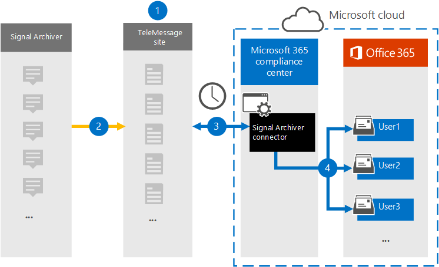

# Configurar un conector para archivar datos de comunicaciones de señalSet up a connector to archive Signal communications data

Use el conector de TeleMessage en el Centro de cumplimiento de Microsoft 365 para importar y archivar chats de señal, datos adjuntos, archivos y mensajes y llamadas eliminados.Use the TeleMessage connector in the Microsoft 365 compliance center to import and archive Signal chats, attachments, files, and deleted messages and calls. Después de configurar y configurar un conector, se conecta a la cuenta de TeleMessage de la organización e importa la comunicación móvil de los empleados mediante el Archivador de señal de TeleMessage a buzones de correo de Microsoft 365.After you set up and configure a connector, it connects to your organization's TeleMessage account, and imports the mobile communication of employees using the TeleMessage Signal Archiver to mailboxes in Microsoft 365.

Después de almacenar los datos del conector del archivador de señales en buzones de usuario, puede aplicar Microsoft 365 características de cumplimiento como retención por juicio, búsqueda de contenido y directivas de retención de Microsoft 365 a los datos de comunicaciones de signal.After Signal Archiver connector data is stored in user mailboxes, you can apply Microsoft 365 compliance features such as Litigation Hold, Content search, and Microsoft 365 retention policies to Signal communications data. Por ejemplo, puede buscar la comunicación de señal mediante la búsqueda de contenido o asociar el buzón que contiene los datos del conector del archivador de señales con un custodio en un Advanced eDiscovery caso.For example, you can search Signal communication using Content search or associate the mailbox that contains the Signal Archiver connector data with a custodian in an Advanced eDiscovery case. El uso de un conector de Archivador de señales para importar y archivar datos en Microsoft 365 puede ayudar a su organización a cumplir con las normativas de gobierno corporativo y las directivas reglamentarias.Using a Signal Archiver connector to import and archive data in Microsoft 365 can help your organization stay compliant with corporate governance regulations and regulatory policies.

## Información general sobre el archivado de datos de comunicaciones de señalOverview of archiving Signal communications data

En la siguiente introducción se explica el proceso de uso de un conector para archivar datos de comunicación de señal en Microsoft 365.The following overview explains the process of using a connector to archive  Signal communication data in Microsoft 365.

1. Su organización trabaja con TeleMessage para configurar un conector de archivador de señales.Your organization works with TeleMessage to set up a Signal Archiver connector. Para obtener más información, vea [Activating the TeleMessage Signal Archiver for Microsoft 365](https://www.telemessage.com/microsoft-365-activation-for-signal-archiver/).For more information, see [Activating the TeleMessage Signal Archiver for Microsoft 365](https://www.telemessage.com/microsoft-365-activation-for-signal-archiver/).

2. En tiempo real, los datos de signal de la organización se copian en el sitio de TeleMessage.In real time, your organization's Signal data is copied to the TeleMessage site.

3. El conector del archivador de señales que cree en el Centro de cumplimiento de Microsoft 365 se conecta al sitio de TeleMessage todos los días y transfiere los mensajes de correo electrónico de las 24 horas anteriores a un área de Azure Storage segura en Microsoft Cloud.The Signal Archiver connector that you create in the Microsoft 365 compliance center connects to the TeleMessage site every day and transfers the email messages from the previous 24 hours to a secure Azure Storage area in the Microsoft Cloud.

4. El conector importa los elementos de comunicación móvil al buzón de un usuario específico.The connector imports the mobile communication items to the mailbox of a specific user. Se creará una nueva carpeta denominada Signal Archiver en el buzón del usuario específico y los elementos se importarán a él.A new folder named Signal Archiver will be created in the specific user's mailbox and the items will be imported to it. El conector realiza la asignación mediante el valor de la *propiedad Dirección de correo* electrónico del usuario.The connector does the mapping by using the value of the *User's Email address* property. Cada mensaje de correo electrónico contiene esta propiedad, que se rellena con la dirección de correo electrónico de cada participante del mensaje de correo electrónico.Every email message contains this property, which is populated with the email address of every participant of the email message.

> Además de la asignación automática  de usuarios mediante el valor de la propiedad Dirección de correo electrónico del usuario, también puede definir una asignación personalizada cargando un archivo de asignación CSV.In addition to automatic user mapping using the value of the *User's Email address* property, you can also define a custom mapping by uploading a CSV mapping file. Este archivo de asignación debe contener el número de teléfono móvil del usuario y la dirección Microsoft 365 buzón de correo correspondiente para cada usuario.This mapping file should contain User's mobile Number and the corresponding Microsoft 365 mailbox address for each user. Si habilita la asignación automática de usuarios y proporciona una asignación personalizada, por cada elemento de correo electrónico, el conector primero buscará el archivo de asignación personalizado.If you enable automatic user mapping and provide a custom mapping, for every email item the connector will first look at custom mapping file. Si no encuentra un usuario Microsoft 365 válido que corresponda al número de teléfono móvil de un usuario, el conector usará la propiedad de dirección de correo electrónico del usuario del elemento de correo electrónico.If it doesn't find a valid Microsoft 365 user that corresponds to a user's mobile number, the connector will use the User ‘s email address property of the email item. Si el conector no encuentra un usuario Microsoft 365 válido en el  archivo de asignación personalizado o en la propiedad de dirección de correo electrónico del usuario del elemento de correo electrónico, el elemento no se importará.If the connector doesn't find a valid Microsoft 365 user in either the custom mapping file or the *user's email address* property of the email item, the item won't be imported.

## Antes de configurar un conectorBefore you set up a connector

- Ordene [el servicio de archivador de señales desde TeleMessage](https://www.telemessage.com/mobile-archiver/order-mobile-archiver-for-o365/) y obtenga una cuenta de administración válida para su organización.Order the [Signal Archiver service from TeleMessage](https://www.telemessage.com/mobile-archiver/order-mobile-archiver-for-o365/) and get a valid administration account for your organization. Deberá iniciar sesión en esta cuenta al crear el conector en el centro de cumplimiento.You'll need to sign into this account when you create the connector in the compliance center.

- Registrar todos los usuarios que requieren el archivado de señales en la cuenta de TeleMessage.Register all users that require Signal archiving in the TeleMessage account. Al registrar usuarios, asegúrese de usar la misma dirección de correo electrónico que se usa para su Microsoft 365 usuario.When registering users, be sure to use the same email address that's used for their Microsoft 365 account.

- Instala la aplicación Signal Archiver en los teléfonos móviles de tus empleados y actívala.Install the Signal Archiver app on the mobile phones of your employees and activate it. La aplicación Archivo de señales les permite comunicarse y chatear con otros usuarios de Signal.The Signal Archiver app allows them to communicate and chat with other Signal users.

- Al usuario que crea un conector de archivador de señales en el paso 3 se le debe asignar el rol De importación de buzones de Exchange Online.The user who creates a Signal Archiver connector in Step 3 must be assigned the Mailbox Import Export role in Exchange Online. Esto es necesario para agregar conectores en la **página Conectores de datos** de la Centro de cumplimiento de Microsoft 365.This is required to add connectors in the **Data connectors** page in the Microsoft 365 compliance center. Este rol no está asignado a ningún grupo de roles de Exchange Online de forma predeterminada.By default, this role isn't assigned to any role group in Exchange Online. Puede agregar el rol Exportación de importación de buzones al grupo de roles Administración de la organización en Exchange Online.You can add the Mailbox Import Export role to the Organization Management role group in Exchange Online. O bien, puede crear un grupo de roles, asignar el rol Importación de buzones de correo Exportar y, a continuación, agregar los usuarios adecuados como miembros.Or you can create a role group, assign the Mailbox Import Export role, and then add the appropriate users as members. Para obtener más información, vea  las secciones [Crear](/Exchange/permissions-exo/role-groups#create-role-groups) grupos de roles o Modificar grupos de roles en el artículo "Administrar grupos de roles en Exchange Online".For more information, see the [Create role groups](/Exchange/permissions-exo/role-groups#create-role-groups) or [Modify role groups](/Exchange/permissions-exo/role-groups#modify-role-groups) sections in the article "Manage role groups in Exchange Online".

## Crear un conector de archivador de señalesCreate a Signal Archiver connector

Después de completar los requisitos previos descritos en la sección anterior, puede crear el conector del archivador de señales en el Centro de cumplimiento de Microsoft 365.After you've completed the prerequisites described in the previous section, you can create the Signal Archiver connector in the Microsoft 365 compliance center. El conector usa la información que proporciona para conectarse al sitio de TeleMessage y transfiere los datos de comunicaciones de señal a los cuadros de buzón de usuario correspondientes en Microsoft 365.The connector uses the information you provide to connect to the TeleMessage site and transfers Signal communications data to the corresponding user mailbox boxes in Microsoft 365.

1. Vaya a <https://compliance.microsoft.com> y, a continuación, haga clic en **Conectores de datos**  >  **Del archivador de señales**.Go to <https://compliance.microsoft.com> and then click **Data connectors** > **Signal Archiver**.

2. En la página **Descripción del producto del archivador** de señales, haga clic en Agregar **conector.**On the **Signal Archiver** product description page, click **Add connector.**

3. En la **página Términos de** servicio, haga clic **en Aceptar**.On the **Terms of service** page, click **Accept**.

4. En la **página Iniciar sesión en TeleMessage,** en el paso 3, escriba la información necesaria en los cuadros siguientes y, a continuación, haga clic en **Siguiente**.On the **Login to TeleMessage** page, under Step 3, enter the required information in the following boxes and then click **Next**.

    - **Nombre de usuario:** Su nombre de usuario de TeleMessage.**Username:** Your TeleMessage username.

    - **Contraseña:** Su contraseña de TeleMessage.**Password:** Your TeleMessage password.

5. Después de crear el conector, puede cerrar la ventana emergente y pasar a la página siguiente.After the connector is created, you can close the pop-up window and go to the next page.

6. En la **página Asignación de** usuarios, habilite la asignación automática de usuarios.On the **User mapping** page, enable automatic user mapping. Para habilitar la asignación personalizada, cargue un archivo CSV que contenga la información de asignación de usuarios y, a continuación, haga clic **en Siguiente**.To enable custom mapping, upload a CSV file that contains the user mapping information, and then click **Next**.

7. Revise la configuración y, a continuación, haga clic **en Finalizar** para crear el conector.Review your settings, and then click **Finish** to create the connector.

8. Vaya a la pestaña Conectores de la **página Conectores de** datos para ver el progreso del proceso de importación del nuevo conector.Go to the Connectors tab in **Data connectors** page to see the progress of the import process for the new connector.

## Problemas conocidosKnown issues

- En este momento, no se admite la importación de datos adjuntos o elementos de más de 10 MB.At this time, we don't support importing attachments or items that are larger than 10 MB. La compatibilidad con elementos más grandes estará disponible en una fecha posterior.Support for larger items will be available at a later date.
