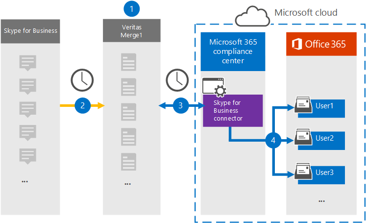

# Configuración de un conector para archivar datos Skype Empresarial

[!include[Purview banner](../includes/purview-rebrand-banner.md)]

Use un conector de Veritas en el portal de cumplimiento Microsoft Purview para importar y archivar datos de la plataforma de Skype Empresarial a buzones de usuario de la organización de Microsoft 365. Veritas proporciona un conector [de Skype Empresarial](https://www.veritas.com/en/au/insights/merge1/skype-for-business) que está configurado para capturar elementos del origen de datos de terceros (de forma periódica) e importarlos a Microsoft 365. El conector convierte el contenido, como mensajes entre usuarios, chats persistentes y mensajes de conferencia de Skype Empresarial a un formato de mensaje de correo electrónico y, a continuación, importa esos elementos al buzón del usuario en Microsoft 365.

Después de almacenar Skype Empresarial datos en buzones de usuario, puede aplicar Microsoft Purview características como suspensión por juicio, exhibición de documentos electrónicos, directivas de retención y etiquetas de retención. El uso de un conector de Skype Empresarial para importar y archivar datos en Microsoft 365 puede ayudar a su organización a cumplir las directivas gubernamentales y normativas.

## Introducción al archivado de datos Skype Empresarial

En la información general siguiente se explica el proceso de uso de un conector para archivar los datos de Skype Empresarial en Microsoft 365.

1. Su organización trabaja con Skype Empresarial para configurar y configurar un sitio de Skype Empresarial.

2. Una vez cada 24 horas, Skype Empresarial elementos se copian en el sitio de Veritas Merge1. El conector también convierte Skype Empresarial elementos en un formato de mensaje de correo electrónico.

3. El conector de Skype Empresarial que se crea en el portal de cumplimiento, se conecta al sitio Veritas Merge1 todos los días y transfiere el contenido de Skype Empresarial a una ubicación de Azure Storage segura en la nube de Microsoft.

4. El conector importa los elementos convertidos a los buzones de usuarios específicos mediante el valor de la propiedad *Email* de la asignación automática de usuarios, tal como se describe en [el paso 3](#step-3-map-users-and-complete-the-connector-setup). Se crea una subcarpeta de la carpeta Bandeja de entrada denominada **Skype Empresarial** en los buzones de usuario y los elementos se importan a esa carpeta. Para ello, el conector usa el valor de la propiedad *Email* . Cada elemento Skype Empresarial contiene esta propiedad, que se rellena con la dirección de correo electrónico de cada participante del elemento.

## Antes de configurar un conector

- Cree una cuenta de Merge1 para los conectores de Microsoft. Para ello, póngase en contacto con [el servicio de atención al cliente de Veritas](https://www.veritas.com/form/requestacall/ms-connectors-contact.html). Debe iniciar sesión en esta cuenta al crear el conector en el paso 1.

- Al usuario que crea el conector de Skype Empresarial en el paso 1 (y lo completa en el paso 3) se le debe asignar el rol Administrador del conector de datos. Este rol es necesario para agregar conectores en la página **Conectores de datos** del portal de cumplimiento. Este rol se agrega de forma predeterminada a varios grupos de roles. Para obtener una lista de estos grupos de roles, consulte la sección "Roles en los centros de seguridad y cumplimiento" de [Permisos en el Centro de cumplimiento de & seguridad](../security/office-365-security/permissions-in-the-security-and-compliance-center.md#roles-in-the-security--compliance-center). Como alternativa, un administrador de su organización puede crear un grupo de roles personalizado, asignar el rol Administrador del conector de datos y, a continuación, agregar los usuarios adecuados como miembros. Para obtener instrucciones, consulte la sección "Crear un grupo de roles personalizado" en [Permisos en el portal de cumplimiento Microsoft Purview](microsoft-365-compliance-center-permissions.md#create-a-custom-role-group).

- Este conector de datos de Veritas está en versión preliminar pública en entornos de GCC en la nube Microsoft 365 administración pública de EE. UU. Las aplicaciones y servicios de terceros pueden implicar almacenar, transmitir y procesar los datos de clientes de su organización en sistemas de terceros que están fuera de la infraestructura de Microsoft 365 y, por lo tanto, no están cubiertos por los compromisos de protección de datos y Microsoft Purview. Microsoft no hace ninguna representación de que el uso de este producto para conectarse a aplicaciones de terceros implica que esas aplicaciones de terceros son compatibles con FEDRAMP.

## Paso 1: Configurar el conector de Skype Empresarial

El primer paso consiste en acceder a la página **Conectores de datos** del portal de cumplimiento y crear un conector para Skype Empresarial datos.

1. Vaya a <https://compliance.microsoft.com> y haga clic en **Conectores** >  **de datos Skype Empresarial**.

2. En la página **Skype Empresarial** descripción del producto, haga clic en **Agregar conector**.

3. En la página **Términos de servicio** , haga clic en **Aceptar**.

4. Escriba un nombre único que identifique el conector y, a continuación, haga clic en **Siguiente**.

5. Inicie sesión en su cuenta de Merge1 para configurar el conector.

## Paso 2: Configurar el Skype Empresarial en el sitio de Veritas Merge1

El segundo paso es configurar el conector de Skype Empresarial en el sitio de Veritas Merge1. Para obtener información sobre cómo configurar el conector de Skype Empresarial, consulte [la Guía del usuario de conectores de terceros Merge1](https://docs.ms.merge1.globanetportal.com/Merge1%20Third-Party%20Connectors%20Skype%20for%20Business%20%20User%20Guide.pdf).

Después de hacer clic en **Guardar & finalizar**, se muestra la página **Asignación** de usuarios del asistente del conector en el portal de cumplimiento.

## Paso 3: Asignar usuarios y completar la configuración del conector

Para asignar usuarios y completar la configuración del conector en el portal de cumplimiento, siga estos pasos:

1. En la página **Asignar Skype Empresarial usuarios a Microsoft 365 usuarios**, habilite la asignación automática de usuarios. Los elementos Skype Empresarial incluyen una propiedad denominada *Email*, que contiene direcciones de correo electrónico para los usuarios de la organización. Si el conector puede asociar esta dirección a un usuario Microsoft 365, los elementos se importan al buzón de ese usuario.

2. Haga clic en **Siguiente**, revise la configuración y, a continuación, vaya a la página **Conectores de datos** para ver el progreso del proceso de importación del nuevo conector.

## Paso 4: Supervisión del conector de Skype Empresarial

Después de crear el conector de Skype Empresarial, puede ver el estado del conector en el portal de cumplimiento.

1. Vaya a <https://compliance.microsoft.com/> y haga clic en **Conectores de datos** en el panel de navegación izquierdo.

2. Haga clic en la pestaña **Conectores** y, a continuación, seleccione el conector **Skype Empresarial** para mostrar la página de control flotante, que contiene las propiedades y la información sobre el conector.

3. En **Estado del conector con origen**, haga clic en el vínculo **Descargar registro** para abrir (o guardar) el registro de estado del conector. Este registro contiene información sobre los datos que se han importado a la nube de Microsoft. Para obtener más información, consulte [Visualización de registros de administración para conectores de datos](data-connector-admin-logs.md).

## Problemas conocidos

- En este momento, no se admiten la importación de datos adjuntos o elementos que superen los 10 MB. La compatibilidad con elementos más grandes estará disponible en una fecha posterior.
