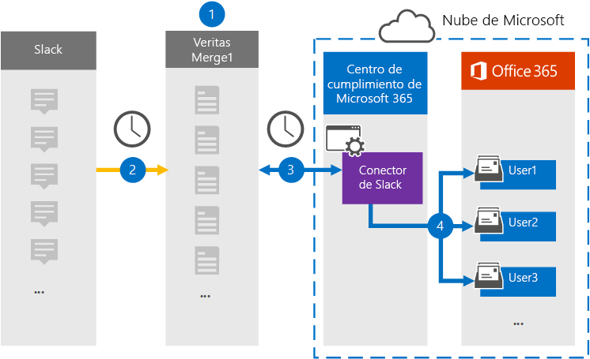

# Configurar un conector para archivar datos de eDiscovery de demoraSet up a connector to archive Slack eDiscovery data

Use un conector de Globanet en el centro de cumplimiento de Microsoft 365 para importar y archivar datos de terceros desde plataformas de medios sociales, mensajería instantánea y colaboración de documentos a los buzones de la organización 365 de Microsoft.Use a Globanet connector in the Microsoft 365 compliance center to import and archive third-party data from social media, instant messaging, and document collaboration platforms to mailboxes in your Microsoft 365 organization. Globanet proporciona un conector de demora que está configurado para capturar elementos del origen de datos de terceros (de forma regular) y, a continuación, importar dichos elementos a Microsoft 365.Globanet provides a Slack connector that is configured to capture items from the third-party data source (on a regular basis) and then import those items to Microsoft 365. El margen de demora extrae mensajes y archivos de la API de demora y los convierte a un formato de mensaje de correo electrónico y, a continuación, importa el elemento a los buzones de usuario.Slack pulls messages and files from the Slack API and converts them to an email message format and then imports the item to user mailboxes.

Tras el margen de demora los datos de eDiscovery se almacenan en buzones de usuario, puede aplicar características de cumplimiento de Microsoft 365, como retención por juicio, eDiscovery, directivas de retención y etiquetas de retención y cumplimiento de la comunicación.After Slack eDiscovery data is stored in user mailboxes, you can apply Microsoft 365 compliance features such as Litigation Hold, eDiscovery, retention policies and retention labels, and communication compliance. El uso de un conector de margen de demora para importar y archivar datos en Microsoft 365 puede ayudar a su organización a cumplir las directivas gubernamentales y regulatorias.Using a Slack connector to import and archive data in Microsoft 365 can help your organization stay compliant with government and regulatory policies.

## Información general sobre el margen de archivado datos de eDiscoveryOverview of archiving Slack eDiscovery data

En la siguiente introducción se explica el proceso de uso de un conector para archivar la información de demora en Microsoft 365.The following overview explains the process of using a connector to archive the Slack information in Microsoft 365.

1. Su organización trabaja con la demora para configurar y configurar un sitio de margen de demora.Your organization works with Slack to set up and configure a Slack site.

2. Una vez cada 24 horas, los mensajes de chat de la exhibición de documentos electrónicos de demora se copian en el sitio de Merge1 de Globanet.Once every 24 hours, chat messages from Slack eDiscovery are copied to the Globanet Merge1 site. El conector también convierte el contenido de un mensaje de chat en un formato de mensaje de correo electrónico.The connector also converts the content of a chat message to an email message format.

3. El conector eDiscovery de demora que crea en el centro de cumplimiento de Microsoft 365, se conecta al sitio de Globanet Merge1 todos los días y transfiere los mensajes de chat a una ubicación de almacenamiento seguro de Azure en la nube de Microsoft.The Slack eDiscovery connector that you create in the Microsoft 365 compliance center, connects to the Globanet Merge1 site every day and transfers the chat messages to a secure Azure Storage location in the Microsoft cloud.

4. El conector importa los elementos de mensaje de chat convertidos a los buzones de usuarios específicos usando el valor de la propiedad *email* y la asignación automática de usuarios, como se describe en el paso 3.The connector imports the converted chat message items to the mailboxes of specific users using the value of the *Email* property and automatic user mapping, as described in Step 3. En los buzones de usuario se crea una subcarpeta nueva en la carpeta Bandeja de entrada con el nombre **eDiscovery** , y los elementos de mensajes de chat se importan a esa carpeta.A new subfolder in the Inbox folder named **Slack eDiscovery** is created in the user mailboxes, and the chat message items are imported to that folder. El conector lo hace mediante el valor de la propiedad *email* .The connector does this by using the value of the *Email* property. Todos los mensajes de chat contienen esta propiedad, que se rellena con la dirección de correo electrónico de cada participante del mensaje de chat.Every chat message contains this property, which is populated with the email address of every participant of the chat message.

## Antes de empezarBefore you begin

- Cree una cuenta de Globanet Merge1 para Microsoft Connectors.Create a Globanet Merge1 account for Microsoft connectors. Para ello, póngase en contacto con el [soporte técnico de Globanet](https://globanet.com/ms-connectors-contact).To do this, contact [Globanet Customer Support](https://globanet.com/ms-connectors-contact). Debe iniciar sesión en esta cuenta cuando cree el conector en el paso 1.You need to sign into this account when you create the connector in Step 1.

- Obtenga el nombre de usuario y la contraseña de la cuenta de empresa del margen de demora de su organización.Obtain the username and password for your organization's Slack enterprise account. Deberá iniciar sesión en esta cuenta en el paso 2 cuando configure el margen de demora.You'll need to sign into this account in Step 2 when you configure Slack.

- El usuario que crea el conector eDiscovery de demora en el paso 1 (y lo completa en el paso 3) debe asignarse a la función importación y exportación de buzones de correo en Exchange Online.The user who creates the Slack eDiscovery connector in Step 1 (and completes it in Step 3) must be assigned to the Mailbox Import Export role in Exchange Online. Este rol es necesario para agregar conectores en la página **conectores de datos** del centro de cumplimiento de Microsoft 365.This role is required to add connectors on the **Data connectors** page in the Microsoft 365 compliance center. De forma predeterminada, este rol no está asignado a ningún grupo de roles en Exchange Online.By default, this role is not assigned to any role group in Exchange Online. Puede Agregar el rol importación y exportación de buzones al grupo de funciones de administración de la organización en Exchange Online.You can add the Mailbox Import Export role to the Organization Management role group in Exchange Online. O bien, puede crear un grupo de roles, asignar el rol de importación y exportación de buzones de correo y, a continuación, agregar los usuarios adecuados como miembros.Or you can create a role group, assign the Mailbox Import Export role, and then add the appropriate users as members. Para obtener más información, vea las secciones [crear grupos](https://docs.microsoft.com/Exchange/permissions-exo/role-groups#create-role-groups) de roles o [modificar grupos de roles](https://docs.microsoft.com/Exchange/permissions-exo/role-groups#modify-role-groups) en el artículo sobre la administración de grupos de roles en Exchange Online.For more information, see the [Create role groups](https://docs.microsoft.com/Exchange/permissions-exo/role-groups#create-role-groups) or [Modify role groups](https://docs.microsoft.com/Exchange/permissions-exo/role-groups#modify-role-groups) sections in the article "Manage role groups in Exchange Online".

## Paso 1: configurar el conector de eDiscovery de demoraStep 1: Set up the Slack eDiscovery connector

El primer paso es obtener acceso a la página **conectores de datos** en el centro de cumplimiento de Microsoft 365 y crear un conector para los datos de demora.The first step is to access to the **Data Connectors** page in the Microsoft 365 compliance center and create a connector for Slack data.

1. Vaya a [https://compliance.microsoft.com](https://compliance.microsoft.com/) y haga clic en eDiscovery de demora de conectores de **datos**  >  **Slack eDiscovery**.Go to [https://compliance.microsoft.com](https://compliance.microsoft.com/) and then click **Data connectors** > **Slack eDiscovery**.

2. En la página Descripción del producto de **eDiscovery de demora** , haga clic en **Agregar conector**.On the **Slack eDiscovery** product description page, click **Add connector**.

3. En la página **condiciones de servicio** , haga clic en **Aceptar**.On the **Terms of service** page, click **Accept**.

4. Escriba un nombre único que identifique el conector y, a continuación, haga clic en **siguiente**.Enter a unique name that identifies the connector, and then click **Next**.

5. Inicie sesión en su cuenta de Merge1 para configurar el conector.Sign in to your Merge1 account to configure the connector.

## Paso 2: configurar la exhibición de documentos electrónicos de demoraStep 2: Configure Slack eDiscovery

El segundo paso consiste en configurar el conector eDiscovery de demora en el sitio de Merge1.The second step is to configure the Slack eDiscovery connector on the Merge1 site. Para obtener más información sobre cómo configurar el conector eDiscovery de demora en el sitio de Merge1 de Globanet, consulte [Merge1 guía del usuario de conectores de terceros](https://docs.ms.merge1.globanetportal.com/Merge1%20Third-Party%20Connectors%20Slack%20eDiscovery%20User%20Guide.pdf).For more information about how to configure the Slack eDiscovery connector on the Globanet Merge1 site, see [Merge1 Third-Party Connectors User Guide](https://docs.ms.merge1.globanetportal.com/Merge1%20Third-Party%20Connectors%20Slack%20eDiscovery%20User%20Guide.pdf).

Después de hacer clic en **guardar & finalizar**, se le redirigirá al centro de cumplimiento de Microsoft 365, a la página **asignación de usuarios** del Asistente para el conector.After you click **Save & Finish**, you are directed back to the Microsoft 365 compliance center, to the **User mapping** page in the connector wizard.

## Paso 3: asignar usuarios y completar la configuración del conectorStep 3: Map users and complete the connector setup

1. En la página **asignar usuarios externos a Microsoft 365 usuarios** , habilite la asignación automática de usuarios.On the **Map external users to Microsoft 365 users** page, enable automatic user mapping.

   Los elementos de eDiscovery de demora incluyen una propiedad denominada *email*, que contiene las direcciones de correo electrónico de los usuarios de la organización.Slack eDiscovery items include a property called *Email*, which contains email addresses for users in your organization. Si el conector puede asociar esta dirección con un usuario de Microsoft 365, los elementos se importan al buzón de correo del usuario.If the connector can associate this address with a Microsoft 365 user, the items are imported to that user's mailbox.

2. En la página **consentimiento del administrador** , haga clic en **proporcionar consentimiento**.On the **Admin Consent** page, click **Provide Consent**. Se le redirigirá al sitio de Microsoft.You will be redirected to the Microsoft site. Haga clic en **Aceptar** para proporcionar el consentimiento.Click **Accept** to provide the consent.

   La organización debe permitir que el servicio de importación de Office 365 obtenga acceso a los datos de buzones de la organización.Your organization must consent to allow the Office 365 Import service to access mailbox data in your organization. Para proporcionar el consentimiento del administrador, debe haber iniciado sesión con las credenciales de un administrador global de Microsoft 365 y aceptar la solicitud de consentimiento.To provide admin consent, you must be signed in with the credentials of a Microsoft 365 global admin, and then accept the consent request. Si no ha iniciado sesión como administrador global, puede ir a [esta página](https://login.microsoftonline.com/common/oauth2/authorize?client_id=570d0bec-d001-4c4e-985e-3ab17fdc3073&response_type=code&redirect_uri=https://portal.azure.com/&nonce=1234&prompt=admin_consent) e iniciar sesión con las credenciales de administrador global para aceptar la solicitud.If you aren't signed in as a global admin, you can go to [this page](https://login.microsoftonline.com/common/oauth2/authorize?client_id=570d0bec-d001-4c4e-985e-3ab17fdc3073&response_type=code&redirect_uri=https://portal.azure.com/&nonce=1234&prompt=admin_consent) and sign in using global admin credentials to accept the request.

3. Haga clic en **siguiente**, revise la configuración y vaya a la página **conectores de datos** para ver el progreso del proceso de importación del nuevo conector.Click **Next**, review your settings, and go to the **Data connectors** page to see the progress of the import process for the new connector.

## Paso 4: supervisar el margen de demora del conector de exhibición de documentos electrónicosStep 4: Monitor the Slack eDiscovery connector

Después de crear el conector eDiscovery de demora, puede ver el estado del conector en el centro de cumplimiento de Microsoft 365.After you create the Slack eDiscovery connector, you can view the connector status in the Microsoft 365 compliance center.

1. Vaya a [https://compliance.microsoft.com](https://compliance.microsoft.com) y haga clic en **conectores de datos** en el panel de navegación izquierdo.Go to [https://compliance.microsoft.com](https://compliance.microsoft.com) and click **Data connectors** in the left nav.

2. Haga clic en la pestaña **conectores** y seleccione el conector **eDiscovery de demora** para mostrar la página de flotante, que contiene las propiedades y la información sobre el conector.Click the **Connectors** tab and then select the **Slack eDiscovery** connector to display the flyout page, which contains the properties and information about the connector.

3. En **Estado del conector con origen**, haga clic en el vínculo **Descargar registro** para abrir (o guardar) el registro de estado del conector.Under **Connector status with source**, click the **Download log** link to open (or save) the status log for the connector. Este registro contiene información sobre los datos que se han importado a la nube de Microsoft.This log contains information about the data that has been imported to the Microsoft cloud.

## Problemas conocidosKnown issues

- En este momento, no se admite la importación de datos adjuntos o elementos de más de 10 MB.At this time, we don't support importing attachments or items that are larger than 10 MB. La compatibilidad con elementos más grandes estará disponible en una fecha posterior.Support for larger items will be available at a later date.
