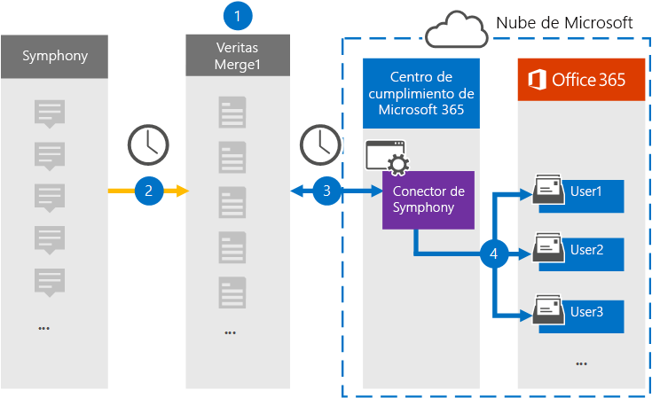

# Configurar un conector para archivar datos de SymphonySet up a connector to archive Symphony data

Use un conector Veritas en el centro de Microsoft 365 de cumplimiento para importar y archivar datos de Symphony en los buzones de usuario de su Microsoft 365 organización.Use a Veritas connector in the Microsoft 365 compliance center to import and archive Symphony data to user mailboxes in your Microsoft 365 organization. Symphony es una plataforma de mensajería y colaboración que se usa en el sector de servicios financieros.Symphony is a messaging and collaboration platform used in the financial services industry. Veritas proporciona un conector de datos [Sinfónico](https://globanet.com/symphony) en el centro de cumplimiento de Microsoft 365 que puede configurar para capturar elementos del origen de datos de terceros (de forma regular) y, a continuación, importar esos elementos a buzones de usuario.Veritas provides a [Symphony](https://globanet.com/symphony) data connector in the Microsoft 365 compliance center that you can configure to capture items from the third-party data source (on a regular basis) and then import those items to user mailboxes. El conector convierte el contenido de un elemento de la cuenta de Symphony en un formato de mensaje de correo electrónico y, a continuación, importa el elemento a un buzón de correo en Microsoft 365.The connector converts the content of an item from the Symphony account to an email message format and then imports the item to a mailbox in Microsoft 365.

Una vez almacenadas las comunicaciones de Symphony en buzones de usuario, puede aplicar Microsoft 365 de cumplimiento, como retención por juicio, exhibición de documentos electrónicos, directivas de retención y etiquetas de retención, y cumplimiento de comunicaciones.After Symphony communications are stored in user mailboxes, you can apply Microsoft 365 compliance features such as Litigation Hold, eDiscovery, retention policies and retention labels, and communication compliance. El uso de un conector de Sinfónico para importar y archivar datos en Microsoft 365 puede ayudar a su organización a cumplir con las directivas gubernamentales y reglamentarias.Using a Symphony connector to import and archive data in Microsoft 365 can help your organization stay compliant with government and regulatory policies.

## Información general sobre el archivado de datos de SymphonyOverview of archiving Symphony data

En la siguiente introducción se explica el proceso de uso de un conector de datos para archivar las comunicaciones de Sinfónico en Microsoft 365.The following overview explains the process of using a data connector to archive Symphony communications in Microsoft 365.

1. Su organización trabaja con Symphony para configurar y configurar un sitio de Sinfónico.Your organization works with Symphony to set up and configure a Symphony site.

2. Una vez cada 24 horas, los mensajes de chat de Symphony se copian en el sitio Veritas Merge1.Once every 24 hours, chat messages from Symphony are copied to the Veritas Merge1 site. El conector también convierte el contenido de un mensaje de chat a un formato de mensaje de correo electrónico.The connector also converts the content of a chat message to an email message format.

3. El conector Sinfónico que cree en el centro de cumplimiento de Microsoft 365, se conecta al sitio veritas Merge1 todos los días y transfiere los mensajes a una ubicación de Azure Storage segura en la nube de Microsoft.The Symphony connector that you create in the Microsoft 365 compliance center, connects to the Veritas Merge1 site every day and transfers the messages to a secure Azure Storage location in the Microsoft cloud.

4. El conector importa los elementos de mensaje convertidos a los buzones de usuarios específicos mediante el valor de la propiedad *Email* de la asignación automática de usuarios, tal como se describe en el paso 3.The connector imports the converted message items to the mailboxes of specific users using the value of the *Email* property of the automatic user mapping as described in Step 3. Se crea una subcarpeta nueva en la carpeta Bandeja de entrada denominada **Sinfónico** en los buzones de usuario y los elementos del mensaje se importan a esa carpeta.A new subfolder in the Inbox folder named **Symphony** is created in the user mailboxes, and the message items are imported to that folder. El conector determina a qué buzón se importarán los elementos mediante el valor de la *propiedad Email.*The connector determines which mailbox to import items to by using the value of the *Email* property. Cada mensaje de chat contiene esta propiedad, que se rellena con la dirección de correo electrónico de cada participante.Every chat message contains this property, which is populated with the email address for every participant.

## Antes de empezarBefore you begin

- Cree una cuenta de Veritas Merge1 para conectores de Microsoft.Create a Veritas Merge1 account for Microsoft connectors. Para crear una cuenta, póngase en contacto con [el Servicio de soporte al cliente de Veritas](https://globanet.com/ms-connectors-contact).To create an account, contact [Veritas Customer Support](https://globanet.com/ms-connectors-contact). Iniciará sesión en esta cuenta al crear el conector en el paso 1.You will sign into this account when you create the connector in Step 1.

- El usuario que crea el conector Sinfónico en el paso 1 (y lo completa en el paso 3) debe estar asignado al rol Importar exportación de buzones en Exchange Online.The user who creates the Symphony connector in Step 1 (and completes it in Step 3) must be assigned to the Mailbox Import Export role in Exchange Online. Este rol es necesario para agregar conectores en la página **Conectores** de datos del centro de Microsoft 365 cumplimiento.This role is required to add connectors on the **Data connectors** page in the Microsoft 365 compliance center. De forma predeterminada, este rol no se asigna a un grupo de roles en Exchange Online.By default, this role is not assigned to a role group in Exchange Online. Puede agregar el rol Exportación de importación de buzones al grupo de roles Administración de la organización en Exchange Online.You can add the Mailbox Import Export role to the Organization Management role group in Exchange Online. O bien, puede crear un grupo de roles, asignar el rol Importación de buzones de correo Exportar y, a continuación, agregar los usuarios adecuados como miembros.Or you can create a role group, assign the Mailbox Import Export role, and then add the appropriate users as members. Para obtener más información, vea  las secciones [Crear](/Exchange/permissions-exo/role-groups#create-role-groups) grupos de roles o Modificar grupos de roles en el artículo "Administrar grupos de roles en Exchange Online".For more information, see the [Create role groups](/Exchange/permissions-exo/role-groups#create-role-groups) or [Modify role groups](/Exchange/permissions-exo/role-groups#modify-role-groups) sections in the article "Manage role groups in Exchange Online".

## Paso 1: Configurar el conector DesastrosoStep 1: Set up the Symphony connector

El primer paso es obtener acceso a la página **Conectores** de datos en el centro de Microsoft 365 de cumplimiento y crear un conector para datos de Sinfónico.The first step is to access to the **Data Connectors** page in the Microsoft 365 compliance center and create a connector for Symphony data.

1. Vaya a [https://compliance.microsoft.com](https://compliance.microsoft.com/) y, a continuación, **haga clic en Conectores de datos**  >  **Sinfónico**.Go to [https://compliance.microsoft.com](https://compliance.microsoft.com/) and then click **Data connectors** > **Symphony**.

2. En la página Descripción del **producto Sinfónico,** haga clic en Agregar **conector**.On the **Symphony** product description page, click **Add connector**.

3. En la **página Términos de** servicio, haga clic **en Aceptar**.On the **Terms of service** page, click **Accept**.

4. Escriba un nombre único que identifique el conector y, a continuación, haga clic en **Siguiente**.Enter a unique name that identifies the connector, and then click **Next**.

5. Inicie sesión en su cuenta merge1 para configurar el conector.Sign in to your Merge1 account to configure the connector.

## Configurar el conector de Sinfónico en el sitio Veritas Merge1Configure the Symphony connector on the Veritas Merge1 site

El segundo paso es configurar el conector Desastroso en el sitio Merge1.The second step is to configure the Symphony connector on the Merge1 site. Para obtener información acerca de la configuración del conector de Sinfónico en el sitio Veritas Merge1, vea [Merge1 Third-Party Connectors User Guide](https://docs.ms.merge1.globanetportal.com/Merge1%20Third-Party%20Connectors%20Symphony%20User%20Guide%20.pdf).For information about configuring  the Symphony connector on the Veritas Merge1 site, see [Merge1 Third-Party Connectors User Guide](https://docs.ms.merge1.globanetportal.com/Merge1%20Third-Party%20Connectors%20Symphony%20User%20Guide%20.pdf).

Después de hacer clic en Guardar  & **finalizar**, se muestra la página Asignación de usuario en el asistente para conectores en Microsoft 365 centro de cumplimiento.After you click **Save & Finish**, the **User mapping** page in the connector wizard in the Microsoft 365 compliance center is displayed.

## Paso 3: Asignar usuarios y completar la configuración del conectorStep 3: Map users and complete the connector setup

Para asignar usuarios y completar la configuración del conector en el centro de Microsoft 365 cumplimiento, siga estos pasos:To map users and complete the connector setup in the Microsoft 365 compliance center, follow these steps:

1. En la **página Asignar usuarios externos Microsoft 365 usuarios,** habilite la asignación automática de usuarios.On the **Map external users to Microsoft 365 users** page, enable automatic user mapping. Los elementos de Symphony incluyen una propiedad denominada *Email*, que contiene direcciones de correo electrónico para los usuarios de la organización.The Symphony items include a property called *Email*, which contains email addresses for users in your organization. Si el conector puede asociar esta dirección a un Microsoft 365, los elementos se importan al buzón de ese usuario.If the connector can associate this address with a Microsoft 365 user, the items are imported to that user’s mailbox.

2. Haga **clic en** Siguiente, revise la configuración y, a continuación, vaya a la página **Conectores** de datos para ver el progreso del proceso de importación del nuevo conector.Click **Next**, review your settings, and then go to the **Data connectors** page to see the progress of the import process for the new connector.

## Paso 4: Supervisar el conector DesastrosoStep 4: Monitor the Symphony connector

Después de crear el conector Sinfónico, puede ver el estado del conector en el centro de Microsoft 365 cumplimiento.After you create the Symphony connector, you can view the connector status in the Microsoft 365 compliance center.

1. Vaya a [https://compliance.microsoft.com](https://compliance.microsoft.com) y haga clic en **Conectores de datos** en la navegación izquierda.Go to [https://compliance.microsoft.com](https://compliance.microsoft.com) and click **Data connectors** in the left nav.

2. Haga clic **en la pestaña Conectores** y, a continuación, seleccione **el conector Sinfónico** para mostrar la página desplegable.Click the **Connectors** tab and then select the **Symphony** connector to display the flyout page. Esta página contiene las propiedades y la información sobre el conector.This page contains the properties and information about the connector.

3. En **Estado del conector con origen,** haga clic en el vínculo Descargar **registro** para abrir (o guardar) el registro de estado del conector.Under **Connector status with source**, click the **Download log** link to open (or save) the status log for the connector. Este registro contiene información sobre los datos que se han importado a la nube de Microsoft.This log contains information about the data that has been imported to the Microsoft cloud.

## Problemas conocidosKnown issues

- En este momento, no se admite la importación de datos adjuntos o elementos de más de 10 MB.At this time, we don't support importing attachments or items that are larger than 10 MB. La compatibilidad con elementos más grandes estará disponible en una fecha posterior.Support for larger items will be available at a later date.