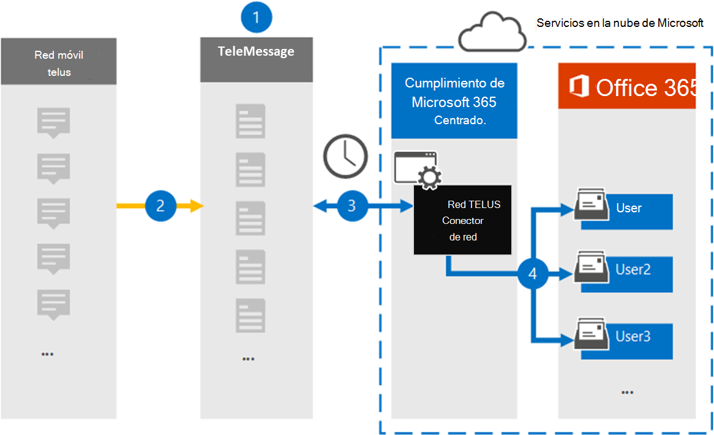

# Configurar un conector para archivar datos de red de TELUSSet up a connector to archive TELUS Network data

Use el conector de teleservicio del centro de cumplimiento de Microsoft 365 para importar y archivar datos del servicio de mensajes cortos (SMS) de la red TELUS de su organización.Use the TeleMessage connector in the Microsoft 365 compliance center to import and archive Short Messaging Service (SMS) data from your organization's TELUS Network. Después de configurar y configurar un conector, se conecta a la red de TELUS de su organización una vez al día e importa datos de SMS a los buzones de correo de Microsoft 365.After you set up and configure a connector, it connects to your organization's TELUS Network once every day, and imports SMS data to mailboxes in Microsoft 365.

Una vez que los mensajes SMS se almacenan en buzones de usuario, puede aplicar las características de cumplimiento de Microsoft 365, como la retención por juicio, la búsqueda de contenido y las directivas de retención de Microsoft 365 a los datos de TELUS.After SMS messages are stored in user mailboxes, you can apply Microsoft 365 compliance features such as Litigation Hold, Content Search, and Microsoft 365 retention policies to TELUS data. Por ejemplo, puede buscar mensajes SMS de TELUS mediante la búsqueda de contenido o asociar el buzón que contiene los datos de TELUS con un custodio en un caso de exhibición avanzada de documentos electrónicos.For example, you can search TELUS SMS messages using Content Search or associate the mailbox that contains the TELUS data with a custodian in an Advanced eDiscovery case. El uso de un conector de red TELUS para importar y archivar datos en Microsoft 365 puede ayudar a su organización a cumplir con las directivas gubernamentales y regulatorias.Using a TELUS Network connector to import and archive data in Microsoft 365 can help your organization stay compliant with government and regulatory policies.

## Información general sobre el archivado TELUS datos de redOverview of archiving TELUS Network data

En la siguiente introducción se explica el proceso de uso de un conector para archivar datos de red de TELUS en Microsoft 365.The following overview explains the process of using a connector to archive TELUS Network data in Microsoft 365.

1. La organización trabaja con telemessage y TELUS para configurar un conector de red de TELUS.Your organization works with TeleMessage and TELUS to set up a TELUS Network connector. Para obtener más información, consulte [Telus Network Archiver](https://www.telemessage.com/office365-activation-for-telus-network-archiver/).For more information, see [TELUS Network Archiver](https://www.telemessage.com/office365-activation-for-telus-network-archiver/).

2. Una vez cada 24 horas, los mensajes SMS de la red TELUS de su organización se copian en el sitio de Telemensaje.Once every 24 hours, SMS messages from your organization’s TELUS Network are copied to the TeleMessage site.

3. El conector de red TELUS que ha creado en el centro de cumplimiento de Microsoft 365 se conecta al sitio de Telemensaje cada día y transfiere los mensajes SMS de las 24 horas anteriores a una ubicación de almacenamiento seguro de Azure en la nube de Microsoft.The TELUS Network connector that you create in the Microsoft 365 compliance center connects to the TeleMessage site every day and transfers the SMS messages from the previous 24 hours to a secure Azure Storage location in the Microsoft Cloud. El conector también convierte el contenido de los mensajes SMS en un formato de mensaje de correo electrónico.The connector also converts the content of SMS messages to an email message format.

4. El conector importa los elementos de comunicación móvil al buzón de un usuario específico.The connector imports the mobile communication items to the mailbox of a specific user. Se crea una nueva carpeta llamada **Telus SMS Network Archiver** en el buzón de correo del usuario específico y los elementos se importan a ella.A new folder named **TELUS SMS Network Archiver** is created in the specific user's mailbox and the items are imported to it. El conector se asigna mediante el valor de la propiedad de la *dirección de correo electrónico del usuario* .The connector does mapping by using the value of the *User’s Email address* property. Todos los mensajes SMS contienen esta propiedad, que se rellena con la dirección de correo electrónico de cada participante del mensaje SMS.Every SMS message contains this property, which is populated with the email address of every participant of the SMS message.

   Además de la asignación automática de usuarios mediante el valor de la propiedad de la *dirección de correo electrónico del usuario* , también puede implementar una asignación personalizada mediante la carga de un archivo de asignación CSV.In addition to automatic user mapping using the value of the *User’s Email address* property, you can also implement custom mapping by uploading a CSV mapping file. Este archivo de asignación contiene el número de teléfono móvil y la dirección de correo electrónico de Microsoft 365 correspondiente a los usuarios de su organización.This mapping file contains the mobile phone number and corresponding Microsoft 365 email address for users in your organization. Si habilita la asignación automática de usuarios y la asignación personalizada, para cada elemento de TELUS, el conector examina primero el archivo de asignación personalizado.If you enable both automatic user mapping and custom mapping, for every TELUS item the connector first looks at custom mapping file. Si no encuentra un usuario válido de Microsoft 365 que se corresponda con el número de teléfono móvil de un usuario, el conector usará los valores de la propiedad dirección de correo electrónico del elemento que intenta importar.If it doesn't find a valid Microsoft 365 user that corresponds to a user's mobile phone number, the connector will use the values in the email address property of the item it's trying to import. Si el conector no encuentra un usuario válido de Microsoft 365 en el archivo de asignación personalizado o en la propiedad de dirección de correo electrónico del elemento TELUS, no se importará el elemento.If the connector doesn't find a valid Microsoft 365 user in either the custom mapping file or in the email address property of the TELUS item, the item won't be imported.

## Antes de empezarBefore you begin

Algunos de los pasos de implementación necesarios para archivar datos de red de TELUS son externos a Microsoft 365 y deben completarse antes de poder crear un conector en el centro de cumplimiento.Some of the implementation steps required to archive TELUS Network data are external to Microsoft 365 and must be completed before you can create a connector in the compliance center.

- Solicite el [servicio de archivado de red Telus del Telemensaje](https://www.telemessage.com/mobile-archiver/order-mobile-archiver-for-o365) y obtenga una cuenta de administración válida para su organización.Order the [TELUS Network Archiver service from TeleMessage](https://www.telemessage.com/mobile-archiver/order-mobile-archiver-for-o365) and get a valid administration account for your organization. Tendrá que iniciar sesión en esta cuenta cuando cree el conector en el centro de cumplimiento.You'll need to sign into this account when you create the connector in the compliance center.

- Obtenga su cuenta de red de TELUS y los detalles de contacto de facturación para poder completar los formularios de incorporación de mensajes y solicitar el servicio de archivado de mensajes desde TELUS.Obtain your TELUS Network account and billing contact details so you can fill-out the TeleMessage onboarding forms and order the message archiving service from TELUS.

- Registre todos los usuarios que requieran el archivado de red SMS de TELUS en la cuenta de Telemensaje.Register all users that require TELUS SMS Network archiving in the TeleMessage account. Al registrar usuarios, asegúrese de usar la misma dirección de correo electrónico que se usa para su cuenta de Microsoft 365.When registering users, be sure to use the same email address that's used for their Microsoft 365 account.

- Los empleados deben tener teléfonos móviles de empresa y de propiedad corporativa en la red móvil de theTELUS.Your employees must have corporate-owned and corporate-liable mobile phones on theTELUS mobile network. Los mensajes de archivado en Microsoft 365 no están disponibles para los dispositivos de propiedad de empleados ni para los dispositivos de BYOD.Archiving messages in Microsoft 365 isn't available for employee-owned or Bring Your Own Devices (BYOD) devices.

- El usuario que crea un conector de red TELUS debe tener asignado el rol importación y exportación de buzones de correo en Exchange Online.The user who creates a TELUS Network connector must be assigned the Mailbox Import Export role in Exchange Online. Esto es necesario para agregar conectores en la página **conectores de datos** en el centro de cumplimiento de Microsoft 365.This is required to add connectors in the **Data connectors** page in the Microsoft 365 compliance center. Este rol no está asignado a ningún grupo de roles de Exchange Online de forma predeterminada.By default, this role isn't assigned to any role group in Exchange Online. Puede Agregar el rol importación y exportación de buzones al grupo de funciones de administración de la organización en Exchange Online.You can add the Mailbox Import Export role to the Organization Management role group in Exchange Online. O bien, puede crear un grupo de roles, asignar el rol de importación y exportación de buzones de correo y, a continuación, agregar los usuarios adecuados como miembros.Or you can create a role group, assign the Mailbox Import Export role, and then add the appropriate users as members. Para obtener más información, vea las secciones [crear grupos](https://docs.microsoft.com/Exchange/permissions-exo/role-groups#create-role-groups) de roles o [modificar grupos de roles](https://docs.microsoft.com/Exchange/permissions-exo/role-groups#modify-role-groups) en el artículo sobre la administración de grupos de roles en Exchange Online.For more information, see the [Create role groups](https://docs.microsoft.com/Exchange/permissions-exo/role-groups#create-role-groups) or [Modify role groups](https://docs.microsoft.com/Exchange/permissions-exo/role-groups#modify-role-groups) sections in the article "Manage role groups in Exchange Online".

## Crear un conector de red de TELUSCreate a TELUS Network connector

Una vez que haya completado los requisitos previos descritos en la sección anterior, puede crear un conector de red de TELUS en el centro de cumplimiento de Microsoft 365.After you've completed the prerequisites described in the previous section, you can create TELUS Network connector in the Microsoft 365 compliance center. El conector usa la información que proporciona para conectarse al sitio de Telemensaje y transferir los mensajes SMS a los cuadros de buzón de usuario correspondientes en Microsoft 365.The connector uses the information you provide to connect to the TeleMessage site and transfer SMS messages to the corresponding user mailbox boxes in Microsoft 365.

1. Vaya a [https://compliance.microsoft.com](https://compliance.microsoft.com/) y haga clic en **conectores de datos**  >  **Telus red**.Go to [https://compliance.microsoft.com](https://compliance.microsoft.com/) and then click **Data connectors** > **TELUS Network**.

2. En la página Descripción del producto de **red de Telus** , haga clic en **Agregar conector** .On the **TELUS Network** product description page, click **Add connector**

3. En la página **condiciones de servicio** , haga clic en **Aceptar**.On the **Terms of service** page, click **Accept**.

4. En la página **iniciar sesión en Telemensaje** , en el paso 3, escriba la información necesaria en los siguientes cuadros y, a continuación, haga clic en **siguiente**.On the **Login to TeleMessage** page, under Step 3, enter the required information in the following boxes and then click **Next**.

   - **Nombre de usuario:** El nombre de usuario de Telemensaje.**Username:** Your TeleMessage username.

   - **Contraseña:** La contraseña de Telemensaje.**Password:** Your TeleMessage password.

5. Una vez creado el conector, puede cerrar la ventana emergente y pasar a la página siguiente.After the connector is created, you can close the pop-up window and go to the next page.

6. En la página **asignación de usuarios** , habilite la asignación automática de usuarios y haga clic en **siguiente**.On the **User mapping** page, enable automatic user mapping and click **Next**. En caso de que necesite una asignación personalizada, cargue un archivo CSV y haga clic en **siguiente**.In case you need custom mapping upload a CSV file, and click **Next**.

7. Revise la configuración y, a continuación, haga clic en **Finalizar** para crear el conector.Review your settings, and then click **Finish** to create the connector.

8. Vaya a la ficha conectores en la página **conectores de datos** para ver el progreso del proceso de importación del nuevo conector.Go to the Connectors tab in **Data connectors** page to see the progress of the import process for the new connector.

## Problemas conocidosKnown issues

- En este momento, no se admite la importación de datos adjuntos o elementos de más de 10 MB.At this time, we don't support importing attachments or items that are larger than 10 MB. La compatibilidad con elementos más grandes estará disponible en una fecha posterior.Support for larger items will be available at a later date.
