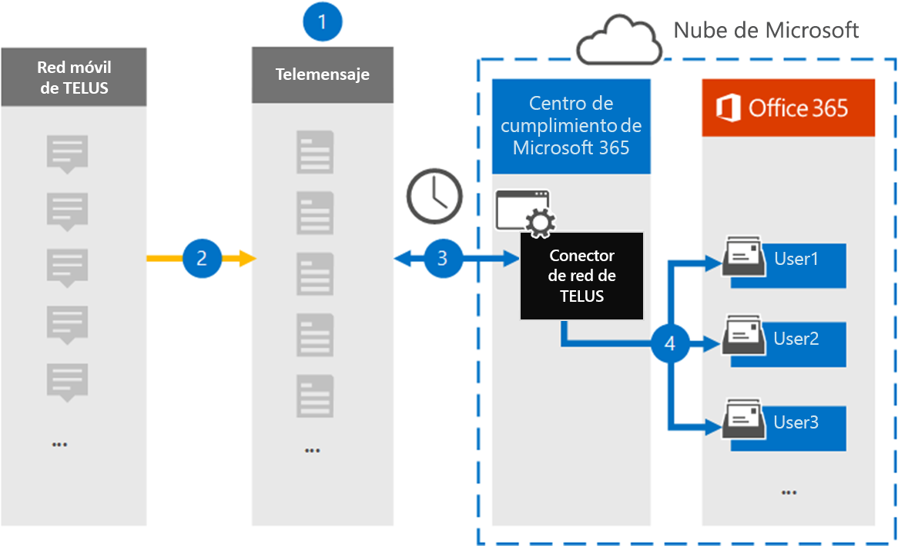

# Configurar un conector para archivar datos de red de TELUS (versión preliminar)

Use el conector de teleservicio del centro de cumplimiento de Microsoft 365 para importar y archivar datos del servicio de mensajes cortos (SMS) de la red TELUS de su organización. Después de configurar y configurar un conector, se conecta a la red de TELUS de su organización una vez al día e importa datos de SMS a los buzones de correo de Microsoft 365.

Una vez que los mensajes SMS se almacenan en buzones de usuario, puede aplicar las características de cumplimiento de Microsoft 365, como la retención por juicio, la búsqueda de contenido y las directivas de retención de Microsoft 365 a los datos de TELUS. Por ejemplo, puede buscar mensajes SMS de TELUS mediante la búsqueda de contenido o asociar el buzón que contiene los datos de TELUS con un custodio en un caso de exhibición avanzada de documentos electrónicos. El uso de un conector de red TELUS para importar y archivar datos en Microsoft 365 puede ayudar a su organización a cumplir con las directivas gubernamentales y regulatorias.

## Información general sobre el archivado TELUS datos de red

En la siguiente introducción se explica el proceso de uso de un conector para archivar datos de red de TELUS en Microsoft 365.

1. La organización trabaja con telemessage y TELUS para configurar un conector de red de TELUS. Para obtener más información, consulte [Telus Network Archiver](https://www.telemessage.com/office365-activation-for-telus-network-archiver/).

2. Una vez cada 24 horas, los mensajes SMS de la red TELUS de su organización se copian en el sitio de Telemensaje.

3. El conector de red TELUS que ha creado en el centro de cumplimiento de Microsoft 365 se conecta al sitio de Telemensaje cada día y transfiere los mensajes SMS de las 24 horas anteriores a una ubicación de almacenamiento seguro de Azure en la nube de Microsoft. El conector también convierte el contenido de los mensajes SMS en un formato de mensaje de correo electrónico.

4. El conector importa los elementos de comunicación móvil al buzón de un usuario específico. Se crea una nueva carpeta llamada **Telus SMS Network Archiver** en el buzón de correo del usuario específico y los elementos se importan a ella. El conector se asigna mediante el valor de la propiedad de la *dirección de correo electrónico del usuario* . Todos los mensajes SMS contienen esta propiedad, que se rellena con la dirección de correo electrónico de cada participante del mensaje SMS.

   Además de la asignación automática de usuarios mediante el valor de la propiedad de la *dirección de correo electrónico del usuario* , también puede implementar una asignación personalizada mediante la carga de un archivo de asignación CSV. Este archivo de asignación contiene el número de teléfono móvil y la dirección de correo electrónico de Microsoft 365 correspondiente a los usuarios de su organización. Si habilita la asignación automática de usuarios y la asignación personalizada, para cada elemento de TELUS, el conector examina primero el archivo de asignación personalizado. Si no encuentra un usuario válido de Microsoft 365 que se corresponda con el número de teléfono móvil de un usuario, el conector usará los valores de la propiedad dirección de correo electrónico del elemento que intenta importar. Si el conector no encuentra un usuario válido de Microsoft 365 en el archivo de asignación personalizado o en la propiedad de dirección de correo electrónico del elemento TELUS, no se importará el elemento.

## Antes de empezar

Muchos de los pasos de implementación necesarios para archivar datos de red de TELUS son externos a Microsoft 365 y deben completarse antes de poder crear un conector en el centro de cumplimiento.

- Solicite el [servicio de archivado de red Telus del Telemensaje](https://www.telemessage.com/mobile-archiver/order-mobile-archiver-for-o365) y obtenga una cuenta de administración válida para su organización. Tendrá que iniciar sesión en esta cuenta cuando cree el conector en el centro de cumplimiento.

- Obtenga su cuenta de red de TELUS y los detalles de contacto de facturación para poder completar los formularios de incorporación de mensajes y solicitar el servicio de archivado de mensajes desde TELUS.

- Registre todos los usuarios que requieran el archivado de red SMS de TELUS en la cuenta de Telemensaje. Al registrar usuarios, asegúrese de usar la misma dirección de correo electrónico que se usa para su cuenta de Microsoft 365.

- Los empleados deben tener teléfonos móviles de empresa y de propiedad corporativa en la red móvil de theTELUS. Los mensajes de archivado en Microsoft 365 no están disponibles para los dispositivos de propiedad de empleados ni para los dispositivos de BYOD.

- La organización debe permitir que el servicio de importación de Office 365 obtenga acceso a los datos de buzones de la organización. Tendrá que proporcionar este consentimiento cuando cree el conector. Para dar su consentimiento a esta solicitud, vaya a [esta página](https://login.microsoftonline.com/common/oauth2/authorize?client_id=570d0bec-d001-4c4e-985e-3ab17fdc3073&response_type=code&redirect_uri=https://portal.azure.com/&nonce=1234&prompt=admin_consent), inicie sesión con las credenciales de un administrador global de Office 365 y, a continuación, acepte la solicitud. Debe completar este paso para poder crear correctamente TELUS conector de red.

- El usuario que crea un conector de red TELUS debe tener asignado el rol importación y exportación de buzones de correo en Exchange Online. Esto es necesario para agregar conectores en la página **conectores de datos** en el centro de cumplimiento de Microsoft 365. Este rol no está asignado a ningún grupo de roles de Exchange Online de forma predeterminada. Puede Agregar el rol importación y exportación de buzones al grupo de funciones de administración de la organización en Exchange Online. O bien, puede crear un grupo de roles, asignar el rol de importación y exportación de buzones de correo y, a continuación, agregar los usuarios adecuados como miembros. Para obtener más información, vea las secciones [crear grupos](https://docs.microsoft.com/Exchange/permissions-exo/role-groups#create-role-groups) de roles o [modificar grupos de roles](https://docs.microsoft.com/Exchange/permissions-exo/role-groups#modify-role-groups) en el artículo sobre la administración de grupos de roles en Exchange Online.

## Crear un conector de red de TELUS

Una vez que haya completado los requisitos previos descritos en la sección anterior, puede crear un conector de red de TELUS en el centro de cumplimiento de Microsoft 365. El conector usa la información que proporciona para conectarse al sitio de Telemensaje y transferir los mensajes SMS a los cuadros de buzón de usuario correspondientes en Microsoft 365.

1. Vaya a [https://compliance.microsoft.com](https://compliance.microsoft.com/) y haga clic en **conectores de datos**  >  **Telus red**.

2. En la página Descripción del producto de **red de Telus** , haga clic en **Agregar conector** .

3. En la página **condiciones de servicio** , haga clic en **Aceptar**.

4. En la página **iniciar sesión en Telemensaje** , en el paso 3, escriba la información necesaria en los siguientes cuadros y, a continuación, haga clic en **siguiente**.

   - **Nombre de usuario:** El nombre de usuario de Telemensaje.

   - **Contraseña:** La contraseña de Telemensaje.

5. Una vez creado el conector, puede cerrar la ventana emergente y pasar a la página siguiente.

6. En la página **asignación de usuarios** , habilite la asignación automática de usuarios y haga clic en **siguiente**. En caso de que necesite una asignación personalizada, cargue un archivo CSV y haga clic en **siguiente**.

7. Proporcione el consentimiento del administrador y haga clic en **siguiente**.

   Para proporcionar el consentimiento del administrador, debe haber iniciado sesión con las credenciales de un administrador global de Office 365 y, a continuación, aceptar la solicitud de consentimiento. Si no ha iniciado sesión como administrador global, puede ir a [esta página](https://login.microsoftonline.com/common/oauth2/authorize?client_id=570d0bec-d001-4c4e-985e-3ab17fdc3073&response_type=code&redirect_uri=https://portal.azure.com/&nonce=1234&prompt=admin_consent) y iniciar sesión con credenciales de administrador global para aceptar la solicitud.

8. Revise la configuración y, a continuación, haga clic en **Finalizar** para crear el conector.

9. Vaya a la ficha conectores en la página **conectores de datos** para ver el progreso del proceso de importación del nuevo conector.

## Problemas conocidos

- El conector no importa ningún elemento de más de 10 MB.
