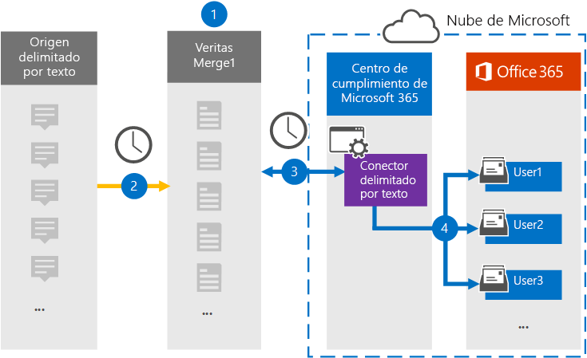

# Configurar un conector para archivar datos delimitados por textoSet up a connector to archive text-delimited data

Use un conector de Globanet en el centro de cumplimiento de Microsoft 365 para importar y archivar datos delimitados por texto a los buzones de usuario de la organización 365 de Microsoft.Use a Globanet connector in the Microsoft 365 compliance center to import and archive text-delimited data to user mailboxes in your Microsoft 365 organization. [Globanet](https://globanet.com/merge1/) proporciona un conector delimitado por texto que está configurado para capturar elementos de un origen de datos de terceros (de forma regular) e importar los elementos a Microsoft 365.[Globanet](https://globanet.com/merge1/) provides a Text-Delimited connector that is configured to capture items from a third-party data source (on a regular basis) and import those items to Microsoft 365. El conector convierte el contenido del origen de datos delimitados por texto a un formato de mensaje de correo electrónico y, a continuación, importa esos elementos al buzón del usuario en Microsoft 365.The connector converts content from the text-delimited data source to an email message format and then imports those items to the user's mailbox in Microsoft 365.

Después de almacenar datos delimitados por texto en los buzones de usuario, puede aplicar características de cumplimiento de Microsoft 365, como retención por juicio, eDiscovery, directivas de retención y etiquetas de retención y cumplimiento de la comunicación.After text-delimited data is stored in user mailboxes, you can apply Microsoft 365 compliance features such as Litigation Hold, eDiscovery, retention policies and retention labels, and communication compliance. El uso de un conector de reuniones de zoom para importar y archivar datos en Microsoft 365 puede ayudar a su organización a cumplir las directivas gubernamentales y regulatorias.Using a Zoom Meetings connector to import and archive data in Microsoft 365 can help your organization stay compliant with government and regulatory policies.

Una vez archivadas, las comunicaciones de origen delimitadas por texto pueden conservarse, supervisarse para cumplir el cumplimiento y recuperarse para la exhibición de documentos electrónicos y el gobierno de información interno.Once archived, the Text-Delimited source communications can be retained, supervised for compliance, and retrieved for eDiscovery and internal Information Governance.

## Información general sobre el archivado del origen delimitado por textoOverview of archiving the Text-Delimited source

En la siguiente introducción se explica el proceso de uso de un conector para archivar la información de origen delimitada por texto en Microsoft 365.The following overview explains the process of using a connector to archive the Text-Delimited source information in Microsoft 365.

1. La organización trabaja con el origen de texto delimitado para configurar y configurar un sitio delimitado por texto.Your organization works with the Text-Delimited source to set up and configure a Text-Delimited site.

2. Una vez cada 24 horas, los mensajes de chat desde el origen de texto delimitado se copian al sitio de Merge1 de Globanet.Once every 24 hours, chat messages from the Text-Delimited source are copied to the Globanet Merge1 site. El conector también convierte el contenido en un formato de mensaje de correo electrónico.The connector also converts the content to an email message format.

3. El conector de texto delimitado que se crea en el centro de cumplimiento de Microsoft 365, se conecta al sitio de Globanet Merge1 todos los días y transfiere los mensajes a una ubicación de almacenamiento seguro de Azure en la nube de Microsoft.The Text-Delimited connector that you create in the Microsoft 365 compliance center, connects to the Globanet Merge1 site every day and transfers the messages to a secure Azure Storage location in the Microsoft cloud.

4. El conector importa los elementos de mensaje convertidos a los buzones de usuarios específicos usando el valor de la propiedad *email* de la asignación automática de usuarios, como se describe en el paso 3.The connector imports the converted message items to the mailboxes of specific users using the value of the *Email* property of the automatic user mapping as described in Step 3. Se creará una nueva subcarpeta en la carpeta Bandeja de entrada denominada **texto delimitado por texto** en los buzones de usuario y los elementos del mensaje se importarán a esa carpeta.A new subfolder in the Inbox folder named **Text- Delimited** will be created in the user mailboxes, and the message items will be imported to that folder. El conector lo hace mediante el valor de la propiedad *email* .The connector does this by using the value of the *Email* property. Cada mensaje contiene esta propiedad, que se rellena con la dirección de correo electrónico de cada participante del mensaje.Every message contains this property, which is populated with the email address of every participant of the message.

## Antes de empezarBefore you begin

- Cree una cuenta de Globanet Merge1 para Microsoft Connectors.Create a Globanet Merge1 account for Microsoft connectors. Para ello, póngase en contacto con el [soporte técnico de Globanet](https://globanet.com/ms-connectors-contact).To do this, contact [Globanet Customer Support](https://globanet.com/ms-connectors-contact). Debe iniciar sesión en esta cuenta cuando cree el conector en el paso 1.You need to sign into this account when you create the connector in Step 1.

- El usuario que crea el conector delimitado por texto en el paso 1 (y lo completa en el paso 3) debe estar asignado a la función importación y exportación de buzones de correo en Exchange Online.The user who creates the Text-Delimited connector in Step 1 (and completes it in Step 3) must be assigned to the Mailbox Import Export role in Exchange Online. Este rol es necesario para agregar conectores en la página **conectores de datos** del centro de cumplimiento de Microsoft 365.This role is required to add connectors on the **Data connectors** page in the Microsoft 365 compliance center. De forma predeterminada, este rol no está asignado a ningún grupo de roles en Exchange Online.By default, this role is not assigned to any role group in Exchange Online. Puede Agregar el rol importación y exportación de buzones al grupo de funciones de administración de la organización en Exchange Online.You can add the Mailbox Import Export role to the Organization Management role group in Exchange Online. O bien, puede crear un grupo de roles, asignar el rol de importación y exportación de buzones de correo y, a continuación, agregar los usuarios adecuados como miembros.Or you can create a role group, assign the Mailbox Import Export role, and then add the appropriate users as members. Para obtener más información, vea las secciones [crear grupos](https://docs.microsoft.com/Exchange/permissions-exo/role-groups#create-role-groups) de roles o [modificar grupos de roles](https://docs.microsoft.com/Exchange/permissions-exo/role-groups#modify-role-groups) en el artículo sobre la administración de grupos de roles en Exchange Online.For more information, see the [Create role groups](https://docs.microsoft.com/Exchange/permissions-exo/role-groups#create-role-groups) or [Modify role groups](https://docs.microsoft.com/Exchange/permissions-exo/role-groups#modify-role-groups) sections in the article "Manage role groups in Exchange Online".

## Paso 1: configurar el conector delimitado por textoStep 1: Set up the Text-Delimited connector

El primer paso es obtener acceso a la página **conectores de datos** en el centro de cumplimiento de Microsoft 365 y crear un conector para datos delimitados por texto.The first step is to access to the **Data Connectors** page in the Microsoft 365 compliance center and create a connector for text-delimited data.

1. Vaya a [https://compliance.microsoft.com](https://compliance.microsoft.com/) y, a continuación, haga clic en **conectores**  >  **de datos delimitados por texto**.Go to [https://compliance.microsoft.com](https://compliance.microsoft.com/) and then click **Data connectors** > **Text-Delimited**.

2. En la página Descripción de producto **delimitado por texto** , haga clic en **Agregar conector**.On the **Text-Delimited** product description page, click **Add connector**.

3. En la página **condiciones de servicio** , haga clic en **Aceptar**.On the **Terms of service** page, click **Accept**.

4. Escriba un nombre único que identifique el conector y, a continuación, haga clic en **siguiente**.Enter a unique name that identifies the connector, and then click **Next**.

5. Inicie sesión en su cuenta de Merge1 para configurar el conector.Sign in to your Merge1 account to configure the connector.

## Paso 2: configurar el conector de texto delimitado en el sitio de Merge1 de GlobanetStep 2: Configure the Text-delimited connector on the Globanet Merge1 site

El segundo paso consiste en configurar el conector de texto delimitado en el sitio Merge1.The second step is to configure the Text-Delimited connector in the Merge1 site. Para obtener información acerca de la configuración del conector de texto delimitado en el sitio de Merge1 de Globanet, consulte [Merge1 guía del usuario de conectores de terceros](https://docs.ms.merge1.globanetportal.com/Merge1%20Third-Party%20Connectors%20Text-Delimited%20User%20Guide%20.pdf).For information about configuring  the Text-Delimited connector on the Globanet Merge1 site, see [Merge1 Third-Party Connectors User Guide](https://docs.ms.merge1.globanetportal.com/Merge1%20Third-Party%20Connectors%20Text-Delimited%20User%20Guide%20.pdf).

Después de hacer clic en **guardar & finalizar**, se le devolverá al centro de cumplimiento de Microsoft 365, a la página **asignación de usuarios** del Asistente para conector.After you click **Save & Finish**, you are returned to the Microsoft 365 compliance center, to the **User mapping** page of the connector wizard.

## Paso 3: asignar usuarios y completar la configuración del conectorStep 3: Map users and complete the connector setup

Para asignar usuarios y completar la configuración del conector en el centro de cumplimiento de Microsoft 365, siga estos pasos:To map users and complete the connector setup in the Microsoft 365 compliance center, follow these steps:

1. En la página **asignar usuarios externos a Microsoft 365 usuarios** , habilite la asignación automática de usuarios.On the **Map external users to Microsoft 365 users** page, enable automatic user mapping. Los elementos de origen de texto delimitados incluyen una propiedad denominada *email*, que contiene las direcciones de correo electrónico de los usuarios de la organización.The Text- Delimited source items include a property called *Email*, which contains email addresses for users in your organization. Si el conector puede asociar esta dirección con un usuario de Microsoft 365, los elementos se importan al buzón de correo del usuario.If the connector can associate this address with a Microsoft 365 user, the items are imported to that user’s mailbox.

2. En la página **consentimiento del administrador** , haga clic en el botón **proporcionar consentimiento** .On the **Admin Consent** page, click the **Provide Consent** button. Se le redirigirá al sitio de Microsoft.You will be redirected to the Microsoft site. Haga clic en **Aceptar** para proporcionar el consentimiento.Click **Accept** to provide the consent.

   La organización debe permitir que el servicio de importación de Office 365 obtenga acceso a los datos de buzones de la organización.Your organization must consent to allow the Office 365 Import service to access mailbox data in your organization. Para proporcionar el consentimiento del administrador, debe haber iniciado sesión con las credenciales de un administrador global de Microsoft 365 y aceptar la solicitud de consentimiento.To provide admin consent, you must be signed in with the credentials of a Microsoft 365 global admin, and then accept the consent request. Si no ha iniciado sesión como administrador global, puede ir a [esta página](https://login.microsoftonline.com/common/oauth2/authorize?client_id=570d0bec-d001-4c4e-985e-3ab17fdc3073&response_type=code&redirect_uri=https://portal.azure.com/&nonce=1234&prompt=admin_consent) e iniciar sesión con las credenciales de administrador global para aceptar la solicitud.If you aren't signed in as a global admin, you can go to [this page](https://login.microsoftonline.com/common/oauth2/authorize?client_id=570d0bec-d001-4c4e-985e-3ab17fdc3073&response_type=code&redirect_uri=https://portal.azure.com/&nonce=1234&prompt=admin_consent) and sign in using global admin credentials to accept the request.

3. Haga clic en **siguiente**, revise la configuración y, después, vaya a la página **conectores de datos** para ver el progreso del proceso de importación del nuevo conector.Click **Next**, review your settings, and then go to the **Data connectors** page to see the progress of the import process for the new connector.

## Paso 4: supervisar el conector delimitado por textoStep 4: Monitor the text-delimited connector

Después de crear el conector de texto delimitado, puede ver el estado del conector en el centro de cumplimiento de Microsoft 365.After you create the Text- Delimited connector, you can view the connector status in the Microsoft 365 compliance center.

1. Vaya a [https://compliance.microsoft.com](https://compliance.microsoft.com) y haga clic en **conectores de datos** en el panel de navegación izquierdo.Go to [https://compliance.microsoft.com](https://compliance.microsoft.com) and click **Data connectors** in the left nav.

2. Haga clic en la pestaña **conectores** y, a continuación, seleccione el conector **delimitado por texto** para mostrar la página de flotante, que contiene las propiedades y la información sobre el conector.Click the **Connectors** tab and then select the **Text- Delimited** connector to display the flyout page, which contains the properties and information about the connector.

3. En **Estado del conector con origen**, haga clic en el vínculo **Descargar registro** para abrir (o guardar) el registro de estado del conector.Under **Connector status with source**, click the **Download log** link to open (or save) the status log for the connector. Este registro contiene información sobre los datos que se han importado a la nube de Microsoft.This log contains information about the data that has been imported to the Microsoft cloud.

## Problemas conocidosKnown issues

- En este momento, no se admite la importación de datos adjuntos o elementos de más de 10 MB.At this time, we don't support importing attachments or items that are larger than 10 MB. La compatibilidad con elementos más grandes estará disponible en una fecha posterior.Support for larger items will be available at a later date.
