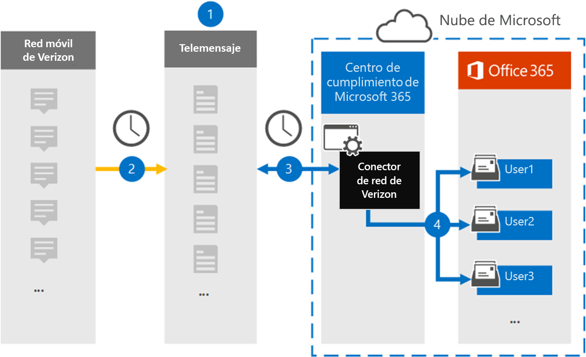

# Configurar un conector para archivar datos de la red de Verizon

Use el conector de teleservicio del centro de cumplimiento de Microsoft 365 para importar y archivar datos del servicio de mensajería breve (SMS) y el servicio de mensajería multimedia (MMS) de Verizon Network. Después de configurar y configurar un conector, se conecta a la red Verizon de su organización una vez al día e importa los datos SMS y MMS a los buzones en Microsoft 365.

Una vez que los datos de Verizon Network Connector se almacenan en buzones de usuario, puede aplicar las características de cumplimiento de Microsoft 365, como la retención por juicio, la búsqueda de contenido y las directivas de retención de Microsoft 365 a los datos de Verizon. Por ejemplo, puede buscar mensajes de Verizon SMS y MMS mediante la búsqueda de contenido o asociar el buzón que contiene los datos de Verizon Network con un custodio en un caso de exhibición avanzada de documentos electrónicos. El uso de un conector para la red de Verizon para importar y archivar datos en Microsoft 365 puede ayudar a su organización a cumplir las directivas gubernamentales y regulatorias.

## Información general sobre el archivado de datos de la red de Verizon

La siguiente descripción general explica el proceso de uso de un conector para archivar datos de la red de Verizon en Microsoft 365.

1. La organización trabaja con telemessage y Verizon para configurar un conector para la red Verizon. Para obtener más información, consulte [Verizon Network Archiver](https://www.telemessage.com/office365-activation-for-verizon-network-archiver/).

2. Una vez cada 24 horas, los mensajes SMS y MMS de la red Verizon de la organización se copian en el sitio de Telemensaje.

3. El conector para redes de Verizon que se crea en el centro de cumplimiento de Microsoft 365 se conecta al sitio de Telemensaje cada día y transfiere los mensajes SMS y MMS de las 24 horas anteriores a una ubicación de almacenamiento seguro de Azure en la nube de Microsoft. El conector también convierte el contenido de los mensajes de SMS y MMS en un formato de mensaje de correo electrónico.

4. El conector importa los elementos de comunicación móvil al buzón de un usuario específico. Se crea una nueva carpeta denominada **archivador de red Verizon SMS/MMS** en el buzón del usuario específico y los elementos se importan a ella. El conector realiza esta asignación mediante el valor de la propiedad de la *dirección de correo electrónico del usuario* . Todos los mensajes SMS y MMS contienen esta propiedad, que se rellena con la dirección de correo electrónico de cada participante del mensaje.

   Además de la asignación automática de usuarios mediante el valor de la propiedad de la *dirección de correo electrónico del usuario* , también puede implementar una asignación personalizada mediante la carga de un archivo de asignación CSV. Este archivo de asignación contiene el número de teléfono móvil y la dirección de correo electrónico de Microsoft 365 correspondiente a los usuarios de su organización. Si habilita la asignación automática de usuarios y la asignación personalizada, para cada elemento de Verizon, el conector examina primero el archivo de asignación personalizado. Si no encuentra un usuario válido de Microsoft 365 que se corresponda con el número de teléfono móvil de un usuario, el conector usará los valores de la propiedad dirección de correo electrónico del elemento que intenta importar. Si el conector no encuentra un usuario válido de Microsoft 365 en el archivo de asignación personalizado o en la propiedad de dirección de correo electrónico del elemento Verizon, no se importará el elemento.

## Antes de empezar

Algunos de los pasos de implementación necesarios para archivar datos de la red de Verizon son externos a Microsoft 365 y deben completarse antes de poder crear un conector en el centro de cumplimiento.

- Solicite el [servicio de Verizon Network Archiver desde telemessage](https://www.telemessage.com/mobile-archiver/order-mobile-archiver-for-o365) y obtenga una cuenta de administración válida para su organización. Tendrá que iniciar sesión en esta cuenta cuando cree el conector en el centro de cumplimiento.

- Obtenga la cuenta de Verizon Network y los detalles de contacto de facturación para poder completar los formularios de incorporación de mensajes y solicitar el servicio de archivado de mensajes desde Verizon.

- Registre todos los usuarios que requieran el archivado de Verizon SMS y MMS en la cuenta de Telemensaje. Al registrar usuarios, asegúrese de usar la misma dirección de correo electrónico que se usa para su cuenta de Microsoft 365.

- Los empleados deben tener teléfonos móviles que sean responsables de la empresa y de la empresa en la red Verizon Mobile. Los mensajes de archivado en Microsoft 365 no están disponibles para los dispositivos de propiedad de empleados ni para los dispositivos de BYOD.

- La organización debe permitir que el servicio de importación de Office 365 obtenga acceso a los datos de buzones de la organización. Tendrá que proporcionar este consentimiento cuando cree el conector. Para dar su consentimiento a esta solicitud, vaya a [esta página](https://login.microsoftonline.com/common/oauth2/authorize?client_id=570d0bec-d001-4c4e-985e-3ab17fdc3073&response_type=code&redirect_uri=https://portal.azure.com/&nonce=1234&prompt=admin_consent), inicie sesión con las credenciales de Microsoft 365 global admin y, a continuación, acepte la solicitud. Debe completar este paso para poder crear correctamente Verizon Network Connector.

- El usuario que crea un conector de Verizon Network Connector debe tener asignado el rol importación y exportación de buzones de correo en Exchange Online. Esto es necesario para agregar conectores en la página **conectores de datos** en el centro de cumplimiento de Microsoft 365. Este rol no está asignado a ningún grupo de roles de Exchange Online de forma predeterminada. Puede Agregar el rol importación y exportación de buzones al grupo de funciones de administración de la organización en Exchange Online. O bien, puede crear un grupo de roles, asignar el rol de importación y exportación de buzones de correo y, a continuación, agregar los usuarios adecuados como miembros. Para obtener más información, vea las secciones [crear grupos](https://docs.microsoft.com/Exchange/permissions-exo/role-groups#create-role-groups) de roles o [modificar grupos de roles](https://docs.microsoft.com/Exchange/permissions-exo/role-groups#modify-role-groups) en el artículo sobre la administración de grupos de roles en Exchange Online.

## Crear un conector para la red Verizon

Una vez que haya completado los requisitos previos descritos en la sección anterior, puede crear Verizon Network Connector en el centro de cumplimiento de Microsoft 365. El conector usa la información que proporciona para conectarse al sitio de Telemensaje y transferir los mensajes SMS y MMS a los cuadros de buzón de usuario correspondientes de Microsoft 365.

1. Vaya a [https://compliance.microsoft.com](https://compliance.microsoft.com) y haga clic en **conectores de datos**  >  **Verizon Network**.

2. En la página Descripción del producto de **Verizon Network** , haga clic en **Agregar conector** .

3. En la página **condiciones de servicio** , haga clic en **Aceptar**.

4. En la página **iniciar sesión en Telemensaje** , en el paso 3, escriba la información necesaria en los siguientes cuadros y, a continuación, haga clic en **siguiente**.
  
   - **Nombre de usuario:** El nombre de usuario de Telemensaje.

   - **Contraseña:** La contraseña de Telemensaje.

5. Una vez creado el conector, puede cerrar la ventana emergente y pasar a la página siguiente.

6. En la página **asignación de usuarios** , habilite la asignación automática de usuarios y haga clic en **siguiente**. En caso de que necesite una asignación personalizada, cargue un archivo CSV y haga clic en **siguiente**.

7. Proporcione el consentimiento del administrador y haga clic en **siguiente**.

   Para proporcionar el consentimiento del administrador, debe haber iniciado sesión con las credenciales de un administrador global de Office 365 y, a continuación, aceptar la solicitud de consentimiento. Si no ha iniciado sesión como administrador global, puede ir a [esta página](https://login.microsoftonline.com/common/oauth2/authorize?client_id=570d0bec-d001-4c4e-985e-3ab17fdc3073&response_type=code&redirect_uri=https://portal.azure.com/&nonce=1234&prompt=admin_consent) e iniciar sesión con las credenciales de administrador global para aceptar la solicitud.

8. Revise la configuración y, a continuación, haga clic en **Finalizar** para crear el conector.

9. Vaya a la ficha conectores en la página **conectores de datos** para ver el progreso del proceso de importación del nuevo conector.

## Problemas conocidos

- En este momento, no se admite la importación de datos adjuntos o elementos de más de 10 MB. La compatibilidad con elementos más grandes estará disponible en una fecha posterior.
