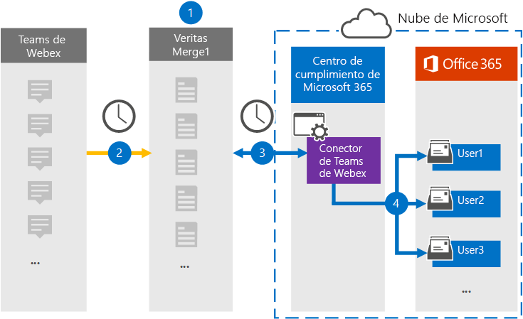

# Configurar un conector para archivar datos de Teams de WebEx (versión preliminar)

Use un conector de Globanet en el centro de cumplimiento de Microsoft 365 para importar y archivar datos de equipos Webex en buzones de usuario de la organización 365 de Microsoft. Globanet proporciona un conector de Microsoft [Teams](https://globanet.com/webex-teams/) que está configurado para capturar los elementos de comunicación de los equipos de WebEx e importarlos a Microsoft 365. El conector convierte el contenido de los equipos WebEx, como los chats de 1:1, las conversaciones en grupo, las conversaciones en canales y los datos adjuntos desde la cuenta de equipo de WebEx de la organización, a un formato de mensaje de correo electrónico y, a continuación, importa esos elementos al buzón del usuario en Microsoft 365.

Una vez que los datos de Teams de WebEx se almacenan en buzones de usuario, puede aplicar características de cumplimiento de Microsoft 365, como retención por juicio, eDiscovery, directivas de retención y etiquetas de retención y cumplimiento de la comunicación. Usar un conector de Microsoft Teams para importar y archivar datos en Microsoft 365 puede ayudar a su organización a cumplir las directivas gubernamentales y regulatorias.

## Información general sobre el archivado de datos de Teams de WebEx

La información general siguiente explica el proceso de uso de un conector para archivar datos de Teams de WebEx en Microsoft 365.

1. La organización trabaja con equipos WebEx para configurar y configurar un sitio de Microsoft Teams.

2. Una vez cada 24 horas, los elementos de Teams de WebEx se copian en el sitio de Merge1 de Globanet. El conector también convierte los elementos de Teams de WebEx en un formato de mensaje de correo electrónico.

3. El conector de Microsoft teams que se crea en el centro de cumplimiento de Microsoft 365, se conecta al Globanet Merge1 cada día y transfiere los elementos de Teams de WebEx a una ubicación de almacenamiento seguro de Azure en la nube de Microsoft.

4. El conector importa elementos a los buzones de usuarios específicos mediante el valor de la propiedad *email* de la asignación automática de usuarios, como se describe en el [paso 3](#step-3-map-users-and-complete-the-connector-setup). Se crea una subcarpeta en la carpeta Bandeja de entrada denominada Microsoft **Teams** en los buzones de usuario y los elementos se importan a esa carpeta. El conector lo hace mediante el valor de la propiedad *email* . Cada elemento de Teams de WebEx contiene esta propiedad, que se rellena con la dirección de correo electrónico de cada participante del elemento.

## Antes de empezar

- Cree una cuenta de Globanet Merge1 para Microsoft Connectors. Para ello, póngase en contacto con el [soporte técnico de Globanet](https://globanet.com/ms-connectors-contact). Debe iniciar sesión en esta cuenta cuando cree el conector en el paso 1.

- Cree una aplicación en [https://developer.webex.com/](https://developer.webex.com) para obtener datos de la cuenta de Teams de WebEx. Para obtener instrucciones paso a paso acerca de la creación de la aplicación, consulte [Guía del usuario de conectores de terceros de Merge1](https://docs.ms.merge1.globanetportal.com/Merge1%20Third-Party%20Connectors%20Webex%20Teams%20User%20Guide%20.pdf)

   Al crear esta aplicación, la plataforma WebEx genera un conjunto de credenciales únicas. Estas credenciales se usan en el paso 2 al configurar el conector de Microsoft Webex en el sitio de Merge1 global.

- El usuario que crea el conector de Microsoft Webex en el paso 1 (y lo completa en el paso 3) debe asignarse a la función importación y exportación de buzones de correo en Exchange Online. Este rol es necesario para agregar conectores en la página **conectores de datos** del centro de cumplimiento de Microsoft 365. De forma predeterminada, este rol no está asignado a ningún grupo de roles en Exchange Online. Puede Agregar el rol importación y exportación de buzones al grupo de funciones de administración de la organización en Exchange Online. O bien, puede crear un grupo de roles, asignar el rol de importación y exportación de buzones de correo y, a continuación, agregar los usuarios adecuados como miembros. Para obtener más información, vea las secciones [crear grupos](https://docs.microsoft.com/Exchange/permissions-exo/role-groups#create-role-groups) de roles o [modificar grupos de roles](https://docs.microsoft.com/Exchange/permissions-exo/role-groups#modify-role-groups) en el artículo sobre la administración de grupos de roles en Exchange Online.

## Paso 1: configurar el conector de Microsoft Teams WebEx

El primer paso es obtener acceso a los **conectores de datos** y configurar el conector de Microsoft [Teams](https://globanet.com/webex-teams/) .

1. Vaya a [https://compliance.microsoft.com](https://compliance.microsoft.com/) y haga clic en **conectores de datos**de Microsoft  >  **Teams**.

2. En la página Descripción del producto de Microsoft **Teams de WebEx** , haga clic en **Agregar conector**.

3. En la página **condiciones de servicio** , haga clic en **Aceptar**.

4. Escriba un nombre único que identifique el conector y, a continuación, haga clic en **siguiente**.

5. Inicie sesión en su cuenta de Merge1 para configurar el conector.

## Paso 2: Configure the WebEx Teams Connector on the Globanet Merge1 site

El segundo paso consiste en configurar el conector de equipos Webex en el sitio Merge1. Para obtener información sobre cómo configurar el conector de equipos WebEx, consulte la [Guía del usuario de conectores de terceros de Merge1](https://docs.ms.merge1.globanetportal.com/Merge1%20Third-Party%20Connectors%20Webex%20Teams%20User%20Guide%20.pdf).

Después de hacer clic en **guardar & finalizar**, se le redirigirá al centro de cumplimiento de Microsoft 365, a la página **asignación de usuarios** del Asistente para el conector.

## Paso 3: asignar usuarios y completar la configuración del conector

Para asignar usuarios y completar la configuración del conector en el centro de cumplimiento de Microsoft 365, siga estos pasos:

1. En la página **asignar usuarios de Microsoft WebEx Teams a usuarios de Microsoft 365** , habilite la asignación automática de usuarios. Los elementos de Teams de WebEx incluyen una propiedad denominada *email*, que contiene las direcciones de correo electrónico de los usuarios de la organización. Si el conector puede asociar esta dirección con un usuario de Microsoft 365, los elementos se importan al buzón de correo del usuario.

2. En la página **consentimiento del administrador** , haga clic en el botón **proporcionar consentimiento** . Se le redirigirá al sitio de Microsoft. Haga clic en **Aceptar** para proporcionar el consentimiento.
  
   La organización debe permitir que el servicio de importación de Office 365 obtenga acceso a los datos de buzones de la organización. Para proporcionar el consentimiento del administrador, debe haber iniciado sesión con las credenciales de un administrador global de Microsoft 365 y aceptar la solicitud de consentimiento. Si no ha iniciado sesión como administrador global, puede ir a [esta página](https://login.microsoftonline.com/common/oauth2/authorize?client_id=570d0bec-d001-4c4e-985e-3ab17fdc3073&response_type=code&redirect_uri=https://portal.azure.com/&nonce=1234&prompt=admin_consent) e iniciar sesión con las credenciales de administrador global para aceptar la solicitud.

3. Haga clic en **siguiente**, revise la configuración y, después, vaya a la página **conectores de datos** para ver el progreso del proceso de importación del nuevo conector.

## Paso 4: supervisar el conector de Microsoft Teams

Después de crear el conector de Microsoft WebEx, puede ver el estado del conector en el centro de cumplimiento de Microsoft 365.

1. Vaya a [https://compliance.microsoft.com](https://compliance.microsoft.com) y haga clic en **conectores de datos** en el panel de navegación izquierdo.

2. Haga clic en la pestaña **conectores** y, a continuación, seleccione el conector de Microsoft **Teams** para mostrar la página de flotante, que contiene las propiedades y la información sobre el conector.

3. En **Estado del conector con origen**, haga clic en el vínculo **Descargar registro** para abrir (o guardar) el registro de estado del conector. Este registro contiene información sobre los datos que se han importado a la nube de Microsoft.

## Problemas conocidos

- En este momento, no se admite la importación de datos adjuntos de más de 10 MB, pero el soporte para elementos de mayor tamaño estará disponible en una fecha posterior.
