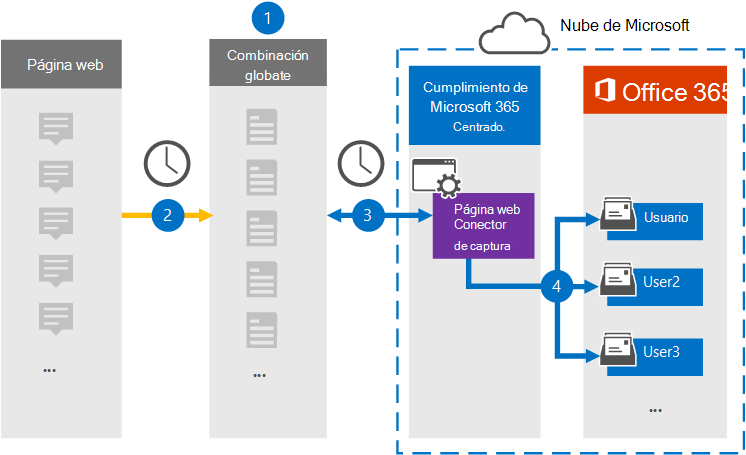

# Configurar un conector para archivar datos de páginas web

Use un conector de Globanet en el Centro de cumplimiento de Microsoft 365 para importar y archivar datos de páginas web a buzones de usuario de su organización de Microsoft 365. Globanet proporciona un conector [de captura de](https://globanet.com/webpage-capture) páginas web que captura páginas web específicas (y cualquier vínculo de esas páginas) en un sitio web específico o en un dominio completo. El conector convierte el contenido de la página web en un formato de archivo PDF, PNG o personalizado y, a continuación, adjunta los archivos convertidos a un mensaje de correo electrónico y, a continuación, importa esos elementos de correo electrónico a buzones de usuario en Microsoft 365.

Después de almacenar el contenido de la página web en buzones de usuario, puede aplicar características de cumplimiento de Microsoft 365 como retención por juicio, exhibición de documentos electrónicos y directivas de retención y etiquetas de retención. El uso de un conector de captura de páginas web para importar y archivar datos en Microsoft 365 puede ayudar a su organización a cumplir con las directivas gubernamentales y reglamentarias.

## Información general sobre los datos de la página web de archivado

En la siguiente introducción se explica el proceso de uso de un conector para archivar el contenido de la página web en Microsoft 365.

1. Su organización trabaja con el origen de la página web para configurar y configurar un sitio de captura de páginas web.

2. Una vez cada 24 horas, los elementos de orígenes de la página web se copian en el sitio de Globanet Merge1. El conector también convierte y adjunta el contenido de una página web a un mensaje de correo electrónico.

3. El conector de captura de páginas web que crea en el centro de cumplimiento de Microsoft 365, se conecta al sitio de Globanet Merge1 todos los días y transfiere los elementos de la página web a una ubicación segura de Azure Storage en la nube de Microsoft.

4. El conector importa los elementos de página web convertidos en los buzones de usuarios específicos mediante el valor de la propiedad *Email* de la asignación automática de usuarios, tal como se describe en [el paso 3](#step-3-map-users-and-complete-the-connector-setup). Se crea una subcarpeta en la carpeta Bandeja de entrada denominada **Captura** de página web en los buzones de usuario y los elementos de la página web se importan a esa carpeta. El conector hace esto mediante el valor de la *propiedad Email.* Cada elemento de página web contiene esta propiedad, que se rellena con las direcciones de correo electrónico proporcionadas al configurar el conector de captura de páginas web en [el paso 2](#step-2-configure-the-webpage-capture-connector-on-the-globanet-merge1-site).

## Antes de empezar

- Crear una cuenta de Globanet Merge1 para conectores de Microsoft. Para crear esta cuenta, póngase en contacto [con el servicio de soporte al cliente de Globanet](https://globanet.com/ms-connectors-contact/). Iniciará sesión en esta cuenta al crear el conector en el paso 1.

- Debe trabajar con la compatibilidad con Globanet para configurar un formato de archivo personalizado al que convertir los elementos de la página web. Para obtener más información, vea la Guía del usuario de Merge1 Third-Party Connectors en 

- El usuario que crea el conector de captura de páginas web en el paso 1 (y lo completa en el paso 3) debe estar asignado al rol De exportación de importación de buzones en Exchange Online. Este rol es necesario para agregar conectores en la página **Conectores de datos** del Centro de cumplimiento de Microsoft 365. De forma predeterminada, este rol no se asigna a un grupo de roles en Exchange Online. Puede agregar el rol Exportación de importación de buzones al grupo de roles Administración de la organización en Exchange Online. O bien, puede crear un grupo de roles, asignar el rol Importación de buzones de correo Exportar y, a continuación, agregar los usuarios adecuados como miembros. Para obtener más información, vea  las secciones [Crear](/Exchange/permissions-exo/role-groups#create-role-groups) grupos de roles o Modificar grupos de roles en el artículo "Administrar grupos de roles en Exchange Online".

## Paso 1: Configurar el conector de captura de páginas web

El primer paso es obtener acceso a **los conectores de datos** y crear un conector para los datos de origen de página web.

1. Vaya a [https://compliance.microsoft.com](https://compliance.microsoft.com/) y, a continuación, haga clic **en Conectores de datos** Captura de página  >  **web**.

2. En la página **Descripción del producto Captura de** página web, haga clic en Agregar **conector**.

3. En la **página Términos de** servicio, haga clic **en Aceptar**.

4. Escriba un nombre único que identifique el conector y, a continuación, haga clic en **Siguiente**.

5. Inicie sesión en su cuenta merge1 para configurar el conector.

## Paso 2: Configurar el conector de captura de páginas web en el sitio de Globanet Merge1

El segundo paso es configurar el conector de captura de páginas web en el sitio de Globanet Merge1. Para obtener información sobre cómo configurar el conector de captura de páginas web, vea [Merge1 Third-Party Connectors User Guide](https://docs.ms.merge1.globanetportal.com/Merge1%20Third-Party%20Connectors%20Web%20Page%20Capture%20User%20Guide%20.pdf).

Después de hacer clic en Guardar  & **finalizar**, se muestra la página Asignación de usuario en el asistente para conectores en el Centro de cumplimiento de Microsoft 365.

## Paso 3: Asignar usuarios y completar la configuración del conector

Para asignar usuarios y completar la configuración del conector en el Centro de cumplimiento de Microsoft 365, siga estos pasos:

1. En la página Asignar captura de páginas web a usuarios de **Microsoft 365,** habilite la asignación automática de usuarios. Los elementos de captura de página web incluyen una propiedad denominada *Email*, que contiene direcciones de correo electrónico para los usuarios de la organización. Si el conector puede asociar esta dirección con un usuario de Microsoft 365, los elementos se importan al buzón de ese usuario.

2. Haga **clic en** Siguiente, revise la configuración y vaya a la página **Conectores** de datos para ver el progreso del proceso de importación del nuevo conector.

## Paso 4: Supervisar el conector de captura de páginas web

Después de crear el conector de captura de páginas web, puede ver el estado del conector en el Centro de cumplimiento de Microsoft 365.

1. Vaya a [https://compliance.microsoft.com](https://compliance.microsoft.com) y haga clic en **Conectores de datos** en la navegación izquierda.

2. Haga clic **en la pestaña Conectores** y, a continuación, seleccione el conector de captura **de** páginas web para mostrar la página desplegable. Esta página contiene las propiedades y la información sobre el conector.

3. En **Estado del conector con origen,** haga clic en el vínculo Descargar **registro** para abrir (o guardar) el registro de estado del conector. Este registro contiene datos que se han importado a la nube de Microsoft.

## Problemas conocidos

- En este momento, no se admite la importación de datos adjuntos o elementos de más de 10 MB. La compatibilidad con elementos más grandes estará disponible en una fecha posterior.