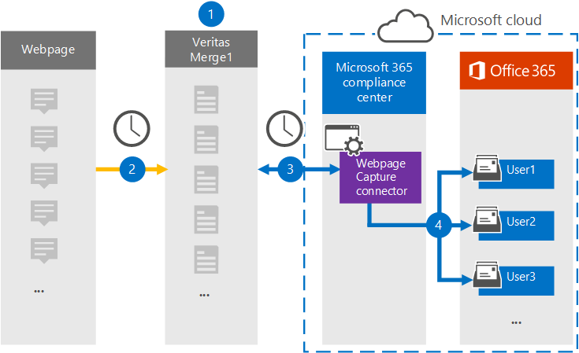

# Configurar un conector para archivar datos de páginas webSet up a connector to archive webpage data

Use un conector Veritas en el centro de Microsoft 365 de cumplimiento para importar y archivar datos de páginas web a buzones de usuario de su Microsoft 365 organización.Use a Veritas connector in the Microsoft 365 compliance center to import and archive data from webpages to user mailboxes in your Microsoft 365 organization. Veritas proporciona un conector [de captura de](https://globanet.com/webpage-capture) páginas web que captura páginas web específicas (y cualquier vínculo de esas páginas) en un sitio web específico o en un dominio completo.Veritas provides a [Webpage Capture](https://globanet.com/webpage-capture) connector that captures specific webpages (and any links on those pages) in a specific website or an entire domain. El conector convierte el contenido de la página web en un formato de archivo PDF, PNG o personalizado y, a continuación, adjunta los archivos convertidos a un mensaje de correo electrónico y, a continuación, importa esos elementos de correo electrónico a buzones de usuario en Microsoft 365.The connector converts the webpage content to a PDF, PNG, or custom file format and then attaches the converted files to an email message and then imports those email items to user mailboxes in Microsoft 365.

Después de almacenar el contenido de la página web en buzones de usuario, puede aplicar Microsoft 365 de cumplimiento, como retención por juicio, exhibición de documentos electrónicos y directivas de retención y etiquetas de retención.After webpage content is stored in user mailboxes, you can apply Microsoft 365 compliance features such as Litigation Hold, eDiscovery, and retention policies and retention labels. El uso de un conector de captura de páginas web para importar y archivar datos en Microsoft 365 puede ayudar a su organización a cumplir con las directivas gubernamentales y reglamentarias.Using a Webpage Capture connector to import and archive data in Microsoft 365 can help your organization stay compliant with government and regulatory policies.

## Información general sobre los datos de la página web de archivadoOverview of archiving webpage data

En la siguiente introducción se explica el proceso de uso de un conector para archivar el contenido de la página web en Microsoft 365.The following overview explains the process of using a connector to archive webpage content in Microsoft 365.

1. Su organización trabaja con el origen de la página web para configurar y configurar un sitio de captura de páginas web.Your organization works with the webpage source to set up and configure a Webpage Capture site.

2. Una vez cada 24 horas, los elementos de orígenes de la página web se copian en el sitio Veritas Merge1.Once every 24 hours, the webpage sources items are copied to the Veritas Merge1 site. El conector también convierte y adjunta el contenido de una página web a un mensaje de correo electrónico.The connector also converts and attaches the content of a webpage to an email message.

3. El conector de captura de páginas web que crea en el centro de cumplimiento de Microsoft 365, se conecta al sitio Veritas Merge1 todos los días y transfiere los elementos de la página web a una ubicación Azure Storage segura en la nube de Microsoft.The Webpage Capture connector that you create in the Microsoft 365 compliance center, connects to the Veritas Merge1 site every day and transfers the webpage items to a secure Azure Storage location in the Microsoft cloud.

4. El conector importa los elementos de página web convertidos en los buzones de usuarios específicos mediante el valor de la propiedad *Email* de la asignación automática de usuarios, tal como se describe en [el paso 3](#step-3-map-users-and-complete-the-connector-setup).The connector imports the converted webpage items to the mailboxes of specific users by using the value of the *Email* property of the automatic user mapping as described in [Step 3](#step-3-map-users-and-complete-the-connector-setup). Se crea una subcarpeta en la carpeta Bandeja de entrada denominada **Captura** de página web en los buzones de usuario y los elementos de la página web se importan a esa carpeta.A subfolder in the Inbox folder named **Webpage Capture** is created in the user mailboxes, and the webpage items are imported to that folder. El conector hace esto mediante el valor de la *propiedad Email.*The connector does this by using the value of the *Email* property. Cada elemento de página web contiene esta propiedad, que se rellena con las direcciones de correo electrónico proporcionadas al configurar el conector de captura de páginas web en [el paso 2](#step-2-configure-the-webpage-capture-connector-on-the-veritas-merge1-site).Every webpage item contains this property, which is populated with the email addresses provided when you configure the Webpage Capture connector in [Step 2](#step-2-configure-the-webpage-capture-connector-on-the-veritas-merge1-site).

## Antes de empezarBefore you begin

- Cree una cuenta de Veritas Merge1 para conectores de Microsoft.Create a Veritas Merge1 account for Microsoft connectors. Para crear esta cuenta, póngase en contacto con [el servicio de soporte al cliente de Veritas](https://www.veritas.com/content/support/).To create this account, contact [Veritas Customer Support](https://www.veritas.com/content/support/). Iniciará sesión en esta cuenta al crear el conector en el paso 1.You will sign into this account when you create the connector in Step 1.

- Debe trabajar con la compatibilidad de Veritas para configurar un formato de archivo personalizado en el que convertir los elementos de la página web.You need to work with Veritas support to set up a custom file format to convert the webpage items to. Para obtener más información, vea la Guía del usuario de [Merge1 Third-Party Connectors](https://docs.ms.merge1.globanetportal.com/Merge1%20Third-Party%20Connectors%20Web%20Page%20Capture%20User%20Guide%20.pdf).For more information, see the [Merge1 Third-Party Connectors User Guide](https://docs.ms.merge1.globanetportal.com/Merge1%20Third-Party%20Connectors%20Web%20Page%20Capture%20User%20Guide%20.pdf).

- El usuario que crea el conector de captura de páginas web en el paso 1 (y lo completa en el paso 3) debe estar asignado al rol Importar exportación de buzones en Exchange Online.The user who creates the Webpage Capture connector in Step 1 (and completes it in Step 3) must be assigned to the Mailbox Import Export role in Exchange Online. Este rol es necesario para agregar conectores en la página **Conectores** de datos del centro de Microsoft 365 cumplimiento.This role is required to add connectors on the **Data connectors** page in the Microsoft 365 compliance center. De forma predeterminada, este rol no se asigna a un grupo de roles en Exchange Online.By default, this role is not assigned to a role group in Exchange Online. Puede agregar el rol Exportación de importación de buzones al grupo de roles Administración de la organización en Exchange Online.You can add the Mailbox Import Export role to the Organization Management role group in Exchange Online. O bien, puede crear un grupo de roles, asignar el rol Importación de buzones de correo Exportar y, a continuación, agregar los usuarios adecuados como miembros.Or you can create a role group, assign the Mailbox Import Export role, and then add the appropriate users as members. Para obtener más información, vea  las secciones [Crear](/Exchange/permissions-exo/role-groups#create-role-groups) grupos de roles o Modificar grupos de roles en el artículo "Administrar grupos de roles en Exchange Online".For more information, see the [Create role groups](/Exchange/permissions-exo/role-groups#create-role-groups) or [Modify role groups](/Exchange/permissions-exo/role-groups#modify-role-groups) sections in the article "Manage role groups in Exchange Online".

## Paso 1: Configurar el conector de captura de páginas webStep 1: Set up the Webpage Capture connector

El primer paso es obtener acceso a **los conectores de datos** y crear un conector para los datos de origen de página web.The first step is to access to the **Data Connectors** and create a connector for Web Page source data.

1. Vaya a [https://compliance.microsoft.com](https://compliance.microsoft.com/) y, a continuación, haga clic **en Conectores de datos** Captura de página  >  **web**.Go to [https://compliance.microsoft.com](https://compliance.microsoft.com/) and then click **Data connectors** > **Webpage Capture**.

2. En la página **Descripción del producto Captura de** página web, haga clic en Agregar **conector**.On the **Webpage Capture** product description page, click **Add connector**.

3. En la **página Términos de** servicio, haga clic **en Aceptar**.On the **Terms of service** page, click **Accept**.

4. Escriba un nombre único que identifique el conector y, a continuación, haga clic en **Siguiente**.Enter a unique name that identifies the connector, and then click **Next**.

5. Inicie sesión en su cuenta merge1 para configurar el conector.Sign in to your Merge1 account to configure the connector.

## Paso 2: Configurar el conector de captura de páginas web en el sitio Veritas Merge1Step 2: Configure the Webpage Capture connector on the Veritas Merge1 site

El segundo paso es configurar el conector de captura de páginas web en el sitio Veritas Merge1.The second step is to configure the Webpage Capture connector on the Veritas Merge1 site. Para obtener información sobre cómo configurar el conector de captura de páginas web, vea [Merge1 Third-Party Connectors User Guide](https://docs.ms.merge1.globanetportal.com/Merge1%20Third-Party%20Connectors%20Web%20Page%20Capture%20User%20Guide%20.pdf).For information about how to configure the Webpage Capture connector, see [Merge1 Third-Party Connectors User Guide](https://docs.ms.merge1.globanetportal.com/Merge1%20Third-Party%20Connectors%20Web%20Page%20Capture%20User%20Guide%20.pdf).

Después de hacer clic en Guardar  & **finalizar**, se muestra la página Asignación de usuario en el asistente para conectores en Microsoft 365 centro de cumplimiento.After you click **Save & Finish**, the **User mapping** page in the connector wizard in the Microsoft 365 compliance center is displayed.

## Paso 3: Asignar usuarios y completar la configuración del conectorStep 3: Map users and complete the connector setup

Para asignar usuarios y completar la configuración del conector en el centro de Microsoft 365 cumplimiento, siga los pasos siguientes:To map users and complete the connector setup in the Microsoft 365 compliance center, follow the steps below:

1. En la página Asignar captura de páginas web **a Microsoft 365 usuarios,** habilite la asignación automática de usuarios.On the **Map Webpage Capture users to Microsoft 365 users** page, enable automatic user mapping. Los elementos de captura de página web incluyen una propiedad denominada *Email*, que contiene direcciones de correo electrónico para los usuarios de la organización.The Webpage Capture items include a property called *Email*, which contains email addresses for users in your organization. Si el conector puede asociar esta dirección a un Microsoft 365, los elementos se importan al buzón de ese usuario.If the connector can associate this address with a Microsoft 365 user, the items are imported to that user's mailbox.

2. Haga **clic en** Siguiente, revise la configuración y vaya a la página **Conectores** de datos para ver el progreso del proceso de importación del nuevo conector.Click **Next**, review your settings, and go to the **Data connectors** page to see the progress of the import process for the new connector.

## Paso 4: Supervisar el conector de captura de páginas webStep 4: Monitor the Webpage Capture connector

Después de crear el conector de captura de páginas web, puede ver el estado del conector en el Microsoft 365 de cumplimiento.After you create the Webpage Capture connector, you can view the connector status in the Microsoft 365 compliance center.

1. Vaya a [https://compliance.microsoft.com](https://compliance.microsoft.com) y haga clic en **Conectores de datos** en la navegación izquierda.Go to [https://compliance.microsoft.com](https://compliance.microsoft.com) and click **Data connectors** in the left nav.

2. Haga clic **en la pestaña Conectores** y, a continuación, seleccione el conector de captura **de** páginas web para mostrar la página desplegable.Click the **Connectors** tab and then select the **Webpage Capture** connector to display the flyout page. Esta página contiene las propiedades y la información sobre el conector.This page contains the properties and information about the connector.

3. En **Estado del conector con origen,** haga clic en el vínculo Descargar **registro** para abrir (o guardar) el registro de estado del conector.Under **Connector status with source**, click the **Download log** link to open (or save) the status log for the connector. Este registro contiene datos que se han importado a la nube de Microsoft.This log contains data that has been imported to the Microsoft cloud.

## Problemas conocidosKnown issues

- En este momento, no se admite la importación de datos adjuntos o elementos de más de 10 MB.At this time, we don't support importing attachments or items that are larger than 10 MB. La compatibilidad con elementos más grandes estará disponible en una fecha posterior.Support for larger items will be available at a later date.