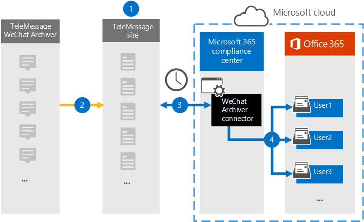

# Configurar un conector para archivar datos de WeChat

Use el conector de TeleMessage en el Centro de cumplimiento de Microsoft 365 para importar y archivar llamadas, chats, datos adjuntos, archivos y mensajes recuperados de WeChat y WeCom. Después de configurar y configurar un conector, se conecta a la cuenta de TeleMessage de la organización e importa la comunicación móvil de los empleados mediante el Archivador de WeChat de TeleMessage a los buzones de correo de Microsoft 365.

Después de almacenar los datos del conector del archivador de WeChat en buzones de usuario, puede aplicar Microsoft 365 las características de cumplimiento como retención por juicio, exhibición de documentos electrónicos, archivado de In-Place, auditoría, cumplimiento de comunicaciones y directivas de retención de Microsoft 365 a los datos de comunicación de WeChat. Por ejemplo, puede buscar en la comunicación de WeChat mediante búsqueda de contenido o asociar el buzón que contiene los datos del conector del archivador de WeChat con un custodio en un Advanced eDiscovery caso. El uso de un conector de Archivador de WeChat para importar y archivar datos en Microsoft 365 puede ayudar a su organización a cumplir con las normativas de gobierno corporativo y las directivas reglamentarias.

## Información general sobre el archivado de datos de comunicación de WeChat

En la siguiente introducción se explica el proceso de uso de un conector para archivar datos de comunicaciones de WeChat en Microsoft 365.

1. Su organización trabaja con TeleMessage para configurar un conector de archivador de WeChat.

2. En tiempo real, los datos de WeChat de su organización se copian en el sitio de TeleMessage.

3. El conector de Archivador de WeChat que crea en el Centro de cumplimiento de Microsoft 365 se conecta al sitio de TeleMessage todos los días y transfiere los mensajes de correo electrónico de las 24 horas anteriores a un área de Azure Storage segura en Microsoft Cloud.

4. El conector importa los elementos de comunicación móvil al buzón de un usuario específico. Se creará una nueva carpeta denominada WeChat Archiver en el buzón del usuario específico y los elementos se importarán a él. El conector realiza la asignación mediante el valor de la *propiedad Dirección de correo electrónico del* usuario. Cada mensaje de correo electrónico contiene esta propiedad, que se rellena con la dirección de correo electrónico de cada participante del mensaje de correo electrónico. Además de la asignación automática de usuarios mediante el valor  de la propiedad Dirección de correo electrónico del usuario, también puede definir una asignación personalizada cargando un archivo de asignación CSV. Este archivo de asignación debe contener el número de teléfono móvil del usuario y la dirección Microsoft 365 buzón de correo correspondiente para cada usuario. Si habilita la asignación automática de usuarios y proporciona una asignación personalizada, por cada elemento de correo electrónico, el conector primero buscará el archivo de asignación personalizado. Si no encuentra un usuario Microsoft 365 válido que corresponda al número de teléfono móvil de un usuario, el conector usará la propiedad de dirección de correo electrónico del usuario del elemento de correo electrónico. Si el conector no encuentra un usuario Microsoft 365 válido en el archivo de asignación personalizado o en la propiedad de dirección  de correo electrónico del usuario del elemento de correo electrónico, el elemento no se importará.

## Antes de configurar un conector

- Trabaje con TeleMessage para configurar un conector de archivo de WeChat. Para obtener más información, vea [Activating the TeleMessage WeChat Archiver for Microsoft 365](https://www.telemessage.com/microsoft-365-activation-for-wechat-archiver/).

- Configure un conector de TeleMessage para Microsoft 365 y obtenga una cuenta de administración de empresa válida. Para obtener más información, vea [Order Microsoft 365 Mobile Archiving](https://www.telemessage.com/mobile-archiver/order-mobile-archiver-for-microsoft-365/).

- Registra todos los usuarios que requieren el archivado de WeChat en la cuenta de TeleMessage con la misma dirección de correo electrónico que se usa para la cuenta Microsoft 365 usuario.

- Tendrás que instalar la aplicación Tencent WeCom en los teléfonos móviles de los usuarios de tu organización y activarla. La aplicación WeCom permite a los usuarios comunicarse y chatear con otros usuarios de WeChat y WeCom.

- El usuario que crea un conector de archivador de WeChat en el Centro de cumplimiento de Microsoft 365 debe tener asignado el rol de administrador del conector de datos. Este rol es necesario para agregar conectores en la **página Conectores de datos** de la Centro de cumplimiento de Microsoft 365. Este rol se agrega de forma predeterminada a varios grupos de roles. Para obtener una lista de estos grupos de roles, vea la sección "Roles en los centros de seguridad y cumplimiento" en Permisos en el [Centro de seguridad & cumplimiento](../security/office-365-security/permissions-in-the-security-and-compliance-center.md#roles-in-the-security--compliance-center). Como alternativa, un administrador de la organización puede crear un grupo de roles personalizado, asignar el rol de administrador del conector de datos y, a continuación, agregar los usuarios adecuados como miembros. Para obtener instrucciones, vea la sección "Crear un grupo de roles personalizado" en [Permisos en el Centro de cumplimiento de Microsoft 365](microsoft-365-compliance-center-permissions.md#create-a-custom-role-group).

- Este conector de datos de TeleMessage está disponible en GCC entornos en la Microsoft 365 us government cloud. Las aplicaciones y servicios de terceros pueden implicar almacenar, transmitir y procesar los datos de clientes de su organización en sistemas de terceros que están fuera de la infraestructura de Microsoft 365 y, por lo tanto, no están cubiertos por los compromisos de cumplimiento y protección de datos de Microsoft 365. Microsoft no hace ninguna representación de que el uso de este producto para conectarse a aplicaciones de terceros implica que esas aplicaciones de terceros son compatibles con FEDRAMP.

## Crear un conector de Archivador de WeChat

Siga los pasos de esta sección para crear un conector de archivador de WeChat en el Centro de cumplimiento de Microsoft 365. El conector usa la información que proporciona para conectarse al sitio de TeleMessage y transferir datos de comunicaciones de WeChat a los buzones de usuario correspondientes en Microsoft 365.

1. Vaya a <https://compliance.microsoft.com> y, a continuación, **haga clic en Conectores de datosWeChat** >  **Archiver**.

2. En la página **Descripción del producto archiver de WeChat** , haga clic **en Agregar conector**

3. En la **página Términos de** servicio, haga clic en **Aceptar**.

4. En la **página Iniciar sesión en TeleMessage** , en paso 3, escriba la información necesaria en los siguientes cuadros y, a continuación, haga clic en **Siguiente**.

    - **Nombre de** usuario: nombre de usuario de TeleMessage.

    - **Contraseña**: la contraseña de TeleMessage.

5. Después de crear el conector, puede cerrar la ventana emergente ir a la página siguiente.

6. En la **página Asignación de** usuarios, habilite la asignación automática de usuarios. También puede cargar un archivo CSV de asignación de usuario personalizado.

7. Haga **clic en Siguiente**, revise la configuración y, a continuación, haga clic **en Finalizar** para crear el conector.

8. Vaya a la **pestaña Conectores** de la **página Conectores de** datos para ver el progreso del proceso de importación del nuevo conector.

## Problemas conocidos

- En este momento, no se admite la importación de datos adjuntos o elementos de más de 10 MB. La compatibilidad con elementos más grandes estará disponible en una fecha posterior.
