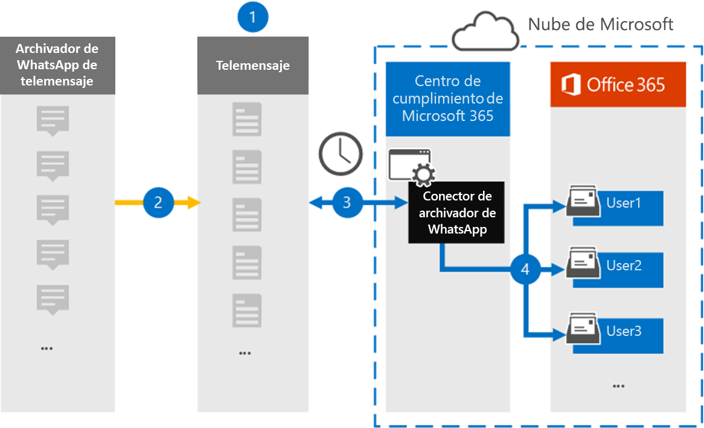

# Configurar un conector para archivar datos de WhatsAppSet up a connector to archive WhatsApp data

Use el conector de TeleMessage en el centro de Microsoft 365 de cumplimiento para importar y archivar llamadas de WhatsApp, chats, datos adjuntos, archivos y mensajes eliminados.Use the TeleMessage connector in the Microsoft 365 compliance center to import and archive WhatsApp calls, chats, attachments, files, and deleted messages. Después de configurar y configurar un conector, se conecta a la cuenta de TeleMessage de la organización una vez al día e importa la comunicación móvil de los empleados mediante el Archivador de WhatsApp Teléfono de TeleMessage o el Archivador en la nube de WhatsApp de TeleMessage a buzones de Microsoft 365.After you set up and configure a connector, it connects to your organization's TeleMessage account once every day, and imports the mobile communication of employees using the TeleMessage WhatsApp Phone Archiver or TeleMessage WhatsApp Cloud Archiver to mailboxes in Microsoft 365.

Después de almacenar los datos de WhatsApp en buzones de usuario, puede aplicar Microsoft 365 características de cumplimiento como retención por juicio, búsqueda de contenido y directivas de retención Microsoft 365 a los datos de WhatsApp.After WhatsApp data is stored in user mailboxes, you can apply Microsoft 365 compliance features such as Litigation Hold, Content Search, and Microsoft 365 retention policies to WhatsApp data. Por ejemplo, puede buscar mensajes de WhatsApp mediante búsqueda de contenido o asociar el buzón que contiene mensajes de WhatsApp con un custodio en un Advanced eDiscovery caso.For example, you can search WhatsApp messages using Content Search or associate the mailbox that contains WhatsApp messages with a custodian in an Advanced eDiscovery case. El uso de un conector de WhatsApp para importar y archivar datos en Microsoft 365 puede ayudar a su organización a cumplir con las directivas gubernamentales y reglamentarias.Using a WhatsApp connector to import and archive data in Microsoft 365 can help your organization stay compliant with government and regulatory policies.

## Información general sobre el archivado de datos de WhatsAppOverview of archiving WhatsApp data

En la siguiente introducción se explica el proceso de uso de un conector para archivar datos de WhatsApp en Microsoft 365.The following overview explains the process of using a connector to archive WhatsApp data in Microsoft 365.

1. Su organización trabaja con TeleMessage para configurar un conector de archivador de WhatsApp.Your organization works with TeleMessage to set up a WhatsApp Archiver connector. Para obtener más información, [vea WhatsApp Archiver](https://www.telemessage.com/office365-activation-for-whatsapp-archiver).For more information, see [WhatsApp Archiver](https://www.telemessage.com/office365-activation-for-whatsapp-archiver).

2. En tiempo real, los datos de WhatsApp de la organización se copian en el sitio de TeleMessage.In real time, your organization's WhatsApp data is copied to the TeleMessage site.

3. El conector de WhatsApp que cree en el centro de cumplimiento de Microsoft 365 se conecta al sitio de TeleMessage todos los días y transfiere los datos de WhatsApp de las 24 horas anteriores a una ubicación Azure Storage segura en la nube de Microsoft.The WhatsApp connector that you create in the Microsoft 365 compliance center connects to the TeleMessage site every day and transfers WhatsApp data from the previous 24 hours to a secure Azure Storage location in the Microsoft cloud. El conector también convierte los datos de WhatsApp de contenido en un formato de mensaje de correo electrónico.The connector also converts the content WhatsApp data to an email message format.

4. El conector importa datos de WhatsApp al buzón de un usuario específico.The connector imports WhatsApp data to the mailbox of a specific user. Se crea una nueva carpeta denominada **WhatsApp Archiver** en el buzón del usuario específico y los elementos se importan a él.A new folder named **WhatsApp Archiver** is created in the specific user's mailbox and the items are imported to it. El conector realiza esta asignación mediante el valor de la *propiedad Dirección de correo* electrónico del usuario.The connector does this mapping by using the value of the *User’s Email address* property. Cada mensaje de WhatsApp contiene esta propiedad, que se rellena con la dirección de correo electrónico de cada participante del mensaje.Every WhatsApp message contains this property, which is populated with the email address of every participant of the message.

   Además de la asignación automática  de usuarios mediante el valor de la propiedad Dirección de correo electrónico del usuario, también puede implementar la asignación personalizada cargando un archivo de asignación CSV.In addition to automatic user mapping using the value of the *User’s Email address* property, you can also implement custom mapping by uploading a CSV mapping file. Este archivo de asignación contiene el número de teléfono móvil y la dirección Microsoft 365 de correo electrónico correspondiente para los usuarios de la organización.This mapping file contains the mobile phone number and corresponding Microsoft 365 email address for users in your organization. Si habilita la asignación automática de usuarios y la asignación personalizada, por cada elemento de WhatsApp, el conector primero mira el archivo de asignación personalizado.If you enable both automatic user mapping and custom mapping, for every WhatsApp item the connector first looks at custom mapping file. Si no encuentra un usuario Microsoft 365 válido que corresponda al número de teléfono móvil de un usuario, el conector usará los valores de la propiedad de dirección de correo electrónico del elemento que está intentando importar.If it doesn't find a valid Microsoft 365 user that corresponds to a user's mobile phone number, the connector will use the values in the email address property of the item it's trying to import. Si el conector no encuentra un usuario Microsoft 365 válido en el archivo de asignación personalizado o en la propiedad de dirección de correo electrónico del elemento de WhatsApp, el elemento no se importará.If the connector doesn't find a valid Microsoft 365 user in either the custom mapping file or in the email address property of the WhatsApp item, the item won't be imported.

## Antes de empezarBefore you begin

Algunos de los pasos de implementación necesarios para archivar los datos de comunicación de WhatsApp son externos a Microsoft 365 y deben completarse antes de poder crear el conector en el centro de cumplimiento.Some of the implementation steps required to archive WhatsApp communication data are external to Microsoft 365 and must be completed before you can create the connector in the compliance center.

- Ordene [el servicio archiver de WhatsApp desde TeleMessage](https://www.telemessage.com/mobile-archiver/order-mobile-archiver-for-o365) y obtenga una cuenta de administración válida para su organización.Order the [WhatsApp Archiver service from TeleMessage](https://www.telemessage.com/mobile-archiver/order-mobile-archiver-for-o365) and get a valid administration account for your organization. Deberá iniciar sesión en esta cuenta al crear el conector en el centro de cumplimiento.You'll need to sign into this account when you create the connector in the compliance center.

- Registrar todos los usuarios que requieren archivado de WhatsApp en la cuenta de TeleMessage.Register all users that require WhatsApp archiving in the TeleMessage account. Al registrar usuarios, asegúrese de usar la misma dirección de correo electrónico que se usa para su Microsoft 365 usuario.When registering users, be sure to use the same email address that's used for their Microsoft 365 account.

- Instala la aplicación [Teléfono Archiver](https://www.telemessage.com/mobile-archiver/whatsapp-phone-archiver-2/) de TeleMessage en los teléfonos móviles de tus empleados y actívala.Install the TeleMessage [WhatsApp Phone Archiver app](https://www.telemessage.com/mobile-archiver/whatsapp-phone-archiver-2/) on the mobile phones of your employees and activate it. Como alternativa, puedes instalar las aplicaciones regulares de WhatsApp o WhatsApp Empresa en los teléfonos móviles de tus empleados y activar el servicio WhatsApp Cloud Archiver mediante el examen de un código QR en el sitio web de TeleMessage.Alternatively, you can install the regular WhatsApp or WhatsApp Business apps on the mobile phones of your employees and activate the WhatsApp Cloud Archiver service by scanning a QR code on the TeleMessage website. Para obtener más información, [vea WhatsApp Cloud Archiver](https://www.telemessage.com/mobile-archiver/whatsapp-archiver/whatsapp-cloud-archiver/).For more information, see [WhatsApp Cloud Archiver](https://www.telemessage.com/mobile-archiver/whatsapp-archiver/whatsapp-cloud-archiver/).

- Al usuario que crea un conector de red de Verizon se le debe asignar el rol De importación de buzones de Exchange Online.The user who creates a Verizon Network connector must be assigned the Mailbox Import Export role in Exchange Online. Esto es necesario para agregar conectores en la **página Conectores de datos** del centro de Microsoft 365 cumplimiento.This is required to add connectors in the **Data connectors** page in the Microsoft 365 compliance center. Este rol no está asignado a ningún grupo de roles de Exchange Online de forma predeterminada.By default, this role isn't assigned to any role group in Exchange Online. Puede agregar el rol Exportación de importación de buzones al grupo de roles Administración de la organización en Exchange Online.You can add the Mailbox Import Export role to the Organization Management role group in Exchange Online. O bien, puede crear un grupo de roles, asignar el rol Importación de buzones de correo Exportar y, a continuación, agregar los usuarios adecuados como miembros.Or you can create a role group, assign the Mailbox Import Export role, and then add the appropriate users as members. Para obtener más información, vea  las secciones [Crear](/Exchange/permissions-exo/role-groups#create-role-groups) grupos de roles o Modificar grupos de roles en el artículo "Administrar grupos de roles en Exchange Online".For more information, see the [Create role groups](/Exchange/permissions-exo/role-groups#create-role-groups) or [Modify role groups](/Exchange/permissions-exo/role-groups#modify-role-groups) sections in the article "Manage role groups in Exchange Online".

## Crear un conector de Archivador de WhatsAppCreate a WhatsApp Archiver connector

Después de completar los requisitos previos descritos en la sección anterior, puede crear el conector de WhatsApp en el centro de Microsoft 365 cumplimiento.After you've completed the prerequisites described in the previous section, you can create the WhatsApp connector in the Microsoft 365 compliance center. El conector usa la información que proporciona para conectarse al sitio de TeleMessage y transferir los datos de WhatsApp a los cuadros de buzón de usuario correspondientes en Microsoft 365.The connector uses the information you provide to connect to the TeleMessage site and transfer the WhatsApp data to the corresponding user mailbox boxes in Microsoft 365.

1. Vaya a [https://compliance.microsoft.com](https://compliance.microsoft.com/) y, a continuación, haga clic **en Conectores de datos**  >  **WhatsApp Archiver**.Go to [https://compliance.microsoft.com](https://compliance.microsoft.com/) and then click **Data connectors** > **WhatsApp Archiver**.

2. En la página descripción del producto Archiver de **WhatsApp,** haga clic **en Agregar conector**On the **WhatsApp Archiver** product description page, click **Add connector**

3. En la **página Términos de** servicio, haga clic **en Aceptar**.On the **Terms of service** page, click **Accept**.

4. En la **página Iniciar sesión en TeleMessage,** en el paso 3, escriba la información necesaria en los cuadros siguientes y, a continuación, haga clic en **Siguiente**.On the **Login to TeleMessage** page, under Step 3, enter the required information in the following boxes and then click **Next**.

   - **Nombre de usuario:** Su nombre de usuario de TeleMessage.**Username:** Your TeleMessage username.

   - **Contraseña:** Su contraseña de TeleMessage.**Password:** Your TeleMessage password.

5. Después de crear el conector, puede cerrar la ventana emergente y pasar a la página siguiente.After the connector is created, you can close the pop-up window and go to the next page.

6. En la **página Asignación de** usuarios, habilite la asignación automática de usuarios y haga clic **en Siguiente**.On the **User mapping** page, enable automatic user mapping and click **Next**. En caso de que necesite una asignación personalizada, cargue un archivo CSV y haga clic en **Siguiente**.In case you need custom mapping upload a CSV file, and click **Next**.

7. Revise la configuración y, a continuación, haga clic **en Finalizar** para crear el conector.Review your settings, and then click **Finish** to create the connector.

8. Vaya a la pestaña Conectores de la **página Conectores de** datos para ver el progreso del proceso de importación del nuevo conector.Go to the Connectors tab in **Data connectors** page to see the progress of the import process for the new connector.

## Problemas conocidosKnown issues

- En este momento, no se admite la importación de datos adjuntos o elementos de más de 10 MB.At this time, we don't support importing attachments or items that are larger than 10 MB. La compatibilidad con elementos más grandes estará disponible en una fecha posterior.Support for larger items will be available at a later date.
