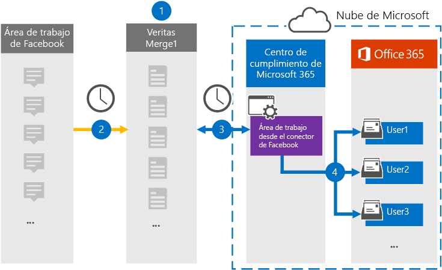

# Configurar un conector para archivar el área de trabajo de datos de Facebook

Use un conector de Globanet en el centro de cumplimiento de Microsoft 365 para importar y archivar datos desde el lugar de trabajo de Facebook a los buzones de usuario de la organización 365 de Microsoft. Globanet proporciona un [área de trabajo del conector de Facebook](https://globanet.com/workplace/) que está configurada para capturar elementos del origen de datos de terceros (de forma regular) e importar dichos elementos a Microsoft 365. El conector convierte el contenido, como chats, datos adjuntos, publicaciones y vídeos del lugar de trabajo a un formato de mensaje de correo electrónico y, a continuación, importa esos elementos a los buzones de usuario en Microsoft 365.

Una vez que los datos del espacio de trabajo se almacenan en buzones de usuario, puede aplicar características de cumplimiento de Microsoft 365, como retención por juicio, eDiscovery, directivas de retención y etiquetas de retención, y cumplimiento de la comunicación. El uso del área de trabajo del conector de Facebook para importar y archivar datos en Microsoft 365 puede ayudar a su organización a cumplir las directivas gubernamentales y regulatorias.

## Información general sobre el espacio de trabajo de archivado de datos de Facebook

En la siguiente introducción se explica el proceso de uso de un conector para archivar los datos del área de trabajo en Microsoft 365.

1. La organización trabaja con el área de trabajo de Facebook para configurar y configurar un sitio de área de trabajo.

2. Una vez cada 24 horas, los elementos del área de trabajo se copian en el sitio de Merge1 de Globanet. El conector también convierte el contenido de estos elementos en un formato de mensaje de correo electrónico.

3. El área de trabajo del conector de Facebook que cree en el centro de cumplimiento de Microsoft 365, se conecta a Globanet Merge1 cada día y transfiere los elementos del área de trabajo a una ubicación de almacenamiento seguro de Azure en la nube de Microsoft.

4. El conector importa los elementos convertidos a los buzones de usuarios específicos usando el valor de la propiedad *email* de la asignación automática de usuarios, como se describe en el paso 3. Se crea una subcarpeta de la carpeta Bandeja **de entrada denominada Workplace desde Facebook** y los elementos del área de trabajo se importan a esa carpeta. El conector lo hace mediante el valor de la propiedad *email* . Cada elemento del espacio de trabajo contiene esta propiedad, que se rellena con la dirección de correo electrónico de cada participante de chat o post.

## Antes de empezar

- Cree una cuenta de Globanet Merge1 para Microsoft Connectors. Para crear esta cuenta, póngase en contacto [con el soporte técnico de Globanet](https://globanet.com/ms-connectors-contact). Iniciará sesión en esta cuenta cuando cree el conector en el paso 1.

- Cree una integración personalizada en https://my.workplace.com/work/admin/apps/ para recuperar datos del lugar de trabajo a través de las API con fines de cumplimiento y de exhibición de documentos electrónicos.

   Al crear la integración, la plataforma de trabajo genera un conjunto de credenciales únicas usadas para generar tokens que se usan para la autenticación. Estos tokens se usan en el área de trabajo del Asistente para la configuración del conector de Facebook en el paso 2. Para obtener instrucciones paso a paso sobre cómo crear las aplicaciones, consulte la [Guía del usuario de conectores de terceros de Merge1](https://docs.ms.merge1.globanetportal.com/Merge1%20Third-Party%20Connectors%20Workplace%20from%20Facebook%20User%20Guide%20.pdf).

- El usuario que crea el área de trabajo desde el conector de Facebook en el paso 1 (y lo completa en el paso 3) debe asignarse a la función importación y exportación de buzones de correo en Exchange Online. Este rol es necesario para agregar conectores en la página **conectores de datos** del centro de cumplimiento de Microsoft 365. De forma predeterminada, este rol no está asignado a un grupo de roles en Exchange Online. Puede Agregar el rol importación y exportación de buzones al grupo de funciones de administración de la organización en Exchange Online. O bien, puede crear un grupo de roles, asignar el rol de importación y exportación de buzones de correo y, a continuación, agregar los usuarios adecuados como miembros. Para obtener más información, vea las secciones [crear grupos](https://docs.microsoft.com/Exchange/permissions-exo/role-groups#create-role-groups) de roles o [modificar grupos de roles](https://docs.microsoft.com/Exchange/permissions-exo/role-groups#modify-role-groups) en el artículo sobre la administración de grupos de roles en Exchange Online.

## Paso 1: configurar el área de trabajo desde el conector de Facebook

El primer paso es obtener acceso a la página **conectores de datos** en el centro de cumplimiento de Microsoft 365 y crear un conector para los datos del área de trabajo.

1. Vaya a [https://compliance.microsoft.com](https://compliance.microsoft.com/) y, a continuación, haga clic en **Data Connectors**  >  **Workplace desde Facebook** .

2. En la página **área de trabajo de la descripción de producto de Facebook** , haga clic en **Agregar conector** .

3. En la página **condiciones de servicio** , haga clic en **Aceptar** .

4. Escriba un nombre único que identifique el conector y, a continuación, haga clic en **siguiente** .

5. Inicie sesión en su cuenta de Merge1 para configurar el conector.

## Paso 2: configurar el área de trabajo desde el conector de Facebook en el sitio de Merge1 de Globanet

El segundo paso consiste en configurar el área de trabajo desde el conector de Facebook en el sitio de Merge1. Para obtener información sobre cómo configurar el área de trabajo desde el conector de Facebook, consulte la [Guía del usuario de conectores de terceros de Merge1](https://docs.ms.merge1.globanetportal.com/Merge1%20Third-Party%20Connectors%20Workplace%20from%20Facebook%20User%20Guide%20.pdf).

Después de hacer clic en **guardar & finalizar** , se muestra la página **asignación de usuarios** en el Asistente para conectores del centro de cumplimiento de Microsoft 365.

## Paso 3: asignar usuarios y completar la configuración del conector

Para asignar usuarios y completar la configuración del conector en el centro de cumplimiento de Microsoft 365, siga estos pasos:

1. En la página **asignar usuarios externos a Microsoft 365 usuarios** , habilite la asignación automática de usuarios. Los elementos del área de trabajo incluyen una propiedad denominada *correo electrónico* que contiene las direcciones de correo electrónico de los usuarios de la organización. Si el conector puede asociar esta dirección con un usuario de Microsoft 365, los elementos se importan al buzón de correo del usuario.

2. En la página **consentimiento del administrador** , haga clic en **proporcionar consentimiento** . Se le redirigirá al sitio de Microsoft. Haga clic en **Aceptar** para proporcionar el consentimiento.
  
   La organización debe permitir que el servicio de importación de Office 365 obtenga acceso a los datos de buzones de la organización. Para proporcionar el consentimiento del administrador, debe haber iniciado sesión con las credenciales de un administrador global de Microsoft 365 y aceptar la solicitud de consentimiento. Si no ha iniciado sesión como administrador global, puede ir a [esta página](https://login.microsoftonline.com/common/oauth2/authorize?client_id=570d0bec-d001-4c4e-985e-3ab17fdc3073&response_type=code&redirect_uri=https://portal.azure.com/&nonce=1234&prompt=admin_consent) e iniciar sesión con las credenciales de administrador global para aceptar la solicitud.

3. Haga clic en **siguiente** , revise la configuración y, después, vaya a la página **conectores de datos** para ver el progreso del proceso de importación del nuevo conector.

## Paso 4: supervisar el área de trabajo desde el conector de Facebook

Después de crear el área de trabajo desde el conector de Facebook, puede ver el estado del conector en el centro de cumplimiento de Microsoft 365.

1. Vaya a [https://compliance.microsoft.com](https://compliance.microsoft.com) y haga clic en **conectores de datos** en el panel de navegación izquierdo.

2. Haga clic en la pestaña **conectores** y, a continuación, seleccione el **área de trabajo de Facebook** Connector para mostrar la página de flotante. Esta página contiene las propiedades y la información sobre el conector.

3. En **Estado del conector con origen** , haga clic en el vínculo **Descargar registro** para abrir (o guardar) el registro de estado del conector. Este registro contiene información sobre los datos que se han importado a la nube de Microsoft.

## Problemas conocidos

- En este momento, no se admite la importación de datos adjuntos o elementos de más de 10 MB. La compatibilidad con elementos más grandes estará disponible en una fecha posterior.
