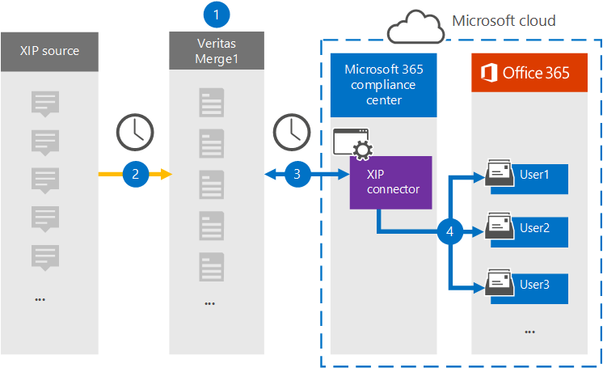

# Configurar un conector para archivar datos de origen de XIP (versión preliminar)

Use un conector de Globanet en el centro de cumplimiento de Microsoft 365 para importar y archivar datos de la plataforma de origen de XIP en buzones de usuario de la organización 365 de Microsoft. Globanet proporciona un conector [XIP](https://globanet.com/xip/) que permite el uso de un archivo XIP para importar elementos a Microsoft 365. Un archivo XIP es similar a un archivo ZIP, pero permite el uso de una firma digital. La firma digital se comprueba mediante la combinación 1 Globanet antes de extraer el archivo de origen XIP. El conector convierte el contenido del archivo de origen XIP en un formato de mensaje de correo electrónico y, a continuación, importa esos elementos en el buzón del usuario en Microsoft 365.

Una vez que los datos de origen de XIP se almacenan en buzones de usuario, puede aplicar características de cumplimiento de Microsoft 365 como retención por juicio, eDiscovery, directivas de retención y etiquetas de retención y cumplimiento de la comunicación. El uso de un conector de XIP para importar y archivar datos en Microsoft 365 puede ayudar a su organización a cumplir las directivas gubernamentales y regulatorias.

## Información general sobre el archivado de los datos de origen de XIP

La información general siguiente explica el proceso de uso de un conector para archivar los datos de origen de XIP en Microsoft 365.

1. Su organización trabaja con el origen de XIP para configurar y configurar un sitio de XIP.

2. Una vez cada 24 horas, XIP elementos de origen se copian en el sitio Merge1 de Globanet. El conector también convierte el contenido en un formato de mensaje de correo electrónico.

3. El conector XIP que crea en el centro de cumplimiento de Microsoft 365, se conecta al sitio de Merge1 de Globanet todos los días y transfiere los mensajes a una ubicación de almacenamiento seguro de Azure en la nube de Microsoft.

4. El conector importa los elementos de mensaje convertidos a los buzones de usuarios específicos usando el valor de la propiedad *email* de la asignación automática de usuarios, como se describe en el [paso 3](#step-3-map-users-and-complete-the-connector-setup). Se crea una subcarpeta en la carpeta Bandeja de entrada denominada **XIP** en los buzones de usuario y los elementos se importan a esa carpeta. El conector determina a qué buzón se importarán los elementos mediante el valor de la propiedad *email* . Cada elemento de origen contiene esta propiedad, que se rellena con la dirección de correo electrónico de cada participante.

## Antes de empezar

- Cree una cuenta de Globanet Merge1 para Microsoft Connectors. Para crear una cuenta, póngase en contacto [con el soporte técnico de Globanet](https://globanet.com/contact-us/). Debe iniciar sesión en esta cuenta cuando cree el conector en el paso 1.

- El usuario que crea el conector XIP en el paso 1 (y lo completa en el paso 3) debe estar asignado a la función importación y exportación de buzones de correo en Exchange Online. Este rol es necesario para agregar conectores en la página conectores de datos del centro de cumplimiento de Microsoft 365. De forma predeterminada, este rol no está asignado a ningún grupo de roles en Exchange Online. Puede Agregar el rol importación y exportación de buzones al grupo de funciones de administración de la organización en Exchange Online. O bien, puede crear un grupo de roles, asignar el rol de importación y exportación de buzones de correo y, a continuación, agregar los usuarios adecuados como miembros. Para obtener más información, vea las secciones [crear grupos](https://docs.microsoft.com/Exchange/permissions-exo/role-groups#create-role-groups) de roles o [modificar grupos de roles](https://docs.microsoft.com/Exchange/permissions-exo/role-groups#modify-role-groups) en el artículo sobre la administración de grupos de roles en Exchange Online.

## Paso 1: configurar el conector de XIP

El primer paso es obtener acceso a la página **conectores de datos** en el centro de cumplimiento de Microsoft365 y crear un conector para los datos de origen de XIP.

1. Vaya a [https://compliance.microsoft.com](https://compliance.microsoft.com/) y haga clic en **conectores de datos** \> **XIP**.

2. En la página Descripción del producto de **XIP** , haga clic en **Agregar nuevo conector**.

3. En la página **condiciones de servicio** , haga clic en **Aceptar**.

4. Escriba un nombre único que identifique el conector y, a continuación, haga clic en **siguiente**.

5. Inicie sesión en su cuenta de Merge1 para configurar el conector.

## Paso 2: configurar el conector de XIP en el sitio de Merge1 de Globanet

El segundo paso consiste en configurar el conector de XIP en el sitio de Merge1. Para obtener información acerca de cómo configurar el conector de XIP, consulte [Merge1 guía del usuario de conectores de terceros](https://docs.ms.merge1.globanetportal.com/Merge1%20Third-Party%20Connectors%20XIP%20User%20Guide%20.pdf).

Después de hacer clic en **guardar & finalizar** , se muestra la página **asignación de usuarios** en el Asistente para conectores del centro de cumplimiento de Microsoft 365.

## Paso 3: asignar usuarios y completar la configuración del conector

Para asignar usuarios y completar la configuración del conector, siga estos pasos:

1. En la página **asignar XIP usuarios a Microsoft 365 usuarios** , habilite la asignación automática de usuarios. Los elementos de origen XIP incluyen una propiedad denominada *email* , que contiene las direcciones de correo electrónico de los usuarios de la organización. Si el conector puede asociar esta dirección con un usuario de Microsoft 365, los elementos se importan al buzón de correo del usuario.

2. En la página **consentimiento del administrador** , haga clic en el botón **proporcionar consentimiento** . Se le redirigirá al sitio de Microsoft. Haga clic en **Aceptar** para proporcionar el consentimiento.

   La organización debe permitir que el servicio de importación de Office 365 obtenga acceso a los datos de buzones de la organización. Para proporcionar el consentimiento del administrador, debe haber iniciado sesión con las credenciales de un administrador global de Microsoft 365 y aceptar la solicitud de consentimiento. Si no ha iniciado sesión como administrador global, puede ir a [esta página](https://login.microsoftonline.com/common/oauth2/authorize?client_id=570d0bec-d001-4c4e-985e-3ab17fdc3073&response_type=code&redirect_uri=https://portal.azure.com/&nonce=1234&prompt=admin_consent) e iniciar sesión con las credenciales de administrador global para aceptar la solicitud.

3. Haga clic en **siguiente** , revise la configuración y vaya a la página **conectores de datos** para ver el progreso del proceso de importación del nuevo conector.

## Paso 4: supervisar el conector de XIP

Después de crear el conector de XIP, puede ver el estado del conector en el centro de cumplimiento de Microsoft 365.

1. Vaya a [https://compliance.microsoft.com](https://compliance.microsoft.com/) y haga clic en **conectores de datos** en el panel de navegación izquierdo.

2. Haga clic en la pestaña **conectores** y, a continuación, seleccione el conector de **XIP** para mostrar la página de flotante, que contiene las propiedades y la información sobre el conector.

3. En **Estado del conector con origen** , haga clic en el vínculo **Descargar registro** para abrir (o guardar) el registro de estado del conector. Este registro contiene datos que se han importado a la nube de Microsoft.

## Problemas conocidos

- En este momento, no se admite la importación de datos adjuntos o elementos de más de 10 MB. La compatibilidad con elementos más grandes estará disponible en una fecha posterior.
