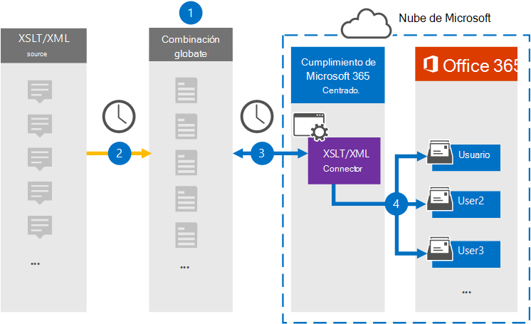

# Configurar un conector para archivar datos XSLT/XML

Use un conector de Globanet en el centro de cumplimiento de Microsoft 365 para importar y archivar datos desde el origen de la página web a los buzones de usuario de la organización 365 de Microsoft. Globanet proporciona un [conector XSLT/XML](https://globanet.com/xslt-xml) que permite el desarrollo rápido de archivos creados mediante XSLT (transformaciones de lenguaje de hojas de estilos extensible) para transformar archivos XML en otros formatos de archivo (como HTML o texto) que se pueden importar a Microsoft 365. El conector convierte el contenido de un elemento del origen XSLT/XML a un formato de mensaje de correo electrónico y, a continuación, importa el elemento convertido a los buzones de correo de Microsoft 365.

Una vez que los datos XSLT/XML se almacenan en buzones de usuario, puede aplicar las características de cumplimiento de Microsoft 365, como retención por juicio, exhibición de documentos electrónicos y las etiquetas de retención y las directivas de retención. El uso de un conector XSLT/XML para importar y archivar datos en Microsoft 365 puede ayudar a su organización a cumplir las directivas gubernamentales y regulatorias.

## Información general sobre el archivado de datos XSLT/XML

La información general siguiente explica el proceso de uso de un conector para archivar datos de origen XSLT/XML en Microsoft 365.

1. La organización trabaja con el origen XSLT/XML para configurar y configurar un sitio XSLT/XML.

2. Una vez cada 24 horas, los mensajes de chat del origen XSLT/XML se copian al sitio de Merge1 de Globanet. El conector también convierte el contenido en un formato de mensaje de correo electrónico.

3. El conector XSLT/XML que se crea en el centro de cumplimiento de Microsoft 365, se conecta al sitio de Globanet Merge1 todos los días y transfiere los mensajes a una ubicación de almacenamiento seguro de Azure en la nube de Microsoft.

4. El conector importa los elementos de mensaje convertidos a los buzones de usuarios específicos usando el valor de la propiedad *email* de la asignación automática de usuarios, como se describe en el paso 3. Se crea una subcarpeta nueva en la carpeta Bandeja de entrada denominada **XSLT/XML** en los buzones de usuario y los elementos de mensaje se importan a esa carpeta. El conector lo hace mediante el valor de la propiedad *email* . Cada mensaje contiene esta propiedad, que se rellena con la dirección de correo electrónico de cada participante del mensaje.

## Antes de empezar

- Cree una cuenta de Globanet Merge1 para Microsoft Connectors. Para crear esta cuenta, póngase en contacto [con el soporte técnico de Globanet](https://globanet.com/contact-us/). Iniciará sesión en esta cuenta cuando cree el conector en el paso 1.

- El usuario que crea el conector XSLT/XML en el paso 1 (y lo completa en el paso 3) debe asignarse a la función importación y exportación de buzones de correo en Exchange Online. Este rol es necesario para agregar conectores en la página **conectores de datos** del centro de cumplimiento de Microsoft 365. De forma predeterminada, este rol no está asignado a un grupo de roles en Exchange Online. Puede Agregar el rol importación y exportación de buzones al grupo de funciones de administración de la organización en Exchange Online. O bien, puede crear un grupo de roles, asignar el rol de importación y exportación de buzones de correo y, a continuación, agregar los usuarios adecuados como miembros. Para obtener más información, vea las secciones [crear grupos](https://docs.microsoft.com/Exchange/permissions-exo/role-groups#create-role-groups) de roles o [modificar grupos de roles](https://docs.microsoft.com/Exchange/permissions-exo/role-groups#modify-role-groups) en el artículo sobre la administración de grupos de roles en Exchange Online.

## Paso 1: configurar un conector XSLT/XML

El primer paso es obtener acceso a los **conectores de datos** en el centro de cumplimiento de Microsoft 365 y crear un conector para los datos XSLT/XML.

1. Vaya a [https://compliance.microsoft.com](https://compliance.microsoft.com/) y, a continuación, haga clic en **Data Connectors**  >  **XSLT/XML**.

2. En la página Descripción del producto **XSLT/XML** , haga clic en **Agregar nuevo conector**.

3. En la página **condiciones de servicio** , haga clic en **Aceptar**.

4. Escriba un nombre único que identifique el conector y, a continuación, haga clic en **siguiente**.

5. Inicie sesión en su cuenta de Merge1 para configurar el conector.

## Paso 2: configurar un conector XSLT/XML

El segundo paso consiste en configurar el conector XSLT/XML en el sitio Merge1. Para obtener información sobre cómo configurar el conector XSLT/XML en el sitio de Merge1 de Globanet, consulte [Merge1 guía del usuario de conectores de terceros](https://docs.ms.merge1.globanetportal.com/Merge1%20Third-Party%20Connectors%20XSLT-XML%20User%20Guide%20.pdf).

Después de hacer clic en **guardar & finalizar**, se muestra la página **asignación de usuarios** en el Asistente para conectores del centro de cumplimiento de Microsoft 365.

## Paso 3: asignar usuarios y completar la configuración del conector

1. Para asignar usuarios y completar la configuración del conector en el centro de cumplimiento de Microsoft 365, siga los pasos que se indican a continuación:

2. En la página **asignar usuarios de XSLT/XML a usuarios de Microsoft 365** , habilite la asignación automática de usuarios. Los elementos XSLT/XML incluyen una propiedad denominada *email*, que contiene las direcciones de correo electrónico de los usuarios de la organización. Si el conector puede asociar esta dirección con un usuario de Microsoft 365, los elementos se importan al buzón de correo del usuario.

3. Haga clic en **siguiente**, revise la configuración y vaya a la página **conectores de datos** para ver el progreso del proceso de importación del nuevo conector.

## Paso 4: supervisar el conector XSLT/XML

Después de crear el conector XSLT/XML, puede ver el estado del conector en el centro de cumplimiento de Microsoft 365.

1. Vaya a [https://compliance.microsoft.com](https://compliance.microsoft.com) y haga clic en **conectores de datos** en el panel de navegación izquierdo.

2. Haga clic en la pestaña **conectores** y, a continuación, seleccione el conector **XSLT/XML** para mostrar la página de flotante. Esta página contiene las propiedades y la información sobre el conector.

3. En **Estado del conector con origen**, haga clic en el vínculo **Descargar registro** para abrir (o guardar) el registro de estado del conector. Este registro contiene datos que se han importado a la nube de Microsoft.

## Problemas conocidos

- En este momento, no se admite la importación de datos adjuntos o elementos de más de 10 MB. La compatibilidad con elementos más grandes estará disponible en una fecha posterior.
