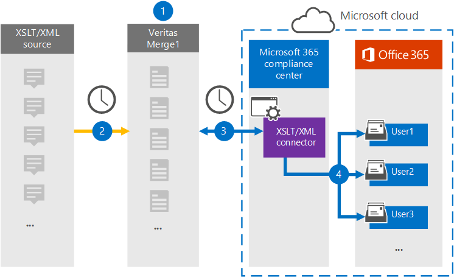

# Configurar un conector para archivar datos XSLT/XMLSet up a connector to archive XSLT/XML data

Use un conector de Globanet en el Centro de cumplimiento de Microsoft 365 para importar y archivar datos desde el origen de la página web a los buzones de usuario de su organización de Microsoft 365.Use a Globanet connector in the Microsoft 365 compliance center to import and archive data from the Web page source to user mailboxes in your Microsoft 365 organization. Globanet proporciona un conector [XSLT/XML](https://globanet.com/xslt-xml) que permite el rápido desarrollo de archivos creados mediante XSLT (Transformaciones de lenguaje de hojas de estilos extensibles) para transformar archivos XML en otros formatos de archivo (como HTML o texto) que se pueden importar a Microsoft 365.Globanet provides you with an [XSLT/XML connector](https://globanet.com/xslt-xml) that allows the rapid development of files created by using XSLT (Extensible Style sheet Language Transformations) to transform XML files into other file formats (such as HTML or text) that can be imported to Microsoft 365. El conector convierte el contenido de un elemento del origen XSLT/XML a un formato de mensaje de correo electrónico y, a continuación, importa el elemento convertido a buzones de Microsoft 365.The connector converts the content of an item from the XSLT/XML source to an email message format and then imports the converted item to Microsoft 365 mailboxes.

Una vez que los datos XSLT/XML se almacenan en buzones de usuario, puede aplicar características de cumplimiento de Microsoft 365, como retención por juicio, exhibición de documentos electrónicos y directivas de retención y etiquetas de retención.After XSLT/XML data is stored in user mailboxes, you can apply Microsoft 365 compliance features such as Litigation Hold, eDiscovery, and retention policies and retention labels. El uso de un conector XSLT/XML para importar y archivar datos en Microsoft 365 puede ayudar a su organización a cumplir con las directivas gubernamentales y reglamentarias.Using an XSLT/XML connector to import and archive data in Microsoft 365 can help your organization stay compliant with government and regulatory policies.

## Información general sobre el archivado de datos XSLT/XMLOverview of archiving XSLT/XML data

En la siguiente introducción se explica el proceso de uso de un conector para archivar datos de origen XSLT/XML en Microsoft 365.The following overview explains the process of using a connector to archive XSLT/XML source data in Microsoft 365.

1. Su organización trabaja con el origen XSLT/XML para configurar y configurar un sitio XSLT/XML.Your organization works with the XSLT/XML source to set up and configure an XSLT/XML site.

2. Una vez cada 24 horas, los mensajes de chat del origen XSLT/XML se copian en el sitio de Globanet Merge1.Once every 24 hours, chat messages from the XSLT/XML source are copied to the Globanet Merge1 site. El conector también convierte el contenido en un formato de mensaje de correo electrónico.The connector also converts the content to an email message format.

3. El conector XSLT/XML que cree en el Centro de cumplimiento de Microsoft 365, se conecta al sitio de Globanet Merge1 todos los días y transfiere los mensajes a una ubicación segura de Azure Storage en la nube de Microsoft.The XSLT/XML connector that you create in the Microsoft 365 compliance center, connects to the Globanet Merge1 site every day and transfers the messages to a secure Azure Storage location in the Microsoft cloud.

4. El conector importa los elementos de mensaje convertidos a los buzones de usuarios específicos mediante el valor de la propiedad *Email* de la asignación automática de usuarios, tal como se describe en el paso 3.The connector imports the converted message items to the mailboxes of specific users using the value of the *Email* property of the automatic user mapping as described in Step 3. Se crea una nueva subcarpeta en la carpeta Bandeja de entrada denominada **XSLT/XML** en los buzones de usuario y los elementos del mensaje se importan a esa carpeta.A new subfolder in the Inbox folder named **XSLT/XML** is created in the user mailboxes, and the message items are imported to that folder. El conector hace esto mediante el valor de la *propiedad Email.*The connector does this by using the value of the *Email* property. Cada mensaje contiene esta propiedad, que se rellena con la dirección de correo electrónico de cada participante del mensaje.Every message contains this property, which is populated with the email address of every participant of the message.

## Antes de empezarBefore you begin

- Crear una cuenta de Globanet Merge1 para conectores de Microsoft.Create a Globanet Merge1 account for Microsoft connectors. Para crear esta cuenta, póngase en contacto [con el servicio de soporte al cliente de Globanet](https://globanet.com/contact-us/).To create this account, contact [Globanet Customer Support](https://globanet.com/contact-us/). Iniciará sesión en esta cuenta al crear el conector en el paso 1.You will sign into this account when you create the connector in Step 1.

- El usuario que crea el conector XSLT/XML en el paso 1 (y lo completa en el paso 3) debe estar asignado al rol De exportación de importación de buzones en Exchange Online.The user who creates the XSLT/XML connector in Step 1 (and completes it in Step 3) must be assigned to the Mailbox Import Export role in Exchange Online. Este rol es necesario para agregar conectores en la página **Conectores de datos** del Centro de cumplimiento de Microsoft 365.This role is required to add connectors on the **Data connectors** page in the Microsoft 365 compliance center. De forma predeterminada, este rol no se asigna a un grupo de roles en Exchange Online.By default, this role is not assigned to a role group in Exchange Online. Puede agregar el rol Exportación de importación de buzones al grupo de roles Administración de la organización en Exchange Online.You can add the Mailbox Import Export role to the Organization Management role group in Exchange Online. O bien, puede crear un grupo de roles, asignar el rol Importación de buzones de correo Exportar y, a continuación, agregar los usuarios adecuados como miembros.Or you can create a role group, assign the Mailbox Import Export role, and then add the appropriate users as members. Para obtener más información, vea  las secciones [Crear](/Exchange/permissions-exo/role-groups#create-role-groups) grupos de roles o Modificar grupos de roles en el artículo "Administrar grupos de roles en Exchange Online".For more information, see the [Create role groups](/Exchange/permissions-exo/role-groups#create-role-groups) or [Modify role groups](/Exchange/permissions-exo/role-groups#modify-role-groups) sections in the article "Manage role groups in Exchange Online".

## Paso 1: Configurar un conector XSLT/XMLStep 1: Set up an XSLT/XML connector

El primer paso es obtener acceso a **los** conectores de datos en el Centro de cumplimiento de Microsoft 365 y crear un conector para datos XSLT/XML.The first step is to access to the **Data Connectors** in the Microsoft 365 compliance center and create a connector for XSLT/XML data.

1. Vaya a [https://compliance.microsoft.com](https://compliance.microsoft.com/) y, a continuación, haga clic en **Conectores de datos**  >  **XSLT/XML**.Go to [https://compliance.microsoft.com](https://compliance.microsoft.com/) and then click **Data connectors** > **XSLT/XML**.

2. En la **página Descripción del producto XSLT/XML,** haga clic en Agregar nuevo **conector**.On the **XSLT/XML** product description page, click **Add new connector**.

3. En la **página Términos de** servicio, haga clic **en Aceptar**.On the **Terms of service** page, click **Accept**.

4. Escriba un nombre único que identifique el conector y, a continuación, haga clic en **Siguiente**.Enter a unique name that identifies the connector, and then click **Next**.

5. Inicie sesión en su cuenta merge1 para configurar el conector.Sign in to your Merge1 account to configure the connector.

## Paso 2: Configurar un conector XSLT/XMLStep 2: Configure an XSLT/XML connector

El segundo paso es configurar el conector XSLT/XML en el sitio Merge1.The second step is to configure the XSLT/XML connector on the Merge1 site. Para obtener información sobre cómo configurar el conector XSLT/XML en el sitio de Globanet Merge1, vea [Merge1 Third-Party Connectors User Guide](https://docs.ms.merge1.globanetportal.com/Merge1%20Third-Party%20Connectors%20XSLT-XML%20User%20Guide%20.pdf).For information about how to configure the XSLT/XML connector on the Globanet Merge1 site, see [Merge1 Third-Party Connectors User Guide](https://docs.ms.merge1.globanetportal.com/Merge1%20Third-Party%20Connectors%20XSLT-XML%20User%20Guide%20.pdf).

Después de hacer clic en Guardar  & **finalizar**, se muestra la página Asignación de usuario en el asistente para conectores en el Centro de cumplimiento de Microsoft 365.After you click **Save & Finish**, the **User mapping** page in the connector wizard in the Microsoft 365 compliance center is displayed.

## Paso 3: Asignar usuarios y completar la configuración del conectorStep 3: Map users and complete the connector setup

1. Para asignar usuarios y completar la configuración del conector en el Centro de cumplimiento de Microsoft 365, siga estos pasos:To map users and complete the connector setup in the Microsoft 365 compliance center, follow the steps below:

2. En la **página Asignar usuarios XSLT/XML a usuarios de Microsoft 365,** habilite la asignación automática de usuarios.On the **Map XSLT/XML users to Microsoft 365 users** page, enable automatic user mapping. Los elementos XSLT/XML incluyen una propiedad denominada *Email*, que contiene direcciones de correo electrónico para los usuarios de la organización.The XSLT/XML items include a property called *Email*, which contains email addresses for users in your organization. Si el conector puede asociar esta dirección con un usuario de Microsoft 365, los elementos se importan al buzón de ese usuario.If the connector can associate this address with a Microsoft 365 user, the items are imported to that user’s mailbox.

3. Haga **clic en** Siguiente, revise la configuración y vaya a la página **Conectores** de datos para ver el progreso del proceso de importación del nuevo conector.Click **Next**, review your settings, and go to the **Data connectors** page to see the progress of the import process for the new connector.

## Paso 4: Supervisar el conector XSLT/XMLStep 4: Monitor the XSLT/XML connector

Después de crear el conector XSLT/XML, puede ver el estado del conector en el Centro de cumplimiento de Microsoft 365.After you create the XSLT/XML connector, you can view the connector status in the Microsoft 365 compliance center.

1. Vaya a [https://compliance.microsoft.com](https://compliance.microsoft.com) y haga clic en **Conectores de datos** en la navegación izquierda.Go to [https://compliance.microsoft.com](https://compliance.microsoft.com) and click **Data connectors** in the left nav.

2. Haga clic **en la pestaña Conectores** y, a continuación, seleccione el conector **XSLT/XML** para mostrar la página desplegable.Click the **Connectors** tab and then select the **XSLT/XML** connector to display the flyout page. Esta página contiene las propiedades y la información sobre el conector.This page contains the properties and information about the connector.

3. En **Estado del conector con origen,** haga clic en el vínculo Descargar **registro** para abrir (o guardar) el registro de estado del conector.Under **Connector status with source**, click the **Download log** link to open (or save) the status log for the connector. Este registro contiene datos que se han importado a la nube de Microsoft.This log contains data that has been imported to the Microsoft cloud.

## Problemas conocidosKnown issues

- En este momento, no se admite la importación de datos adjuntos o elementos de más de 10 MB.At this time, we don't support importing attachments or items that are larger than 10 MB. La compatibilidad con elementos más grandes estará disponible en una fecha posterior.Support for larger items will be available at a later date.