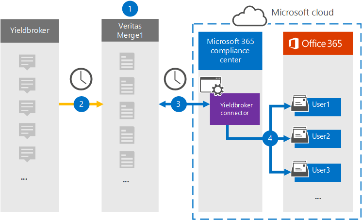

# Configurar un conector para archivar datos de YieldbrokerSet up a connector to archive Yieldbroker data

Use un conector Veritas en el Centro de cumplimiento de Microsoft 365 para importar y archivar datos del Yieldbroker a buzones de usuario de su organización de Microsoft 365.Use a Veritas connector in the Microsoft 365 compliance center to import and archive data from the Yieldbroker to user mailboxes in your Microsoft 365 organization. Veritas le proporciona un conector [Yieldbroker](https://globanet.com/yieldbroker/) configurado para capturar elementos del origen de datos de terceros e importarlos a Microsoft 365.Veritas provides you with a [Yieldbroker](https://globanet.com/yieldbroker/) connector that's configured to capture items from the third-party data source and import those items to Microsoft 365. El conector convierte el contenido de Yieldbroker a un formato de mensaje de correo electrónico y, a continuación, importa esos elementos al buzón del usuario en Microsoft 365.The connector converts the content from Yieldbroker to an email message format and then imports those items to the user’s mailbox in Microsoft 365.

Después de almacenar Yieldbroker en buzones de usuario, puede aplicar características de cumplimiento de Microsoft 365 como retención por juicio, exhibición de documentos electrónicos, directivas de retención y etiquetas de retención.After Yieldbroker is stored in user mailboxes, you can apply Microsoft 365 compliance features such as Litigation Hold, eDiscovery, retention policies, and retention labels. El uso de un conector Yieldbroker para importar y archivar datos en Microsoft 365 puede ayudar a su organización a cumplir con las directivas gubernamentales y reglamentarias.Using a Yieldbroker connector to import and archive data in Microsoft 365 can help your organization stay compliant with government and regulatory policies.

## Información general sobre el archivado de datos yieldbrokerOverview of archiving Yieldbroker data

En la siguiente introducción se explica el proceso de uso de un conector para archivar los datos de Yieldbroker en Microsoft 365.The following overview explains the process of using a connector to archive the Yieldbroker data in Microsoft 365.

1. Su organización trabaja con yieldbroker para configurar y configurar un sitio Yieldbroker.Your organization works with the Yieldbroker to set up and configure a Yieldbroker site.

2. Una vez cada 24 horas, los elementos Yieldbroker se copian en el sitio Veritas Merge1.Once every 24 hours, Yieldbroker items are copied to the Veritas Merge1 site. El conector también convierte el contenido en un formato de mensaje de correo electrónico.The connector also converts the content to an email message format.

3. El conector Yieldbroker que crea en el Centro de cumplimiento de Microsoft 365, se conecta al sitio Veritas Merge1 todos los días y transfiere los mensajes a una ubicación segura de Azure Storage en la nube de Microsoft.The Yieldbroker connector that you create in the Microsoft 365 compliance center, connects to the Veritas Merge1 site every day and transfers the messages to a secure Azure Storage location in the Microsoft cloud.

4. El conector importa los elementos Yieldbroker convertidos a los buzones de usuarios específicos mediante el valor de la propiedad *Email* de la asignación automática de usuarios, tal como se describe en [el paso 3](#step-3-map-users-and-complete-the-connector-setup).The connector imports the converted Yieldbroker items to the mailboxes of specific users using the value of the *Email* property of the automatic user mapping as described in [Step 3](#step-3-map-users-and-complete-the-connector-setup). Se crea una subcarpeta en la carpeta Bandeja de entrada denominada **Yieldbroker** en los buzones de usuario y los elementos se importan a esa carpeta.A subfolder in the Inbox folder named **Yieldbroker** is created in the user mailboxes, and the items are imported to that folder. El conector determina a qué buzón se importarán los elementos mediante el valor de la *propiedad Email.*The connector determines which mailbox to import items to by using the value of the *Email* property. Cada Yieldbroker contiene esta propiedad, que se rellena con la dirección de correo electrónico de todos los participantes del elemento.Every Yieldbroker contains this property, which is populated with the email address of every participant of the item.

## Antes de empezarBefore you begin

- Cree una cuenta de Veritas Merge1 para conectores de Microsoft.Create a Veritas Merge1 account for Microsoft connectors. Para crear una cuenta, póngase en contacto con [el Servicio de soporte al cliente de Veritas](https://www.veritas.com/content/support/).To create an account, contact [Veritas Customer Support](https://www.veritas.com/content/support/). Debe iniciar sesión en esta cuenta al crear el conector en el paso 1.You need to sign into this account when you create the connector in Step 1.

- El usuario que crea el conector Yieldbroker en el paso 1 (y lo completa en el paso 3) debe estar asignado al rol De exportación de importación de buzones en Exchange Online.The user who creates the Yieldbroker connector in Step 1 (and completes it in Step 3) must be assigned to the Mailbox Import Export role in Exchange Online. Este rol es necesario para agregar conectores en la página Conectores de datos del Centro de cumplimiento de Microsoft 365.This role is required to add connectors on the Data connectors page in the Microsoft 365 compliance center. De forma predeterminada, este rol no se asigna a ningún grupo de roles en Exchange Online.By default, this role is not assigned to any role group in Exchange Online. Puede agregar el rol Exportación de importación de buzones al grupo de roles Administración de la organización en Exchange Online.You can add the Mailbox Import Export role to the Organization Management role group in Exchange Online. O bien, puede crear un grupo de roles, asignar el rol Importación de buzones de correo Exportar y, a continuación, agregar los usuarios adecuados como miembros.Or you can create a role group, assign the Mailbox Import Export role, and then add the appropriate users as members. Para obtener más información, vea  las secciones [Crear](/Exchange/permissions-exo/role-groups#create-role-groups) grupos de roles o Modificar grupos de roles en el artículo "Administrar grupos de roles en Exchange Online".For more information, see the [Create role groups](/Exchange/permissions-exo/role-groups#create-role-groups) or [Modify role groups](/Exchange/permissions-exo/role-groups#modify-role-groups) sections in the article "Manage role groups in Exchange Online".

## Paso 1: Configurar el conector YieldbrokerStep 1: Set up the Yieldbroker connector

El primer paso es acceder a la página **Conectores** de datos en el Centro de cumplimiento de Microsoft 365 y crear un conector para yieldbroker.The first step is to access to the **Data Connectors** page in the Microsoft 365 compliance center and create a connector for the Yieldbroker.

1. Vaya a [https://compliance.microsoft.com](https://compliance.microsoft.com/) y, a continuación, haga clic **en Conectores de datos** &gt; **Yieldbroker**.Go to [https://compliance.microsoft.com](https://compliance.microsoft.com/) and then click **Data connectors** &gt; **Yieldbroker**.

2. En la **página Descripción del producto Yieldbroker,** haga clic en Agregar nuevo **conector**.On the **Yieldbroker** product description page, click **Add new connector**.

3. En la **página Términos de** servicio, haga clic **en Aceptar**.On the **Terms of service** page, click **Accept**.

4. Escriba un nombre único que identifique el conector y, a continuación, haga clic en **Siguiente**.Enter a unique name that identifies the connector, and then click **Next**.

5. Inicie sesión en su cuenta merge1 para configurar el conector.Sign in to your Merge1 account to configure the connector.

## Paso 2: Configurar el conector Yieldbroker en el sitio Veritas Merge1Step 2: Configure the Yieldbroker connector on the Veritas Merge1 site

El segundo paso es configurar el conector Yieldbroker en el sitio Merge1.The second step is to configure the Yieldbroker connector on the Merge1 site. Para obtener información sobre cómo configurar yieldbroker, vea [Merge1 Third-Party Connectors User Guide](https://docs.ms.merge1.globanetportal.com/Merge1%20Third-Party%20Connectors%20Yieldbroker%20User%20Guide%20.pdf).For information about how to configure the Yieldbroker, see [Merge1 Third-Party Connectors User Guide](https://docs.ms.merge1.globanetportal.com/Merge1%20Third-Party%20Connectors%20Yieldbroker%20User%20Guide%20.pdf).

Después de hacer clic en Guardar  & **finalizar**, se muestra la página Asignación de usuario en el asistente para conectores en el Centro de cumplimiento de Microsoft 365.After you click **Save & Finish**, the **User mapping** page in the connector wizard in the Microsoft 365 compliance center is displayed.

## Paso 3: Asignar usuarios y completar la configuración del conectorStep 3: Map users and complete the connector setup

Para asignar usuarios y completar la configuración del conector, siga estos pasos:To map users and complete the connector setup, follow these steps:

1. En la **página Asignar usuarios de Yieldbroker a usuarios de Microsoft 365,** habilite la asignación automática de usuarios.On the **Map Yieldbroker users to Microsoft 365 users** page, enable automatic user mapping. Los elementos Yieldbroker incluyen una propiedad denominada *Email*, que contiene direcciones de correo electrónico para los usuarios de la organización.The Yieldbroker items include a property called *Email*, which contains email addresses for users in your organization. Si el conector puede asociar esta dirección con un usuario de Microsoft 365, los elementos se importan al buzón de ese usuario.If the connector can associate this address with a Microsoft 365 user, the items are imported to that user’s mailbox.

2. Haga **clic en** Siguiente, revise la configuración y vaya a la página **Conectores** de datos para ver el progreso del proceso de importación del nuevo conector.Click **Next**, review your settings, and go to the **Data connectors** page to see the progress of the import process for the new connector.

## Paso 4: Supervisar el conector YieldbrokerStep 4: Monitor the Yieldbroker connector

Después de crear el conector Yieldbroker, puede ver el estado del conector en el Centro de cumplimiento de Microsoft 365.After you create the Yieldbroker connector, you can view the connector status in the Microsoft 365 compliance center.

1. Vaya a [https://compliance.microsoft.com](https://compliance.microsoft.com/) y haga clic en **Conectores de datos** en la navegación izquierda.Go to [https://compliance.microsoft.com](https://compliance.microsoft.com/) and click **Data connectors** in the left nav.

2. Haga clic **en la pestaña Conectores** y, a continuación, seleccione el conector **Yieldbroker** para mostrar la página desplegable, que contiene las propiedades e información sobre el conector.Click the **Connectors** tab and then select the **Yieldbroker** connector to display the flyout page, which contains the properties and information about the connector.

3. En **Estado del conector con origen,** haga clic en el vínculo Descargar **registro** para abrir (o guardar) el registro de estado del conector.Under **Connector status with source**, click the **Download log** link to open (or save) the status log for the connector. Este registro contiene datos que se han importado a la nube de Microsoft.This log contains data that has been imported to the Microsoft cloud.

## Problemas conocidosKnown issues

- En este momento, no se admite la importación de datos adjuntos o elementos de más de 10 MB.At this time, we don't support importing attachments or items that are larger than 10 MB. La compatibilidad con elementos más grandes estará disponible en una fecha posterior.Support for larger items will be available at a later date.