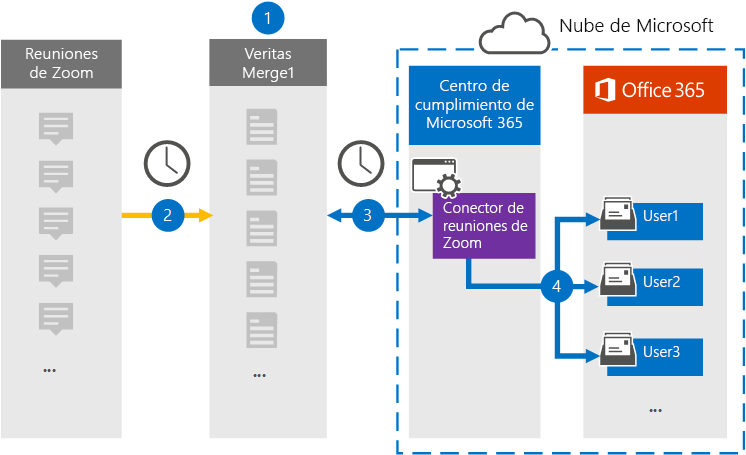

# Configurar un conector para archivar datos de reuniones de ZoomSet up a connector to archive Zoom Meetings data

Use un conector Veritas en el centro de Microsoft 365 de cumplimiento para importar y archivar datos de reuniones de Zoom a buzones de usuario de su Microsoft 365 organización.Use a Veritas connector in the Microsoft 365 compliance center to import and archive data from Zoom Meetings to user mailboxes in your Microsoft 365 organization. Veritas proporciona un [conector de](https://globanet.com/zoom/) reuniones de Zoom que está configurado para capturar elementos del origen de datos de terceros (de forma regular) e importar esos elementos a Microsoft 365.Veritas provides a [Zoom Meetings](https://globanet.com/zoom/) connector that is configured to capture items from the third-party data source (on a regular basis) and import those items to Microsoft 365. El conector convierte el contenido de las reuniones (incluidos los chats, los archivos grabados y los metadatos) de la cuenta de Reuniones de Zoom a un formato de mensaje de correo electrónico y, a continuación, importa esos elementos a buzones de usuario en Microsoft 365.The connector converts the content of the meetings (including chats, recorded files, and metadata) from the Zoom Meetings account to an email message format and then imports those items to user mailboxes in Microsoft 365.

Después de almacenar los datos de reuniones de Zoom en buzones de usuario, puede aplicar Microsoft 365 características de cumplimiento como retención por juicio, exhibición de documentos electrónicos, directivas de retención y etiquetas de retención y cumplimiento de comunicaciones.After Zoom Meetings data is stored in user mailboxes, you can apply Microsoft 365 compliance features such as Litigation Hold, eDiscovery, retention policies and retention labels, and communication compliance. El uso de un conector de reuniones de Zoom para importar y archivar datos en Microsoft 365 puede ayudar a su organización a cumplir con las directivas gubernamentales y reglamentarias.Using a Zoom Meetings connector to import and archive data in Microsoft 365 can help your organization stay compliant with government and regulatory policies.

## Información general sobre el archivado de datos de reuniones de zoomOverview of archiving Zoom Meetings data

En la siguiente introducción se explica el proceso de uso de un conector para archivar datos de reuniones de Zoom en Microsoft 365.The following overview explains the process of using a connector to archive Zoom Meetings data in Microsoft 365.

1. Su organización trabaja con Reuniones de Zoom para configurar y configurar un sitio de reuniones de zoom.Your organization works with Zoom Meetings to set up and configure a Zoom Meetings site.

2. Una vez cada 24 horas, los elementos de reunión de Zoom Meetings se copian en el sitio Veritas Merge1.Once every 24 hours, meeting items from Zoom Meetings are copied to the Veritas Merge1 site. El conector también convierte el contenido de las reuniones a un formato de mensaje de correo electrónico.The connector also converts the content of the meetings to an email message format.

3. El conector de reuniones de zoom que crea en el centro de cumplimiento de Microsoft 365, se conecta a Veritas Merge1 todos los días y transfiere los mensajes de reunión a una ubicación de Azure Storage segura en la nube de Microsoft.The Zoom Meetings connector that you create in the Microsoft 365 compliance center, connects to the Veritas Merge1 every day, and transfers the meeting messages to a secure Azure Storage location in the Microsoft cloud.

4. El conector importa los elementos de reunión convertidos a los buzones de usuarios específicos mediante el valor de la propiedad *Email* y la asignación automática de usuarios, tal como se describe en el paso 3.The connector imports the converted meeting items to the mailboxes of specific users using the value of the *Email* property and automatic user mapping, as described in Step 3. Se crea una nueva subcarpeta en la carpeta Bandeja de entrada denominada Reuniones de zoom en los **buzones** de usuario y los elementos de la reunión se importan a esa carpeta.A new subfolder in the Inbox folder named **Zoom Meetings** is created in user mailboxes, and the meeting items are imported to that folder. El conector hace esto mediante el valor de la *propiedad Email.*The connector does this by using the value of the *Email* property. Cada elemento de reunión contiene esta propiedad, que se rellena con la dirección de correo electrónico de cada participante de la reunión.Every meeting item contains this property, which is populated with the email address of every participant of the meeting.

## Antes de empezarBefore you begin

- Cree una cuenta de Veritas Merge1 para conectores de Microsoft.Create a Veritas Merge1 account for Microsoft connectors. Para crear esta cuenta, póngase en contacto con [el servicio de soporte al cliente de Veritas](https://globanet.com/ms-connectors-contact).To create this account, contact [Veritas Customer Support](https://globanet.com/ms-connectors-contact). Iniciará sesión en esta cuenta al crear el conector en el paso 1.You will sign into this account when you create the connector in Step 1.

- Obtenga el nombre de usuario y la contraseña de la cuenta de Zoom Business o Zoom Enterprise de su organización.Obtain the username and password for your organization's Zoom Business or Zoom Enterprise account. Deberá iniciar sesión en esta cuenta en el paso 2 al configurar el conector de reuniones de zoom.You'll need to sign into this account in Step 2 when you configure the Zoom Meetings connector.

- Cree las siguientes aplicaciones en [Zoom Marketplace:](https://marketplace.zoom.us)Create the following applications in the [Zoom Marketplace](https://marketplace.zoom.us):

  - Aplicación OAuthOAuth application

  - Aplicación JWTJWT application

  Después de crear estas aplicaciones, la plataforma zoom genera un conjunto de credenciales únicas que se usan para generar los tokens.After you create these applications, the Zoom platform generates a set of unique credentials used to generate the tokens. Estos tokens se usan para autenticar el conector cuando se conecta a su cuenta de Zoom y copia elementos en el sitio Merge1.These tokens are used to authenticate the connector when it connects to your Zoom account and copies items to the Merge1 site. Usará estos tokens al configurar el conector de zoom en el paso 2.You will use these tokens when you configure the Zoom connector in Step 2.

  Para obtener instrucciones paso a paso sobre cómo crear las aplicaciones OAuth y JWT, consulte [Merge1 Third-Party Connectors User Guide](https://docs.ms.merge1.globanetportal.com/Merge1%20Third-Party%20Connectors%20Zoom%20Meetings%20User%20Guide%20.pdf).For step-by step instructions on how to create the OAuth and JWT applications, see [Merge1 Third-Party Connectors User Guide](https://docs.ms.merge1.globanetportal.com/Merge1%20Third-Party%20Connectors%20Zoom%20Meetings%20User%20Guide%20.pdf).

- El usuario que crea el conector de reuniones de Zoom en el paso 1 (y lo completa en el paso 3) debe estar asignado al rol De exportación de importación de buzones en Exchange Online.The user who creates the Zoom Meetings connector in Step 1 (and completes it in Step 3) must be assigned to the Mailbox Import Export role in Exchange Online. Este rol es necesario para agregar conectores en la página **Conectores** de datos del centro de Microsoft 365 cumplimiento.This role is required to add connectors on the **Data connectors** page in the Microsoft 365 compliance center. De forma predeterminada, este rol no se asigna a un grupo de roles en Exchange Online.By default, this role is not assigned to a role group in Exchange Online. Puede agregar el rol Exportación de importación de buzones al grupo de roles Administración de la organización en Exchange Online.You can add the Mailbox Import Export role to the Organization Management role group in Exchange Online. O bien, puede crear un grupo de roles, asignar el rol Importación de buzones de correo Exportar y, a continuación, agregar los usuarios adecuados como miembros.Or you can create a role group, assign the Mailbox Import Export role, and then add the appropriate users as members. Para obtener más información, vea  las secciones [Crear](/Exchange/permissions-exo/role-groups#create-role-groups) grupos de roles o Modificar grupos de roles en el artículo "Administrar grupos de roles en Exchange Online".For more information, see the [Create role groups](/Exchange/permissions-exo/role-groups#create-role-groups) or [Modify role groups](/Exchange/permissions-exo/role-groups#modify-role-groups) sections in the article "Manage role groups in Exchange Online".

## Paso 1: Configurar el conector de reuniones de zoomStep 1: Set up the Zoom Meetings connector

El primer paso es obtener acceso a los conectores de **datos** en el centro Microsoft 365 cumplimiento y crear un conector de reuniones de zoom.The first step is to access the **Data Connectors** in the Microsoft 365 compliance center and create a Zoom Meetings connector.

1. Vaya a [https://compliance.microsoft.com](https://compliance.microsoft.com/) y, a continuación, haga clic en **Conectores de datos**  >  **Acercar reuniones**.Go to [https://compliance.microsoft.com](https://compliance.microsoft.com/) and then click **Data connectors** > **Zoom Meetings**.

2. En la página **Descripción del producto Reuniones de Zoom,** haga clic en Agregar **conector**.On the **Zoom Meetings** product description page, click **Add connector**.

3. En la **página Términos de** servicio, haga clic **en Aceptar**.On the **Terms of service** page, click **Accept**.

4. Escriba un nombre único que identifique el conector y, a continuación, haga clic en **Siguiente**.Enter a unique name that identifies the connector, and then click **Next**.

5. Inicie sesión en su cuenta merge1 para configurar el conector.Sign in to your Merge1 account to configure the connector.

## Paso 2: Configurar el conector de reuniones de zoomStep 2: Configure the Zoom Meetings connector

El segundo paso es configurar el conector de reuniones de Zoom en el sitio Merge1.The second step is to configure the Zoom Meetings connector on the Merge1 site. Para obtener más información acerca de cómo configurar el conector de reuniones de Zoom en el sitio Veritas Merge1, vea [Merge1 Third-Party Connectors User Guide](https://docs.ms.merge1.globanetportal.com/Merge1%20Third-Party%20Connectors%20Zoom%20Meetings%20User%20Guide%20.pdf).For more information about how to configure the Zoom Meetings connector on the Veritas Merge1 site, see [Merge1 Third-Party Connectors User Guide](https://docs.ms.merge1.globanetportal.com/Merge1%20Third-Party%20Connectors%20Zoom%20Meetings%20User%20Guide%20.pdf).

Después de hacer clic en Guardar  & **finalizar**, se muestra la página Asignación de usuario en el asistente para conectores en Microsoft 365 centro de cumplimiento.After you click **Save & Finish**, the **User mapping** page in the connector wizard in the Microsoft 365 compliance center is displayed.

## Paso 3: Asignar usuarios y completar la configuración del conectorStep 3: Map users and complete the connector setup

1. En la **página Asignar usuarios externos Microsoft 365 usuarios,** habilite la asignación automática de usuarios.On the **Map external users to Microsoft 365 users** page, enable automatic user mapping.

   Los elementos de Reuniones de Zoom incluyen una propiedad denominada *Correo* electrónico que contiene direcciones de correo electrónico para los usuarios de la organización.Zoom Meetings items include a property called *Email* that contains email addresses for users in your organization. Si el conector puede asociar esta dirección a un Microsoft 365, los elementos se importan al buzón de ese usuarioIf the connector can associate this address with a Microsoft 365 user, the items are imported to that user's mailbox

2. Haga **clic en** Siguiente, revise la configuración y vaya a la página **Conectores** de datos para ver el progreso del proceso de importación del nuevo conector.Click **Next**, review your settings, and go to the **Data connectors** page to see the progress of the import process for the new connector.

## Paso 4: Supervisar el conector de reuniones de zoomStep 4: Monitor the Zoom Meetings connector

Después de crear el conector de reuniones de Zoom, puede ver el estado del conector en el centro de Microsoft 365 cumplimiento.After you create the Zoom Meetings connector, you can view the connector status in the Microsoft 365 compliance center.

1. Vaya a [https://compliance.microsoft.com](https://compliance.microsoft.com) y haga clic en **Conectores de datos** en la navegación izquierda.Go to [https://compliance.microsoft.com](https://compliance.microsoft.com) and click **Data connectors** in the left nav.

2. Haga clic **en la pestaña Conectores** y, a continuación, seleccione el conector de reuniones **de Zoom** para mostrar la página desplegable.Click the **Connectors** tab and then select the **Zoom Meetings** connector to display the flyout page. Esta página contiene las propiedades y la información sobre el conector.This page contains the properties and information about the connector.

3. En **Estado del conector con origen,** haga clic en el vínculo Descargar **registro** para abrir (o guardar) el registro de estado del conector.Under **Connector status with source**, click the **Download log** link to open (or save) the status log for the connector. Este registro contiene información sobre los datos que se han importado a la nube de Microsoft.This log contains information about the data that has been imported to the Microsoft cloud.

## Problemas conocidosKnown issues

- En este momento, no se admite la importación de datos adjuntos o elementos de más de 10 MB.At this time, we don't support importing attachments or items that are larger than 10 MB. La compatibilidad con elementos más grandes estará disponible en una fecha posterior.Support for larger items will be available at a later date.

- Para que el conector de reuniones de Zoom funcione, debe habilitar las grabaciones al configurar reuniones de zoom.For the Zoom Meetings connector to work, you must enable recordings when setting up Zoom Meetings.