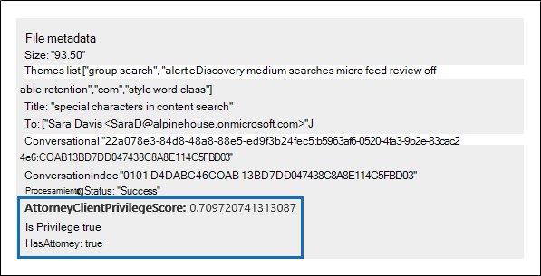
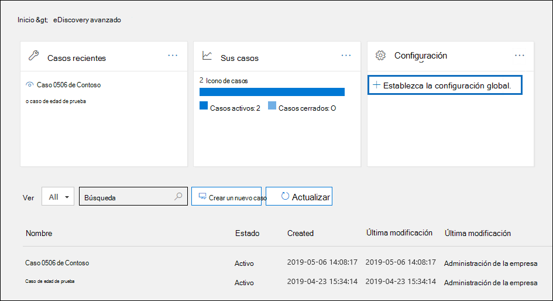
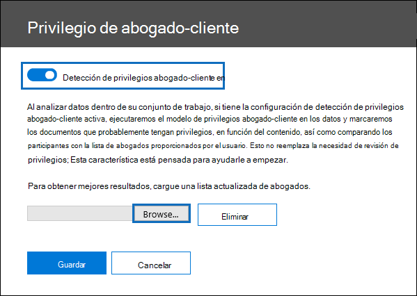

# Configurar la detección de privilegios de abogado-cliente en Advanced eDiscovery

Un aspecto importante y costoso de la fase de revisión de cualquier proceso de exhibición de documentos electrónicos es revisar documentos para obtener contenido con privilegios. Advanced eDiscovery proporciona detección basada en aprendizaje automático de contenido con privilegios para que este proceso sea más eficaz. Esta característica se denomina *detección de privilegios abogado-cliente.*

## ¿Cómo funciona?

Cuando se habilita la detección de privilegios de abogado-cliente, el modelo de  detección de privilegios de abogado-cliente procesará todos los documentos de un conjunto de revisión al analizar los datos del conjunto de revisión. El modelo busca dos cosas:

- Contenido con privilegios: el modelo usa el aprendizaje automático para determinar la probabilidad de que el documento contenga contenido de naturaleza legal.

- Participantes: como parte de la configuración de la detección de privilegios de abogado y cliente, debe enviar una lista de abogados para su organización. A continuación, el modelo compara los participantes del documento con la lista de abogados para determinar si un documento tiene al menos un participante que es abogado.

El modelo produce las tres propiedades siguientes para cada documento:

- **AttorneyClientPrivilegeScore:** La probabilidad de que el documento sea de naturaleza legal; los valores de la puntuación están entre **0** y **1**.

- **HasAttorney:** Esta propiedad se establece en **true** si uno de los participantes del documento aparece en la lista de abogados; de lo contrario, el valor es **false**. El valor también se establece en **false** si su organización no cargó una lista de abogados.

- **IsPrivilege:** Esta propiedad se establece en **true** si el valor de **AttorneyClientPrivilegeScore** está por encima del *umbral* o si el documento tiene un participante del abogado; de lo contrario, el valor se establece en **false**.

Estas propiedades (y sus valores correspondientes) se agregan a los metadatos de archivo de los documentos de un conjunto de revisión, como se muestra en la siguiente captura de pantalla:

Estas tres propiedades también se pueden buscar en un conjunto de revisión. Para obtener más información, [vea Consultar los datos de un conjunto de revisión.](review-set-search.md)

## Configurar el modelo de detección de privilegios abogado-cliente

Para habilitar el modelo de detección de privilegios abogado-cliente, la organización debe activarlo y, a continuación, cargar una lista de abogados.

### Paso 1: Activar la detección de privilegios abogado-cliente

Una persona que sea administrador de exhibición de documentos electrónicos en su organización (miembro del subgrupo administrador de exhibición de documentos electrónicos en el grupo de roles administrador de exhibición de documentos electrónicos) debe hacer que el modelo esté disponible en los Advanced eDiscovery casos.

1. En el Centro de & cumplimiento, vaya a **eDiscovery > Advanced eDiscovery**.

2. En la **Advanced eDiscovery** principal, en el icono **Configuración,** haga clic **en Configurar la configuración de análisis global.**

   

3. En la **pestaña Configuración de Analytics,** seleccione **Administrar la configuración de privilegios abogado-cliente**.

4. En la página de control flotante **Secreto profesional entre abogado y cliente**, use el botón de alternancia para habilitar la característica y, después, seleccione **Guardar**.

### Paso 2: Upload una lista de abogados (opcional)

Para aprovechar al máximo el modelo de detección de privilegios abogado-cliente y usar los resultados de la detección de Has **Attorney** o **Potentially Privileged** que se describió anteriormente, se recomienda cargar una lista de direcciones de correo electrónico para los abogados y el personal legal que trabajan para su organización. 

Para cargar una lista de abogados para su uso por el modelo de detección de privilegios abogado-cliente:

1. Cree un archivo .csv (sin una fila de encabezado) y agregue la dirección de correo electrónico de cada usuario adecuado en una línea independiente. Guarde este archivo en su equipo local.

2. En la **Advanced eDiscovery** principal, en el icono **Configuración,** seleccione Configurar características **experimentales** y, a continuación, seleccione Administrar la configuración de privilegios de **abogado-cliente**.

   Se **muestra la página** Privilegios de abogado-cliente y se activa la alternancia de detección de privilegios **abogado-cliente.**

   

3. Seleccione **Examinar** y, a continuación, busque y seleccione .csv archivo que creó en el paso 1.

4. Seleccione **Guardar para** cargar la lista de abogados.

## Usar el modelo de detección de privilegios abogado-cliente

Siga los pasos de esta sección para usar la detección de privilegios de abogado-cliente para los documentos de un conjunto de revisión.

### Paso 1: Crear un grupo de etiquetas inteligentes con el modelo de detección de privilegios abogado-cliente

Una de las formas principales de ver los resultados de la detección de secreto profesional entre abogado y cliente en el proceso de revisión es mediante un grupo de etiquetas inteligentes. Un grupo de etiquetas inteligentes indica los resultados de la detección de secreto profesional entre abogado y cliente y muestra los resultados en línea junto a las etiquetas de un grupo de etiquetas inteligentes. Esto le permite identificar rápidamente documentos con privilegios potenciales durante la revisión de documentos. Además, también puede usar las etiquetas del grupo de etiquetas inteligentes para etiquetar documentos como secretos o no secretos. Para obtener más información acerca de las etiquetas inteligentes, vea [Configurar etiquetas inteligentes en Advanced eDiscovery](smart-tags.md).

1. En el conjunto de revisión que contiene los documentos analizados en el paso 1, seleccione Administrar conjunto de **revisión** y, a continuación, **seleccione Administrar etiquetas**.
 
2. En **Etiquetas**, seleccione la lista desplegable situada junto **a Agregar grupo** y, a continuación, seleccione Agregar grupo de **etiquetas inteligentes.**

   

3. En la **página Elegir un modelo para la etiqueta inteligente,** elija **Seleccionar** junto al **privilegio Abogado-cliente**.

   Se muestra un grupo de etiquetas denominado **Privilegio abogado-cliente.** Contiene dos etiquetas secundarias **denominadas Positive** y **Negative**, que corresponden a los posibles resultados producidos por el modelo.

   

3. Cambie el nombre del grupo de etiquetas y las etiquetas según corresponda para su revisión. Por ejemplo, puede cambiar el nombre **De positivo** a **Privilegiado** **y** Negativo a **No privilegiado.**

### Paso 2: Analizar un conjunto de revisión

Al analizar los documentos de un conjunto de revisión, también se ejecutará el modelo de detección de privilegios abogado-cliente y se agregarán las propiedades correspondientes (descritas en ¿Cómo funciona? a todos los documentos del conjunto de [revisión.](#how-does-it-work) Para obtener más información acerca del análisis de datos en el conjunto de revisión, vea Analizar datos en un conjunto de [revisión en Advanced eDiscovery](analyzing-data-in-review-set.md).

### Paso 3: Usar el grupo de etiquetas inteligentes para revisar el contenido con privilegios

Después de analizar el conjunto de revisión y configurar etiquetas inteligentes, el siguiente paso es revisar los documentos. Si el modelo ha determinado que el documento tiene potenciales privilegios, la etiqueta inteligente correspondiente en el **panel** de etiquetado indicará los siguientes resultados producidos por la detección de privilegios abogado-cliente:

- Si el documento tiene contenido que puede ser de naturaleza legal, la etiqueta **Contenido** legal se muestra junto a la etiqueta inteligente correspondiente (que en este caso es la **etiqueta positiva** predeterminada).

- Si el documento tiene un participante que se encuentra en la lista de abogados de su organización, la etiqueta **Abogado** se muestra junto a la etiqueta inteligente correspondiente (que en este caso también es la etiqueta **positiva** predeterminada).

- Si el documento tiene contenido que puede ser de naturaleza legal y  tiene  un participante que se encuentra en la lista de abogados, se muestran tanto el contenido legal como las etiquetas de abogado.  

Si el modelo determina que un documento no contiene contenido de naturaleza legal o no contiene un participante de la lista de abogados, no se muestra ninguna etiqueta en el panel de etiquetado.

Por ejemplo, las siguientes capturas de pantalla muestran dos documentos. El primero contiene contenido de naturaleza legal y tiene un participante que se encuentra en la lista de abogados. El segundo no contiene ninguno y, por lo tanto, no muestra ninguna etiqueta.

Después de revisar un documento para ver si contiene contenido con privilegios, puede etiquetar el documento con la etiqueta adecuada.
