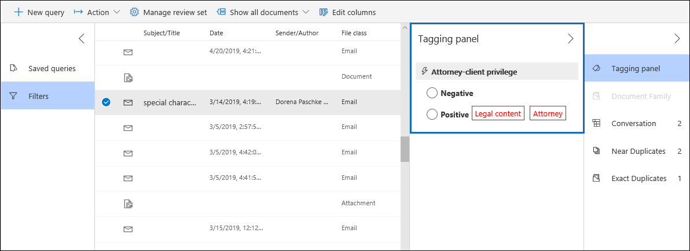

# Configuración de la detección de privilegios de clientes de abogado en eDiscovery avanzadoSet up attorney-client privilege detection in Advanced eDiscovery

Uno de los aspectos más importantes y costosos de la fase de revisión de cualquier proceso de eDiscovery es la revisión de los documentos para obtener un contenido privilegiado.A major and costly aspect of the review phase of any eDiscovery process is reviewing documents for privileged content. La exhibición avanzada de documentos electrónicos proporciona detección de contenido privilegiado basada en aprendizaje automático para que este proceso sea más eficaz.Advanced eDiscovery provides machine learning-based detection of privileged content to make this process more efficient. Esta característica se denomina *detección de privilegios de cliente de abogado*.This feature is called *attorney-client privilege detection*.

## ¿Cómo funciona?How does it work?

Cuando se habilita la detección de privilegios de clientes de abogados, el modelo de detección de privilegios de cliente-cliente procesa todos los documentos de un conjunto de revisión cuando se [analizan los datos](analyzing-data-in-review-set.md) del conjunto de revisión.When attorney-client privilege detection is enabled, all documents in a review set will be processed by the attorney-client privilege detection model when you [analyze the data](analyzing-data-in-review-set.md) in the review set. El modelo busca dos cosas:The model looks for two things:

- Contenido privilegiado: el modelo usa el aprendizaje automático para determinar la probabilidad de que el documento incluya contenido que sea legal por naturaleza.Privileged content – The model uses machine learning to determine the likelihood that the document contains content that is legal in nature.

- Participantes: como parte de la configuración de la detección de privilegios de clientes de abogados, tiene que enviar una lista de abogados para su organización.Participants – As part of setting up attorney-client privilege detection, you have to submit a list of attorneys for your organization. A continuación, el modelo compara los participantes del documento con la lista de abogados para determinar si un documento tiene al menos un participante del abogado.The model then compares the participants of the document with the attorney list to determine if a document has at least one attorney participant.

El modelo genera las siguientes tres propiedades para cada documento:The model produces the following three properties for every document:

- **AttorneyClientPrivilegeScore:** La probabilidad de que el documento tenga carácter legal; los valores de la puntuación están comprendidos entre **0** y **1**.**AttorneyClientPrivilegeScore:** The likelihood the document is legal in nature; the values for the score are between **0** and **1**.

- **HasAttorney:** Esta propiedad se establece en **true** si uno de los participantes del documento aparece en la lista de abogados; de lo contrario, el valor es **false**.**HasAttorney:** This property is set to **true** if one of the document participants is listed in the attorney list; otherwise the value is **false**. El valor también se establece en **false** si la organización no ha cargado una lista de abogados.The value is also set to **false** if your organization didn't upload an attorney list.

- **IsPrivilege:** Esta propiedad se establece en **true** si el valor de **AttorneyClientPrivilegeScore** está por encima del umbral *o* si el documento tiene un participante del abogado; de lo contrario, el valor se establece en **false**.**IsPrivilege:** This property is set to **true** if the value for **AttorneyClientPrivilegeScore** is above the threshold *or* if the document has an attorney participant; otherwise the value is set to **false**.

Estas propiedades (y sus valores correspondientes) se agregan a los metadatos de archivo de los documentos en un conjunto de revisión, como se muestra en la siguiente captura de pantalla:These properties (and their corresponding values) are added to the file metadata of the documents in a review set, as shown in the following screenshot:

Estas tres propiedades también se pueden buscar dentro de un conjunto de revisión.These three properties are also searchable within a review set. Para obtener más información, consulte [consultar los datos de un conjunto de revisión](review-set-search.md).For more information, see [Query the data in a review set](review-set-search.md).

## Configuración del modelo de detección de privilegios de clientes de abogadosSet up the attorney-client privilege detection model

Para habilitar el modelo de detección de privilegios de clientes de abogados, su organización debe activarlo y, a continuación, cargar una lista de abogados.To enable the attorney-client privilege detection model, your organization has to turn it on and then upload an attorney list.

### Paso 1: activar la detección de privilegios de clientes de abogadoStep 1: Turn on attorney-client privilege detection

Una persona que sea administrador de eDiscovery en su organización (un miembro del subgrupo de administradores de eDiscovery en el grupo de roles de eDiscovery Manager) debe hacer que el modelo esté disponible en los casos de eDiscovery avanzado.A person who is an eDiscovery Administrator in your organization (a member of the eDiscovery Administrator subgroup in the eDiscovery Manager role group) must make the model available in your Advanced eDiscovery cases.

1. En el centro de seguridad & cumplimiento, vaya a **ediscovery > la exhibición avanzada**de documentos electrónicos.In the Security & Compliance Center, go to **eDiscovery > Advanced eDiscovery**.

2. En la Página principal de **EDiscovery avanzado** , en el icono **configuración** , haga clic en **configurar la configuración global de análisis**.On the **Advanced eDiscovery** home page, in the **Settings** tile, click **Configure global analytics settings**.

   

3. En la pestaña **configuración de Analytics** , seleccione **administrar el privilegio de cliente de abogado**.On the **Analytics settings** tab, select **Manage attorney-client privilege setting**.

4. En la página de control flotante de **privilegios de cliente** , use el botón de alternancia para activar la característica y, a continuación, seleccione **Guardar**.On the **Attorney-client privilege** flyout page, use the toggle to turn on the feature and then select **Save**.

### Paso 2: cargar una lista de abogados (opcional)Step 2: Upload a list of attorneys (optional)

Para sacar el máximo provecho del modelo de detección de privilegios de clientes de abogado y usar los resultados de la detección de **abogados** o **potencialmente privilegiados** que se describió anteriormente, le recomendamos que cargue una lista de direcciones de correo electrónico para los abogados y el personal legal que trabajan para su organización.To take full advantage of the attorney-client privilege detection model and use the results of the **Has Attorney** or **Potentially Privileged** detection that was previously described, we recommend that you upload a list of email addresses for the lawyers and legal personnel who work for your organization. 

Para cargar una lista de abogados para su uso por parte del modelo de detección de privilegios de clientes de abogados:To upload an attorney list for use by the attorney-client privilege detection model:

1. Cree un archivo. csv (sin una fila de encabezado) y agregue la dirección de correo electrónico de cada persona apropiada en una línea independiente.Create a .csv file (without a header row) and add the email address for each appropriate person on a separate line. Guarde este archivo en el equipo local.Save this file to your local computer.

2. En la Página principal de **EDiscovery avanzado** , en el icono **configuración** , seleccione **configurar características experimentales**y, a continuación, seleccione **administrar el privilegio de cliente de abogado**.On the **Advanced eDiscovery** home page, in the **Settings** tile, select **Configure experimental features**, and then select **Manage attorney-client privilege setting**.

   Se muestra la página de **privilegios abogado-Client** y se activa el botón de alternancia **detección de privilegios de clientes o abogados** .The **Attorney-client privilege** page is displayed, and the **Attorney-client privilege detection** toggle is turned on.

   

3. Seleccione **examinar** y, a continuación, busque y seleccione el archivo. csv que creó en el paso 1.Select **Browse** and then find and select the .csv file that you created in step 1.

4. Seleccione **Guardar** para cargar la lista de abogados.Select **Save** to upload the attorney list.

## Usar el modelo de detección de privilegios de cliente de abogadoUse the attorney-client privilege detection model

Siga los pasos descritos en esta sección para usar la detección de privilegios de clientes de abogados para documentos en un conjunto de revisión.Follow the steps in this section to use attorney-client privilege detection for documents in a review set.

### Paso 1: crear un grupo de etiquetas inteligentes con un modelo de detección de privilegios de clientes de abogadosStep 1: Create a smart tag group with attorney-client privilege detection model

Una de las principales formas de ver los resultados de la detección de privilegios de clientes de abogados en el proceso de revisión consiste en usar un grupo de etiquetas inteligentes.One of the primary ways to see the results of attorney-client privilege detection in your review process is by using a smart tag group. Un grupo de etiquetas inteligentes indica los resultados de la detección de privilegios de clientes de abogados y muestra los resultados en línea junto a las etiquetas en un grupo de etiquetas inteligentes.A smart tag group indicates the results of the attorney-client privilege detection and shows the results in-line next to the tags in a smart tag group. Esto le permite identificar rápidamente los documentos potencialmente privilegiados durante la revisión del documento.This lets you quickly identify potentially privileged documents during document review. Además, también puede usar las etiquetas del grupo de etiquetas inteligentes para etiquetar los documentos como privilegiados o sin privilegios.Additionally, you can also use the tags in the smart tag group to tag documents as privileged or non-privileged. Para obtener más información acerca de las etiquetas inteligentes, consulte [configurar las etiquetas inteligentes en la exhibición avanzada de](smart-tags.md)documentos electrónicos.For more information about smart tags, see [Set up smart tags in Advanced eDiscovery](smart-tags.md).

1. En el conjunto de revisiones que contiene los documentos que analizó en el paso 1, seleccione **administrar conjunto de revisiones** y, a continuación, seleccione **administrar etiquetas**.In the review set that contains the documents that you analyzed in Step 1, select **Manage review set** and then select **Manage tags**.
 
2. En **etiquetas**, seleccione la opción desplegable junto a **Agregar grupo** y, a continuación, seleccione **Agregar grupo de etiquetas inteligentes**.Under **Tags**, select the pull-down next to **Add group** and then select **Add smart tag group**.

   

3. En la página **Elija un modelo para la etiqueta inteligente** , elija **seleccionar** junto a **abogado-privilegio de cliente**.On the **Choose a model for your smart tag** page, choose **Select** next to **Attorney-client privilege**.

   Se muestra un grupo de etiquetas con el **privilegio abogado-Client** .A tag group named **Attorney-client privilege** is displayed. Contiene dos etiquetas secundarias denominadas **positivo** y **negativo**, que corresponden a los posibles resultados generados por el modelo.It contains two child tags named **Positive** and **Negative**, which correspond to the possible results produced by the model.

   

3. Cambie el nombre del grupo de etiquetas y las etiquetas según corresponda para su revisión.Rename the tag group and tags as appropriate for your review. Por ejemplo, puede cambiar el nombre de **positivo** a **privilegiado** y de **negativo** a **no privilegiado**.For example, you can rename **Positive** to **Privileged** and **Negative** to **Not privileged**.

### Paso 2: analizar un conjunto de revisiónStep 2: Analyze a review set

Al analizar los documentos de un conjunto de revisiones, también se ejecutará el modelo de detección de privilegios de clientes de abogados y las propiedades correspondientes (que se describen en [¿Cómo funciona?](#how-does-it-work) se agregarán a todos los documentos del conjunto de revisión.When you analyze the documents in a review set, the attorney-client privilege detection model will also run and the corresponding properties (described in [How does it work?](#how-does-it-work) will be added to every document in the review set. Para obtener más información acerca del análisis de datos en el conjunto de revisiones, consulte [analizar datos en un conjunto de revisión en EDiscovery avanzado](analyzing-data-in-review-set.md).For more information about analyzing data in review set, see [Analyze data in a review set in Advanced eDiscovery](analyzing-data-in-review-set.md).

### Paso 3: usar el grupo de etiquetas inteligentes para revisar el contenido privilegiadoStep 3: Use the smart tag group for review of privileged content

Después de analizar el conjunto de revisión y configurar las etiquetas inteligentes, el siguiente paso es revisar los documentos.After analyzing the review set and setting up smart tags, the next step is to review the documents. Si el modelo ha determinado que el documento tiene potencialmente privilegios, la etiqueta inteligente correspondiente en el **Panel de etiquetado** indicará los siguientes resultados generados por la detección de privilegios de cliente abogado:If the model has determined the document is potentially privileged, the corresponding smart tag in the **Tagging panel** will indicate the following results produced by the attorney-client privilege detection:

- Si el documento tiene contenido que puede ser legal por naturaleza, el **contenido legal** de la etiqueta se muestra junto a la etiqueta inteligente correspondiente (que, en este caso, es la etiqueta **positiva** predeterminada).If the document has content that may be legal in nature, the label **Legal content** is displayed next to the corresponding smart tag (which in this case is the default **Positive** tag).

- Si el documento tiene un participante que se encuentra en la lista de abogados de la organización, el **abogado** se muestra junto a la etiqueta inteligente correspondiente (que, en este caso, también es la etiqueta **positiva** predeterminada).If the document has a participant who is found in your organization's attorney list, the label **Attorney** is displayed next to the corresponding smart tag (which in this case is also the default **Positive** tag).

- Si el documento tiene contenido que puede ser legal por naturaleza *y* se ha encontrado un participante en la lista de abogados, se muestran las etiquetas de **contenido legal** y **abogados** .If the document has content that may be legal in nature *and* has a participant found in the attorney list, both the **Legal content**  and **Attorney** labels are displayed. 

Si el modelo determina que un documento no tiene contenido legal por naturaleza o que no contiene un participante de la lista de abogados, no se muestra ninguna etiqueta en el panel de etiquetado.If the model determines that a document doesn't contain content that is legal in nature or doesn't contain a participant from the attorney list, then neither label is displayed in the tagging panel.

Por ejemplo, en las siguientes capturas de pantallas se muestran dos documentos.For example, the following screenshots show two documents. El primero incluye contenido que es legal por naturaleza y tiene un participante en la lista de abogados.The first one contains content that is legal in nature and has a participant found in the list of attorneys. La segunda contiene ninguno y, por lo tanto, no muestra ninguna etiqueta.The second contains neither and therefore doesn't display any labels.

Después de revisar un documento para ver si contiene contenido privilegiado, puede etiquetar el documento con la etiqueta adecuada.After you review a document to see if it contains privileged content, you can tag the document with the appropriate tag.
