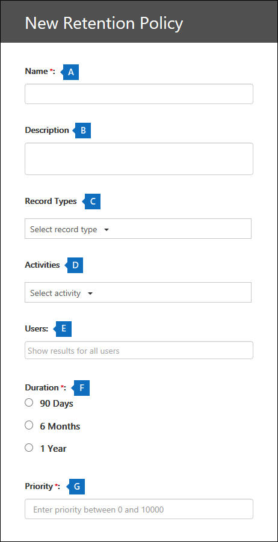

# <a name="manage-audit-log-retention-policies"></a>Administrar directivas de retención de registros de auditoría

Puede crear y administrar directivas de retención de registros de auditoría en el Centro de seguridad y cumplimiento. Las directivas de retención de registros de auditoría son parte de las nuevas funciones de auditoría avanzada en Microsoft 365. Una directiva de retención de registro de auditoría le permite especificar durante cuánto tiempo se conservan los registros de auditoría en su organización. Puede conservar los registros de auditoría hasta por un año. Puede crear directivas en función de los siguientes criterios:

- Todas las actividades en uno o más servicios de Microsoft 365

- Actividades específicas (en un servicio específico) realizadas por todos los usuarios o por usuarios específicos

- Un nivel de prioridad que especifique qué directiva prevalece en caso de que tenga varias directivas en su organización

## <a name="default-audit-log-retention-policy"></a>Directivas de retención de registros de auditoría predeterminadas

La auditoría avanzada en Microsoft 365 proporciona una directiva de retención de registros de auditoría predeterminada para todas las organizaciones. Esta directiva conserva todos los registros de auditoría de Exchange, SharePoint y Azure Active Directory durante un año. Esta directiva predeterminada conserva registros de auditoría que contienen el valor de **AzureActiveDirectory**, **Exchange** o **SharePoint** de la propiedad **Carga de trabajo** (que es el servicio en el que se produjo la actividad). La directiva predeterminada no se puede modificar. Vea la sección [Más información](#more-information) en este artículo para obtener una lista de los tipos de registros para cada carga de trabajo que se incluye en la directiva predeterminada.

> [!NOTE]
> La directiva de retención de registros de auditoría predeterminada solo se aplica a los registros de auditoría para la actividad realizada por usuarios que tienen asignada una licencia de Office 365 o Microsoft 365 E5, o que tienen una licencia de complemento de Microsoft 365 E5 Compliance. Si no tiene usuarios de E5 en su organización, los registros de auditoría correspondientes se conservarán durante 90 días.

## <a name="before-you-begin"></a>Antes de empezar

- Debe tener asignado el rol de Configuración de la organización en el Centro de seguridad y cumplimiento para crear o modificar una directiva de retención de auditoría.

- Puede tener un máximo de 50 directivas de retención de registros de auditoría en su organización.

- Para conservar un registro de auditoría durante más de 90 días, el usuario que ha generado el registro de auditoría debe tener asignada una licencia de Office 365 o Microsoft 365 E5, o tener una licencia de complemento de Microsoft 365 E5 Compliance.

- Todas las directivas de retención de registros de auditoría personalizadas (creadas por su organización) tienen prioridad ante la directiva de retención predeterminada. Por ejemplo, si crea una directiva de retención de registros de auditoría para la actividad del buzón de Exchange que tiene un período de retención inferior a un año, los registros de auditoría de las actividades de buzón de Exchange se conservarán por la duración más corta especificada en la directiva personalizada.

## <a name="create-an-audit-log-retention-policy-in-the-security--compliance-center"></a>Crear una directiva de retención de registros de auditoría en el Centro de seguridad y cumplimiento

1. Vaya a [https://protection.office.com](https://protection.office.com) e inicie sesión con la cuenta de usuario que tenga asignado el rol de Configuración de la organización en el Centro de seguridad y cumplimiento. 

2. En el panel izquierdo del Centro de seguridad y cumplimiento, haga clic en **Buscar** > **Búsqueda de registros de auditoría**.

    La página de **Búsqueda de registros de auditoría** se mostrará.

    

3. Haga clic en **Nueva directiva de retención**, y después, complete los siguientes campos en la página flotante:

    

   a. **Nombre:** el nombre de la directiva de retención de registros de auditoría. Este nombre debe ser exclusivo en la organización.
   
   b. **Descripción:** es opcional, pero le resultará útil para proporcionar información sobre la directiva (como el tipo de registro o la carga de trabajo, los usuarios especificados en la directiva y la duración).

   c. **Tipos de registro:** el tipo de registro de auditoría al que se aplica la directiva. Si selecciona más de un tipo de registro, no podrá seleccionar actividades porque la directiva se aplicará a todas las actividades para los tipos de registros seleccionados. Además, si deja en blanco esta propiedad, debe seleccionar un usuario en el cuadro **Usuarios**.

   d. **Actividades:** use este cuadro para elegir las actividades del tipo de registro que haya seleccionado. Puede elegir actividades específicas para aplicar la directiva. Si no elige actividades específicas, la directiva se aplicará a todas las actividades del tipo de registro seleccionado.

   e. **Usuarios:** seleccione uno o más usuarios para aplicar la directiva. Si deja este cuadro en blanco, la directiva se aplicará a todos los usuarios. Si deja en blanco **Tipos de registro**, entonces deberá seleccionar un usuario.

   f. **Duración:** es la cantidad de tiempo que se conservarán los registros de auditoría que cumplan los criterios de la directiva.

   g. **Prioridad:** este valor determina el orden en el que se procesan las directivas de retención de registros de auditoría de su organización. Un valor más alto indica una prioridad mayor. Por ejemplo, una directiva con un valor de prioridad de **5** tendría prioridad sobre una directiva con un valor de prioridad de **0**. Como se ha explicado anteriormente, cualquier directiva de retención de registros de auditoría personalizada tiene prioridad sobre la directiva predeterminada para su organización.

6. Haga clic en **Guardar** para crear la nueva directiva de retención de registros de auditoría. 

En este momento, no hay ningún indicio de que la directiva de retención se ha creado correctamente. Consulte la siguiente sección para ver las propiedades de las directivas de retención de registros de auditoría.

## <a name="create-an-audit-log-retention-policy-in-powershell"></a>Crear una directiva de retención de registros de auditoría en PowerShell

También puede usar PowerShell del Centro de seguridad y cumplimiento de Office 365 para crear directivas de retención de registros de auditoría. 

1. [Conectarse a PowerShell del Centro de seguridad y cumplimiento](https://docs.microsoft.com/powershell/exchange/office-365-scc/connect-to-scc-powershell/connect-to-scc-powershell).

2. Ejecute el siguiente comando para crear una directiva de retención de registros de auditoría. 

   ```powershell
   New-UnifiedAuditLogRetentionPolicy -Name "Microsoft Teams Audit Policy" -Description "One year retention policy for all Microsoft Teams activities" -RecordTypes MicrosoftTeams -RetentionDuration TwelveMonths -Priority 100
   ```
    
    En este ejemplo se crea una directiva de retención de registros de auditoría denominada "Directiva de auditoría de Microsoft Teams" con esta configuración:

   - Una descripción de la directiva.

   - Conserva todas las actividades de Microsoft Teams (definidas en el parámetro *RecordType*).

   - Conserva los registros de auditoría de Microsoft Teams por un año.

   - Una prioridad de 100.

Este es otro ejemplo para la creación de una directiva de retención de registros de auditoría. Esta directiva conserva los registros de auditoría de la actividad "el usuario inició sesión" durante seis meses para el usuario admin@contoso.onmicrosoft.com.

```powershell
New-UnifiedAuditLogRetentionPolicy -Name "SixMonth retention for admin logons" -RecordTypes AzureActiveDirectoryStsLogon -Operations UserLoggedIn -UserIds admin@contoso.onmicrosoft.com -RetentionDuration SixMonths -Priority 25
```

Para obtener más información, consulte [New-UnifiedAuditLogRetentionPolicy](https://docs.microsoft.com/powershell/module/exchange/policy-and-compliance-audit/new-unifiedauditlogretentionpolicy).

## <a name="view-audit-log-retention-policies"></a>Ver directivas de retención de registros de auditoría

En este momento, la única manera de ver las directivas de retención de registros de auditoría personalizadas es usar el cmdlet **Get-UnifiedAuditRetentionPolicy** en PowerShell del Centro de seguridad y cumplimiento. Este es un comando de ejemplo para mostrar la configuración (que ha establecido en el paso anterior) para las directivas de retención de registros de auditoría en su organización. Este comando ordena las directivas desde las de mayor hasta las de menor prioridad.

```powershell
Get-UnifiedAuditLogRetentionPolicy | Sort-Object -Property Priority -Descending | FL Priority,Name,Description,RecordTypes,Operations,UserIds,RetentionDuration
```

> [!NOTE]
> En este momento, el cmdlet **Get-UnifiedAuditLogRetentionPolicy** no devuelve la directiva de registros de auditoría predeterminada para su organización.

Para obtener más información, consulte [Get-UnifiedAuditLogRetentionPolicy](https://docs.microsoft.com/powershell/module/exchange/policy-and-compliance-audit/get-unifiedauditlogretentionpolicy).

## <a name="more-information"></a>Más información

- Use el cmdlet **Set-UnifiedAuditLogRetentionPolicy** en PowerShell del Centro de seguridad y cumplimiento para modificar una directiva de retención de registros de auditoría existente. Para obtener más información, consulte [Set-UnifiedAuditLogRetentionPolicy](https://docs.microsoft.com/powershell/module/exchange/policy-and-compliance-audit/set-unifiedauditlogretentionpolicy).

- Use el cmdlet **Remove-UnifiedAuditLogRetentionPolicy** en PowerShell del Centro de seguridad y cumplimiento para eliminar una directiva de retención de registros de auditoría. La directiva puede tardar hasta 30 minutos para quitarse por completo. Para obtener más información, consulte [Remove-UnifiedAuditLogRetentionPolicy](https://docs.microsoft.com/powershell/module/exchange/policy-and-compliance-audit/remove-unifiedauditlogretentionpolicy).

- Como se ha indicado anteriormente, los registros de auditoría para las operaciones en Azure Active Directory, Exchange y SharePoint se conservan durante un año. En la siguiente tabla se enumeran todos los tipos de registro (para cada uno de estos servicios) incluidos en la directiva de retención de registros de auditoría predeterminada. Esto significa que los registros de auditoría de cualquier operación con este tipo de registro se conservan durante un año, a menos que una directiva de retención de registros de auditoría personalizada tenga prioridad para un tipo de registro, una operación o un usuario específicos. El valor Enum (que se muestra como el valor de la propiedad RecordType en un registro de auditoría) para cada tipo de registro se muestra entre paréntesis.

   |AzureActiveDirectory |Exchange  |SharePoint|
   |:---------|:---------|:---------|
   |AzureActiveDirectory (8)|ExchangeAdmin (1)|ComplianceDLPSharePoint (11)|
   |AzureActiveDirectoryAccountLogon (9)|ExchangeItem (2)|ComplianceDLPSharePointClassification (33)|
   |AzureActiveDirectoryStsLogon (15)|Campaña (62)|Proyecto (35)|
   ||ComplianceDLPExchange (13)|SharePoint (4)|
   ||ComplianceSupervisionExchange (68)|SharePointCommentOperation (37)|
   ||CustomerKeyServiceEncryption (69)|SharePointContentTypeOperation (55)|
   ||ExchangeAggregatedOperation (19)|SharePointFieldOperation (56)|
   ||ExchangeItemAggregated (50)|SharePointFileOperation (6)|
   ||ExchangeItemGroup (3)|SharePointListOperation (36)|
   ||InformationBarrierPolicyApplication (53)|SharePointSharingOperation (14)|
   ||||
