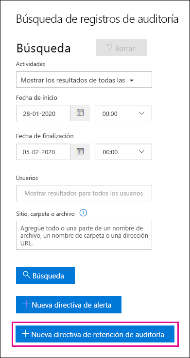
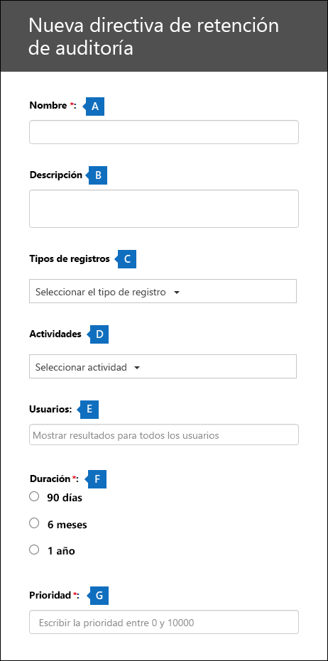

# <a name="manage-audit-log-retention-policies"></a><span data-ttu-id="6043c-104">Administrar directivas de retención de registros de auditoría</span><span class="sxs-lookup"><span data-stu-id="6043c-104">Manage audit log retention policies</span></span>

<span data-ttu-id="6043c-105">Puede crear y administrar directivas de retención de registros de auditoría en el Centro de seguridad y cumplimiento.</span><span class="sxs-lookup"><span data-stu-id="6043c-105">You can create and manage audit log retention policies in the Security & Compliance Center.</span></span> <span data-ttu-id="6043c-106">Las directivas de retención de registros de auditoría forman parte de las nuevas capacidades de Auditoría avanzada en Microsoft 365.</span><span class="sxs-lookup"><span data-stu-id="6043c-106">Audit log retention policies are part of the new Advanced Audit capabilities in Microsoft 365.</span></span> <span data-ttu-id="6043c-107">Una directiva de retención de registro de auditoría le permite especificar durante cuánto tiempo se conservan los registros de auditoría en su organización.</span><span class="sxs-lookup"><span data-stu-id="6043c-107">An audit log retention policy lets you specify how long to retain audit logs in your organization.</span></span> <span data-ttu-id="6043c-108">Puede conservar los registros de auditoría hasta por un año.</span><span class="sxs-lookup"><span data-stu-id="6043c-108">You can retain audit logs for up to one year.</span></span> <span data-ttu-id="6043c-109">Puede crear directivas en función de los siguientes criterios:</span><span class="sxs-lookup"><span data-stu-id="6043c-109">You can create policies based on the following criteria:</span></span>

- <span data-ttu-id="6043c-110">Todas las actividades en uno o más servicios de Microsoft 365</span><span class="sxs-lookup"><span data-stu-id="6043c-110">All activities in one or more Microsoft 365 services</span></span>

- <span data-ttu-id="6043c-111">Actividades específicas (en un servicio específico) realizadas por todos los usuarios o por usuarios específicos</span><span class="sxs-lookup"><span data-stu-id="6043c-111">Specific activities (in a specific service) performed by all users or by specific users</span></span>

- <span data-ttu-id="6043c-112">Un nivel de prioridad que especifique qué directiva prevalece en caso de que tenga varias directivas en su organización</span><span class="sxs-lookup"><span data-stu-id="6043c-112">A priority level that specifies which policy takes precedence in you have multiple policies in your organization</span></span>

## <a name="default-audit-log-retention-policy"></a><span data-ttu-id="6043c-113">Directivas de retención de registros de auditoría predeterminadas</span><span class="sxs-lookup"><span data-stu-id="6043c-113">Default audit log retention policy</span></span>

<span data-ttu-id="6043c-114">Auditoría avanzada en Microsoft 365 proporciona una directiva de retención de registros de auditoría predeterminada para todas las organizaciones.</span><span class="sxs-lookup"><span data-stu-id="6043c-114">Advanced Audit in Microsoft 365 provides a default audit log retention policy for all organizations.</span></span> <span data-ttu-id="6043c-115">Esta directiva conserva todos los registros de auditoría de Exchange, SharePoint y Azure Active Directory durante un año.</span><span class="sxs-lookup"><span data-stu-id="6043c-115">This policy retains all Exchange, SharePoint, and Azure Active Directory audit records for one year.</span></span> <span data-ttu-id="6043c-116">Esta directiva predeterminada conserva registros de auditoría que contienen el valor de **AzureActiveDirectory**, **Exchange** o **SharePoint** de la propiedad **Carga de trabajo** (que es el servicio en el que se produjo la actividad).</span><span class="sxs-lookup"><span data-stu-id="6043c-116">This default policy retains audit records that contain the value of **AzureActiveDirectory**, **Exchange**, or **SharePoint** for the **Workload** property (which is the service in which the activity occurred).</span></span> <span data-ttu-id="6043c-117">La directiva predeterminada no se puede modificar.</span><span class="sxs-lookup"><span data-stu-id="6043c-117">The default policy can't be modified.</span></span> <span data-ttu-id="6043c-118">Vea la sección [Más información](#more-information) en este artículo para obtener una lista de los tipos de registros para cada carga de trabajo que se incluye en la directiva predeterminada.</span><span class="sxs-lookup"><span data-stu-id="6043c-118">See the [More information](#more-information) section in this article for a list of record types for each workload that are included in the default policy.</span></span>

> [!NOTE]
> <span data-ttu-id="6043c-119">La directiva de retención de registros de auditoría predeterminada solo se aplica a los registros de auditoría para la actividad realizada por usuarios que tienen asignada una licencia de Office 365 o Microsoft 365 E5, o que tienen una licencia de complemento de Microsoft 365 E5 Compliance.</span><span class="sxs-lookup"><span data-stu-id="6043c-119">The default audit log retention policy only applies to audit records for activity performed by users who are assigned an Office 365 or Microsoft 365 E5 license or have a Microsoft 365 E5 Compliance add-on license.</span></span> <span data-ttu-id="6043c-120">Si no tiene usuarios de E5 en su organización, los registros de auditoría correspondientes se conservarán durante 90 días.</span><span class="sxs-lookup"><span data-stu-id="6043c-120">If you have non-E5 users in your organization, their corresponding audit records are retained for 90 days.</span></span>

## <a name="before-you-begin"></a><span data-ttu-id="6043c-121">Antes de empezar</span><span class="sxs-lookup"><span data-stu-id="6043c-121">Before you begin</span></span>

- <span data-ttu-id="6043c-122">Debe tener asignado el rol de Configuración de la organización en el Centro de seguridad y cumplimiento para crear o modificar una directiva de retención de auditoría.</span><span class="sxs-lookup"><span data-stu-id="6043c-122">You have to be assigned the Organization Configuration role in the Security & Compliance Center to create or modify an audit retention policy.</span></span>

- <span data-ttu-id="6043c-123">Puede tener un máximo de 50 directivas de retención de registros de auditoría en su organización.</span><span class="sxs-lookup"><span data-stu-id="6043c-123">You can have a maximum of 50 audit log retention policies in your organization.</span></span>

- <span data-ttu-id="6043c-124">Para conservar un registro de auditoría durante más de 90 días, el usuario que ha generado el registro de auditoría debe tener asignada una licencia de Office 365 o Microsoft 365 E5, o tener una licencia de complemento de Microsoft 365 E5 Compliance.</span><span class="sxs-lookup"><span data-stu-id="6043c-124">To retain an audit log for longer than 90 days, the user who generated the audit log must be assigned an Office 365 or Microsoft 365 E5 license or have a Microsoft 365 E5 Compliance add-on license.</span></span>

- <span data-ttu-id="6043c-125">Todas las directivas de retención de registros de auditoría personalizadas (creadas por su organización) tienen prioridad ante la directiva de retención predeterminada.</span><span class="sxs-lookup"><span data-stu-id="6043c-125">All custom audit log retention policies (created by your organization) take priority of the default retention policy.</span></span> <span data-ttu-id="6043c-126">Por ejemplo, si crea una directiva de retención de registros de auditoría para la actividad del buzón de Exchange que tiene un período de retención inferior a un año, los registros de auditoría de las actividades de buzón de Exchange se conservarán por la duración más corta especificada en la directiva personalizada.</span><span class="sxs-lookup"><span data-stu-id="6043c-126">For example, if you create an audit log retention policy for Exchange mailbox activity that has a retention period that's shorter than one year, audit records for Exchange mailbox activities will be retained for the shorter duration specified by the custom policy.</span></span>

## <a name="create-an-audit-log-retention-policy-in-the-security--compliance-center"></a><span data-ttu-id="6043c-127">Crear una directiva de retención de registros de auditoría en el Centro de seguridad y cumplimiento</span><span class="sxs-lookup"><span data-stu-id="6043c-127">Create an audit log retention policy in the Security & Compliance Center</span></span>

1. <span data-ttu-id="6043c-128">Vaya a [https://protection.office.com](https://protection.office.com) e inicie sesión con la cuenta de usuario que tenga asignado el rol de Configuración de la organización en el Centro de seguridad y cumplimiento.</span><span class="sxs-lookup"><span data-stu-id="6043c-128">Go to [https://protection.office.com](https://protection.office.com) and sign in with user account that's assigned the Organization Configuration role in the Security & Compliance Center.</span></span> 

2. <span data-ttu-id="6043c-129">En el panel izquierdo del Centro de seguridad y cumplimiento, haga clic en **Buscar** > **Búsqueda de registros de auditoría**.</span><span class="sxs-lookup"><span data-stu-id="6043c-129">In the left pane of the Security & Compliance Center, click **Search** > **Audit log search**.</span></span>

    <span data-ttu-id="6043c-130">La página de **Búsqueda de registros de auditoría** se mostrará.</span><span class="sxs-lookup"><span data-stu-id="6043c-130">The **Audit log search** page is displayed.</span></span>

    

3. <span data-ttu-id="6043c-132">Haga clic en **Nueva directiva de retención de auditoría**, y después, complete los siguientes campos en la página flotante:</span><span class="sxs-lookup"><span data-stu-id="6043c-132">Click **New audit retention policy**, and then complete the following fields on the flyout page:</span></span>

    

   <span data-ttu-id="6043c-134">a.</span><span class="sxs-lookup"><span data-stu-id="6043c-134">a.</span></span> <span data-ttu-id="6043c-135">**Nombre:** el nombre de la directiva de retención de registros de auditoría.</span><span class="sxs-lookup"><span data-stu-id="6043c-135">**Name:** The name of the audit log retention policy.</span></span> <span data-ttu-id="6043c-136">Este nombre debe ser exclusivo en la organización.</span><span class="sxs-lookup"><span data-stu-id="6043c-136">This name must be unique in your organization.</span></span>
   
   <span data-ttu-id="6043c-137">b.</span><span class="sxs-lookup"><span data-stu-id="6043c-137">b.</span></span> <span data-ttu-id="6043c-138">**Descripción:** es opcional, pero le resultará útil para proporcionar información sobre la directiva (como el tipo de registro o la carga de trabajo, los usuarios especificados en la directiva y la duración).</span><span class="sxs-lookup"><span data-stu-id="6043c-138">**Description:** Optional, but helpful to provide information about the policy, such as the record type or workload, users specified in the policy, and the duration.</span></span>

   <span data-ttu-id="6043c-139">c.</span><span class="sxs-lookup"><span data-stu-id="6043c-139">c.</span></span> <span data-ttu-id="6043c-140">**Tipos de registro:** el tipo de registro de auditoría al que se aplica la directiva.</span><span class="sxs-lookup"><span data-stu-id="6043c-140">**Record types:** The audit record type the policy applies to.</span></span> <span data-ttu-id="6043c-141">Si selecciona más de un tipo de registro, no podrá seleccionar actividades porque la directiva se aplicará a todas las actividades para los tipos de registros seleccionados.</span><span class="sxs-lookup"><span data-stu-id="6043c-141">If you select more than one record type, you can't select activities because the policy will apply to all activities for the selected record types.</span></span> <span data-ttu-id="6043c-142">Además, si deja en blanco esta propiedad, debe seleccionar un usuario en el cuadro **Usuarios**.</span><span class="sxs-lookup"><span data-stu-id="6043c-142">Also, if you leave this property blank, you must select a user in the **Users** box.</span></span>

   <span data-ttu-id="6043c-143">d.</span><span class="sxs-lookup"><span data-stu-id="6043c-143">d.</span></span> <span data-ttu-id="6043c-144">**Actividades:** use este cuadro para elegir las actividades del tipo de registro que haya seleccionado.</span><span class="sxs-lookup"><span data-stu-id="6043c-144">**Activities:** Use this box to choose activities from the record type that you selected.</span></span> <span data-ttu-id="6043c-145">Puede elegir actividades específicas para aplicar la directiva.</span><span class="sxs-lookup"><span data-stu-id="6043c-145">You can choose specific activities to apply the policy to.</span></span> <span data-ttu-id="6043c-146">Si no elige actividades específicas, la directiva se aplicará a todas las actividades del tipo de registro seleccionado.</span><span class="sxs-lookup"><span data-stu-id="6043c-146">If you don't choose specific activities, then the policy will apply to all activities of the selected record type.</span></span>

   <span data-ttu-id="6043c-147">e.</span><span class="sxs-lookup"><span data-stu-id="6043c-147">e.</span></span> <span data-ttu-id="6043c-148">**Usuarios:** seleccione uno o más usuarios para aplicar la directiva.</span><span class="sxs-lookup"><span data-stu-id="6043c-148">**Users:** Select one or more users to apply the policy to.</span></span> <span data-ttu-id="6043c-149">Si deja este cuadro en blanco, la directiva se aplicará a todos los usuarios.</span><span class="sxs-lookup"><span data-stu-id="6043c-149">If you leave this box blank, then the policy will apply to all users.</span></span> <span data-ttu-id="6043c-150">Si deja en blanco **Tipos de registro**, entonces deberá seleccionar un usuario.</span><span class="sxs-lookup"><span data-stu-id="6043c-150">If you leave the **Record types** blank, then you must select a user.</span></span>

   <span data-ttu-id="6043c-151">f.</span><span class="sxs-lookup"><span data-stu-id="6043c-151">f.</span></span> <span data-ttu-id="6043c-152">**Duración:** es la cantidad de tiempo que se conservarán los registros de auditoría que cumplan los criterios de la directiva.</span><span class="sxs-lookup"><span data-stu-id="6043c-152">**Duration:** The amount of time to retain the audit logs that meet the criteria of the policy.</span></span>

   <span data-ttu-id="6043c-153">g.</span><span class="sxs-lookup"><span data-stu-id="6043c-153">g.</span></span> <span data-ttu-id="6043c-154">**Prioridad:** este valor determina el orden en el que se procesan las directivas de retención de registros de auditoría de su organización.</span><span class="sxs-lookup"><span data-stu-id="6043c-154">**Priority:** This value determines the order in which audit log retention policies in your organization are processed.</span></span> <span data-ttu-id="6043c-155">Un valor más alto indica una prioridad mayor.</span><span class="sxs-lookup"><span data-stu-id="6043c-155">A higher value indicates a higher priority.</span></span> <span data-ttu-id="6043c-156">Por ejemplo, una directiva con un valor de prioridad de **5** tendría prioridad sobre una directiva con un valor de prioridad de **0**.</span><span class="sxs-lookup"><span data-stu-id="6043c-156">For example, a policy with a priority value of **5** would take priority over a policy with a priority value of **0**.</span></span> <span data-ttu-id="6043c-157">Como se ha explicado anteriormente, cualquier directiva de retención de registros de auditoría personalizada tiene prioridad sobre la directiva predeterminada para su organización.</span><span class="sxs-lookup"><span data-stu-id="6043c-157">As previously explained, any custom audit log retention policy takes priority over the default policy for your organization.</span></span>

6. <span data-ttu-id="6043c-158">Haga clic en **Guardar** para crear la nueva directiva de retención de registros de auditoría.</span><span class="sxs-lookup"><span data-stu-id="6043c-158">Click **Save** to create the new audit log retention policy.</span></span> 

<span data-ttu-id="6043c-159">En este momento, no hay ningún indicio de que la directiva de retención se ha creado correctamente.</span><span class="sxs-lookup"><span data-stu-id="6043c-159">At this time, there's no indication that the retention policy was successfully created.</span></span> <span data-ttu-id="6043c-160">Consulte la siguiente sección para ver las propiedades de las directivas de retención de registros de auditoría.</span><span class="sxs-lookup"><span data-stu-id="6043c-160">See the next section on viewing the properties of the audit log retention policies.</span></span>

## <a name="create-an-audit-log-retention-policy-in-powershell"></a><span data-ttu-id="6043c-161">Crear una directiva de retención de registros de auditoría en PowerShell</span><span class="sxs-lookup"><span data-stu-id="6043c-161">Create an audit log retention policy in PowerShell</span></span>

<span data-ttu-id="6043c-162">También puede usar PowerShell del Centro de seguridad y cumplimiento para crear directivas de retención de registros de auditoría.</span><span class="sxs-lookup"><span data-stu-id="6043c-162">You can also use Security & Compliance Center PowerShell to create audit log retention policies.</span></span> 

1. <span data-ttu-id="6043c-163">[Conectarse a PowerShell del Centro de seguridad y cumplimiento](https://docs.microsoft.com/powershell/exchange/office-365-scc/connect-to-scc-powershell/connect-to-scc-powershell).</span><span class="sxs-lookup"><span data-stu-id="6043c-163">[Connect to Security & Compliance Center PowerShell](https://docs.microsoft.com/powershell/exchange/office-365-scc/connect-to-scc-powershell/connect-to-scc-powershell).</span></span>

2. <span data-ttu-id="6043c-164">Ejecute el siguiente comando para crear una directiva de retención de registros de auditoría.</span><span class="sxs-lookup"><span data-stu-id="6043c-164">Run the following command to create an audit log retention policy.</span></span> 

   ```powershell
   New-UnifiedAuditLogRetentionPolicy -Name "Microsoft Teams Audit Policy" -Description "One year retention policy for all Microsoft Teams activities" -RecordTypes MicrosoftTeams -RetentionDuration TwelveMonths -Priority 100
   ```
    
    <span data-ttu-id="6043c-165">En este ejemplo se crea una directiva de retención de registros de auditoría denominada "Directiva de auditoría de Microsoft Teams" con esta configuración:</span><span class="sxs-lookup"><span data-stu-id="6043c-165">This example creates an audit log retention policy named "Microsoft Teams Audit Policy" with these settings:</span></span>

   - <span data-ttu-id="6043c-166">Una descripción de la directiva.</span><span class="sxs-lookup"><span data-stu-id="6043c-166">A description of the policy.</span></span>

   - <span data-ttu-id="6043c-167">Conserva todas las actividades de Microsoft Teams (definidas en el parámetro *RecordType*).</span><span class="sxs-lookup"><span data-stu-id="6043c-167">Retains all Microsoft Teams activities (as defined by the *RecordType* parameter).</span></span>

   - <span data-ttu-id="6043c-168">Conserva los registros de auditoría de Microsoft Teams por un año.</span><span class="sxs-lookup"><span data-stu-id="6043c-168">Retains Microsoft Teams audit logs for one year.</span></span>

   - <span data-ttu-id="6043c-169">Una prioridad de 100.</span><span class="sxs-lookup"><span data-stu-id="6043c-169">A priority of 100.</span></span>

<span data-ttu-id="6043c-170">Este es otro ejemplo para la creación de una directiva de retención de registros de auditoría.</span><span class="sxs-lookup"><span data-stu-id="6043c-170">Here's another example of creating an audit log retention policy.</span></span> <span data-ttu-id="6043c-171">Esta directiva conserva los registros de auditoría de la actividad "el usuario inició sesión" durante seis meses para el usuario admin@contoso.onmicrosoft.com.</span><span class="sxs-lookup"><span data-stu-id="6043c-171">This policy retains audit logs for the "User logged in" activity for six months for the user admin@contoso.onmicrosoft.com.</span></span>

```powershell
New-UnifiedAuditLogRetentionPolicy -Name "SixMonth retention for admin logons" -RecordTypes AzureActiveDirectoryStsLogon -Operations UserLoggedIn -UserIds admin@contoso.onmicrosoft.com -RetentionDuration SixMonths -Priority 25
```

<span data-ttu-id="6043c-172">Para obtener más información, consulte [New-UnifiedAuditLogRetentionPolicy](https://docs.microsoft.com/powershell/module/exchange/new-unifiedauditlogretentionpolicy).</span><span class="sxs-lookup"><span data-stu-id="6043c-172">For more information, see [New-UnifiedAuditLogRetentionPolicy](https://docs.microsoft.com/powershell/module/exchange/new-unifiedauditlogretentionpolicy).</span></span>

## <a name="view-audit-log-retention-policies"></a><span data-ttu-id="6043c-173">Ver directivas de retención de registros de auditoría</span><span class="sxs-lookup"><span data-stu-id="6043c-173">View audit log retention policies</span></span>

<span data-ttu-id="6043c-174">En este momento, la única manera de ver las directivas de retención de registros de auditoría personalizadas es usar el cmdlet **Get-UnifiedAuditRetentionPolicy** en PowerShell del Centro de seguridad y cumplimiento.</span><span class="sxs-lookup"><span data-stu-id="6043c-174">At this time, the only way to view custom audit log retention policies is to use the **Get-UnifiedAuditRetentionPolicy** cmdlet in Security & Compliance Center PowerShell.</span></span> <span data-ttu-id="6043c-175">Este es un comando de ejemplo para mostrar la configuración (que ha establecido en el paso anterior) para las directivas de retención de registros de auditoría en su organización.</span><span class="sxs-lookup"><span data-stu-id="6043c-175">Here's a sample command to display the settings (that you configured in the previous step) for the audit log retention policies in your organization.</span></span> <span data-ttu-id="6043c-176">Este comando ordena las directivas desde las de mayor hasta las de menor prioridad.</span><span class="sxs-lookup"><span data-stu-id="6043c-176">This command sorts the policies from the highest to lowest priority.</span></span>

```powershell
Get-UnifiedAuditLogRetentionPolicy | Sort-Object -Property Priority -Descending | FL Priority,Name,Description,RecordTypes,Operations,UserIds,RetentionDuration
```

> [!NOTE]
> <span data-ttu-id="6043c-177">En este momento, el cmdlet **Get-UnifiedAuditLogRetentionPolicy** no devuelve la directiva de registros de auditoría predeterminada para su organización.</span><span class="sxs-lookup"><span data-stu-id="6043c-177">At this time, the **Get-UnifiedAuditLogRetentionPolicy** cmdlet doesn't return the default audit log policy for your organization.</span></span>

<span data-ttu-id="6043c-178">Para obtener más información, consulte [Get-UnifiedAuditLogRetentionPolicy](https://docs.microsoft.com/powershell/module/exchange/get-unifiedauditlogretentionpolicy).</span><span class="sxs-lookup"><span data-stu-id="6043c-178">For more information, see [Get-UnifiedAuditLogRetentionPolicy](https://docs.microsoft.com/powershell/module/exchange/get-unifiedauditlogretentionpolicy).</span></span>

## <a name="more-information"></a><span data-ttu-id="6043c-179">Más información</span><span class="sxs-lookup"><span data-stu-id="6043c-179">More information</span></span>

- <span data-ttu-id="6043c-180">Use el cmdlet **Set-UnifiedAuditLogRetentionPolicy** en PowerShell del Centro de seguridad y cumplimiento para modificar una directiva de retención de registros de auditoría existente.</span><span class="sxs-lookup"><span data-stu-id="6043c-180">Use the **Set-UnifiedAuditLogRetentionPolicy** cmdlet in Security & Compliance Center PowerShell to modify an existing audit log retention policy.</span></span> <span data-ttu-id="6043c-181">Para obtener más información, consulte [Set-UnifiedAuditLogRetentionPolicy](https://docs.microsoft.com/powershell/module/exchange/set-unifiedauditlogretentionpolicy).</span><span class="sxs-lookup"><span data-stu-id="6043c-181">For more information, see [Set-UnifiedAuditLogRetentionPolicy](https://docs.microsoft.com/powershell/module/exchange/set-unifiedauditlogretentionpolicy).</span></span>

- <span data-ttu-id="6043c-182">Use el cmdlet **Remove-UnifiedAuditLogRetentionPolicy** en PowerShell del Centro de seguridad y cumplimiento para eliminar una directiva de retención de registros de auditoría.</span><span class="sxs-lookup"><span data-stu-id="6043c-182">Use the **Remove-UnifiedAuditLogRetentionPolicy** cmdlet in Security & Compliance Center PowerShell to delete an audit log retention policy.</span></span> <span data-ttu-id="6043c-183">La directiva puede tardar hasta 30 minutos para quitarse por completo.</span><span class="sxs-lookup"><span data-stu-id="6043c-183">It might take up to 30 minutes for the policy to be completely removed.</span></span> <span data-ttu-id="6043c-184">Para obtener más información, consulte [Remove-UnifiedAuditLogRetentionPolicy](https://docs.microsoft.com/powershell/module/exchange/remove-unifiedauditlogretentionpolicy).</span><span class="sxs-lookup"><span data-stu-id="6043c-184">For more information, see [Remove-UnifiedAuditLogRetentionPolicy](https://docs.microsoft.com/powershell/module/exchange/remove-unifiedauditlogretentionpolicy).</span></span>

- <span data-ttu-id="6043c-185">Como se ha indicado anteriormente, los registros de auditoría para las operaciones en Azure Active Directory, Exchange y SharePoint se conservan durante un año.</span><span class="sxs-lookup"><span data-stu-id="6043c-185">As previously stated, audit records for operations in Azure Active Directory, Exchange, and SharePoint are retained for one year.</span></span> <span data-ttu-id="6043c-186">En la siguiente tabla se enumeran todos los tipos de registro (para cada uno de estos servicios) incluidos en la directiva de retención de registros de auditoría predeterminada.</span><span class="sxs-lookup"><span data-stu-id="6043c-186">The following table list all the record types (for each of these services) included in the default audit log retention policy.</span></span> <span data-ttu-id="6043c-187">Esto significa que los registros de auditoría de cualquier operación con este tipo de registro se conservan durante un año, a menos que una directiva de retención de registros de auditoría personalizada tenga prioridad para un tipo de registro, una operación o un usuario específicos.</span><span class="sxs-lookup"><span data-stu-id="6043c-187">This means that audit logs for any operation with this record type are retained for one year unless a custom audit log retention policy takes precedence for a specific record type, operation, or user.</span></span> <span data-ttu-id="6043c-188">El valor Enum (que se muestra como el valor de la propiedad RecordType en un registro de auditoría) para cada tipo de registro se muestra entre paréntesis.</span><span class="sxs-lookup"><span data-stu-id="6043c-188">The Enum value (which is displayed as the value for the RecordType property in an audit record) for each record type is shown in parentheses.</span></span>

   |<span data-ttu-id="6043c-189">AzureActiveDirectory</span><span class="sxs-lookup"><span data-stu-id="6043c-189">AzureActiveDirectory</span></span> |<span data-ttu-id="6043c-190">Exchange</span><span class="sxs-lookup"><span data-stu-id="6043c-190">Exchange</span></span>  |<span data-ttu-id="6043c-191">SharePoint</span><span class="sxs-lookup"><span data-stu-id="6043c-191">SharePoint</span></span>|
   |:---------|:---------|:---------|
   |<span data-ttu-id="6043c-192">AzureActiveDirectory (8)</span><span class="sxs-lookup"><span data-stu-id="6043c-192">AzureActiveDirectory (8)</span></span>|<span data-ttu-id="6043c-193">ExchangeAdmin (1)</span><span class="sxs-lookup"><span data-stu-id="6043c-193">ExchangeAdmin (1)</span></span>|<span data-ttu-id="6043c-194">ComplianceDLPSharePoint (11)</span><span class="sxs-lookup"><span data-stu-id="6043c-194">ComplianceDLPSharePoint (11)</span></span>|
   |<span data-ttu-id="6043c-195">AzureActiveDirectoryAccountLogon (9)</span><span class="sxs-lookup"><span data-stu-id="6043c-195">AzureActiveDirectoryAccountLogon (9)</span></span>|<span data-ttu-id="6043c-196">ExchangeItem (2)</span><span class="sxs-lookup"><span data-stu-id="6043c-196">ExchangeItem (2)</span></span>|<span data-ttu-id="6043c-197">ComplianceDLPSharePointClassification (33)</span><span class="sxs-lookup"><span data-stu-id="6043c-197">ComplianceDLPSharePointClassification (33)</span></span>|
   |<span data-ttu-id="6043c-198">AzureActiveDirectoryStsLogon (15)</span><span class="sxs-lookup"><span data-stu-id="6043c-198">AzureActiveDirectoryStsLogon (15)</span></span>|<span data-ttu-id="6043c-199">Campaña (62)</span><span class="sxs-lookup"><span data-stu-id="6043c-199">Campaign (62)</span></span>|<span data-ttu-id="6043c-200">Proyecto (35)</span><span class="sxs-lookup"><span data-stu-id="6043c-200">Project (35)</span></span>|
   ||<span data-ttu-id="6043c-201">ComplianceDLPExchange (13)</span><span class="sxs-lookup"><span data-stu-id="6043c-201">ComplianceDLPExchange (13)</span></span>|<span data-ttu-id="6043c-202">SharePoint (4)</span><span class="sxs-lookup"><span data-stu-id="6043c-202">SharePoint (4)</span></span>|
   ||<span data-ttu-id="6043c-203">ComplianceSupervisionExchange (68)</span><span class="sxs-lookup"><span data-stu-id="6043c-203">ComplianceSupervisionExchange (68)</span></span>|<span data-ttu-id="6043c-204">SharePointCommentOperation (37)</span><span class="sxs-lookup"><span data-stu-id="6043c-204">SharePointCommentOperation (37)</span></span>|
   ||<span data-ttu-id="6043c-205">CustomerKeyServiceEncryption (69)</span><span class="sxs-lookup"><span data-stu-id="6043c-205">CustomerKeyServiceEncryption (69)</span></span>|<span data-ttu-id="6043c-206">SharePointContentTypeOperation (55)</span><span class="sxs-lookup"><span data-stu-id="6043c-206">SharePointContentTypeOperation (55)</span></span>|
   ||<span data-ttu-id="6043c-207">ExchangeAggregatedOperation (19)</span><span class="sxs-lookup"><span data-stu-id="6043c-207">ExchangeAggregatedOperation (19)</span></span>|<span data-ttu-id="6043c-208">SharePointFieldOperation (56)</span><span class="sxs-lookup"><span data-stu-id="6043c-208">SharePointFieldOperation (56)</span></span>|
   ||<span data-ttu-id="6043c-209">ExchangeItemAggregated (50)</span><span class="sxs-lookup"><span data-stu-id="6043c-209">ExchangeItemAggregated (50)</span></span>|<span data-ttu-id="6043c-210">SharePointFileOperation (6)</span><span class="sxs-lookup"><span data-stu-id="6043c-210">SharePointFileOperation (6)</span></span>|
   ||<span data-ttu-id="6043c-211">ExchangeItemGroup (3)</span><span class="sxs-lookup"><span data-stu-id="6043c-211">ExchangeItemGroup (3)</span></span>|<span data-ttu-id="6043c-212">SharePointListOperation (36)</span><span class="sxs-lookup"><span data-stu-id="6043c-212">SharePointListOperation (36)</span></span>|
   ||<span data-ttu-id="6043c-213">InformationBarrierPolicyApplication (53)</span><span class="sxs-lookup"><span data-stu-id="6043c-213">InformationBarrierPolicyApplication (53)</span></span>|<span data-ttu-id="6043c-214">SharePointSharingOperation (14)</span><span class="sxs-lookup"><span data-stu-id="6043c-214">SharePointSharingOperation (14)</span></span>|
   ||||
