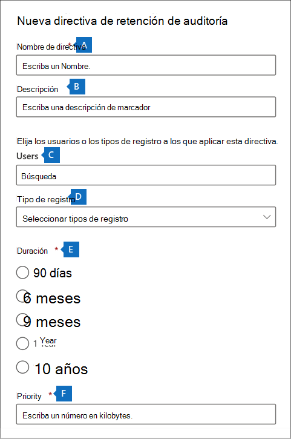

# <a name="manage-audit-log-retention-policies"></a><span data-ttu-id="727d8-104">Administrar directivas de retención de registros de auditoría</span><span class="sxs-lookup"><span data-stu-id="727d8-104">Manage audit log retention policies</span></span>

<span data-ttu-id="727d8-105">Puede crear y administrar directivas de retención de registros de auditoría en el Centro de seguridad y cumplimiento.</span><span class="sxs-lookup"><span data-stu-id="727d8-105">You can create and manage audit log retention policies in the Security & Compliance Center.</span></span> <span data-ttu-id="727d8-106">Las directivas de retención de registros de auditoría forman parte de las nuevas capacidades de Auditoría avanzada en Microsoft 365.</span><span class="sxs-lookup"><span data-stu-id="727d8-106">Audit log retention policies are part of the new Advanced Audit capabilities in Microsoft 365.</span></span> <span data-ttu-id="727d8-107">Una directiva de retención de registro de auditoría le permite especificar durante cuánto tiempo se conservan los registros de auditoría en su organización.</span><span class="sxs-lookup"><span data-stu-id="727d8-107">An audit log retention policy lets you specify how long to retain audit logs in your organization.</span></span> <span data-ttu-id="727d8-108">Puede conservar los registros de auditoría hasta por 10 años.</span><span class="sxs-lookup"><span data-stu-id="727d8-108">You can retain audit logs for up to 10 years.</span></span> <span data-ttu-id="727d8-109">Puede crear directivas en función de los siguientes criterios:</span><span class="sxs-lookup"><span data-stu-id="727d8-109">You can create policies based on the following criteria:</span></span>

- <span data-ttu-id="727d8-110">Todas las actividades en uno o más servicios de Microsoft 365</span><span class="sxs-lookup"><span data-stu-id="727d8-110">All activities in one or more Microsoft 365 services</span></span>

- <span data-ttu-id="727d8-111">Actividades específicas (en un servicio de Microsoft 365) realizadas por todos los usuarios o por usuarios específicos</span><span class="sxs-lookup"><span data-stu-id="727d8-111">Specific activities (in a Microsoft 365 service) performed by all users or by specific users</span></span>

- <span data-ttu-id="727d8-112">Un nivel de prioridad que especifique qué directiva prevalece en caso de que tenga varias directivas en su organización</span><span class="sxs-lookup"><span data-stu-id="727d8-112">A priority level that specifies which policy takes precedence in you have multiple policies in your organization</span></span>

## <a name="default-audit-log-retention-policy"></a><span data-ttu-id="727d8-113">Directivas de retención de registros de auditoría predeterminadas</span><span class="sxs-lookup"><span data-stu-id="727d8-113">Default audit log retention policy</span></span>

<span data-ttu-id="727d8-114">Auditoría avanzada en Microsoft 365 proporciona una directiva de retención de registros de auditoría predeterminada para todas las organizaciones.</span><span class="sxs-lookup"><span data-stu-id="727d8-114">Advanced Audit in Microsoft 365 provides a default audit log retention policy for all organizations.</span></span> <span data-ttu-id="727d8-115">Esta directiva conserva todos los registros de auditoría de Exchange Online, SharePoint Online, OneDrive para la Empresa y Azure Active Directory durante un año.</span><span class="sxs-lookup"><span data-stu-id="727d8-115">This policy retains all Exchange Online, SharePoint Online, OneDrive for Business, and Azure Active Directory audit records for one year.</span></span> <span data-ttu-id="727d8-116">Esta directiva predeterminada conserva los registros de auditoría que contienen el valor de **Exchange**, **SharePoint**, **OneDrive**, **AzureActiveDirectory** para la propiedad de **Carga de trabajo** (que es el servicio en el que se produjo la actividad).</span><span class="sxs-lookup"><span data-stu-id="727d8-116">This default policy retains audit records that contain the value of **Exchange**, **SharePoint**, **OneDrive**, **AzureActiveDirectory** for the **Workload** property (which is the service in which the activity occurred).</span></span> <span data-ttu-id="727d8-117">La directiva predeterminada no se puede modificar.</span><span class="sxs-lookup"><span data-stu-id="727d8-117">The default policy can't be modified.</span></span> <span data-ttu-id="727d8-118">Vea la sección [Más información](#more-information) en este artículo para obtener una lista de los tipos de registros para cada carga de trabajo que se incluye en la directiva predeterminada.</span><span class="sxs-lookup"><span data-stu-id="727d8-118">See the [More information](#more-information) section in this article for a list of record types for each workload that are included in the default policy.</span></span>

> [!NOTE]
> <span data-ttu-id="727d8-119">La directiva de retención de registros de auditoría predeterminada solo se aplica a los registros de auditoría para la actividad realizada por usuarios que tienen asignada una licencia de Office 365 o Microsoft 365 E5, o que tienen una licencia del complemento de Cumplimiento de Microsoft 365 E5 o de eDiscovery y Auditoría de Microsoft 365 E5</span><span class="sxs-lookup"><span data-stu-id="727d8-119">The default audit log retention policy only applies to audit records for activity performed by users who are assigned an Office 365 or Microsoft 365 E5 license or have a Microsoft 365 E5 Compliance or E5 eDiscovery and Audit add-on license.</span></span> <span data-ttu-id="727d8-120">Si no tiene usuarios o invitados de E5 en su organización, los registros de auditoría correspondientes se conservarán durante 90 días.</span><span class="sxs-lookup"><span data-stu-id="727d8-120">If you have non-E5 users or guest users in your organization, their corresponding audit records are retained for 90 days.</span></span>

## <a name="before-you-create-an-audit-log-retention-policy"></a><span data-ttu-id="727d8-121">Antes de crear una directiva de retención de registros de auditoría</span><span class="sxs-lookup"><span data-stu-id="727d8-121">Before you create an audit log retention policy</span></span>

- <span data-ttu-id="727d8-122">Debe tener asignado el rol de Configuración de la organización en el Centro de seguridad y cumplimiento para crear o modificar una directiva de retención de auditoría.</span><span class="sxs-lookup"><span data-stu-id="727d8-122">You have to be assigned the Organization Configuration role in the Security & Compliance Center to create or modify an audit retention policy.</span></span>

- <span data-ttu-id="727d8-123">Puede tener un máximo de 50 directivas de retención de registros de auditoría en su organización.</span><span class="sxs-lookup"><span data-stu-id="727d8-123">You can have a maximum of 50 audit log retention policies in your organization.</span></span>

- <span data-ttu-id="727d8-124">Para conservar un registro de auditoría durante más de 90 días (y hasta un año), el usuario que ha generado dicho registro (mediante una actividad de auditoría) debe tener asignada una licencia de Office 365 E5 o Microsoft 365 E5, o tener una licencia de complemento de Cumplimiento de Microsoft 365 E5 o E5 eDiscovery y Auditoría.</span><span class="sxs-lookup"><span data-stu-id="727d8-124">To retain an audit log for longer than 90 days (and up to 1 year), the user who generates the audit log (by performing an audited activity) must be assigned an Office 365 E5 or Microsoft 365 E5 license or have a Microsoft 365 E5 Compliance or E5 eDiscovery and Audit add-on license.</span></span> <span data-ttu-id="727d8-125">Para conservar los registros de auditoría durante 10 años, el usuario que genera el registro de auditoría también debe tener asignada una licencia del complemento de retención de registro de auditoría de 10 años además de una licencia E5.</span><span class="sxs-lookup"><span data-stu-id="727d8-125">To retain audit logs for 10 years, the user who generates the audit log must also be assigned a 10-year audit log retention add-on license in addition to an E5 license.</span></span>

- <span data-ttu-id="727d8-p106">Todas las directivas de retención de registros de auditoría personalizadas (creadas por su organización) tienen prioridad sobre la directiva de retención predeterminada. Por ejemplo, si crea una directiva de retención de registros de auditoría para la actividad del buzón de Exchange que tiene un período de retención inferior a un año, los registros de auditoría de las actividades de buzón de Exchange se conservarán durante la duración más corta especificada en la directiva personalizada.</span><span class="sxs-lookup"><span data-stu-id="727d8-p106">All custom audit log retention policies (created by your organization) take priority over the default retention policy. For example, if you create an audit log retention policy for Exchange mailbox activity that has a retention period that's shorter than one year, audit records for Exchange mailbox activities will be retained for the shorter duration specified by the custom policy.</span></span>

## <a name="create-an-audit-log-retention-policy"></a><span data-ttu-id="727d8-128">Crear una directiva de retención de registros de auditoría</span><span class="sxs-lookup"><span data-stu-id="727d8-128">Create an audit log retention policy</span></span>

1. <span data-ttu-id="727d8-129">Vaya a [https://compliance.microsoft.com](https://compliance.microsoft.com) e inicie sesión con la cuenta de usuario que tenga asignado el rol de Configuración en la página Permisos de la organización en el Centro de seguridad y cumplimiento.</span><span class="sxs-lookup"><span data-stu-id="727d8-129">Go to [https://compliance.microsoft.com](https://compliance.microsoft.com) and sign in with a user account that's assigned the Organization Configuration role on the Permissions page in the Security & Compliance Center.</span></span>

2. <span data-ttu-id="727d8-130">En el panel izquierdo del Centro de cumplimiento de Microsoft 365, haga clic en **Mostrar todo**, y luego haga clic en **Auditoría**.</span><span class="sxs-lookup"><span data-stu-id="727d8-130">In the left pane of the Microsoft 365 compliance center, click **Show all**, and then click **Audit**.</span></span>

3. <span data-ttu-id="727d8-131">Haga clic en la pestaña **Auditar directivas de retención**.</span><span class="sxs-lookup"><span data-stu-id="727d8-131">Click the **Audit retention policies** tab.</span></span>

4. <span data-ttu-id="727d8-132">Haga clic en **Crear directiva de retención de auditoría** y, después, complete los siguientes campos en la página flotante:</span><span class="sxs-lookup"><span data-stu-id="727d8-132">Click **Create audit retention policy**, and then complete the following fields on the flyout page:</span></span>

    

   1. <span data-ttu-id="727d8-134">**Nombre de directiva:** el nombre de la directiva de retención de registros de auditoría.</span><span class="sxs-lookup"><span data-stu-id="727d8-134">**Policy name:** The name of the audit log retention policy.</span></span> <span data-ttu-id="727d8-135">Este nombre debe ser único en su organización y no puede cambiarse después de crear la directiva.</span><span class="sxs-lookup"><span data-stu-id="727d8-135">This name must be unique in your organization, and it can't be change after the policy is created.</span></span>

   2. <span data-ttu-id="727d8-136">**Descripción:** es opcional, pero le resultará útil para proporcionar información sobre la directiva (como el tipo de registro o la carga de trabajo, los usuarios especificados en la directiva y la duración).</span><span class="sxs-lookup"><span data-stu-id="727d8-136">**Description:** Optional, but helpful to provide information about the policy, such as the record type or workload, users specified in the policy, and the duration.</span></span>

   3. <span data-ttu-id="727d8-137">**Usuarios:** seleccione uno o más usuarios para aplicar la directiva.</span><span class="sxs-lookup"><span data-stu-id="727d8-137">**Users:** Select one or more users to apply the policy to.</span></span> <span data-ttu-id="727d8-138">Si deja este cuadro en blanco, la directiva se aplicará a todos los usuarios.</span><span class="sxs-lookup"><span data-stu-id="727d8-138">If you leave this box blank, then the policy will apply to all users.</span></span> <span data-ttu-id="727d8-139">Si deja en blanco **Tipo de registro**, deberá seleccionar un usuario.</span><span class="sxs-lookup"><span data-stu-id="727d8-139">If you leave the **Record type** blank, then you must select a user.</span></span>

   4. <span data-ttu-id="727d8-140">**Tipo de registro:** el tipo de registro de auditoría al que se aplica la directiva.</span><span class="sxs-lookup"><span data-stu-id="727d8-140">**Record type:** The audit record type the policy applies to.</span></span> <span data-ttu-id="727d8-141">Si deja en blanco esta propiedad, debe seleccionar un usuario en el cuadro **Usuarios**.</span><span class="sxs-lookup"><span data-stu-id="727d8-141">If you leave this property blank, you must select a user in the **Users** box.</span></span> <span data-ttu-id="727d8-142">Puede seleccionar un único tipo de registro o varios tipos de registro:</span><span class="sxs-lookup"><span data-stu-id="727d8-142">You can select a single record type or multiple record types:</span></span>

   - <span data-ttu-id="727d8-143">Si selecciona un único tipo de registro, el campo **Actividades** se mostrará dinámicamente.</span><span class="sxs-lookup"><span data-stu-id="727d8-143">If you select a single record type, the **Activities** field is dynamically displayed.</span></span> <span data-ttu-id="727d8-144">Puede usar la lista desplegable para seleccionar las actividades del tipo de registro seleccionado a las que desea aplicar la directiva.</span><span class="sxs-lookup"><span data-stu-id="727d8-144">You can use the drop-down list to select activities from the selected record type to apply the policy to.</span></span> <span data-ttu-id="727d8-145">Si no elige actividades específicas, la directiva se aplicará a todas las actividades del tipo de registro seleccionado.</span><span class="sxs-lookup"><span data-stu-id="727d8-145">If you don't choose specific activities, the policy will apply to all activities of the selected record type.</span></span>

   - <span data-ttu-id="727d8-146">Si selecciona varios tipos de registro, no podrá seleccionar actividades.</span><span class="sxs-lookup"><span data-stu-id="727d8-146">If you select multiple record types, you don't have the ability to select activities.</span></span> <span data-ttu-id="727d8-147">La directiva se aplicará a todas las actividades de los tipos de registro seleccionados.</span><span class="sxs-lookup"><span data-stu-id="727d8-147">The policy will apply to all activities of the selected record types.</span></span>

   5. <span data-ttu-id="727d8-148">**Duración:** es la cantidad de tiempo que se conservarán los registros de auditoría que cumplan los criterios de la directiva.</span><span class="sxs-lookup"><span data-stu-id="727d8-148">**Duration:** The amount of time to retain the audit logs that meet the criteria of the policy.</span></span>

   6. <span data-ttu-id="727d8-149">**Prioridad:** este valor determina el orden en el que se procesan las directivas de retención de registros de auditoría de su organización.</span><span class="sxs-lookup"><span data-stu-id="727d8-149">**Priority:** This value determines the order in which audit log retention policies in your organization are processed.</span></span> <span data-ttu-id="727d8-150">Un valor más alto indica una prioridad mayor.</span><span class="sxs-lookup"><span data-stu-id="727d8-150">A higher value indicates a higher priority.</span></span> <span data-ttu-id="727d8-151">Por ejemplo, una directiva con un valor de prioridad de **5** tendría prioridad sobre una directiva con un valor de prioridad de **0**.</span><span class="sxs-lookup"><span data-stu-id="727d8-151">For example, a policy with a priority value of **5** would take priority over a policy with a priority value of **0**.</span></span> <span data-ttu-id="727d8-152">Como se ha explicado anteriormente, cualquier directiva de retención de registros de auditoría personalizada tiene prioridad sobre la directiva predeterminada para su organización.</span><span class="sxs-lookup"><span data-stu-id="727d8-152">As previously explained, any custom audit log retention policy takes priority over the default policy for your organization.</span></span>

5. <span data-ttu-id="727d8-153">Haga clic en **Guardar** para crear la nueva directiva de retención de registros de auditoría.</span><span class="sxs-lookup"><span data-stu-id="727d8-153">Click **Save** to create the new audit log retention policy.</span></span>

   <span data-ttu-id="727d8-154">La nueva directiva se muestra en la lista de la pestaña **Auditar directivas de retención**.</span><span class="sxs-lookup"><span data-stu-id="727d8-154">The new policy is displayed in the list on the **Audit retention policies** tab.</span></span>

## <a name="manage-audit-log-retention-policies"></a><span data-ttu-id="727d8-155">Administrar directivas de retención de registros de auditoría</span><span class="sxs-lookup"><span data-stu-id="727d8-155">Manage audit log retention policies</span></span>

<span data-ttu-id="727d8-156">Las directivas de retención de registros de auditoría se muestran en la pestaña **Auditar directivas de retención** (también denominada *panel*).</span><span class="sxs-lookup"><span data-stu-id="727d8-156">Audit log retention policies are listed on the **Audit retention policies** tab (also called the *dashboard*).</span></span> <span data-ttu-id="727d8-157">Puede usar el panel para ver, editar y eliminar directivas de retención de auditoría.</span><span class="sxs-lookup"><span data-stu-id="727d8-157">You can use the dashboard to view, edit, and delete audit retention policies.</span></span>

### <a name="view-policies-in-the-dashboard"></a><span data-ttu-id="727d8-158">Ver directivas en el panel</span><span class="sxs-lookup"><span data-stu-id="727d8-158">View policies in the dashboard</span></span>

<span data-ttu-id="727d8-159">Las directivas de retención de registros de auditoría se muestran en el panel.</span><span class="sxs-lookup"><span data-stu-id="727d8-159">Audit log retention policies are listed in the dashboard.</span></span> <span data-ttu-id="727d8-160">Una ventaja de ver las directivas en el panel es que puede hacer clic en la columna **Prioridad** para enumerar las directivas en la prioridad en que se aplican.</span><span class="sxs-lookup"><span data-stu-id="727d8-160">One advantage of viewing policies in the dashboard is that you can click the **Priority** column to list the policies in the priority in which they are applied.</span></span> <span data-ttu-id="727d8-161">Como se explicó previamente, un valor más alto indica una prioridad mayor.</span><span class="sxs-lookup"><span data-stu-id="727d8-161">As previously explained, a higher value indicates a higher priority.</span></span>


<span data-ttu-id="727d8-163">También puede seleccionar una directiva para mostrar su configuración en la página flotante.</span><span class="sxs-lookup"><span data-stu-id="727d8-163">You can also select a policy to display its settings on the flyout page.</span></span>

> [!NOTE]
> <span data-ttu-id="727d8-164">La directiva de retención de registros de auditoría predeterminada de la organización no se muestra en el panel.</span><span class="sxs-lookup"><span data-stu-id="727d8-164">The default audit log retention policy for your organization isn't displayed in the dashboard.</span></span>

### <a name="edit-policies-in-the-dashboard"></a><span data-ttu-id="727d8-165">Editar directivas en el panel</span><span class="sxs-lookup"><span data-stu-id="727d8-165">Edit policies in the dashboard</span></span>

<span data-ttu-id="727d8-166">Para editar una directiva, selecciónela para mostrar la página de control flotante.</span><span class="sxs-lookup"><span data-stu-id="727d8-166">To edit a policy, select it to display the flyout page.</span></span> <span data-ttu-id="727d8-167">Puede modificar una o más opciones de configuración y, después, guardar los cambios.</span><span class="sxs-lookup"><span data-stu-id="727d8-167">You can modify one or more setting and then save your changes.</span></span>


> [!IMPORTANT]
> <span data-ttu-id="727d8-168">Si usa el cmdlet **New-UnifiedAuditLogRetentionPolicy**, es posible crear una directiva de retención de registros de auditoría para las actividades y los tipos de registros que no están disponibles en la herramienta **Crear directivas de retención de auditoría** en el panel.</span><span class="sxs-lookup"><span data-stu-id="727d8-168">If you use the **New-UnifiedAuditLogRetentionPolicy** cmdlet, it's possible to create an audit log retention policy for record types or activities that aren't available in the **Create audit retention policy** tool in the dashboard.</span></span> <span data-ttu-id="727d8-169">En este caso, no podrá editar la directiva (por ejemplo, cambiar la duración de la retención o agregar y quitar actividades) desde el panel **Directivas de retención de auditoría**.</span><span class="sxs-lookup"><span data-stu-id="727d8-169">In this case, you won't be able to edit the policy (for example, change the retention duration or add and remove activities) from the **Audit retention policies** dashboard.</span></span> <span data-ttu-id="727d8-170">Solo podrá ver y eliminar la directiva en el centro de cumplimiento.</span><span class="sxs-lookup"><span data-stu-id="727d8-170">You'll only be able to view and delete the policy in the compliance center.</span></span> <span data-ttu-id="727d8-171">Para editar la Directiva, tendrá que usar el cmdlet [Set-UnifiedAuditLogRetentionPolicy](/powershell/module/exchange/set-unifiedauditlogretentionpolicy) en el centro de seguridad y cumplimiento de PowerShell.</span><span class="sxs-lookup"><span data-stu-id="727d8-171">To edit the policy, you'll have to use the [Set-UnifiedAuditLogRetentionPolicy](/powershell/module/exchange/set-unifiedauditlogretentionpolicy) cmdlet in Security & Compliance Center PowerShell.</span></span><br/><br/><span data-ttu-id="727d8-172">**Sugerencia:** se muestra un mensaje en la parte superior de la página de salida para las directivas que se deben editar con PowerShell.</span><span class="sxs-lookup"><span data-stu-id="727d8-172">**Tip:** A message is displayed at the top of the flyout page for policies that have to be edited using PowerShell.</span></span>

### <a name="delete-policies-in-the-dashboard"></a><span data-ttu-id="727d8-173">Eliminar directivas en el panel</span><span class="sxs-lookup"><span data-stu-id="727d8-173">Delete policies in the dashboard</span></span>

<span data-ttu-id="727d8-174">Para eliminar una directiva, haga clic en el icono **Eliminar**  y, después, confirme que quiere eliminar la directiva.</span><span class="sxs-lookup"><span data-stu-id="727d8-174">To delete a policy, click the **Delete**  icon and then confirm that you want to delete the policy.</span></span> <span data-ttu-id="727d8-175">La directiva se quita del panel, pero puede tardar hasta 30 minutos en quitarse la directiva de la organización.</span><span class="sxs-lookup"><span data-stu-id="727d8-175">The policy is removed from the dashboard, but it might take up to 30 minutes for the policy to be removed from your organization.</span></span>

## <a name="create-and-manage-audit-log-retention-policies-in-powershell"></a><span data-ttu-id="727d8-176">Crear y administrar directivas de retención de registros de auditoría en PowerShell</span><span class="sxs-lookup"><span data-stu-id="727d8-176">Create and manage audit log retention policies in PowerShell</span></span>

<span data-ttu-id="727d8-177">También puede usar PowerShell del Centro de seguridad y cumplimiento para crear y administrar directivas de retención de registros de auditoría.</span><span class="sxs-lookup"><span data-stu-id="727d8-177">You can also use Security & Compliance Center PowerShell to create and manage audit log retention policies.</span></span> <span data-ttu-id="727d8-178">Uno de los motivos para usar PowerShell es crear una directiva para un tipo de registro o actividad que no esté disponible en la interfaz de usuario.</span><span class="sxs-lookup"><span data-stu-id="727d8-178">One reason to use PowerShell is to create a policy for a record type or activity that isn't available in the UI.</span></span>

### <a name="create-an-audit-log-retention-policy-in-powershell"></a><span data-ttu-id="727d8-179">Crear una directiva de retención de registros de auditoría en PowerShell</span><span class="sxs-lookup"><span data-stu-id="727d8-179">Create an audit log retention policy in PowerShell</span></span>

<span data-ttu-id="727d8-180">Siga estos pasos para crear una directiva de retención de registros de auditoría en PowerShell:</span><span class="sxs-lookup"><span data-stu-id="727d8-180">Follow these steps to create an audit log retention policy in PowerShell:</span></span>

1. <span data-ttu-id="727d8-181">[Conectarse a PowerShell del Centro de seguridad y cumplimiento](/powershell/exchange/connect-to-scc-powershell).</span><span class="sxs-lookup"><span data-stu-id="727d8-181">[Connect to Security & Compliance Center PowerShell](/powershell/exchange/connect-to-scc-powershell).</span></span>

2. <span data-ttu-id="727d8-182">Ejecute el siguiente comando para crear una directiva de retención de registros de auditoría.</span><span class="sxs-lookup"><span data-stu-id="727d8-182">Run the following command to create an audit log retention policy.</span></span>

   ```powershell
   New-UnifiedAuditLogRetentionPolicy -Name "Microsoft Teams Audit Policy" -Description "One year retention policy for all Microsoft Teams activities" -RecordTypes MicrosoftTeams -RetentionDuration TenYears -Priority 100
   ```

    <span data-ttu-id="727d8-183">En este ejemplo se crea una directiva de retención de registros de auditoría denominada "Directiva de auditoría de Microsoft Teams" con esta configuración:</span><span class="sxs-lookup"><span data-stu-id="727d8-183">This example creates an audit log retention policy named "Microsoft Teams Audit Policy" with these settings:</span></span>

   - <span data-ttu-id="727d8-184">Una descripción de la directiva.</span><span class="sxs-lookup"><span data-stu-id="727d8-184">A description of the policy.</span></span>

   - <span data-ttu-id="727d8-185">Conserva todas las actividades de Microsoft Teams (definidas en el parámetro *RecordType*).</span><span class="sxs-lookup"><span data-stu-id="727d8-185">Retains all Microsoft Teams activities (as defined by the *RecordType* parameter).</span></span>

   - <span data-ttu-id="727d8-186">Conserva los registros de auditoría de Microsoft Teams por 10 años.</span><span class="sxs-lookup"><span data-stu-id="727d8-186">Retains Microsoft Teams audit logs for 10 years.</span></span>

   - <span data-ttu-id="727d8-187">Una prioridad de 100.</span><span class="sxs-lookup"><span data-stu-id="727d8-187">A priority of 100.</span></span>

<span data-ttu-id="727d8-188">Este es otro ejemplo para la creación de una directiva de retención de registros de auditoría.</span><span class="sxs-lookup"><span data-stu-id="727d8-188">Here's another example of creating an audit log retention policy.</span></span> <span data-ttu-id="727d8-189">Esta directiva conserva los registros de auditoría de la actividad "el usuario inició sesión" durante seis meses para el usuario admin@contoso.onmicrosoft.com.</span><span class="sxs-lookup"><span data-stu-id="727d8-189">This policy retains audit logs for the "User logged in" activity for six months for the user admin@contoso.onmicrosoft.com.</span></span>

```powershell
New-UnifiedAuditLogRetentionPolicy -Name "SixMonth retention for admin logons" -RecordTypes AzureActiveDirectoryStsLogon -Operations UserLoggedIn -UserIds admin@contoso.onmicrosoft.com -RetentionDuration SixMonths -Priority 25
```

<span data-ttu-id="727d8-190">Para obtener más información, consulte [New-UnifiedAuditLogRetentionPolicy](/powershell/module/exchange/new-unifiedauditlogretentionpolicy).</span><span class="sxs-lookup"><span data-stu-id="727d8-190">For more information, see [New-UnifiedAuditLogRetentionPolicy](/powershell/module/exchange/new-unifiedauditlogretentionpolicy).</span></span>

### <a name="view-policies-in-powershell"></a><span data-ttu-id="727d8-191">Ver directivas en PowerShell</span><span class="sxs-lookup"><span data-stu-id="727d8-191">View policies in PowerShell</span></span>

<span data-ttu-id="727d8-192">Use el cmdlet [Get-UnifiedAuditLogRetentionPolicy](/powershell/module/exchange/get-unifiedauditlogretentionpolicy) en PowerShell del Centro de seguridad y cumplimiento para ver directivas de retención de registros de auditoría.</span><span class="sxs-lookup"><span data-stu-id="727d8-192">Use the [Get-UnifiedAuditLogRetentionPolicy](/powershell/module/exchange/get-unifiedauditlogretentionpolicy) cmdlet in Security & Compliance Center PowerShell to view audit log retention policies.</span></span>

<span data-ttu-id="727d8-193">Este es un comando de ejemplo para mostrar la configuración para todas directivas de retención de registros de auditoría en su organización.</span><span class="sxs-lookup"><span data-stu-id="727d8-193">Here's a sample command to display the settings for all audit log retention policies in your organization.</span></span> <span data-ttu-id="727d8-194">Este comando ordena las directivas de mayor a menor prioridad.</span><span class="sxs-lookup"><span data-stu-id="727d8-194">This command sorts the policies from the highest to lowest priority.</span></span>

```powershell
Get-UnifiedAuditLogRetentionPolicy | Sort-Object -Property Priority -Descending | FL Priority,Name,Description,RecordTypes,Operations,UserIds,RetentionDuration
```

> [!NOTE]
> <span data-ttu-id="727d8-195">El cmdlet **Get-UnifiedAuditLogRetentionPolicy** no devuelve la directiva de retención de registros de auditoría predeterminada para su organización.</span><span class="sxs-lookup"><span data-stu-id="727d8-195">The **Get-UnifiedAuditLogRetentionPolicy** cmdlet doesn't return the default audit log retention policy for your organization.</span></span>

### <a name="edit-policies-in-powershell"></a><span data-ttu-id="727d8-196">Editar directivas en PowerShell</span><span class="sxs-lookup"><span data-stu-id="727d8-196">Edit policies in PowerShell</span></span>

<span data-ttu-id="727d8-197">Use el cmdlet [Set-UnifiedAuditLogRetentionPolicy](/powershell/module/exchange/set-unifiedauditlogretentionpolicy) en PowerShell del Centro de seguridad y cumplimiento para editar una directiva de retención de registros de auditoría existente.</span><span class="sxs-lookup"><span data-stu-id="727d8-197">Use the [Set-UnifiedAuditLogRetentionPolicy](/powershell/module/exchange/set-unifiedauditlogretentionpolicy) cmdlet in Security & Compliance Center PowerShell to edit an existing audit log retention policy.</span></span>

### <a name="delete-policies-in-powershell"></a><span data-ttu-id="727d8-198">Eliminar directivas en PowerShell</span><span class="sxs-lookup"><span data-stu-id="727d8-198">Delete policies in PowerShell</span></span>

<span data-ttu-id="727d8-199">Use el cmdlet [Remove-UnifiedAuditLogRetentionPolicy](/powershell/module/exchange/remove-unifiedauditlogretentionpolicy) en PowerShell del Centro de seguridad y cumplimiento para eliminar una directiva de retención de registros de auditoría.</span><span class="sxs-lookup"><span data-stu-id="727d8-199">Use the [Remove-UnifiedAuditLogRetentionPolicy](/powershell/module/exchange/remove-unifiedauditlogretentionpolicy) cmdlet in Security & Compliance Center PowerShell to delete an audit log retention policy.</span></span> <span data-ttu-id="727d8-200">La directiva puede tardar hasta 30 minutos para eliminarse por completo de su organización.</span><span class="sxs-lookup"><span data-stu-id="727d8-200">It might take up to 30 minutes for the policy to be removed from your organization.</span></span>

## <a name="more-information"></a><span data-ttu-id="727d8-201">Más información</span><span class="sxs-lookup"><span data-stu-id="727d8-201">More information</span></span>

<span data-ttu-id="727d8-202">Como se ha indicado anteriormente, los registros de auditoría para las operaciones en Azure Active Directory, Exchange Online, SharePoint Online y OneDrive para la Empresa se conservan durante un año de forma predeterminada.</span><span class="sxs-lookup"><span data-stu-id="727d8-202">As previously stated, audit records for operations in Azure Active Directory, Exchange Online, SharePoint Online, and OneDrive for Business, are retained for one year by default.</span></span> <span data-ttu-id="727d8-203">En la siguiente tabla se enumeran todos los tipos de registro (para cada uno de estos servicios) incluidos en la directiva de retención de registros de auditoría predeterminada.</span><span class="sxs-lookup"><span data-stu-id="727d8-203">The following table lists all the record types (for each of these services) included in the default audit log retention policy.</span></span> <span data-ttu-id="727d8-204">Esto significa que los registros de auditoría de cualquier operación con este tipo de registro se conservan durante un año, a menos que una directiva de retención de registros de auditoría personalizada tenga prioridad para un tipo de registro, una operación o un usuario específicos.</span><span class="sxs-lookup"><span data-stu-id="727d8-204">This means that audit logs for any operation with this record type are retained for one year unless a custom audit log retention policy takes precedence for a specific record type, operation, or user.</span></span> <span data-ttu-id="727d8-205">El valor Enum (que se muestra como el valor de la propiedad RecordType en un registro de auditoría) para cada tipo de registro se muestra entre paréntesis.</span><span class="sxs-lookup"><span data-stu-id="727d8-205">The Enum value (which is displayed as the value for the RecordType property in an audit record) for each record type is shown in parentheses.</span></span>

|<span data-ttu-id="727d8-206">AzureActiveDirectory</span><span class="sxs-lookup"><span data-stu-id="727d8-206">AzureActiveDirectory</span></span> |<span data-ttu-id="727d8-207">Exchange</span><span class="sxs-lookup"><span data-stu-id="727d8-207">Exchange</span></span>  |<span data-ttu-id="727d8-208">SharePoint o OneDrive</span><span class="sxs-lookup"><span data-stu-id="727d8-208">SharePoint or OneDrive</span></span>|
|:---------|:---------|:---------|
|<span data-ttu-id="727d8-209">AzureActiveDirectory (8)</span><span class="sxs-lookup"><span data-stu-id="727d8-209">AzureActiveDirectory (8)</span></span>|<span data-ttu-id="727d8-210">ExchangeAdmin (1)</span><span class="sxs-lookup"><span data-stu-id="727d8-210">ExchangeAdmin (1)</span></span>|<span data-ttu-id="727d8-211">ComplianceDLPSharePoint (11)</span><span class="sxs-lookup"><span data-stu-id="727d8-211">ComplianceDLPSharePoint (11)</span></span>|
|<span data-ttu-id="727d8-212">AzureActiveDirectoryAccountLogon (9)</span><span class="sxs-lookup"><span data-stu-id="727d8-212">AzureActiveDirectoryAccountLogon (9)</span></span>|<span data-ttu-id="727d8-213">ExchangeItem (2)</span><span class="sxs-lookup"><span data-stu-id="727d8-213">ExchangeItem (2)</span></span>|<span data-ttu-id="727d8-214">ComplianceDLPSharePointClassification (33)</span><span class="sxs-lookup"><span data-stu-id="727d8-214">ComplianceDLPSharePointClassification (33)</span></span>|
|<span data-ttu-id="727d8-215">AzureActiveDirectoryStsLogon (15)</span><span class="sxs-lookup"><span data-stu-id="727d8-215">AzureActiveDirectoryStsLogon (15)</span></span>|<span data-ttu-id="727d8-216">Campaña (62)</span><span class="sxs-lookup"><span data-stu-id="727d8-216">Campaign (62)</span></span>|<span data-ttu-id="727d8-217">Proyecto (35)</span><span class="sxs-lookup"><span data-stu-id="727d8-217">Project (35)</span></span>|
||<span data-ttu-id="727d8-218">ComplianceDLPExchange (13)</span><span class="sxs-lookup"><span data-stu-id="727d8-218">ComplianceDLPExchange (13)</span></span>|<span data-ttu-id="727d8-219">SharePoint (4)</span><span class="sxs-lookup"><span data-stu-id="727d8-219">SharePoint (4)</span></span>|
||<span data-ttu-id="727d8-220">ComplianceSupervisionExchange (68)</span><span class="sxs-lookup"><span data-stu-id="727d8-220">ComplianceSupervisionExchange (68)</span></span>|<span data-ttu-id="727d8-221">SharePointCommentOperation (37)</span><span class="sxs-lookup"><span data-stu-id="727d8-221">SharePointCommentOperation (37)</span></span>|
||<span data-ttu-id="727d8-222">CustomerKeyServiceEncryption (69)</span><span class="sxs-lookup"><span data-stu-id="727d8-222">CustomerKeyServiceEncryption (69)</span></span>|<span data-ttu-id="727d8-223">SharePointContentTypeOperation (55)</span><span class="sxs-lookup"><span data-stu-id="727d8-223">SharePointContentTypeOperation (55)</span></span>|
||<span data-ttu-id="727d8-224">ExchangeAggregatedOperation (19)</span><span class="sxs-lookup"><span data-stu-id="727d8-224">ExchangeAggregatedOperation (19)</span></span>|<span data-ttu-id="727d8-225">SharePointFieldOperation (56)</span><span class="sxs-lookup"><span data-stu-id="727d8-225">SharePointFieldOperation (56)</span></span>|
||<span data-ttu-id="727d8-226">ExchangeItemAggregated (50)</span><span class="sxs-lookup"><span data-stu-id="727d8-226">ExchangeItemAggregated (50)</span></span>|<span data-ttu-id="727d8-227">SharePointFileOperation (6)</span><span class="sxs-lookup"><span data-stu-id="727d8-227">SharePointFileOperation (6)</span></span>|
||<span data-ttu-id="727d8-228">ExchangeItemGroup (3)</span><span class="sxs-lookup"><span data-stu-id="727d8-228">ExchangeItemGroup (3)</span></span>|<span data-ttu-id="727d8-229">SharePointListOperation (36)</span><span class="sxs-lookup"><span data-stu-id="727d8-229">SharePointListOperation (36)</span></span>|
||<span data-ttu-id="727d8-230">InformationBarrierPolicyApplication (53)</span><span class="sxs-lookup"><span data-stu-id="727d8-230">InformationBarrierPolicyApplication (53)</span></span>|<span data-ttu-id="727d8-231">SharePointSharingOperation (14)</span><span class="sxs-lookup"><span data-stu-id="727d8-231">SharePointSharingOperation (14)</span></span>|
||||
