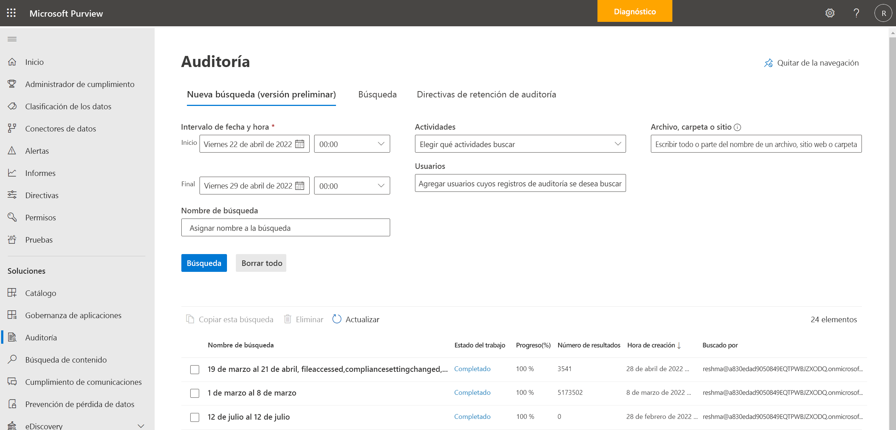
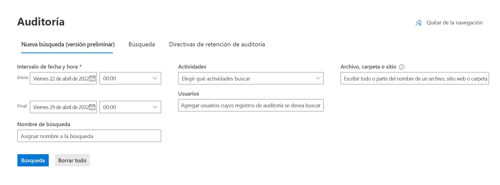
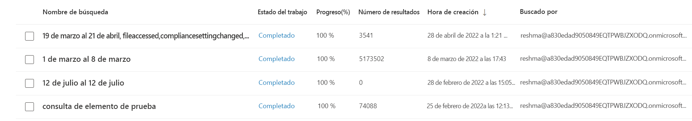
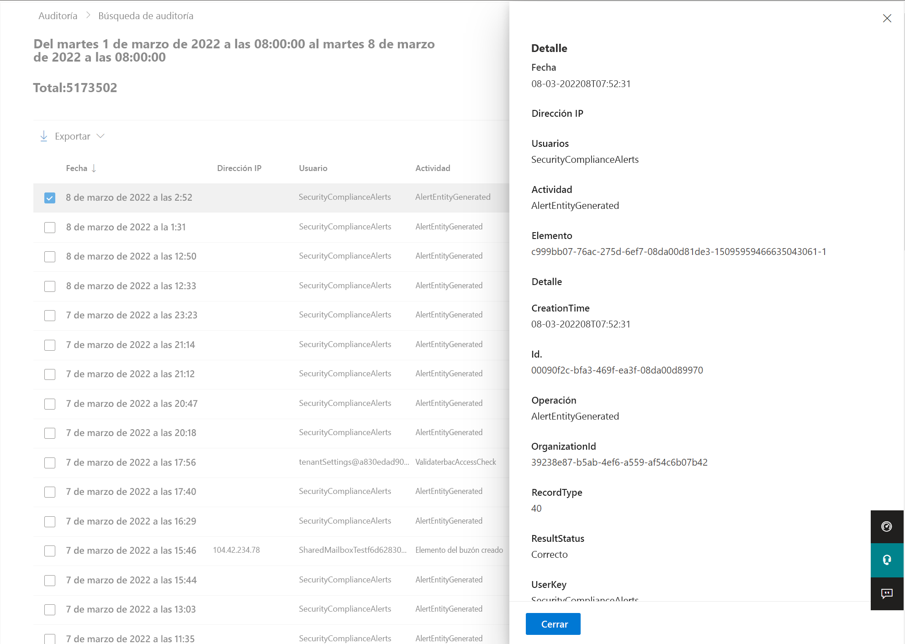

# Nueva búsqueda de Auditoría

Su organización requiere acceso a los datos críticos de los eventos de registro de auditoría para obtener información e investigar con más detalle las actividades del usuario. Anteriormente, los trabajos de búsqueda en la interfaz de usuario del portal de cumplimiento de Microsoft Purview estaban limitados en su capacidad para crear trabajos de búsqueda de auditoría simultáneos y revisar los trabajos de búsqueda históricos. Estos trabajos de búsqueda de auditoría críticos también dependían de que la ventana del explorador permaneciera abierta para poder completarse.

Audit New Search se basa en las funcionalidades de búsqueda existentes e incluye las siguientes mejoras clave:

- Los trabajos de búsqueda iniciados a través de la interfaz de usuario del portal de cumplimiento ya no requieren que la ventana del explorador web permanezca abierta para completarse. Estos trabajos seguirán ejecutándose incluso después de que se cierre la ventana del explorador.
- Los trabajos de búsqueda completados ahora se almacenan durante 30 días, lo que ofrece a los clientes la capacidad de hacer referencia a las búsquedas de auditoría históricas. Estos trabajos de búsqueda se presentan en la interfaz de usuario con una lista del nombre de búsqueda, el estado del trabajo de búsqueda, el porcentaje de progreso, el número de resultados, la hora de creación y búsqueda realizada por.
- Cada usuario de la cuenta de auditoría de administrador puede tener un máximo de 10 trabajos de búsqueda simultáneos en curso con un máximo de un trabajo de búsqueda sin filtrar.

[!INCLUDE [purview-preview](../includes/purview-preview.md)]

## Información para empezar

Vea la documentación disponible de Microsoft Purview Audit, ya que las experiencias de creación y exportación de trabajos de búsqueda tienen muchos paralelismos con la experiencia de búsqueda actual:

- [Busque el registro de auditoría en el portal de cumplimiento de Microsoft Purview](search-the-audit-log-in-security-and-compliance.md) (tenga en cuenta que PowerShell aún no es compatible con la Búsqueda de auditoría V2)
- [Propiedades detalladas del registro de auditoría](detailed-properties-in-the-office-365-audit-log.md)
- [Exportar, configurar y ver registros de registro de auditoría](export-view-audit-log-records.md)

Información adicional:

- La búsqueda a través de una sesión de PowerShell EXO mediante el cmdlet Search-UnifiedAuditLog no es compatible con la nueva búsqueda en este momento.
- Los trabajos de búsqueda pueden aceptar los siguientes criterios: Intervalo de fechas, Intervalo de tiempo, Nombre del trabajo de búsqueda, Actividades, Usuarios, Archivos, Carpetas y Sitios.
- Las búsquedas y el filtrado con fecha, hora, nombre de búsqueda, actividades y usuarios son totalmente funcionales.
- Los datos del registro de auditoría se almacenarán durante el período de retención definido, independientemente de que se elimine un trabajo de búsqueda.

## Introducción a la nueva búsqueda de auditoría

Siga estos pasos para probar y validar la experiencia de la Nueva búsqueda de auditoría:

1. Inicie sesión en el [portal de cumplimiento Microsoft Purview](https://compliance.microsoft.com)
2. Seleccione la pestaña **Auditoría** en el panel izquierdo de la página principal para ir a la herramienta Auditoría.
3. Seleccione la pestaña **Nueva búsqueda** en la parte superior de la página **Auditoría** .

      

4. Pruebe diferentes trabajos de búsqueda en la herramienta de la Nueva búsqueda de auditoría usando los diversos criterios de búsqueda.
Algunos ejemplos de distintas búsquedas incluyen los siguientes criterios. Explore estos diferentes métodos de búsqueda mientras realiza búsquedas en el registro de auditoría.

    - Buscar en diferentes intervalos de tiempo.
      - Un día
      - Semana
      - Mes
      - Varios meses
    - Buscar entre los usuarios seleccionados
    - Determinar el ámbito de la búsqueda mediante el campo de actividades
    - Adición de un archivo, una carpeta o un sitio específicos

  

5. Iniciar otras 2 a 9 búsquedas en el portal de cumplimiento. Se puede ejecutar un máximo de 10 trabajos de búsqueda en paralelo en una cuenta.
6. Explore el historial de trabajos de búsqueda y seleccione diferentes trabajos de búsqueda para obtener sus datos correspondientes de los resultados del trabajo de búsqueda. Los resultados se pueden ordenar por su hora de creación seleccionando el botón correspondiente en la parte superior de la tabla.

  

7. Seleccione un trabajo de búsqueda para ver los resultados del trabajo mostrados en un formato de elemento de línea. Explore las distintas funcionalidades de la interfaz de usuario, entre las que se incluyen:

    - Hacer referencia a la consulta de búsqueda completa en la parte superior de la página, lo que incluye todos los criterios de búsqueda especificados al completar la búsqueda original
    - Selección de varios resultados para obtener más información en la ventana desplegable
    - Filtrar el trabajo de búsqueda mediante la dirección IP, el usuario, la actividad, la fecha, el elemento y los detalles
    - Exportar búsquedas sin filtrar y filtradas
    - Ordenar los resultados haciendo clic en los botones correspondientes de la parte superior de la tabla, que incluyen la fecha, la dirección IP (si procede), el usuario, la actividad, el elemento y los detalles (si procede).

  

## Información general del trabajo de búsqueda de auditoría

- Los trabajos de búsqueda pueden aceptar los siguientes criterios: Intervalo de fechas, Intervalo de tiempo, Nombre del trabajo de búsqueda, Actividades, Usuarios, Archivos, Carpetas y Sitios.
- El cuadro de texto de Archivo, Carpeta o Búsqueda del sitio devolverá todos los resultados relacionados para el archivo, las carpetas y los sitios correspondientes.
- Los trabajos de búsqueda se ejecutarán en la parte inferior de la página de búsqueda.
  - Los trabajos de búsqueda se pueden *poner en cola*, *en curso* y *completados*
  - Un máximo de 10 trabajos de búsqueda *en curso* se pueden completar simultáneamente por usuario
- Los nombres de búsqueda completos de los trabajos se pueden ver al mantener el cursor sobre el trabajo de búsqueda correspondiente
- Los trabajos de búsqueda mostrarán el nombre de búsqueda, el estado, el progreso %, el número de resultados, la hora de creación y búsqueda por

## Información general sobre los resultados de la búsqueda de auditoría

- Los resultados de la búsqueda se muestran en un elemento de línea una vez que se selecciona un trabajo de búsqueda
- La consulta de búsqueda se muestra en la parte superior de la página de resultados del trabajo de búsqueda por referencia y número total de elementos
  > [!NOTE]
  > El número total de resultados deduce los duplicados, por lo que podría ser inferior al número de elementos de la ventana principal de búsqueda de auditoría.
- Puede encontrar información sobre la fecha, la dirección IP, el usuario, la actividad y el elemento en la página de resultados del trabajo de búsqueda de cada elemento.
- Seleccione una actividad para ver una ventana flotante con más detalles sobre la actividad.
- La característica de filtrado para los resultados del trabajo de búsqueda puede ayudar a analizar los resultados.
- La exportación es totalmente funcional y exporta todos los elementos de trabajo de búsqueda a un archivo .csv. Export admite resultados de hasta 50 KB.

## Preguntas más frecuentes

- **¿Hay un número máximo de trabajos de búsqueda por usuario?**
  Hay un máximo de 10 trabajos de búsqueda *en curso* por usuario. Si un usuario requiere más de 10 trabajos de búsqueda, debe esperar a que un trabajo *en curso* finalice o elimine un trabajo de búsqueda. Agradecemos sus comentarios sobre este límite.
- **¿La eliminación de un trabajo de búsqueda elimina también los datos de back-end?**
  No, la eliminación del trabajo de búsqueda solo eliminará la definición del trabajo de búsqueda y su resultado de búsqueda asociado.
