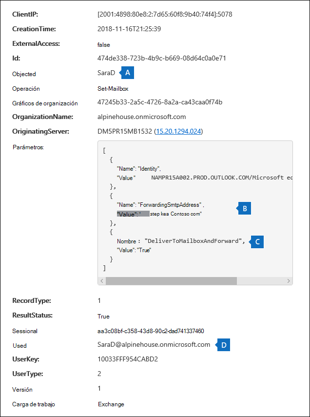
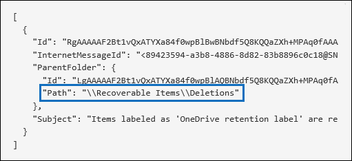
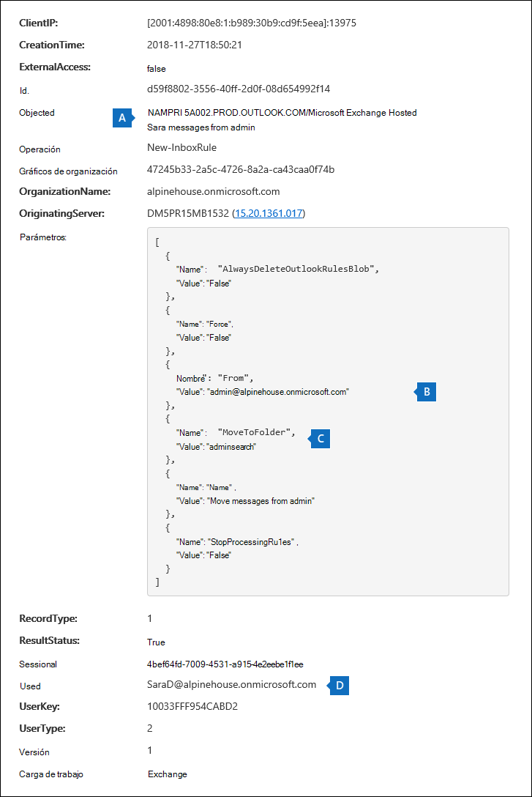

# <a name="search-the-audit-log-to-investigate-common-support-issues"></a><span data-ttu-id="4c8bb-103">Buscar en el registro de auditoría para investigar problemas comunes de soporte técnico</span><span class="sxs-lookup"><span data-stu-id="4c8bb-103">Search the audit log to investigate common support issues</span></span>

<span data-ttu-id="4c8bb-104">En este artículo se describe cómo usar la herramienta de búsqueda de registros de auditoría para ayudarle a investigar problemas comunes de soporte técnico.</span><span class="sxs-lookup"><span data-stu-id="4c8bb-104">This article describes how to use the audit log search tool to help you investigate common support issues.</span></span> <span data-ttu-id="4c8bb-105">Esto incluye el uso del registro de auditoría para:</span><span class="sxs-lookup"><span data-stu-id="4c8bb-105">This includes using the audit log to:</span></span>

- <span data-ttu-id="4c8bb-106">Buscar la dirección IP del equipo usado para obtener acceso a una cuenta comprometida</span><span class="sxs-lookup"><span data-stu-id="4c8bb-106">Find the IP address of the computer used to access a compromised account</span></span>
- <span data-ttu-id="4c8bb-107">Determinar quién ha configurado el reenvío de correo electrónico para un buzón</span><span class="sxs-lookup"><span data-stu-id="4c8bb-107">Determine who set up email forwarding for a mailbox</span></span>
- <span data-ttu-id="4c8bb-108">Determinar si un usuario eliminó elementos de correo electrónico en su buzón</span><span class="sxs-lookup"><span data-stu-id="4c8bb-108">Determine if a user deleted email items in their mailbox</span></span>
- <span data-ttu-id="4c8bb-109">Determinar si un usuario creó una regla de bandeja de entrada</span><span class="sxs-lookup"><span data-stu-id="4c8bb-109">Determine if a user created an inbox rule</span></span>
- <span data-ttu-id="4c8bb-110">Investigar por qué un usuario externo a la organización ha realizado un inicio de sesión correcto</span><span class="sxs-lookup"><span data-stu-id="4c8bb-110">Investigate why there was a successful login by a user outside your organization</span></span>
- <span data-ttu-id="4c8bb-111">Buscar actividades de buzón realizadas por usuarios con licencias que no son E5</span><span class="sxs-lookup"><span data-stu-id="4c8bb-111">Search for mailbox activities performed by users with non-E5 licenses</span></span>
- <span data-ttu-id="4c8bb-112">Búsqueda de actividades de buzón realizadas por usuarios delegados</span><span class="sxs-lookup"><span data-stu-id="4c8bb-112">Search for mailbox activities performed by delegate users</span></span>

## <a name="using-the-audit-log-search-tool"></a><span data-ttu-id="4c8bb-113">Uso de la herramienta de búsqueda de registros de auditoría</span><span class="sxs-lookup"><span data-stu-id="4c8bb-113">Using the audit log search tool</span></span>

<span data-ttu-id="4c8bb-114">Cada uno de los escenarios de solución de problemas descritos en este artículo se basa en el uso de la herramienta de búsqueda de registros de auditoría en el Centro de & cumplimiento.</span><span class="sxs-lookup"><span data-stu-id="4c8bb-114">Each of the troubleshooting scenarios described in this article is based on using the audit log search tool in the Security & Compliance Center.</span></span> <span data-ttu-id="4c8bb-115">En esta sección se enumeran los permisos necesarios para buscar en el registro de auditoría y se describen los pasos para tener acceso y ejecutar búsquedas en el registro de auditoría.</span><span class="sxs-lookup"><span data-stu-id="4c8bb-115">This section lists the permissions required to search the audit log and describes the steps to access and run audit log searches.</span></span> <span data-ttu-id="4c8bb-116">En cada sección de escenario se explica cómo configurar una consulta de búsqueda de registro de auditoría y qué buscar en la información detallada de los registros de auditoría que coinciden con los criterios de búsqueda.</span><span class="sxs-lookup"><span data-stu-id="4c8bb-116">Each scenario section explains how to configure an audit log search query and what to look for in the detailed information in the audit records that match the search criteria.</span></span>

### <a name="permissions-required-to-use-the-audit-log-search-tool"></a><span data-ttu-id="4c8bb-117">Permisos necesarios para usar la herramienta de búsqueda de registros de auditoría</span><span class="sxs-lookup"><span data-stu-id="4c8bb-117">Permissions required to use the audit log search tool</span></span>

<span data-ttu-id="4c8bb-118">Debe tener asignado el rol View-Only registros de auditoría o registros de auditoría en Exchange Online para buscar en el registro de auditoría.</span><span class="sxs-lookup"><span data-stu-id="4c8bb-118">You must be assigned the View-Only Audit Logs or Audit Logs role in Exchange Online to search the audit log.</span></span> <span data-ttu-id="4c8bb-119">De forma predeterminada, estos roles se asignan a los grupos de roles de Administración de la organización y Administración de cumplimiento en la página de **permisos** del centro de administración de Exchange.</span><span class="sxs-lookup"><span data-stu-id="4c8bb-119">By default, these roles are assigned to the Compliance Management and Organization Management role groups on the **Permissions** page in the Exchange admin center.</span></span> <span data-ttu-id="4c8bb-120">Los administradores globales de Office 365 y Microsoft 365 se agregan automáticamente como miembros del grupo de roles Administración de la organización en Exchange Online.</span><span class="sxs-lookup"><span data-stu-id="4c8bb-120">Global administrators in Office 365 and Microsoft 365 are automatically added as members of the Organization Management role group in Exchange Online.</span></span> <span data-ttu-id="4c8bb-121">Para obtener más información, consulte[Administrar grupos de roles en Exchange en línea](https://go.microsoft.com/fwlink/p/?LinkID=730688).</span><span class="sxs-lookup"><span data-stu-id="4c8bb-121">For more information, see [Manage role groups in Exchange Online](https://go.microsoft.com/fwlink/p/?LinkID=730688).</span></span>

### <a name="running-audit-log-searches"></a><span data-ttu-id="4c8bb-122">Ejecución de búsquedas de registros de auditoría</span><span class="sxs-lookup"><span data-stu-id="4c8bb-122">Running audit log searches</span></span>

<span data-ttu-id="4c8bb-123">En esta sección se describen los conceptos básicos para crear y ejecutar búsquedas de registro de auditoría.</span><span class="sxs-lookup"><span data-stu-id="4c8bb-123">This section describes the basics for creating and running audit log searches.</span></span> <span data-ttu-id="4c8bb-124">Use estas instrucciones como punto de partida para cada escenario de solución de problemas de este artículo.</span><span class="sxs-lookup"><span data-stu-id="4c8bb-124">Use these instructions as a starting point for each troubleshooting scenario in this article.</span></span> <span data-ttu-id="4c8bb-125">Para obtener instrucciones detalladas paso a paso, vea [Buscar en el registro de auditoría.](search-the-audit-log-in-security-and-compliance.md#step-1-run-an-audit-log-search)</span><span class="sxs-lookup"><span data-stu-id="4c8bb-125">For more detailed step-by-step instructions, see [Search the audit log](search-the-audit-log-in-security-and-compliance.md#step-1-run-an-audit-log-search).</span></span>

1. <span data-ttu-id="4c8bb-126">Vaya e [https://protection.office.com/unifiedauditlog](https://protection.office.com/unifiedauditlog) inicie sesión con su cuenta de trabajo o escuela.</span><span class="sxs-lookup"><span data-stu-id="4c8bb-126">Go to [https://protection.office.com/unifiedauditlog](https://protection.office.com/unifiedauditlog) and sign in using your work or school account.</span></span>
    
    <span data-ttu-id="4c8bb-127">La página del **registro de auditoría de búsqueda** será mostrada.</span><span class="sxs-lookup"><span data-stu-id="4c8bb-127">The **Audit log search** page is displayed.</span></span> 
    
    
  
4. <span data-ttu-id="4c8bb-129">Puede configurar los siguientes criterios de búsqueda.</span><span class="sxs-lookup"><span data-stu-id="4c8bb-129">You can configure the following search criteria.</span></span> <span data-ttu-id="4c8bb-130">Cada escenario de solución de problemas de este artículo recomienda instrucciones específicas para configurar estos campos.</span><span class="sxs-lookup"><span data-stu-id="4c8bb-130">Each troubleshooting scenario in this article recommends specific guidance for configuring these fields.</span></span>
    
    <span data-ttu-id="4c8bb-131">a.</span><span class="sxs-lookup"><span data-stu-id="4c8bb-131">a.</span></span> <span data-ttu-id="4c8bb-132">**Actividades:** Seleccione la lista desplegable para mostrar las actividades que puede buscar.</span><span class="sxs-lookup"><span data-stu-id="4c8bb-132">**Activities:** Select the drop-down list to display the activities that you can search for.</span></span> <span data-ttu-id="4c8bb-133">Después de ejecutar la búsqueda, solo se muestran los registros de auditoría de las actividades seleccionadas.</span><span class="sxs-lookup"><span data-stu-id="4c8bb-133">After you run the search, only the audit records for the selected activities are displayed.</span></span> <span data-ttu-id="4c8bb-134">Si selecciona **Mostrar resultados para todas las actividades,** se mostrarán los resultados de todas las actividades que cumplan los demás criterios de búsqueda.</span><span class="sxs-lookup"><span data-stu-id="4c8bb-134">Selecting **Show results for all activities** displays results for all activities that meet the other search criteria.</span></span> <span data-ttu-id="4c8bb-135">También tendrá que dejar este campo en blanco en algunos de los escenarios de solución de problemas.</span><span class="sxs-lookup"><span data-stu-id="4c8bb-135">You'll also have to leave this field blank in some of the troubleshooting scenarios.</span></span>
    
    <span data-ttu-id="4c8bb-136">b.</span><span class="sxs-lookup"><span data-stu-id="4c8bb-136">b.</span></span> <span data-ttu-id="4c8bb-137">**Fecha de inicio** y **fecha de finalización:** seleccione un intervalo de fecha y hora para mostrar los eventos que se produjeron dentro de ese período.</span><span class="sxs-lookup"><span data-stu-id="4c8bb-137">**Start date** and **End date:** Select a date and time range to display the events that occurred within that period.</span></span> <span data-ttu-id="4c8bb-138">Los últimos siete días están seleccionados de forma predeterminada.</span><span class="sxs-lookup"><span data-stu-id="4c8bb-138">The last seven days are selected by default.</span></span> <span data-ttu-id="4c8bb-139">La fecha y la hora se presentan en formato de Hora universal coordinada (UTC).</span><span class="sxs-lookup"><span data-stu-id="4c8bb-139">The date and time are presented in Coordinated Universal Time (UTC) format.</span></span> <span data-ttu-id="4c8bb-140">El intervalo máximo de fecha que puede especificar es 90 días.</span><span class="sxs-lookup"><span data-stu-id="4c8bb-140">The maximum date range that you can specify is 90 days.</span></span>

    <span data-ttu-id="4c8bb-141">c.</span><span class="sxs-lookup"><span data-stu-id="4c8bb-141">c.</span></span> <span data-ttu-id="4c8bb-142">**Usuarios:** Haga clic en este cuadro y, a continuación, seleccione uno o más usuarios para los que mostrar los resultados de la búsqueda.</span><span class="sxs-lookup"><span data-stu-id="4c8bb-142">**Users:** Click in this box and then select one or more users to display search results for.</span></span> <span data-ttu-id="4c8bb-143">Los registros de auditoría de la actividad seleccionada realizada por los usuarios seleccionados en este cuadro se muestran en la lista de resultados.</span><span class="sxs-lookup"><span data-stu-id="4c8bb-143">Audit records for the selected activity performed by the users you select in this box are displayed in the list of results.</span></span> <span data-ttu-id="4c8bb-144">Deje este cuadro en blanco para devolver las entradas de todos los usuarios (y cuentas de servicio) de su organización.</span><span class="sxs-lookup"><span data-stu-id="4c8bb-144">Leave this box blank to return entries for all users (and service accounts) in your organization.</span></span>
    
    <span data-ttu-id="4c8bb-145">d.</span><span class="sxs-lookup"><span data-stu-id="4c8bb-145">d.</span></span> <span data-ttu-id="4c8bb-146">**Archivo, carpeta o sitio:** Escriba algunos o todos los nombres de un archivo o carpeta para buscar actividad relacionada con el archivo de carpeta que contiene la palabra clave especificada.</span><span class="sxs-lookup"><span data-stu-id="4c8bb-146">**File, folder, or site:** Type some or all of a file or folder name to search for activity related to the file of folder that contains the specified keyword.</span></span> <span data-ttu-id="4c8bb-147">También puede especificar una dirección URL de un archivo o carpeta.</span><span class="sxs-lookup"><span data-stu-id="4c8bb-147">You can also specify a URL of a file or folder.</span></span> <span data-ttu-id="4c8bb-148">Si usa una dirección URL, asegúrese de escribir la ruta de acceso completa de la dirección URL o, si solo escribe una parte de la dirección URL, no incluya ningún carácter o espacio especial.</span><span class="sxs-lookup"><span data-stu-id="4c8bb-148">If you use a URL, be sure the type the full URL path or if you only type a portion of the URL, don't include any special characters or spaces.</span></span> <span data-ttu-id="4c8bb-149">Deje este cuadro en blanco para devolver las entradas de todos los archivos y carpetas de la organización.</span><span class="sxs-lookup"><span data-stu-id="4c8bb-149">Leave this box blank to return entries for all files and folders in your organization.</span></span> <span data-ttu-id="4c8bb-150">Este campo se deja en blanco en todos los escenarios de solución de problemas de este artículo.</span><span class="sxs-lookup"><span data-stu-id="4c8bb-150">This field is left blank in all the troubleshooting scenarios in this article.</span></span>
    
5. <span data-ttu-id="4c8bb-151">Seleccione **Buscar** para ejecutar la búsqueda con los criterios de búsqueda.</span><span class="sxs-lookup"><span data-stu-id="4c8bb-151">Select **Search** to run the search using your search criteria.</span></span> 
    
    <span data-ttu-id="4c8bb-152">Los resultados de la búsqueda se cargan y, después de un momento, se muestran en **Resultados** en la página de búsqueda **del registro de** auditoría.</span><span class="sxs-lookup"><span data-stu-id="4c8bb-152">The search results are loaded, and after a few moments they're displayed under **Results** on the **Audit log search** page.</span></span> <span data-ttu-id="4c8bb-153">Cada una de las secciones de este artículo proporciona instrucciones sobre los aspectos que debe buscar en el contexto del escenario de solución de problemas específico.</span><span class="sxs-lookup"><span data-stu-id="4c8bb-153">Each of the sections in this article provides guidance about things to look for in the context of the specific troubleshooting scenario.</span></span>

    <span data-ttu-id="4c8bb-154">Para obtener más información acerca de cómo ver, filtrar o exportar resultados de búsqueda de registros de auditoría, vea:</span><span class="sxs-lookup"><span data-stu-id="4c8bb-154">For more information about viewing, filtering, or exporting audit log search results, see:</span></span>

    - [<span data-ttu-id="4c8bb-155">Ver los resultados de la búsqueda</span><span class="sxs-lookup"><span data-stu-id="4c8bb-155">View search results</span></span>](search-the-audit-log-in-security-and-compliance.md#step-2-view-the-search-results)
    - [<span data-ttu-id="4c8bb-156">Filtrar resultados de búsqueda</span><span class="sxs-lookup"><span data-stu-id="4c8bb-156">Filter search results</span></span>](search-the-audit-log-in-security-and-compliance.md#step-3-filter-the-search-results)
    - [<span data-ttu-id="4c8bb-157">Exportar resultados de la búsqueda</span><span class="sxs-lookup"><span data-stu-id="4c8bb-157">Export search results</span></span>](search-the-audit-log-in-security-and-compliance.md#step-4-export-the-search-results-to-a-file)

## <a name="find-the-ip-address-of-the-computer-used-to-access-a-compromised-account"></a><span data-ttu-id="4c8bb-158">Buscar la dirección IP del equipo usado para obtener acceso a una cuenta comprometida</span><span class="sxs-lookup"><span data-stu-id="4c8bb-158">Find the IP address of the computer used to access a compromised account</span></span>

<span data-ttu-id="4c8bb-159">La dirección IP correspondiente a una actividad realizada por cualquier usuario se incluye en la mayoría de los registros de auditoría.</span><span class="sxs-lookup"><span data-stu-id="4c8bb-159">The IP address corresponding to an activity performed by any user is included in most audit records.</span></span> <span data-ttu-id="4c8bb-160">La información sobre el cliente usado también se incluye en el registro de auditoría.</span><span class="sxs-lookup"><span data-stu-id="4c8bb-160">Information about the client used is also included in the audit record.</span></span>

<span data-ttu-id="4c8bb-161">Aquí se muestra cómo configurar una consulta de búsqueda de registros de auditoría para este escenario:</span><span class="sxs-lookup"><span data-stu-id="4c8bb-161">Here's how to configure an audit log search query for this scenario:</span></span>

<span data-ttu-id="4c8bb-162">**Actividades:** Si es relevante para su caso, seleccione una actividad específica para buscar.</span><span class="sxs-lookup"><span data-stu-id="4c8bb-162">**Activities:** If relevant to your case, select a specific activity to search for.</span></span> <span data-ttu-id="4c8bb-163">Para solucionar problemas de cuentas comprometidas, considere la posibilidad de seleccionar el usuario que ha **iniciado** sesión en la actividad del buzón en las **actividades de buzón de Exchange.**</span><span class="sxs-lookup"><span data-stu-id="4c8bb-163">For troubleshooting compromised accounts, consider selecting the **User signed in to mailbox** activity under **Exchange mailbox activities**.</span></span> <span data-ttu-id="4c8bb-164">Esto devuelve registros de auditoría que muestran la dirección IP que se usaba al iniciar sesión en el buzón.</span><span class="sxs-lookup"><span data-stu-id="4c8bb-164">This returns auditing records showing the IP address that was use when signing in to the mailbox.</span></span> <span data-ttu-id="4c8bb-165">De lo contrario, deje este campo en blanco para devolver los registros de auditoría de todas las actividades.</span><span class="sxs-lookup"><span data-stu-id="4c8bb-165">Otherwise, leave this field blank to return audit records for all activities.</span></span> 

> [!TIP]
> <span data-ttu-id="4c8bb-166">Si deja este campo en blanco, se devolverán las actividades **UserLoggedIn,** que es una actividad de Azure Active Directory que indica que alguien ha iniciado sesión en una cuenta de usuario.</span><span class="sxs-lookup"><span data-stu-id="4c8bb-166">Leaving this field blank will  return **UserLoggedIn** activities, which is an Azure Active Directory activity that indicates that someone has signed in to an user account.</span></span> <span data-ttu-id="4c8bb-167">Use el filtrado en los resultados de la búsqueda para mostrar los **registros de auditoría UserLoggedIn.**</span><span class="sxs-lookup"><span data-stu-id="4c8bb-167">Use filtering in the search results to display the **UserLoggedIn** audit records.</span></span>

<span data-ttu-id="4c8bb-168">**Fecha de inicio** y **fecha de finalización:** seleccione un intervalo de fechas que sea aplicable a la investigación.</span><span class="sxs-lookup"><span data-stu-id="4c8bb-168">**Start date** and **End date:** Select a date range that's applicable to your investigation.</span></span>

<span data-ttu-id="4c8bb-169">**Usuarios:** Si está investigando una cuenta en peligro, seleccione el usuario cuya cuenta se ha visto comprometida.</span><span class="sxs-lookup"><span data-stu-id="4c8bb-169">**Users:** If you're investigating a compromised account, select the user whose account was compromised.</span></span> <span data-ttu-id="4c8bb-170">Esto devuelve los registros de auditoría de las actividades realizadas por esa cuenta de usuario.</span><span class="sxs-lookup"><span data-stu-id="4c8bb-170">This returns audit records for activities performed by that user account.</span></span>

<span data-ttu-id="4c8bb-171">**Archivo, carpeta o sitio:** Deje este campo en blanco.</span><span class="sxs-lookup"><span data-stu-id="4c8bb-171">**File, folder, or site:** Leave this field blank.</span></span>

<span data-ttu-id="4c8bb-172">Después de ejecutar la búsqueda, la dirección IP de cada actividad se muestra en la **columna dirección IP** en los resultados de la búsqueda.</span><span class="sxs-lookup"><span data-stu-id="4c8bb-172">After you run the search, the IP address for each activity is displayed in the **IP address** column in the search results.</span></span> <span data-ttu-id="4c8bb-173">Seleccione el registro en los resultados de la búsqueda para ver información más detallada en la página desplegable.</span><span class="sxs-lookup"><span data-stu-id="4c8bb-173">Select the record in the search results to view more detailed information on the flyout page.</span></span>

## <a name="determine-who-set-up-email-forwarding-for-a-mailbox"></a><span data-ttu-id="4c8bb-174">Determinar quién ha configurado el reenvío de correo electrónico para un buzón</span><span class="sxs-lookup"><span data-stu-id="4c8bb-174">Determine who set up email forwarding for a mailbox</span></span>

<span data-ttu-id="4c8bb-175">Cuando se configura el reenvío de correo electrónico para un buzón de correo, los mensajes de correo electrónico que se envían al buzón se reenvía a otro buzón.</span><span class="sxs-lookup"><span data-stu-id="4c8bb-175">When email forwarding is configured for a mailbox, email messages that are sent to the mailbox are forwarded to another mailbox.</span></span> <span data-ttu-id="4c8bb-176">Los mensajes se pueden reenviar a usuarios dentro o fuera de la organización.</span><span class="sxs-lookup"><span data-stu-id="4c8bb-176">Messages can be forwarded to users inside or outside of your organization.</span></span> <span data-ttu-id="4c8bb-177">Cuando se configura el reenvío de correo electrónico en un buzón, el cmdlet subyacente de Exchange Online que se usa es **Set-Mailbox**.</span><span class="sxs-lookup"><span data-stu-id="4c8bb-177">When email forwarding is set up on a mailbox, the underlying Exchange Online cmdlet that's used is **Set-Mailbox**.</span></span>

<span data-ttu-id="4c8bb-178">Aquí se muestra cómo configurar una consulta de búsqueda de registros de auditoría para este escenario:</span><span class="sxs-lookup"><span data-stu-id="4c8bb-178">Here's how to configure an audit log search query for this scenario:</span></span>

<span data-ttu-id="4c8bb-179">**Actividades:** Deje este campo en blanco para que la búsqueda devuelva registros de auditoría de todas las actividades.</span><span class="sxs-lookup"><span data-stu-id="4c8bb-179">**Activities:** Leave this field blank so that the search returns audit records for all activities.</span></span> <span data-ttu-id="4c8bb-180">Esto es necesario para devolver los registros de auditoría relacionados con el cmdlet **Set-Mailbox.**</span><span class="sxs-lookup"><span data-stu-id="4c8bb-180">This is necessary to return any audit records related to the **Set-Mailbox** cmdlet.</span></span>

<span data-ttu-id="4c8bb-181">**Fecha de inicio** y **fecha de finalización:** seleccione un intervalo de fechas que sea aplicable a la investigación.</span><span class="sxs-lookup"><span data-stu-id="4c8bb-181">**Start date** and **End date:** Select a date range that's applicable to your investigation.</span></span>

<span data-ttu-id="4c8bb-182">**Usuarios:** A menos que esté investigando un problema de reenvío de correo electrónico para un usuario específico, deje este campo en blanco.</span><span class="sxs-lookup"><span data-stu-id="4c8bb-182">**Users:** Unless you're investigating an email forwarding issue for a specific user, leave this field blank.</span></span> <span data-ttu-id="4c8bb-183">Esto le ayuda a identificar si el reenvío de correo electrónico se ha configurado para cualquier usuario.</span><span class="sxs-lookup"><span data-stu-id="4c8bb-183">This helps you identify if email forwarding was set up for any user.</span></span>

<span data-ttu-id="4c8bb-184">**Archivo, carpeta o sitio:** Deje este campo en blanco.</span><span class="sxs-lookup"><span data-stu-id="4c8bb-184">**File, folder, or site:** Leave this field blank.</span></span>

<span data-ttu-id="4c8bb-185">Después de ejecutar la búsqueda, seleccione **Filtrar resultados** en la página de resultados de búsqueda.</span><span class="sxs-lookup"><span data-stu-id="4c8bb-185">After you run the search, select **Filter results** on the search results page.</span></span> <span data-ttu-id="4c8bb-186">En el cuadro **de** encabezado de columna Actividad, escriba **Set-Mailbox** para que solo se muestren los registros de auditoría relacionados con el cmdlet **Set-Mailbox.**</span><span class="sxs-lookup"><span data-stu-id="4c8bb-186">In the box under **Activity** column header, type **Set-Mailbox** so that only audit records related to the **Set-Mailbox** cmdlet are displayed.</span></span>


<span data-ttu-id="4c8bb-188">En este punto, debe ver los detalles de cada registro de auditoría para determinar si la actividad está relacionada con el reenvío de correo electrónico.</span><span class="sxs-lookup"><span data-stu-id="4c8bb-188">At this point, you have to look at the details of each audit record to determine if the activity is related to email forwarding.</span></span> <span data-ttu-id="4c8bb-189">Seleccione el registro de auditoría para mostrar **la** página desplegable Detalles y, a continuación, seleccione **Más información.**</span><span class="sxs-lookup"><span data-stu-id="4c8bb-189">Select the audit record to display the **Details** flyout page, and then select **More information**.</span></span> <span data-ttu-id="4c8bb-190">La siguiente captura de pantalla y descripciones resaltan la información que indica que el reenvío de correo electrónico se estableció en el buzón.</span><span class="sxs-lookup"><span data-stu-id="4c8bb-190">The following screenshot and descriptions highlight the information that indicates email forwarding was set on the mailbox.</span></span>



<span data-ttu-id="4c8bb-192">a.</span><span class="sxs-lookup"><span data-stu-id="4c8bb-192">a.</span></span> <span data-ttu-id="4c8bb-193">En el **campo ObjectId,** se muestra el alias del buzón en el que se estableció el reenvío de correo electrónico.</span><span class="sxs-lookup"><span data-stu-id="4c8bb-193">In the **ObjectId** field, the alias of the mailbox that email forwarding was set on is displayed.</span></span> <span data-ttu-id="4c8bb-194">Este buzón también se muestra en la columna **Elemento** de la página de resultados de búsqueda.</span><span class="sxs-lookup"><span data-stu-id="4c8bb-194">This mailbox is also displayed on the **Item** column in the search results page.</span></span>

<span data-ttu-id="4c8bb-195">b.</span><span class="sxs-lookup"><span data-stu-id="4c8bb-195">b.</span></span> <span data-ttu-id="4c8bb-196">En el **campo Parámetros,** el valor *ForwardingSmtpAddress* indica que el reenvío de correo electrónico se estableció en el buzón.</span><span class="sxs-lookup"><span data-stu-id="4c8bb-196">In the **Parameters** field, The value *ForwardingSmtpAddress* indicates that email forwarding was set on the mailbox.</span></span> <span data-ttu-id="4c8bb-197">En este ejemplo, el correo se reenvía a la dirección de correo electrónico mike@contoso.com, que está fuera de alpinehouse.onmicrosoft.com organización.</span><span class="sxs-lookup"><span data-stu-id="4c8bb-197">In this example, mail is being forwarded to the email address mike@contoso.com, which is outside of the alpinehouse.onmicrosoft.com organization.</span></span>

<span data-ttu-id="4c8bb-198">c.</span><span class="sxs-lookup"><span data-stu-id="4c8bb-198">c.</span></span> <span data-ttu-id="4c8bb-199">El valor *True* para el parámetro *DeliverToMailboxAndForward* indica que una copia del mensaje se entrega *a* sarad@alpinehouse.onmicrosoft.com y se reenvía a la dirección de correo electrónico especificada por el parámetro *ForwardingSmtpAddress,* que en este ejemplo es mike@contoso.com.</span><span class="sxs-lookup"><span data-stu-id="4c8bb-199">The *True* value for the *DeliverToMailboxAndForward* parameter indicates that a copy of the message is delivered to sarad@alpinehouse.onmicrosoft.com *and* is forwarded to the email address specified by the *ForwardingSmtpAddress* parameter, which in this example is mike@contoso.com.</span></span> <span data-ttu-id="4c8bb-200">Si el valor del parámetro *DeliverToMailboxAndForward* se establece en *False*, el correo electrónico solo se reenvía a la dirección especificada por el parámetro *ForwardingSmtpAddress.*</span><span class="sxs-lookup"><span data-stu-id="4c8bb-200">If the value for the *DeliverToMailboxAndForward* parameter is set to *False*, then email is only forwarded to the address specified by the *ForwardingSmtpAddress* parameter.</span></span> <span data-ttu-id="4c8bb-201">No se entrega al buzón especificado en el **campo ObjectId.**</span><span class="sxs-lookup"><span data-stu-id="4c8bb-201">It's not delivered to the mailbox specified in the **ObjectId** field.</span></span>

<span data-ttu-id="4c8bb-202">d.</span><span class="sxs-lookup"><span data-stu-id="4c8bb-202">d.</span></span> <span data-ttu-id="4c8bb-203">El **campo UserId** indica el usuario que estableció el reenvío de correo electrónico en el buzón especificado en el **campo ObjectId.**</span><span class="sxs-lookup"><span data-stu-id="4c8bb-203">The **UserId** field indicates the user who set email forwarding on the mailbox specified in the **ObjectId** field.</span></span> <span data-ttu-id="4c8bb-204">Este usuario también se muestra en la columna **Usuario** de la página de resultados de búsqueda.</span><span class="sxs-lookup"><span data-stu-id="4c8bb-204">This user is also displayed in the **User** column on the search results page.</span></span> <span data-ttu-id="4c8bb-205">En este caso, parece que el propietario del buzón estableció el reenvío de correo electrónico en su buzón.</span><span class="sxs-lookup"><span data-stu-id="4c8bb-205">In this case, it seems that the owner of the mailbox set email forwarding on her mailbox.</span></span>

<span data-ttu-id="4c8bb-206">Si determina que el reenvío de correo electrónico no debe establecerse en el buzón, puede quitarlo ejecutando el siguiente comando en Exchange Online PowerShell:</span><span class="sxs-lookup"><span data-stu-id="4c8bb-206">If you determine that email forwarding shouldn't be set on the mailbox, you can remove it by running the following command in Exchange Online PowerShell:</span></span>

```powershell
Set-Mailbox <mailbox alias> -ForwardingSmtpAddress $null 
```

<span data-ttu-id="4c8bb-207">Para obtener más información acerca de los parámetros relacionados con el reenvío de correo electrónico, consulte el artículo [Set-Mailbox.](https://docs.microsoft.com/powershell/module/exchange/set-mailbox)</span><span class="sxs-lookup"><span data-stu-id="4c8bb-207">For more information about the parameters related to email forwarding, see the [Set-Mailbox](https://docs.microsoft.com/powershell/module/exchange/set-mailbox) article.</span></span>

## <a name="determine-if-a-user-deleted-email-items"></a><span data-ttu-id="4c8bb-208">Determinar si un usuario eliminó elementos de correo electrónico</span><span class="sxs-lookup"><span data-stu-id="4c8bb-208">Determine if a user deleted email items</span></span>

<span data-ttu-id="4c8bb-209">A partir de enero de 2019, Microsoft activará el registro de auditoría de buzones de forma predeterminada para todas las organizaciones de Office 365 y Microsoft.</span><span class="sxs-lookup"><span data-stu-id="4c8bb-209">Starting in January 2019, Microsoft is turning on mailbox audit logging by default for all Office 365 and Microsoft organizations.</span></span> <span data-ttu-id="4c8bb-210">Esto significa que determinadas acciones realizadas por los propietarios de buzones de correo se registran automáticamente y los registros de auditoría de buzones correspondientes están disponibles cuando se buscan en el registro de auditoría de buzones.</span><span class="sxs-lookup"><span data-stu-id="4c8bb-210">This means that certain actions performed by mailbox owners are automatically logged, and the corresponding mailbox audit records are available when you search for them in the mailbox audit log.</span></span> <span data-ttu-id="4c8bb-211">Antes de activar la auditoría de buzones de forma predeterminada, tenía que habilitarla manualmente para cada buzón de usuario de la organización.</span><span class="sxs-lookup"><span data-stu-id="4c8bb-211">Before mailbox auditing was turned on by default, you had to manually enable it for every user mailbox in your organization.</span></span> 

<span data-ttu-id="4c8bb-212">Las acciones de buzón registradas de forma predeterminada incluyen las acciones de buzón SoftDelete y HardDelete realizadas por los propietarios de buzones.</span><span class="sxs-lookup"><span data-stu-id="4c8bb-212">The mailbox actions logged by default include the SoftDelete and HardDelete mailbox actions performed by mailbox owners.</span></span> <span data-ttu-id="4c8bb-213">Esto significa que puede seguir los pasos siguientes para buscar eventos relacionados con los elementos de correo electrónico eliminados en el registro de auditoría.</span><span class="sxs-lookup"><span data-stu-id="4c8bb-213">This means you can use the following steps to search the audit log for events related to deleted email items.</span></span> <span data-ttu-id="4c8bb-214">Para obtener más información acerca de la auditoría de buzones de correo de forma predeterminada, vea [Administrar la auditoría de buzones de correo.](enable-mailbox-auditing.md)</span><span class="sxs-lookup"><span data-stu-id="4c8bb-214">For more information about mailbox auditing on by default, see [Manage mailbox auditing](enable-mailbox-auditing.md).</span></span>

<span data-ttu-id="4c8bb-215">Aquí se muestra cómo configurar una consulta de búsqueda de registros de auditoría para este escenario:</span><span class="sxs-lookup"><span data-stu-id="4c8bb-215">Here's how to configure an audit log search query for this scenario:</span></span>

<span data-ttu-id="4c8bb-216">**Actividades:** En **Actividades de buzón de Exchange,** seleccione una o ambas de las siguientes actividades:</span><span class="sxs-lookup"><span data-stu-id="4c8bb-216">**Activities:** Under **Exchange mailbox activities**, select one or both of the following activities:</span></span>

- <span data-ttu-id="4c8bb-217">**Mensajes eliminados de la carpeta Elementos eliminados:** Esta actividad corresponde a la acción de auditoría del buzón **SoftDelete.**</span><span class="sxs-lookup"><span data-stu-id="4c8bb-217">**Deleted messages from Deleted Items folder:** This activity corresponds to the **SoftDelete** mailbox auditing action.</span></span> <span data-ttu-id="4c8bb-218">Esta actividad también se registra cuando un usuario elimina permanentemente un elemento seleccionándoselo y presionando **Mayús + Supr**.</span><span class="sxs-lookup"><span data-stu-id="4c8bb-218">This activity is also logged when a user permanently deletes an item by selecting it and pressing **Shift+Delete**.</span></span> <span data-ttu-id="4c8bb-219">Después de que un elemento se elimina permanentemente, el usuario puede recuperarlo hasta que expire el período de retención de elementos eliminados.</span><span class="sxs-lookup"><span data-stu-id="4c8bb-219">After an item is permanently deleted, the user can recover it until the deleted item retention period expires.</span></span>

- <span data-ttu-id="4c8bb-220">**Mensajes purgados del buzón:** Esta actividad corresponde a la acción de auditoría del buzón **HardDelete.**</span><span class="sxs-lookup"><span data-stu-id="4c8bb-220">**Purged messages from mailbox:** This activity corresponds to the **HardDelete** mailbox auditing action.</span></span> <span data-ttu-id="4c8bb-221">Esto se registra cuando un usuario purga un elemento de la carpeta Elementos recuperables.</span><span class="sxs-lookup"><span data-stu-id="4c8bb-221">This is logged when a user purges an item from the Recoverable Items folder.</span></span> <span data-ttu-id="4c8bb-222">Los administradores pueden usar la herramienta de búsqueda de contenido en el Centro de seguridad y cumplimiento para buscar y recuperar elementos purgados hasta que expire el período de retención de elementos eliminados o más tiempo si el buzón del usuario está en suspensión.</span><span class="sxs-lookup"><span data-stu-id="4c8bb-222">Admins can use the Content Search tool in the security and compliance center to search for and recover purged items until the deleted item retention period expires or longer if the user's mailbox is on hold.</span></span>

<span data-ttu-id="4c8bb-223">**Fecha de inicio** y **fecha de finalización:** seleccione un intervalo de fechas que sea aplicable a la investigación.</span><span class="sxs-lookup"><span data-stu-id="4c8bb-223">**Start date** and **End date:** Select a date range that's applicable to your investigation.</span></span>

<span data-ttu-id="4c8bb-224">**Usuarios:** Si selecciona un usuario en este campo, la herramienta de búsqueda del registro de auditoría devuelve los registros de auditoría de los elementos de correo electrónico eliminados (SoftDeleted o HardDeleted) por el usuario que especifique.</span><span class="sxs-lookup"><span data-stu-id="4c8bb-224">**Users:** If you select a user in this field, the audit log search tool returns audit records for email items that were deleted (SoftDeleted or HardDeleted) by the user you specify.</span></span> <span data-ttu-id="4c8bb-225">A veces, es posible que el usuario que elimina un correo electrónico no sea el propietario del buzón.</span><span class="sxs-lookup"><span data-stu-id="4c8bb-225">Sometimes the user who deletes an email might not be the mailbox owner.</span></span>

<span data-ttu-id="4c8bb-226">**Archivo, carpeta o sitio:** Deje este campo en blanco.</span><span class="sxs-lookup"><span data-stu-id="4c8bb-226">**File, folder, or site:** Leave this field blank.</span></span>

<span data-ttu-id="4c8bb-227">Después de ejecutar la búsqueda, puede filtrar los resultados de la búsqueda para mostrar los registros de auditoría de los elementos eliminados temporalmente o de los elementos eliminados permanentemente.</span><span class="sxs-lookup"><span data-stu-id="4c8bb-227">After you run the search, you can filter the search results to display the audit records for soft-deleted items or for hard-deleted items.</span></span> <span data-ttu-id="4c8bb-228">Seleccione el registro de auditoría para mostrar **la** página desplegable Detalles y, a continuación, seleccione **Más información.**</span><span class="sxs-lookup"><span data-stu-id="4c8bb-228">Select the audit record to display the **Details** flyout page, and then select **More information**.</span></span> <span data-ttu-id="4c8bb-229">Se muestra información adicional sobre el elemento eliminado, como la línea de asunto y la ubicación del elemento cuando se eliminó, en el **campo AffectedItems.**</span><span class="sxs-lookup"><span data-stu-id="4c8bb-229">Additional information about the deleted item, such as the subject line and the location of the item when it was deleted, is displayed in the **AffectedItems** field.</span></span> <span data-ttu-id="4c8bb-230">Las capturas de pantalla siguientes muestran un ejemplo del **campo AffectedItems** de un elemento eliminado temporalmente y un elemento eliminado permanentemente.</span><span class="sxs-lookup"><span data-stu-id="4c8bb-230">The following screenshots show an example of the **AffectedItems** field from a soft-deleted item and a hard-deleted item.</span></span>

<span data-ttu-id="4c8bb-231">**Ejemplo del campo AffectedItems para el elemento eliminado temporalmente**</span><span class="sxs-lookup"><span data-stu-id="4c8bb-231">**Example of AffectedItems field for soft-deleted item**</span></span>


<span data-ttu-id="4c8bb-233">**Ejemplo del campo AffectedItems para el elemento eliminado permanentemente**</span><span class="sxs-lookup"><span data-stu-id="4c8bb-233">**Example of AffectedItems field for hard-deleted item**</span></span>



### <a name="recover-deleted-email-items"></a><span data-ttu-id="4c8bb-235">Recuperar elementos de correo electrónico eliminados</span><span class="sxs-lookup"><span data-stu-id="4c8bb-235">Recover deleted email items</span></span>

<span data-ttu-id="4c8bb-236">Los usuarios pueden recuperar elementos eliminados temporalmente si el período de retención de elementos eliminados no ha expirado.</span><span class="sxs-lookup"><span data-stu-id="4c8bb-236">Users can recover soft-deleted items if the deleted items retention period has not expired.</span></span> <span data-ttu-id="4c8bb-237">En Exchange Online, el período de retención de elementos eliminados predeterminado es de 14 días, pero los administradores pueden aumentar esta configuración a un máximo de 30 días.</span><span class="sxs-lookup"><span data-stu-id="4c8bb-237">In Exchange Online, the default deleted items retention period is 14 days, but admins can increase this setting to a maximum of 30 days.</span></span> <span data-ttu-id="4c8bb-238">Apunte a los usuarios al artículo [Recuperar elementos eliminados](https://support.office.com/article/Recover-deleted-items-or-email-in-Outlook-Web-App-C3D8FC15-EEEF-4F1C-81DF-E27964B7EDD4) o correo electrónico en Outlook en la web para obtener instrucciones sobre la recuperación de elementos eliminados.</span><span class="sxs-lookup"><span data-stu-id="4c8bb-238">Point users to the [Recover deleted items or email in Outlook on the web](https://support.office.com/article/Recover-deleted-items-or-email-in-Outlook-Web-App-C3D8FC15-EEEF-4F1C-81DF-E27964B7EDD4) article for instructions on recovering deleted items.</span></span>

<span data-ttu-id="4c8bb-239">Como se ha explicado anteriormente, los administradores pueden recuperar elementos eliminados permanentemente si el período de retención de elementos eliminados no ha expirado o si el buzón está en suspensión, en cuyo caso los elementos se mantienen hasta que expire la duración de retención.</span><span class="sxs-lookup"><span data-stu-id="4c8bb-239">As previously explained, admins may be able to recover hard-deleted items if the deleted item retention period hasn't expired or if the mailbox is on hold, in which case items are kept until the hold duration expires.</span></span> <span data-ttu-id="4c8bb-240">Cuando se ejecuta una búsqueda de contenido, los elementos eliminados temporalmente y eliminados permanentemente en la carpeta Elementos recuperables se devuelven en los resultados de la búsqueda si coinciden con la consulta de búsqueda.</span><span class="sxs-lookup"><span data-stu-id="4c8bb-240">When you run a content search, soft-deleted and hard-deleted items in the Recoverable Items folder are returned in the search results if they match the search query.</span></span> <span data-ttu-id="4c8bb-241">Para obtener más información acerca de cómo ejecutar búsquedas de contenido, vea [Búsqueda de contenido en Office 365.](content-search.md)</span><span class="sxs-lookup"><span data-stu-id="4c8bb-241">For more information about running content searches, see [Content Search in Office 365](content-search.md).</span></span>

> [!TIP]
> <span data-ttu-id="4c8bb-242">Para buscar elementos de correo electrónico eliminados, busque todo o parte de la línea de asunto que se muestra en el campo **AffectedItems** en el registro de auditoría.</span><span class="sxs-lookup"><span data-stu-id="4c8bb-242">To search for deleted email items, search for all or part of the subject line that's displayed in the **AffectedItems** field in the audit record.</span></span>

## <a name="determine-if-a-user-created-an-inbox-rule"></a><span data-ttu-id="4c8bb-243">Determinar si un usuario creó una regla de bandeja de entrada</span><span class="sxs-lookup"><span data-stu-id="4c8bb-243">Determine if a user created an inbox rule</span></span>

<span data-ttu-id="4c8bb-244">Cuando los usuarios crean una regla de bandeja de entrada para su buzón de Exchange Online, se guarda un registro de auditoría correspondiente en el registro de auditoría.</span><span class="sxs-lookup"><span data-stu-id="4c8bb-244">When users create an inbox rule for their Exchange Online mailbox, a corresponding audit record is saved to the audit log.</span></span> <span data-ttu-id="4c8bb-245">Para obtener más información acerca de las reglas de bandeja de entrada, vea:</span><span class="sxs-lookup"><span data-stu-id="4c8bb-245">For more information about inbox rules, see:</span></span>

- [<span data-ttu-id="4c8bb-246">Usar reglas de bandeja de entrada en Outlook en la Web</span><span class="sxs-lookup"><span data-stu-id="4c8bb-246">Use inbox rules in Outlook on the web</span></span>](https://support.office.com/article/use-inbox-rules-in-outlook-on-the-web-8400435c-f14e-4272-9004-1548bb1848f2)
- [<span data-ttu-id="4c8bb-247">Administrar mensajes de correo electrónico en Outlook mediante reglas</span><span class="sxs-lookup"><span data-stu-id="4c8bb-247">Manage email messages in Outlook by using rules</span></span>](https://support.office.com/article/Manage-email-messages-by-using-rules-C24F5DEA-9465-4DF4-AD17-A50704D66C59)

<span data-ttu-id="4c8bb-248">Aquí se muestra cómo configurar una consulta de búsqueda de registros de auditoría para este escenario:</span><span class="sxs-lookup"><span data-stu-id="4c8bb-248">Here's how to configure an audit log search query for this scenario:</span></span>

<span data-ttu-id="4c8bb-249">**Actividades:** En **Actividades de buzón de Exchange**, seleccione Nueva regla de bandeja de entrada **Crear/modificar/habilitar/deshabilitar regla de bandeja de entrada.**</span><span class="sxs-lookup"><span data-stu-id="4c8bb-249">**Activities:** Under **Exchange mailbox activities**, select **New-InboxRule Create/modify/enable/disable inbox rule**.</span></span>

<span data-ttu-id="4c8bb-250">**Fecha de inicio** y **fecha de finalización:** seleccione un intervalo de fechas que sea aplicable a la investigación.</span><span class="sxs-lookup"><span data-stu-id="4c8bb-250">**Start date** and **End date:** Select a date range that's applicable to your investigation.</span></span>

<span data-ttu-id="4c8bb-251">**Usuarios:** A menos que esté investigando un usuario específico, deje este campo en blanco.</span><span class="sxs-lookup"><span data-stu-id="4c8bb-251">**Users:** Unless you're investigating a specific user, leave this field blank.</span></span> <span data-ttu-id="4c8bb-252">Esto le ayuda a identificar nuevas reglas de bandeja de entrada configuradas por cualquier usuario.</span><span class="sxs-lookup"><span data-stu-id="4c8bb-252">This helps you identify new inbox rules set up by any user.</span></span>

<span data-ttu-id="4c8bb-253">**Archivo, carpeta o sitio:** Deje este campo en blanco.</span><span class="sxs-lookup"><span data-stu-id="4c8bb-253">**File, folder, or site:** Leave this field blank.</span></span>

<span data-ttu-id="4c8bb-254">Después de ejecutar la búsqueda, los registros de auditoría de esta actividad se muestran en los resultados de la búsqueda.</span><span class="sxs-lookup"><span data-stu-id="4c8bb-254">After you run the search, any audit records for this activity are displayed in the search results.</span></span> <span data-ttu-id="4c8bb-255">Seleccione un registro de auditoría para mostrar **la** página desplegable Detalles y, a continuación, seleccione **Más información.**</span><span class="sxs-lookup"><span data-stu-id="4c8bb-255">Select an audit record to display the **Details** flyout page, and then select **More information**.</span></span> <span data-ttu-id="4c8bb-256">La información sobre la configuración de la regla de bandeja de entrada se muestra en el **campo Parámetros.**</span><span class="sxs-lookup"><span data-stu-id="4c8bb-256">Information about the inbox rule settings is displayed in the **Parameters** field.</span></span> <span data-ttu-id="4c8bb-257">La siguiente captura de pantalla y descripciones resaltan la información sobre las reglas de la bandeja de entrada.</span><span class="sxs-lookup"><span data-stu-id="4c8bb-257">The following screenshot and descriptions highlight the information about inbox rules.</span></span>



<span data-ttu-id="4c8bb-259">a.</span><span class="sxs-lookup"><span data-stu-id="4c8bb-259">a.</span></span> <span data-ttu-id="4c8bb-260">En el **campo ObjectId,** se muestra el nombre completo de la regla de bandeja de entrada.</span><span class="sxs-lookup"><span data-stu-id="4c8bb-260">In the **ObjectId** field, the full name of the inbox rule is displayed.</span></span> <span data-ttu-id="4c8bb-261">Este nombre incluye el alias del buzón del usuario (por ejemplo, SaraD) y el nombre de la regla de bandeja de entrada (por ejemplo, "Mover mensajes de administrador").</span><span class="sxs-lookup"><span data-stu-id="4c8bb-261">This name includes the alias of the user's mailbox (for example, SaraD) and the name of the inbox rule (for example, "Move messages from admin").</span></span>

<span data-ttu-id="4c8bb-262">b.</span><span class="sxs-lookup"><span data-stu-id="4c8bb-262">b.</span></span> <span data-ttu-id="4c8bb-263">En el **campo Parámetros,** se muestra la condición de la regla de bandeja de entrada.</span><span class="sxs-lookup"><span data-stu-id="4c8bb-263">In the **Parameters** field, the condition of the inbox rule is displayed.</span></span> <span data-ttu-id="4c8bb-264">En este ejemplo, la condición se especifica mediante el parámetro *From.*</span><span class="sxs-lookup"><span data-stu-id="4c8bb-264">In this example, the condition is specified by the *From* parameter.</span></span> <span data-ttu-id="4c8bb-265">El valor definido para el *parámetro From* indica que la regla de bandeja de entrada actúa en el correo electrónico enviado por admin@alpinehouse.onmicrosoft.com.</span><span class="sxs-lookup"><span data-stu-id="4c8bb-265">The value defined for the *From* parameter indicates that the inbox rule acts on email sent by admin@alpinehouse.onmicrosoft.com.</span></span> <span data-ttu-id="4c8bb-266">Para obtener una lista completa de los parámetros que se pueden usar para definir condiciones de reglas de bandeja de entrada, consulte el [artículo New-InboxRule.](https://docs.microsoft.com/powershell/module/exchange/new-inboxrule)</span><span class="sxs-lookup"><span data-stu-id="4c8bb-266">For a complete list of the parameters that can be used to define conditions of inbox rules, see the [New-InboxRule](https://docs.microsoft.com/powershell/module/exchange/new-inboxrule) article.</span></span>

<span data-ttu-id="4c8bb-267">c.</span><span class="sxs-lookup"><span data-stu-id="4c8bb-267">c.</span></span> <span data-ttu-id="4c8bb-268">El *parámetro MoveToFolder* especifica la acción de la regla de bandeja de entrada.</span><span class="sxs-lookup"><span data-stu-id="4c8bb-268">The *MoveToFolder* parameter specifies the action for the inbox rule.</span></span> <span data-ttu-id="4c8bb-269">En este ejemplo, los mensajes recibidos admin@alpinehouse.onmicrosoft.com se mueven a la carpeta denominada *AdminSearch*.</span><span class="sxs-lookup"><span data-stu-id="4c8bb-269">In this example, messages received from admin@alpinehouse.onmicrosoft.com are moved to the folder named *AdminSearch*.</span></span> <span data-ttu-id="4c8bb-270">Vea también el [artículo New-InboxRule para](https://docs.microsoft.com/powershell/module/exchange/new-inboxrule) obtener una lista completa de parámetros que se pueden usar para definir la acción de una regla de bandeja de entrada.</span><span class="sxs-lookup"><span data-stu-id="4c8bb-270">Also see the [New-InboxRule](https://docs.microsoft.com/powershell/module/exchange/new-inboxrule) article for a complete list of parameters that can be used to define the action of an inbox rule.</span></span>

<span data-ttu-id="4c8bb-271">d.</span><span class="sxs-lookup"><span data-stu-id="4c8bb-271">d.</span></span> <span data-ttu-id="4c8bb-272">El **campo UserId** indica el usuario que creó la regla de bandeja de entrada especificada en el **campo ObjectId.**</span><span class="sxs-lookup"><span data-stu-id="4c8bb-272">The **UserId** field indicates the user who created the inbox rule specified in the **ObjectId** field.</span></span> <span data-ttu-id="4c8bb-273">Este usuario también se muestra en la columna **Usuario** de la página de resultados de búsqueda.</span><span class="sxs-lookup"><span data-stu-id="4c8bb-273">This user is also displayed in the **User** column on the search results page.</span></span>

## <a name="investigate-why-there-was-a-successful-login-by-a-user-outside-your-organization"></a><span data-ttu-id="4c8bb-274">Investigar por qué un usuario externo a la organización ha realizado un inicio de sesión correcto</span><span class="sxs-lookup"><span data-stu-id="4c8bb-274">Investigate why there was a successful login by a user outside your organization</span></span>

<span data-ttu-id="4c8bb-275">Al revisar los registros de auditoría en el registro de auditoría, es posible que vea registros que indican que Azure Active Directory autenticó a un usuario externo e inició sesión correctamente en su organización.</span><span class="sxs-lookup"><span data-stu-id="4c8bb-275">When reviewing audit records in the audit log, you may see records that indicate an external user was authenticated by Azure Active Directory and successfully logged in to your organization.</span></span> <span data-ttu-id="4c8bb-276">Por ejemplo, un administrador de contoso.onmicrosoft.com puede ver un registro de auditoría que muestra que un usuario de una organización diferente (por ejemplo, fabrikam.onmicrosoft.com) ha iniciado sesión correctamente en contoso.onmicrosoft.com.</span><span class="sxs-lookup"><span data-stu-id="4c8bb-276">For example, an admin in contoso.onmicrosoft.com may see an audit record showing that a user from a different organization (for example, fabrikam.onmicrosoft.com) successfully logged into contoso.onmicrosoft.com.</span></span> <span data-ttu-id="4c8bb-277">De forma similar, es posible que vea registros de auditoría que indiquen que los usuarios con una cuenta de Microsoft (MSA), como un Outlook.com o Live.com, iniciaron sesión correctamente en su organización.</span><span class="sxs-lookup"><span data-stu-id="4c8bb-277">Similarly, you may see audit records that indicate users with a Microsoft Account (MSA), such as an Outlook.com or Live.com, successfully logged in to your organization.</span></span> <span data-ttu-id="4c8bb-278">En estas situaciones, la actividad auditada es **Usuario conectado.**</span><span class="sxs-lookup"><span data-stu-id="4c8bb-278">In these situations, the audited activity is **User logged In**.</span></span> 

<span data-ttu-id="4c8bb-279">Este comportamiento es una característica del diseño de la aplicación.</span><span class="sxs-lookup"><span data-stu-id="4c8bb-279">This behavior is by design.</span></span> <span data-ttu-id="4c8bb-280">Azure Active Directory (Azure AD), el  servicio de directorio, permite algo llamado autenticación de paso a través cuando un usuario externo intenta obtener acceso a un sitio de SharePoint o a una ubicación de OneDrive en su organización.</span><span class="sxs-lookup"><span data-stu-id="4c8bb-280">Azure Active Directory (Azure AD), the directory service, allows something called *pass-through authentication* when an external user tries to access a SharePoint site or a OneDrive location in your organization.</span></span> <span data-ttu-id="4c8bb-281">Cuando el usuario externo intenta hacerlo, se le pide que escriba sus credenciales.</span><span class="sxs-lookup"><span data-stu-id="4c8bb-281">When the external user tries to do this, they're prompted to enter their credentials.</span></span> <span data-ttu-id="4c8bb-282">Azure AD usa las credenciales para autenticar al usuario, lo que significa que solo Azure AD comprueba que el usuario es quien dice ser.</span><span class="sxs-lookup"><span data-stu-id="4c8bb-282">Azure AD uses the credentials to authenticate the user, meaning only Azure AD verifies that the user is who they say they are.</span></span> <span data-ttu-id="4c8bb-283">La indicación del inicio de sesión correcto en el registro de auditoría es el resultado de la autenticación de Azure AD del usuario.</span><span class="sxs-lookup"><span data-stu-id="4c8bb-283">The indication of the successful login in the audit record is the result of Azure AD authenticating the user.</span></span> <span data-ttu-id="4c8bb-284">El inicio de sesión correcto no significa que el usuario haya podido obtener acceso a ningún recurso o realizar otras acciones en la organización.</span><span class="sxs-lookup"><span data-stu-id="4c8bb-284">The successful login doesn't mean that the user was able to access any resources or perform any other actions in your organization.</span></span> <span data-ttu-id="4c8bb-285">Solo indica que Azure AD autenticó al usuario.</span><span class="sxs-lookup"><span data-stu-id="4c8bb-285">It only indicates that the user was authenticated by Azure AD.</span></span> <span data-ttu-id="4c8bb-286">Para que un usuario de paso a través tenga acceso a los recursos de SharePoint o OneDrive, un usuario de su organización tendría que compartir explícitamente un recurso con el usuario externo enviándole una invitación para compartir o un vínculo para compartir anónimo.</span><span class="sxs-lookup"><span data-stu-id="4c8bb-286">In order for a pass-through user to access SharePoint or OneDrive resources, a user in your organization would have to explicitly share a resource with the external user by sending them a sharing invitation or anonymous sharing link.</span></span> 

> [!NOTE]
> <span data-ttu-id="4c8bb-287">Azure AD solo permite la autenticación de paso a través para aplicaciones de *terceros,* como SharePoint Online y OneDrive para la Empresa.</span><span class="sxs-lookup"><span data-stu-id="4c8bb-287">Azure AD allows pass-through authentication only for *first-party applications*, such as SharePoint Online and OneDrive for Business.</span></span> <span data-ttu-id="4c8bb-288">No está permitido para otras aplicaciones de terceros.</span><span class="sxs-lookup"><span data-stu-id="4c8bb-288">It isn't allowed for other third-party applications.</span></span>

<span data-ttu-id="4c8bb-289">Este es un ejemplo y descripciones de propiedades  relevantes en un registro de auditoría para un usuario registrado en el evento que es el resultado de la autenticación de paso a través.</span><span class="sxs-lookup"><span data-stu-id="4c8bb-289">Here's an example and descriptions of relevant properties in an audit record for a **User logged In** event that is a result of pass-through authentication.</span></span> <span data-ttu-id="4c8bb-290">Seleccione el registro de auditoría para mostrar **la** página desplegable Detalles y, a continuación, seleccione **Más información.**</span><span class="sxs-lookup"><span data-stu-id="4c8bb-290">Select the audit record to display the **Details** flyout page, and then select **More information**.</span></span>


   <span data-ttu-id="4c8bb-292">a.</span><span class="sxs-lookup"><span data-stu-id="4c8bb-292">a.</span></span> <span data-ttu-id="4c8bb-293">Este campo indica que el usuario que intentó obtener acceso a un recurso de la organización no se encontró en Azure AD de la organización.</span><span class="sxs-lookup"><span data-stu-id="4c8bb-293">This field indicates that the user who attempted to access a resource in your organization wasn't found in your organization's Azure AD.</span></span>

   <span data-ttu-id="4c8bb-294">b.</span><span class="sxs-lookup"><span data-stu-id="4c8bb-294">b.</span></span> <span data-ttu-id="4c8bb-295">Este campo muestra el UPN del usuario externo que intentó obtener acceso a un recurso de la organización.</span><span class="sxs-lookup"><span data-stu-id="4c8bb-295">This field displays the UPN of the external user that attempted to access a resource in your organization.</span></span> <span data-ttu-id="4c8bb-296">Este identificador de usuario también se identifica en las **propiedades User** y **UserId** en el registro de auditoría.</span><span class="sxs-lookup"><span data-stu-id="4c8bb-296">This user ID is also identified in the **User** and **UserId** properties in the audit record.</span></span>

   <span data-ttu-id="4c8bb-297">c.</span><span class="sxs-lookup"><span data-stu-id="4c8bb-297">c.</span></span> <span data-ttu-id="4c8bb-298">La **propiedad ApplicationId** identifica la aplicación que desencadenó la solicitud de inicio de sesión.</span><span class="sxs-lookup"><span data-stu-id="4c8bb-298">The **ApplicationId** property identifies the application that triggered the logon request.</span></span> <span data-ttu-id="4c8bb-299">El valor de 000000003-0000-0ff1-ce00-000000000000 mostrado en la propiedad ApplicationId de este registro de auditoría indica SharePoint Online.</span><span class="sxs-lookup"><span data-stu-id="4c8bb-299">The value of 00000003-0000-0ff1-ce00-000000000000 displayed in the ApplicationId property in this audit record indicates SharePoint Online.</span></span> <span data-ttu-id="4c8bb-300">OneDrive para la Empresa también tiene el mismo ApplicationId.</span><span class="sxs-lookup"><span data-stu-id="4c8bb-300">OneDrive for Business also has this same ApplicationId.</span></span>

   <span data-ttu-id="4c8bb-301">d.</span><span class="sxs-lookup"><span data-stu-id="4c8bb-301">d.</span></span> <span data-ttu-id="4c8bb-302">Esto indica que la autenticación de paso a través se ha realizado correctamente.</span><span class="sxs-lookup"><span data-stu-id="4c8bb-302">This indicates that the pass-through authentication was successful.</span></span> <span data-ttu-id="4c8bb-303">En otras palabras, Azure AD autenticó correctamente al usuario.</span><span class="sxs-lookup"><span data-stu-id="4c8bb-303">In other words, the user was successfully authenticated by Azure AD.</span></span> 

   <span data-ttu-id="4c8bb-304">e.</span><span class="sxs-lookup"><span data-stu-id="4c8bb-304">e.</span></span> <span data-ttu-id="4c8bb-305">El **valor RecordType** de **15** indica que la actividad auditada (UserLoggedIn) es un evento de inicio de sesión del Servicio de token seguro (STS) en Azure AD.</span><span class="sxs-lookup"><span data-stu-id="4c8bb-305">The **RecordType** value of **15** indicates that the audited activity (UserLoggedIn) is a  Secure Token Service (STS) logon event in Azure AD.</span></span>

<span data-ttu-id="4c8bb-306">Para obtener más información sobre las otras propiedades mostradas en un registro de auditoría UserLoggedIn, vea la información de esquema relacionada con Azure AD en el esquema de la API de actividad de administración de [Office 365.](https://docs.microsoft.com/office/office-365-management-api/office-365-management-activity-api-schema#azure-active-directory-base-schema)</span><span class="sxs-lookup"><span data-stu-id="4c8bb-306">For more information about the other properties displayed in a UserLoggedIn audit record, see the Azure AD-related schema information in [Office 365 Management Activity API schema](https://docs.microsoft.com/office/office-365-management-api/office-365-management-activity-api-schema#azure-active-directory-base-schema).</span></span>

<span data-ttu-id="4c8bb-307">Estos son dos escenarios de ejemplo que darían como resultado un usuario **que** inició sesión correctamente en la actividad de auditoría debido a la autenticación de paso a través:</span><span class="sxs-lookup"><span data-stu-id="4c8bb-307">Here are two examples scenarios that would result in a successful **User logged in** audit activity because of pass-through authentication:</span></span> 

  - <span data-ttu-id="4c8bb-308">Un usuario con una cuenta de Microsoft (como SaraD@outlook.com) ha intentado obtener acceso a un documento en una cuenta de OneDrive para la Empresa en fourthcoffee.onmicrosoft.com y no hay una cuenta de usuario de invitado correspondiente para SaraD@outlook.com en fourthcoffee.onmicrosoft.com.</span><span class="sxs-lookup"><span data-stu-id="4c8bb-308">A user with a Microsoft Account (such as SaraD@outlook.com) has tried to access a document in a OneDrive for Business account in fourthcoffee.onmicrosoft.com and there isn't a corresponding guest user account for SaraD@outlook.com in fourthcoffee.onmicrosoft.com.</span></span>

  - <span data-ttu-id="4c8bb-309">Un usuario con una cuenta de trabajo o escuela en una organización (como pilarp@fabrikam.onmicrosoft.com) ha intentado tener acceso a un sitio de SharePoint en contoso.onmicrosoft.com y no hay una cuenta de usuario de invitado correspondiente para pilarp@fabrikam.com en contoso.onmicrosoft.com.</span><span class="sxs-lookup"><span data-stu-id="4c8bb-309">A user with a Work or School account in an organization (such as pilarp@fabrikam.onmicrosoft.com) has tried to access a SharePoint site in contoso.onmicrosoft.com and there isn't a corresponding guest user account for pilarp@fabrikam.com in contoso.onmicrosoft.com.</span></span>

### <a name="tips-for-investigating-successful-logins-resulting-from-pass-through-authentication"></a><span data-ttu-id="4c8bb-310">Sugerencias para investigar inicios de sesión correctos resultantes de la autenticación de paso a través</span><span class="sxs-lookup"><span data-stu-id="4c8bb-310">Tips for investigating successful logins resulting from pass-through authentication</span></span>

- <span data-ttu-id="4c8bb-311">Busque en el registro de auditoría las actividades realizadas por el usuario externo identificado en el **registro de** auditoría usuario registrado.</span><span class="sxs-lookup"><span data-stu-id="4c8bb-311">Search the audit log for activities performed by the external user identified in the **User logged in** audit record.</span></span> <span data-ttu-id="4c8bb-312">Escriba el UPN del usuario  externo en el cuadro Usuarios y use un intervalo de fechas si es relevante para su escenario.</span><span class="sxs-lookup"><span data-stu-id="4c8bb-312">Type the UPN for the external user in the **Users** box and use a date range if relevant to your scenario.</span></span> <span data-ttu-id="4c8bb-313">Por ejemplo, puede crear una búsqueda con los siguientes criterios de búsqueda:</span><span class="sxs-lookup"><span data-stu-id="4c8bb-313">For example, you can create a search using the following search criteria:</span></span>

   

    <span data-ttu-id="4c8bb-315">Además del  usuario que ha iniciado sesión en las actividades, se pueden devolver otros registros de auditoría, como los que indican que un usuario de la organización ha compartido recursos con el usuario externo y si el usuario externo ha accedido, modificado o descargado un documento que se ha compartido con ellos.</span><span class="sxs-lookup"><span data-stu-id="4c8bb-315">In addition to the **User logged in** activities, other audit records may be returned, such ones that indicate a user in your organization shared resources with the external user and whether the external user accessed, modified, or downloaded a document that was shared with them.</span></span>

- <span data-ttu-id="4c8bb-316">Busque actividades de uso compartido de SharePoint que indiquen que un archivo se compartió con el usuario externo identificado por un usuario registrado **en el registro** de auditoría.</span><span class="sxs-lookup"><span data-stu-id="4c8bb-316">Search for SharePoint sharing activities that would indicate a file was shared with the external user identified by a **User logged in** audit record.</span></span> <span data-ttu-id="4c8bb-317">Para obtener más información, consulte [Usar la auditoría de uso compartido en el registro de auditoría](use-sharing-auditing.md).</span><span class="sxs-lookup"><span data-stu-id="4c8bb-317">For more information, see [Use sharing auditing in the audit log](use-sharing-auditing.md).</span></span>

- <span data-ttu-id="4c8bb-318">Exporte los resultados de búsqueda del registro de auditoría que contienen registros relevantes para la investigación, de modo que pueda usar Excel para buscar otras actividades relacionadas con el usuario externo.</span><span class="sxs-lookup"><span data-stu-id="4c8bb-318">Export the audit log search results that contain records relevant to your investigation so that you can use Excel to search for other activities related to the external user.</span></span> <span data-ttu-id="4c8bb-319">Para obtener más información, vea [Exportar, configurar y ver registros de registro de auditoría.](export-view-audit-log-records.md)</span><span class="sxs-lookup"><span data-stu-id="4c8bb-319">For more information, see  [Export, configure, and view audit log records](export-view-audit-log-records.md).</span></span>

## <a name="search-for-mailbox-activities-performed-by-users-with-non-e5-licenses"></a><span data-ttu-id="4c8bb-320">Buscar actividades de buzón realizadas por usuarios con licencias que no son E5</span><span class="sxs-lookup"><span data-stu-id="4c8bb-320">Search for mailbox activities performed by users with non-E5 licenses</span></span>

<span data-ttu-id="4c8bb-321">Incluso [](enable-mailbox-auditing.md) cuando la auditoría de buzones está activada de forma predeterminada para su organización, es posible que observe que los eventos de auditoría de buzones de algunos usuarios no se encuentran en las búsquedas del registro de auditoría mediante el Centro de cumplimiento, el cmdlet **Search-UnifiedAuditLog** o la API de actividad de administración de Office 365.</span><span class="sxs-lookup"><span data-stu-id="4c8bb-321">Even when [mailbox auditing on by default](enable-mailbox-auditing.md) is turned on for your organization, you might notice that mailbox audit events for some users aren't found in audit log searches by using the compliance center, the **Search-UnifiedAuditLog** cmdlet, or the Office 365 Management Activity API.</span></span> <span data-ttu-id="4c8bb-322">El motivo de esto es que los eventos de auditoría de buzones de correo se devolverán solo para los usuarios con licencias E5 cuando uno de los métodos anteriores busque en el registro de auditoría unificado.</span><span class="sxs-lookup"><span data-stu-id="4c8bb-322">The reason for this is that mailbox audit events will be returned only for users with E5 licenses when you one of the previous methods to search the unified audit log.</span></span>

<span data-ttu-id="4c8bb-323">Para recuperar registros de registro de auditoría de buzones de correo para usuarios que no son E5, puede realizar una de las siguientes soluciones alternativas:</span><span class="sxs-lookup"><span data-stu-id="4c8bb-323">To retrieve mailbox audit log records for non-E5 users, you can perform one of the following workarounds:</span></span>

- <span data-ttu-id="4c8bb-324">Habilite manualmente la auditoría de buzones en buzones individuales (ejecute el `Set-Mailbox -Identity <MailboxIdentity> -AuditEnabled $true` comando en Exchange Online PowerShell).</span><span class="sxs-lookup"><span data-stu-id="4c8bb-324">Manually enable mailbox auditing on individual mailboxes (run the `Set-Mailbox -Identity <MailboxIdentity> -AuditEnabled $true` command in Exchange Online PowerShell).</span></span> <span data-ttu-id="4c8bb-325">Después de hacerlo, busque actividades de auditoría de buzones mediante el Centro de cumplimiento, el cmdlet **Search-UnifiedAuditLog** o la API de actividad de administración de Office 365.</span><span class="sxs-lookup"><span data-stu-id="4c8bb-325">After you do this, search for mailbox audit activities by using the compliance center, the **Search-UnifiedAuditLog** cmdlet, or the Office 365 Management Activity API.</span></span>
  
  > [!NOTE]
  > <span data-ttu-id="4c8bb-326">Si la auditoría de buzones ya parece estar habilitada en el buzón, pero las búsquedas no devuelven resultados, cambie el valor del parámetro _AuditEnabled_ a y vuelva a `$false` `$true` .</span><span class="sxs-lookup"><span data-stu-id="4c8bb-326">If mailbox auditing already appears to be enabled on the mailbox, but your searches return no results, change the value of the _AuditEnabled_ parameter to `$false` and then back to `$true`.</span></span>
  
- <span data-ttu-id="4c8bb-327">Use los cmdlets siguientes en Exchange Online PowerShell:</span><span class="sxs-lookup"><span data-stu-id="4c8bb-327">Use the following cmdlets in Exchange Online PowerShell:</span></span>

  - <span data-ttu-id="4c8bb-328">[Search-MailboxAuditLog](https://docs.microsoft.com/powershell/module/exchange/search-mailboxauditlog) para buscar usuarios específicos en el registro de auditoría de buzones.</span><span class="sxs-lookup"><span data-stu-id="4c8bb-328">[Search-MailboxAuditLog](https://docs.microsoft.com/powershell/module/exchange/search-mailboxauditlog) to search the mailbox audit log for specific users.</span></span>

  - <span data-ttu-id="4c8bb-329">[New-MailboxAuditLogSearch](https://docs.microsoft.com/powershell/module/exchange/new-mailboxauditlogsearch) para buscar en el registro de auditoría de buzones usuarios específicos y para que los resultados se envíen por correo electrónico a los destinatarios especificados.</span><span class="sxs-lookup"><span data-stu-id="4c8bb-329">[New-MailboxAuditLogSearch](https://docs.microsoft.com/powershell/module/exchange/new-mailboxauditlogsearch) to search the mailbox audit log for specific users and to have the results sent via email to specified recipients.</span></span>

## <a name="search-for-mailbox-activities-performed-in-a-specific-mailbox-including-shared-mailboxes"></a><span data-ttu-id="4c8bb-330">Buscar actividades de buzón realizadas en un buzón específico (incluidos los buzones compartidos)</span><span class="sxs-lookup"><span data-stu-id="4c8bb-330">Search for mailbox activities performed in a specific mailbox (including shared mailboxes)</span></span>

<span data-ttu-id="4c8bb-331">Al usar  la lista desplegable Usuarios en la herramienta de búsqueda de registros de auditoría del Centro de cumplimiento o el comando **Search-UnifiedAuditLog -UserIds** en Exchange Online PowerShell, puede buscar actividades realizadas por un usuario específico.</span><span class="sxs-lookup"><span data-stu-id="4c8bb-331">When you use the **Users** dropdown list in the audit log search tool in the compliance center or the **Search-UnifiedAuditLog -UserIds** command in Exchange Online PowerShell, you can search for activities performed by a specific user.</span></span> <span data-ttu-id="4c8bb-332">Para las actividades de auditoría de buzones de correo, este tipo de búsqueda buscará las actividades realizadas por el usuario especificado.</span><span class="sxs-lookup"><span data-stu-id="4c8bb-332">For mailbox audit activities, this type of search will search for activities performed by the specified user.</span></span> <span data-ttu-id="4c8bb-333">No garantiza que todas las actividades realizadas en el mismo buzón se devuelvan en los resultados de la búsqueda.</span><span class="sxs-lookup"><span data-stu-id="4c8bb-333">It doesn't guarantee that all activities performed in the same mailbox are returned in the search results.</span></span> <span data-ttu-id="4c8bb-334">Por ejemplo, una búsqueda de registro de auditoría no devolverá registros de auditoría de las actividades realizadas por un usuario delegado porque la búsqueda de actividades de buzón realizadas por un usuario específico no devolverá las actividades realizadas por un usuario delegado al que se le han asignado permisos para acceder al buzón de otro usuario.</span><span class="sxs-lookup"><span data-stu-id="4c8bb-334">For example, an audit log search won't return audit records for activities performed by a delegate user because searching for mailbox activities performed by a specific user will not return activities performed by a delegate user who's been assigned permissions to access another user's mailbox.</span></span> <span data-ttu-id="4c8bb-335">(Un usuario delegado es alguien al que se le ha asignado el permiso de buzón SendAs, SendOnBehalf o FullAccess en el buzón de otro usuario).</span><span class="sxs-lookup"><span data-stu-id="4c8bb-335">(A delegate user is someone who's been assigned the SendAs, SendOnBehalf, or FullAccess mailbox permission to another user's mailbox.)</span></span>

<span data-ttu-id="4c8bb-336">Además, el  uso de la lista desplegable De usuarios en la herramienta de búsqueda de registros de auditoría o **search-UnifiedAuditLog -UserIds** no devolverá resultados para las actividades realizadas en un buzón compartido.</span><span class="sxs-lookup"><span data-stu-id="4c8bb-336">Also, using the **User** dropdown list in the audit log search tool or the **Search-UnifiedAuditLog -UserIds** will not return results for activities performed in a shared mailbox.</span></span>

<span data-ttu-id="4c8bb-337">Para buscar las actividades realizadas en un buzón específico o para buscar actividades realizadas en un buzón compartido, use la siguiente sintaxis al ejecutar el cmdlet **Search-UnifiedAuditLog:**</span><span class="sxs-lookup"><span data-stu-id="4c8bb-337">To search for the activities performed in a specific mailbox or to search for activities performed in a shared mailbox, use the following syntax when running the **Search-UnifiedAuditLog** cmdlet:</span></span>

```powershell
Search-UnifiedAuditLog  -StartDate <date> -EndDate <date> -FreeText (Get-Mailbox <mailbox identity).ExchangeGuid
```

<span data-ttu-id="4c8bb-338">Por ejemplo, el siguiente comando devuelve registros de auditoría de las actividades realizadas en el buzón compartido del equipo de cumplimiento de Contoso entre agosto de 2020 y octubre de 2020:</span><span class="sxs-lookup"><span data-stu-id="4c8bb-338">For example, the following command returns audit records for activities performed in the Contoso Compliance Team shared mailbox between August 2020 and October 2020:</span></span>

```powershell
Search-UnifiedAuditLog  -StartDate 08/01/2020 -EndDate 10/31/2020 -FreeText (Get-Mailbox complianceteam@contoso.onmicrosoft.com).ExchangeGuid
```

<span data-ttu-id="4c8bb-339">Como alternativa, puede usar el cmdlet **Search-MailboxAuditLog** para buscar registros de auditoría de la actividad realizada en un buzón específico.</span><span class="sxs-lookup"><span data-stu-id="4c8bb-339">Alternatively, you can use the **Search-MailboxAuditLog** cmdlet to search for audit records for activity performed in a specific mailbox.</span></span> <span data-ttu-id="4c8bb-340">Esto incluye la búsqueda de actividades realizadas en un buzón compartido.</span><span class="sxs-lookup"><span data-stu-id="4c8bb-340">This includes searching for activities performed in a shared mailbox.</span></span>

<span data-ttu-id="4c8bb-341">En el siguiente ejemplo se devuelven los registros de registro de auditoría de buzones de correo para las actividades realizadas en el buzón compartido del equipo de cumplimiento de Contoso:</span><span class="sxs-lookup"><span data-stu-id="4c8bb-341">The following example returns mailbox audit log records for activities performed in the Contoso Compliance Team shared mailbox:</span></span>

```powershell
Search-MailboxAuditLog -Identity complianceteam@contoso.onmicrosoft.com -StartDate 08/01/2020 -EndDate 10/31/2020 -ShowDetails
```

<span data-ttu-id="4c8bb-342">En el siguiente ejemplo se devuelven los registros de registro de auditoría de buzones de correo para las actividades realizadas en el buzón especificado por usuarios delegados:</span><span class="sxs-lookup"><span data-stu-id="4c8bb-342">The following example returns mailbox audit log records for activities performed in the specified mailbox by delegate users:</span></span>

```powershell
Search-MailboxAuditLog -Identity <mailbox identity> -StartDate <date> -EndDate <date> -LogonTypes Delegate -ShowDetails
```

<span data-ttu-id="4c8bb-343">También puede usar el cmdlet **New-MailboxAuditLogSearch** para buscar en el registro de auditoría un buzón específico y para que los resultados se envíen por correo electrónico a los destinatarios especificados.</span><span class="sxs-lookup"><span data-stu-id="4c8bb-343">You can also use the **New-MailboxAuditLogSearch** cmdlet to search the audit log for a specific mailbox and to have the results sent via email to specified recipients.</span></span>