# <a name="manage-the-lifecycle-of-sharepoint-documents-with-retention-labels"></a>Administración del ciclo de vida de documentos de SharePoint con etiquetas de retención

En este artículo se describe cómo administrar el ciclo de vida de los documentos relacionados con el producto que se almacenan en SharePoint Online mediante las etiquetas de retención de Office 365 y, específicamente, con la aplicación automática de etiquetas y la configuración de la retención basada en eventos. La función de aplicación automática aprovecha la clasificación de documentos por el uso de los metadatos de SharePoint. El escenario de este artículo se basa en documentos relacionados con el producto, pero los mismos conceptos pueden usarse en otros escenarios. Por ejemplo, en la industria del petróleo y gas, podría administrar el ciclo de vida de los documentos relacionados con los activos físicos, como plataformas petrolíferas, registros de pozos y licencias de producción. En la industria de servicios financieros, puede administrar documentos relacionados con cuentas bancarias, hipotecas y contratos de seguros. En el sector público, puede administrar documentos relacionados con permisos de construcción o formularios fiscales.

Echemos un vistazo al escenario de este artículo. Revisaremos la arquitectura de la información y la definición de las etiquetas de retención. Luego, analizaremos la clasificación de documentos aplicando automáticamente las etiquetas y, por último, generaremos los eventos que desencadenan el inicio del periodo de retención.

## <a name="information-architecture"></a>Arquitectura de información

El escenario para este artículo se basa en una empresa manufacturera que usa Office 365 SharePoint Online para almacenar todos los documentos relacionados con los productos que la empresa desarrolla. Estos documentos incluyen especificaciones del producto, acuerdos con proveedores y manuales del usuario. Cuando se almacenan estos documentos en SharePoint como parte de las directivas de Administración de contenido empresarial, se definen los metadatos del documento y se usan para clasificarlos. Cada documento tiene las siguientes propiedades de metadatos:

- **Tipo de documento** (como, por ejemplo, especificaciones del producto, acuerdo del producto y manual del usuario).

- **Nombre del producto**.

- **Estado** (borrador o final).

Estos metadatos forman el tipo de contenido base denominado **Documento de producción** para todos los documentos.

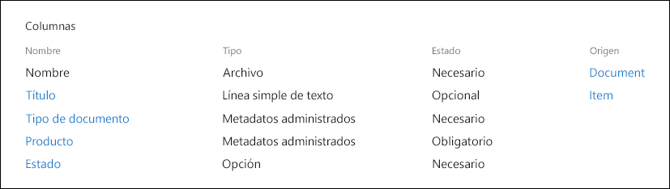

> [!NOTE]
> Las directivas de retención usan las propiedades **Tipo de documento** y **Estado** más tarde en el escenario para clasificar y aplicar automáticamente las etiquetas de retención.

Podemos tener varios tipos de contenido que representen diferentes tipos de documentos, pero vamos a centrarnos en la Documentación del producto.

En este escenario, usamos el servicio de Metadatos administrados y el Almacén de términos para crear un conjunto de términos para **Tipo de documento** y otro para **Nombre de producto**. Para cada conjunto de términos, creamos un término para cada valor. Tendría un aspecto similar a este en el Almacén de términos de su organización de SharePoint:

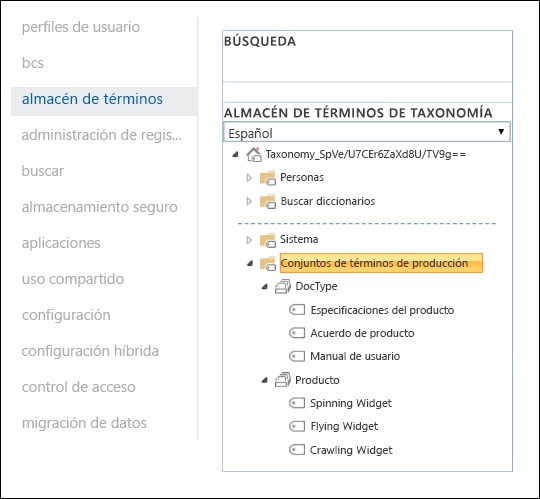

El tipo de contenido se puede crear y publicar con el [Concentrador de tipo de contenido](https://support.office.com/article/manage-content-type-publishing-06f39ac0-5576-4b68-abbc-82b68334889b). Un tipo de contenido también se puede crear y publicar con herramientas de aprovisionamiento de sitios, como el [Marco de aprovisionamiento PnP](https://docs.microsoft.com/sharepoint/dev/solution-guidance/pnp-provisioning-framework) o el [Esquema JSON de diseño de sitio](https://docs.microsoft.com/sharepoint/dev/declarative-customization/site-design-json-schema#define-a-new-content-type).

Cada producto tiene un sitio de SharePoint Online dedicado que contiene una biblioteca de documentos con los tipos de contenido adecuados habilitados. Todos los documentos se almacenan en esta biblioteca de documentos.

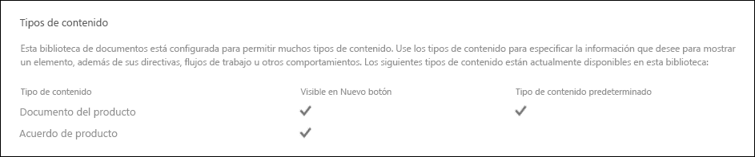

> [!NOTE]
> En lugar de tener un sitio de SharePoint Online por producto, en este escenario, la empresa manufacturera podría usar un equipo de Microsoft Teams por producto, que permitiría la colaboración con los miembros del equipo, como con el chat persistente y el uso de la pestaña **Archivos** del equipo para la administración de documentos. En este artículo nos centraremos solo en los documentos, por lo que solo usaremos un sitio.

La siguiente es una vista de la biblioteca de documentos para el producto Spinning Widget:

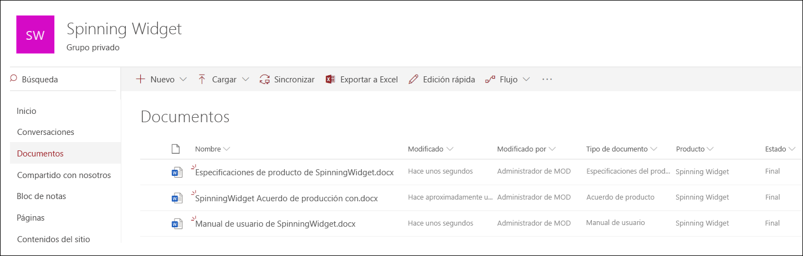

Ahora que tenemos la arquitectura de información básica para la administración de documentos, echemos un vistazo a la estrategia de retención y disposición de los documentos que usan los metadatos y la clasificación de documentos.

## <a name="retention-and-disposition"></a>Retención y disposición

Las directivas de cumplimiento y gobierno de datos de la empresa manufacturera definen el modo en que se conservan y eliminan los datos. Los documentos relacionados con el producto deben conservarse en todo momento durante la fabricación del producto y durante un período determinado tras la finalización de esta. Este período es diferente para especificaciones del producto, acuerdos y manuales del usuario. En la tabla siguiente se indican los requisitos de retención y disposición:

| **Tipo de documento**          | **Retención**                          | **Disposición**                              |
| -------------------------- | -------------------------------------- | -------------------------------------------- |
| Especificaciones del producto      | 5 años después del cese de producción.  | Eliminar                                       |
| Acuerdo de producto          | 10 años después del cese de producción. | Revisar                                       |
| Manual de usuario                | 5 años después del cese de producción.  | Eliminar                                       |
| Cualquier otro tipo de documento | No conservar de forma activa otros documentos  | Eliminar cuando el documento tenga una antigüedad de más de 3 años<sup>\*</sup>  |
|||

> [!NOTE]
> <sup>\*</sup> Se considera que un documento tiene una antigüedad de más de 3 años si no se ha modificado en los últimos 3 años.

Con el centro de seguridad y cumplimiento, creamos las siguientes etiquetas de retención:

  - Especificaciones del producto

  - Acuerdo de producto

  - Manual de usuario

En este artículo, solo se mostrará cómo crear y aplicar automáticamente la etiqueta de retención Especificaciones del producto. Para implementar el escenario completo, se crearían y aplicarían automáticamente las etiquetas de retención de los otros dos tipos de documentos.

### <a name="settings-for-the-product-specification-retention-label"></a>Configuración de la etiqueta de retención Especificaciones del producto

Este es el [plan de archivo](file-plan-manager.md) para la etiqueta de retención de Especificaciones del producto: 

- **Nombre:** Especificaciones del producto.

- **Descripción para administradores:** etiqueta de la especificación de producto, conservar durante 5 años después de la interrupción de la producción, la eliminación automática, la retención basada en eventos, el tipo de evento es la interrupción del producto.

- **Descripción para los usuarios:** Conservar durante 5 años tras el cese de la producción.

- **Acción de retención:** conservar y eliminar.

- **Duración de la retención:** Cinco años (1825 días).

- **Etiqueta de registro**: configure la etiqueta de retención para clasificar el contenido como un [registro](labels.md#using-retention-labels-for-records-management) (los usuarios no pueden modificar ni eliminar los documentos que se clasifican como registros).

- **Descriptores del plan de archivos:** (para simplificar el escenario, no se proporcionan descriptores de archivo).

La siguiente captura de pantalla muestra la configuración al crear la [etiqueta de retención](labels.md) Especificaciones del producto en el centro de seguridad y cumplimiento. Cuando cree la etiqueta de retención, puede crear el tipo de evento **Cese de producción**. Consulte los pasos que se muestran a continuación.

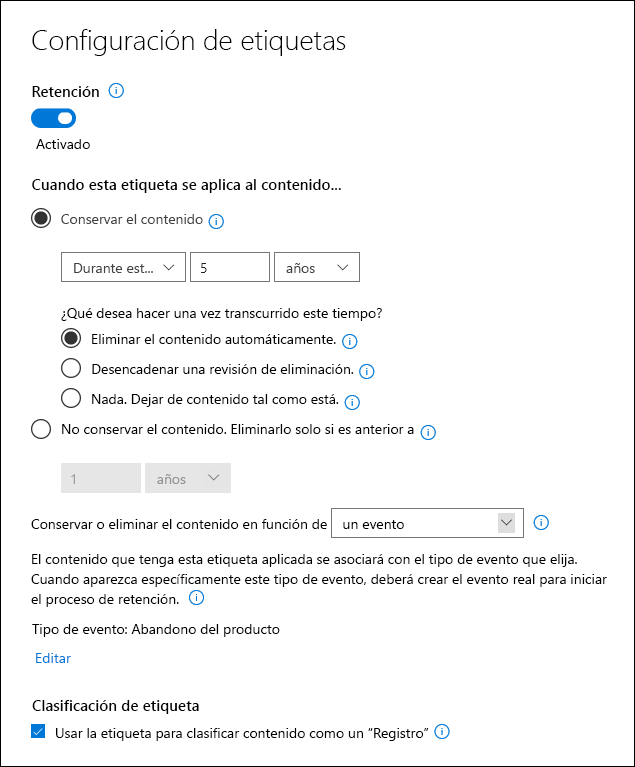

> [!NOTE]
> Por motivos prácticos y para evitar tener que esperar 5 años para ver como un documento se elimina automáticamente, configure la duración de la retención en 1 día si está recreando este escenario en el entorno de prueba.

### <a name="create-an-event-type-when-creating-a-retention-label"></a>Creación de un tipo de evento al crear una etiqueta de retención

1. En la lista desplegable **Conservar o eliminar el contenido en función de**, seleccione **un evento**.

2. Seleccione **Elegir tipo de evento**.

   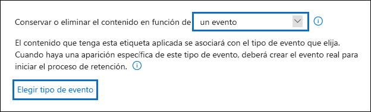

3. En la página **Elegir tipo de evento**, seleccione **Puede crear nuevos tipos de eventos aquí**.

4. Cree un tipo de evento denominado **Cese de producción**, añada una descripción y seleccione **Finalizar** para crearlo. 

5. Al volver a la página **Elegir un tipo de evento**, seleccione el tipo de evento **Cese de producción** que creó y seleccione **Agregar**.

Este es el aspecto que tiene la configuración de la etiqueta de retención de Especificaciones del producto. Seleccione **Crear esta etiqueta** para crearla.

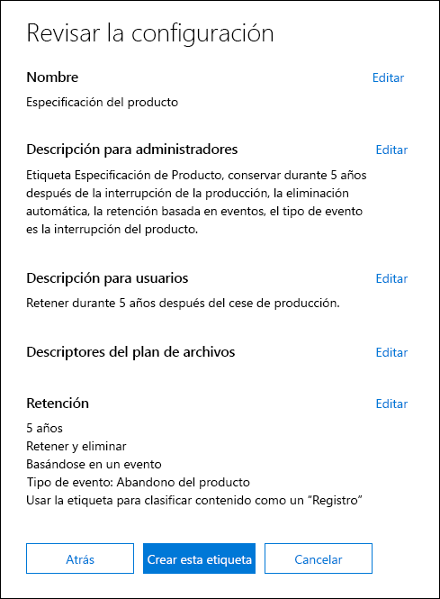

> [!TIP]
> Para obtener instrucciones más detalladas, consulte [Crear una etiqueta cuyo período de retención se base en un evento](event-driven-retention.md#step-1-create-a-label-whose-retention-period-is-based-on-an-event).

Ahora que ha creado la etiqueta de retención, echemos un vistazo a la aplicación automática de la etiqueta de retención en el contenido de especificaciones del producto.

## <a name="classifying-content-by-auto-applying-retention-labels"></a>Clasificación del contenido con la aplicación automática de etiquetas de retención

Vamos a [aplicar automáticamente](labels.md#applying-a-retention-label-automatically-based-on-conditions) las etiquetas de retención que hemos creado para este escenario mediante el lenguaje de consulta de palabras clave (KQL). KQL es el lenguaje que se usa para crear consultas de búsqueda. En KQL, puede realizar búsquedas mediante palabras clave o propiedades administradas. Para más información sobre KQL, consulte <https://docs.microsoft.com/sharepoint/dev/general-development/keyword-query-language-kql-syntax-reference>.

A nivel general, queremos indicar a Office 365 que "aplique la etiqueta de retención **Especificaciones del producto** a todos los documentos que contengan el **Estado** de **Final ** y un **Tipo de documento** de **Especificaciones del producto**". Recuerde que **Estado** y **Tipo de documento** son las columnas de sitio que hemos definido anteriormente para el tipo de contenido Documentación del producto en la sección [Arquitectura de información](#information-architecture). Para ello, debemos configurar el esquema de búsqueda.

Cuando SharePoint indexa contenido, genera automáticamente propiedades rastreadas para cada columna de sitio. Para este escenario, nos interesan las propiedades **Tipo de documento** y **Estado**. Necesitamos documentos en la biblioteca con el tipo de contenido correcto y las columnas de sitio rellenadas, para que la búsqueda pueda crear las propiedades rastreadas.

En el Centro de administración de SharePoint, podemos abrir la configuración de búsqueda y seleccionar **Administrar el esquema de búsqueda** para ver y configurar las propiedades rastreadas.

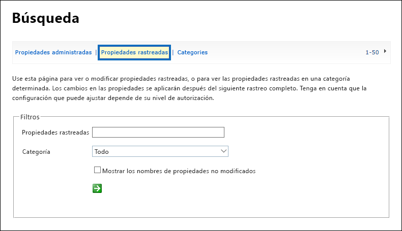

Si escribimos **estado** en el cuadro de **Propiedades rastreadas** y seleccionamos la flecha verde, deberíamos ver un resultado similar a este:

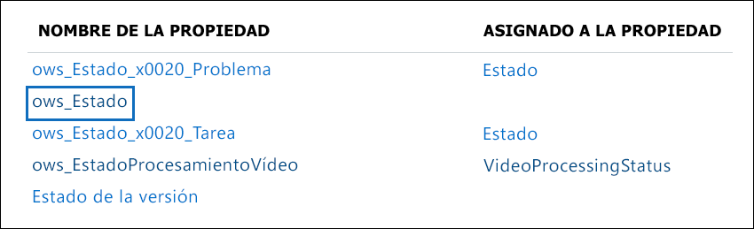

La propiedad **ows\_\_Status** (con doble guión bajo) es la que nos interesa. Esta se asigna a la propiedad **Estado** del tipo de contenido del Documento de producción.

Ahora, si escribimos **ows\_doc** y seleccionamos la flecha verde, deberíamos ver algo así:

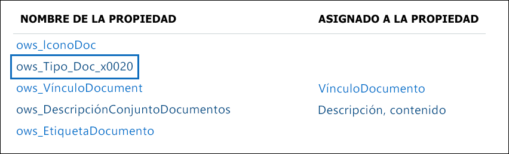

La propiedad **ows\_Doc\_x0020\_Type** es la segunda propiedad que nos interesa. Se asigna a la propiedad **Tipo de documento** del tipo de contenido Documento de producción.

> [!TIP]
> Para identificar el nombre de una propiedad rastreada para este escenario, abra la biblioteca de documentos que contiene los documentos de producción y vaya a la configuración de la biblioteca. En las **Columnas**, seleccione el nombre de la columna (por ejemplo, **Estado** o **Tipo de documento**) para abrir la página de columnas del sitio. El parámetro **Campo** en la dirección URL de la página contiene el nombre del campo. El nombre de este campo, con el prefijo "ows_", es el nombre de la propiedad rastreada. Por ejemplo, la dirección URL `https://tenantname.sharepoint.com/sites/SpinningWidget/_layouts/15/FldEdit.aspx?List=%7BC38C2F45-3BD6-4C3B-AA3B-EF5DF6B3D172%7D&Field=_Status` corresponde a la propiedad rastreada **ows\_\_Status**.

Si las propiedades rastreadas que está buscando no aparecen en la sección Administrar esquema de búsqueda en el centro de administración de SharePoint, puede deberse a uno de los siguientes motivos:

- Los documentos no se han indexado. Puede forzar que se repita la indexación de la biblioteca yendo a la configuración de la biblioteca de documentos > Configuración avanzada.

- Si la biblioteca de documentos está en un sitio moderno, asegúrese de que el administrador de SharePoint también es un administrador de la colección de sitios.

Para obtener más información sobre las propiedades rastreadas y administradas, vea [Crear automáticamente propiedades administradas en SharePoint Server](https://docs.microsoft.com/sharepoint/technical-reference/automatically-created-managed-properties-in-sharepoint).

### <a name="mapping-crawled-properties-to-pre-defined-managed-properties"></a>Asignación de propiedades rastreadas a propiedades administradas previamente definidas

KQL no puede usar propiedades rastreadas en las consultas de búsqueda. Necesita usar una propiedad administrada. En un escenario de búsqueda normal, creamos una propiedad administrada y la asignamos a la propiedad rastreada que necesitamos. Sin embargo, para aplicar las etiquetas de retención automáticamente, solo se pueden especificar en KQL las propiedades administradas predefinidas y no las propiedades administradas personalizadas. Se puede usar un conjunto de propiedades administradas predefinidas ya creadas en el sistema para las cadenas de RefinableString00 a RefinableString199. Para obtener una lista completa, vea [Propiedades administradas sin usar predeterminadas](https://docs.microsoft.com/sharepoint/manage-search-schema#default-unused-managed-properties). Estas propiedades administradas predeterminadas suelen usarse para definir refinadores de búsqueda.

Para que la consulta KQL funcione y aplique automáticamente la etiqueta de retención correcta en el contenido de documentos del producto, asignamos las propiedades rastreadas **ows\_Doc\_x0020\_Type** y **ows\_\_Status** a dos propiedades administradas que se pueden refinar. En nuestro entorno de prueba para este escenario, no se usan **RefinableString00** ni **RefinableString01**. La hemos determinado al analizar las **Propiedades administradas** en **Administrar esquema de búsqueda** en el centro de administración de SharePont.

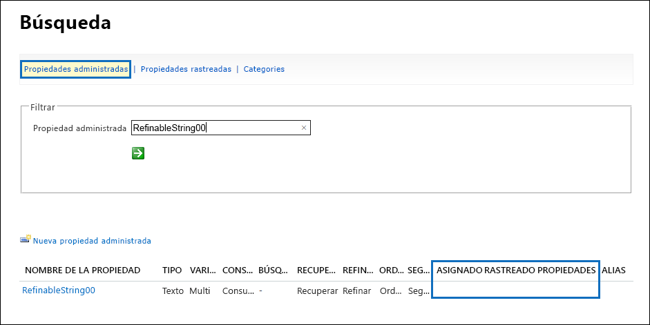

Observe que la columna **Propiedades rastreadas asignadas** en la captura de pantalla anterior está vacía.

Para asignar la propiedad rastreada **ows\_Doc\_x0020\_Type**, siga estos pasos:

1. En el cuadro de filtro **Propiedad administrada**, escriba **RefinableString00** y seleccione la flecha verde.

2. En la lista de resultados, seleccione el vínculo **RefinableString00** y desplácese hacia abajo hasta la sección **Asignaciones a propiedades rastreadas**.  

3. Seleccione **Agregar una asignación** y escriba **ows\_Doc\_x0020\_Type** en el cuadro **Buscar un nombre de propiedad rastreada** en la ventana **Selección de propiedades rastreadas**. Seleccione **Buscar**.  

4. En la lista de resultados, seleccione **ows\_Doc\_x0020\_Type** y seleccione **Aceptar**.

   En la sección **Propiedades rastreadas asignadas**, verá algo parecido a esta captura de pantalla:

   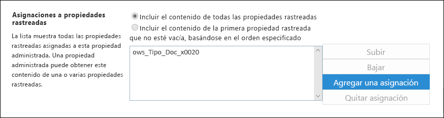

5. Desplácese hasta la parte inferior de la página y seleccione **Aceptar** para guardar la asignación.

Repita este mismo procedimiento para asignar RefinableString01 y ows\_\_Status.

Ahora debería haber dos propiedades administradas asignadas a las dos propiedades rastreadas:

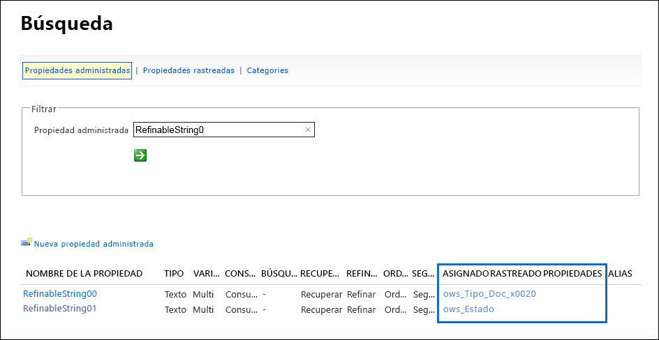

Vamos a comprobar que todo esto está configurado correctamente mediante la ejecución de una búsqueda empresarial. En un explorador, vaya a https://yourtenant.sharepoint.com/search. En el cuadro de búsqueda, escriba **RefinableString00:"Especificaciones del producto"** y presione Entrar. Al hacerlo, se deberían devolver todos los documentos que tengan Especificaciones del producto como **Tipo de documento**.

Ahora, en el cuadro de búsqueda, escriba **RefinableString00:"Especificaciones del producto" Y RefinableString01:Final** y presione Entrar. Esta acción debería devolver todos los documentos que tengan Especificaciones del producto como **Tipo de documento** y **Final** como estado.

### <a name="creating-the-auto-apply-label-policies"></a>Creación de directivas de aplicación automática de etiquetas

Ahora que hemos comprobado que la consulta de KQL funciona correctamente, crearemos la directiva de etiqueta que usa una consulta de KQL para aplicar automáticamente la etiqueta de retención Especificaciones del producto en los documentos correspondientes.

1. En el [centro de seguridad y cumplimiento](https://protection.office.com), vaya a **Clasificación** > **Etiquetas de retención** y seleccione **Aplicar automáticamente una etiqueta**. 

   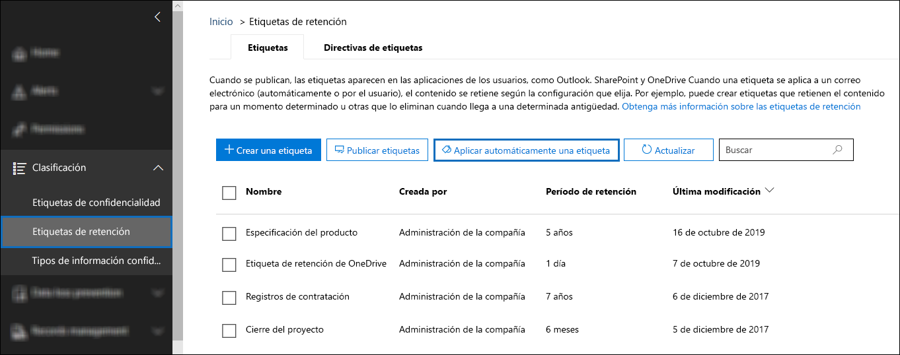

2. En la página del asistente **Elija una etiqueta para aplicar automáticamente**, seleccione **Elija una etiqueta para aplicar automáticamente**.

3. En la lista de etiquetas, seleccione **Especificaciones del producto**, seleccione **Agregar** y seleccione **Siguiente**.

4. Seleccione **Aplicar la etiqueta al contenido que tenga palabras o frases específicas** y, luego, **Siguiente**.

   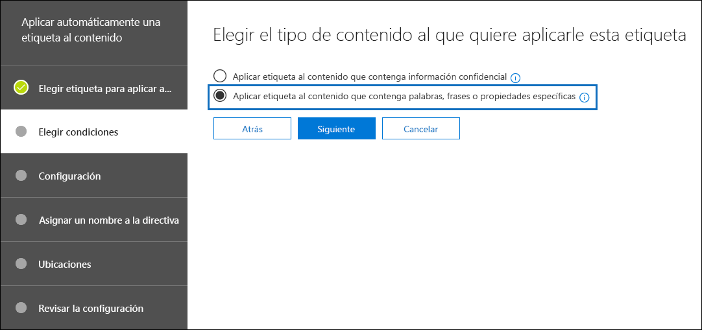

   En el siguiente paso, proporcionará la misma consulta de búsqueda de KQL que hemos probado en la sección anterior. Como recordará, esta consulta devuelve todos los documentos de Especificaciones del producto que tienen el estado Final. El resultado de usar esta misma consulta en la directiva de etiqueta significa que la etiqueta de retención de Especificaciones del producto se aplicará automáticamente a todos los documentos que coincidan con esta consulta de búsqueda.

5. En el cuadro **Editor de consultas de palabras clave**, escriba **RefinableString00:"Especificaciones del producto" AND RefinableString01:Final** y seleccione **Siguiente**.

   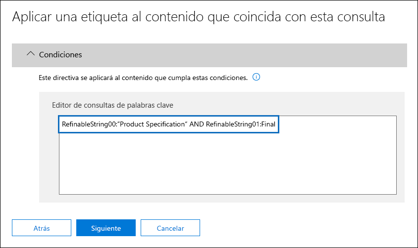

6. Escriba un nombre (por ejemplo, **Aplicar automáticamente etiqueta de Especificaciones del producto**) y una descripción opcional para la directiva de etiqueta. Después, seleccione **Siguiente**. 

7. En la página del asistente **Elegir ubicaciones**, seleccione las ubicaciones de contenido a las que desea aplicar la directiva. Para este escenario solo aplicamos la directiva a las ubicaciones de SharePoint, ya que todos los documentos de producción se almacenan solo en las bibliotecas de documentos de SharePoint. Seleccione **Permitir elegir ubicaciones específicas**, desactive el estado de Correo electrónico de Exchange, Cuentas de OneDrive y Grupos de Office 365 y asegúrese de que el estado de Sitios de SharePoint está activado. 

    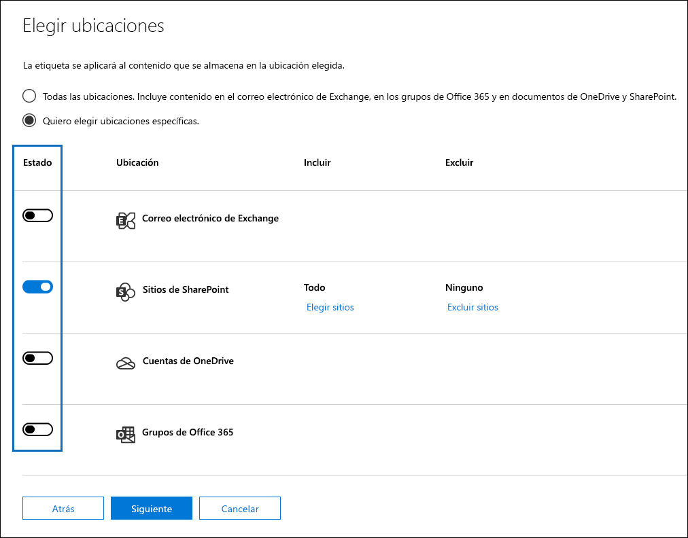

   > [!TIP]
   > En lugar de aplicar la directiva a todos los sitios de SharePoint, puede seleccionar **Elegir sitios** y agregar las direcciones URL de sitios específicos de SharePoint.

8. Seleccione **Siguiente** para mostrar la página **Revisar la configuración**. 

    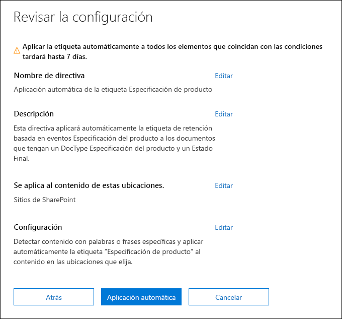

9. Seleccione **Aplicar automáticamente** para crear la directiva de etiqueta. Puede llevar hasta 7 días aplicar automáticamente la etiqueta de Especificaciones del producto a todos los documentos que coincidan con la consulta de búsqueda de KQL que ha proporcionado.

### <a name="verifying-the-retention-label-was-automatically-applied"></a>Comprobación de que la etiqueta de retención se aplicó automáticamente

Después de 7 días, utilice el [Explorador de actividad de etiquetas](view-label-activity-for-documents.md) en el centro de seguridad y cumplimiento para comprobar que la directiva de etiquetas que hemos creado ha aplicado automáticamente las etiquetas de retención a los documentos de producto en este escenario. En la siguiente captura de pantalla, las etiquetas de retención también se han aplicado a los contratos de producto y los manuales de usuario, aunque no se hayan tratado la creación de esas directivas de etiqueta y etiquetas de retención en este artículo.


Otro paso de la comprobación es revisar las propiedades del documento en la biblioteca de documentos. En el panel de información, puede ver que la etiqueta de retención se ha aplicado a un documento seleccionado.

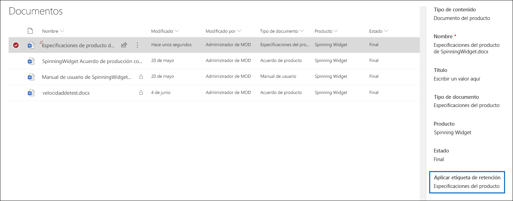

Puesto que las etiquetas de retención se han aplicado automáticamente a los documentos, los documentos no se pueden eliminar porque la etiqueta de retención se configuró para declarar los documentos como registros. Por ejemplo, recibimos el mensaje de error que se muestra en la siguiente captura de pantalla al intentar eliminar uno de estos documentos.

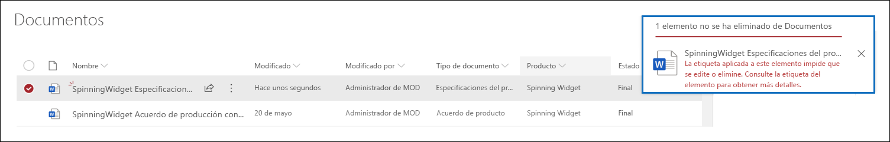

## <a name="generating-the-events-that-trigger-the-start-of-the-retention-period"></a>Generación de los eventos que desencadenan el inicio del periodo de retención

Ahora que las etiquetas de retención se aplicaron correctamente y de forma automática, pasemos al evento que indicará el final de producción para un producto en particular. Cuando se produce este evento, desencadena el inicio del periodo de retención definido en la etiqueta de retención aplicada automáticamente a los documentos. Por ejemplo, para los documentos de especificaciones del producto, el período de retención de cinco años comienza cuando se activa el evento "fin de producción".

Puede crear el evento manualmente en el Centro de seguridad y cumplimiento. Para ello, vaya a **Administración de registros** > **Eventos**, elija el tipo de evento, configure los Id. de activo adecuados y escriba la fecha del evento. Para obtener más información, consulte [Información general sobre la retención basada en eventos](event-driven-retention.md).

Para este escenario, se creará automáticamente el evento al generarlo desde un sistema de producción externo. En este caso, el sistema que genera el evento es una lista simple de SharePoint que indica si un producto está en producción y un [Microsoft Flow](https://docs.microsoft.com/flow/getting-started) que está asociado con la lista y que activará el evento. En un escenario real, cualquier sistema podría generar el evento, como un sistema de RRHH o CRM. Flow contiene muchas interacciones listas para usarse y un bloque de creación para cargas de trabajo de Office 365 (como Exchange, SharePoint, Teams y Dynamics 365), así como para aplicaciones de terceros como Twitter, Box, Salesforce y Workdays. Esto hace que sea más fácil integrar Flow en estos sistemas. Para obtener más información, consulte [Retención automática controlada por eventos](automate-event-driven-retention.md).

La siguiente captura de pantalla muestra la lista de SharePoint que se usará para desencadenar el evento: 

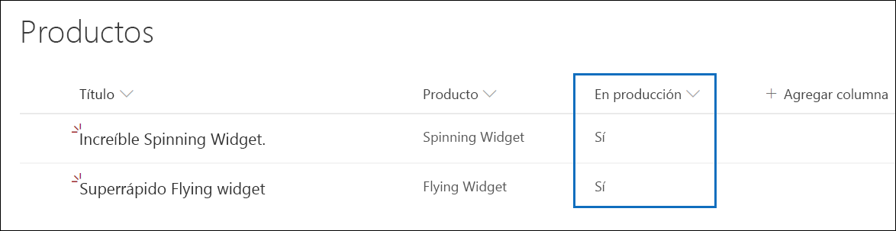

Hay dos productos actualmente en producción, indicados por el valor de **Sí** en la columna **En producción**. Cuando el valor de esta columna se establezca en **No** para un producto, el flujo asociado con la lista generará automáticamente el evento. Este proceso provoca, a su vez, el inicio del periodo de retención de la etiqueta de retención que se aplicó automáticamente a los documentos de producto correspondientes.

En este escenario, usamos el flujo siguiente para desencadenar el evento:

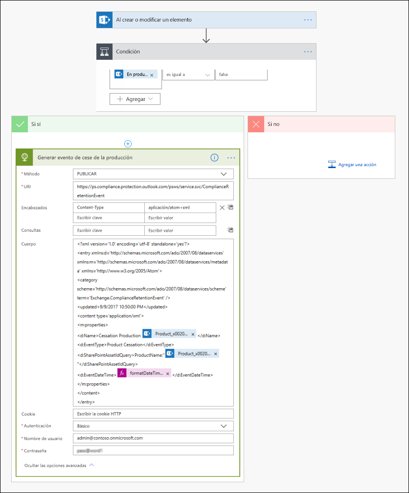

Para crear este flujo, parta de un conector de SharePoint y seleccione el desencadenador **Cuando se crea o modifica un elemento**. Especifique la dirección del sitio y el nombre de la lista y agregue una condición basada en que el valor de la columna de lista **En producción** se establezca en **No** (o que sea igual a falso en la tarjeta condicional). Después, agregue una acción basada en la plantilla HTTP integrada. Use los valores de la sección siguiente para configurar la acción HTTP. Puede copiar los valores de las propiedades URI y Body de la sección siguiente y pegarlos en la plantilla.

- **Method**: POST
- **URI**: https://ps.compliance.protection.outlook.com/psws/service.svc/ComplianceRetentionEvent
- **Headers**: Key = Content-Type, Value = application/atom+xml
- **Body**:

```HTML
<?xml version='1.0' encoding='utf-8' standalone='yes'>
<entry xmlns:d='https://schemas.microsoft.com/ado/2007/08/dataservices' xmlns:m='https://schemas.microsoft.com/ado/2007/08/dataservices/metadata' xmlns='https://www.w3.org/2005/Atom'>
<category scheme='https://schemas.microsoft.com/ado/2007/08/dataservices/scheme' term='Exchange.ComplianceRetentionEvent'>
<updated>9/9/2017 10:50:00 PM</updated>
<content type='application/xml'>
<m:properties>
<d:Name>Cessation Production @{triggerBody()?['Product_x0020_Name']?['Value']}</d:Name>
<d:EventType>Product Cessation&lt;</d:EventType>
<d:SharePointAssetIdQuery>ProductName:&quot;@{triggerBody()?['Product_x0020_Name']?['Value']}<d:SharePointAssetIdQuery>
<d:EventDateTime>@{formatDateTime(utcNow(),'yyyy-MM-dd')}</d:EventDateTime>
</m:properties>
</content&gt>
</entry>
```

En la sección siguiente se describen los parámetros de la propiedad *Body* de la acción que se deben configurar específicamente para este escenario.

- **Name**: este parámetro especifica el nombre del evento que se creará en el centro de seguridad y cumplimiento. Para este escenario, el nombre es "Cese de producción xxx", donde xxx es el valor de la propiedad administrada NombreProducto que hemos creado anteriormente.
- **EventType**: el valor de este parámetro corresponde al tipo de evento al que se aplicará el evento creado. Este tipo de evento se definió al crear la etiqueta de retención. Para este escenario, el tipo de evento es "Cese de producción".
- **SharePointAssetIdQuery**: este parámetro define el Id. de activo del evento. La retención basada en eventos necesita un identificador único para el documento. Podemos usar Id. de activos para identificar los documentos a los que se aplica un evento determinado, o bien, como se hace para este escenario, una columna de metadatos, nuestro Nombre del producto. Para ello, debemos crear una nueva propiedad administrada llamada NombreProducto que pueda usarse en la consulta KQL (también podíamos haber usado RefinableString00 en lugar de crear una nueva propiedad administrada). También necesitamos asignar esta nueva propiedad administrada a la propiedad rastreada ows_Product_x0020_Name. Esta es una captura de pantalla de esta propiedad administrada.

    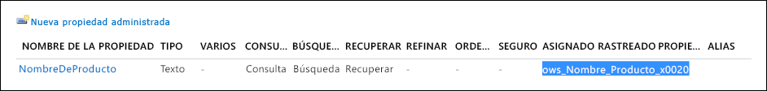

- **EventDateTime**: este parámetro define la fecha en la que se produce el evento. Use el formato de fecha actual: *formatDateTime(utcNow(),'aaaa-MM-dd'*)

### <a name="putting-it-all-together"></a>En conclusión

Ahora que la etiqueta de retención se ha creado y aplicado automáticamente, y que el flujo se creado y configurado, esto es lo que ocurre cuando el valor de la columna **En producción** para el producto Spinning Widget en la lista productos se cambia de **Sí** a **No**. El flujo se activa y crea el evento. Para ver este evento en el Centro de seguridad y cumplimiento, vaya a **Administración de registros** > **Eventos**.

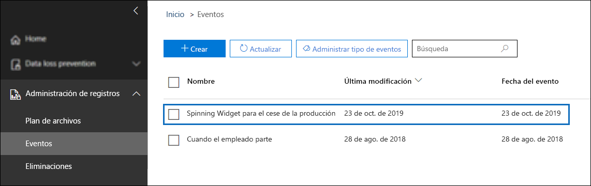

Seleccione el evento para ver los detalles en la página de control flotante. Observe que, aunque se ha creado el evento, los detalles del estado del evento muestran que no se han procesado documentos o sitios de SharePoint.

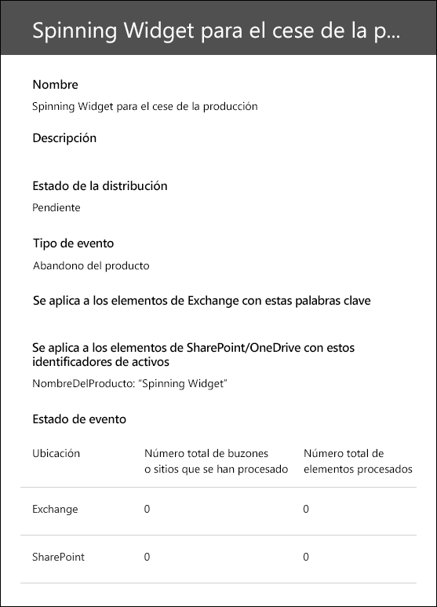

Pero, después de un tiempo, la sección de estado del evento muestra que se han procesado un sitio de SharePoint y un documento de SharePoint.  

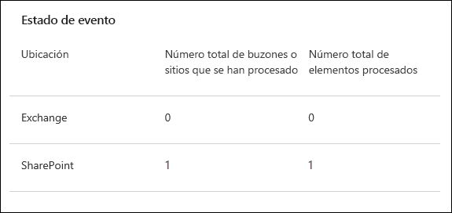
 
Esto significa que se ha iniciado el período de retención de la etiqueta aplicada al documento de producto de Spinning Widget, en base a la fecha del evento Cese de producción de Spinning Widget. Suponiendo que ha implementado el escenario en el entorno de prueba configurando un período de retención de un día, puede ir a la biblioteca de documentos de los documentos de su producto unos días después de crear el evento y comprobar que el documento se haya eliminado (después de que se haya ejecutado la eliminación de la tarea en SharePoint).

### <a name="more-about-asset-ids"></a>Más información sobre los Id. de activo

Como se explica en la [Información general sobre la retención controlada por eventos](event-driven-retention.md), es importante entender la relación entre los tipos de eventos, las etiquetas, los eventos y los Id. de activos. El Id. de activo es simplemente otra propiedad de documento en SharePoint y OneDrive. Le ayuda a identificar con mayor detalle los documentos cuyo período de retención se desencadenará con el evento. De forma predeterminada, SharePoint tiene una propiedad Id. de activo que puede usar para la retención basada en eventos:

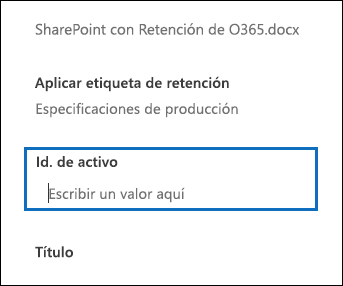

Como se muestra en la siguiente captura de pantalla, la propiedad administrada Id. de activo se denomina **ComplianceAssetId**.

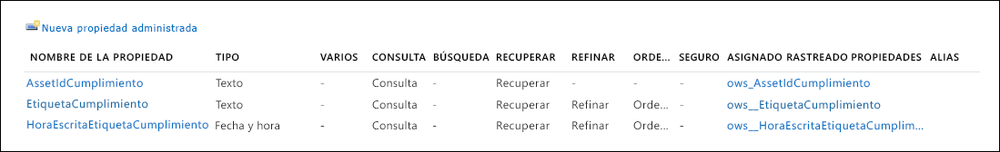

En lugar de usar la propiedad Id. de activo predeterminada, también puede usar otras propiedades, como hacemos en este escenario. No obstante, es importante comprender que, si no especifica palabras clave o un Id. de activo para un evento, el evento desencadenará el período de retención de todo el contenido que tenga aplicada una etiqueta de ese tipo de evento.

### <a name="using-advanced-search-in-sharepoint"></a>Uso de la búsqueda avanzada en SharePoint

En la captura de pantalla anterior, también podemos ver que existe otra propiedad administrada relacionada con las etiquetas de retención denominada **ComplianceTag**, que se asigna a una propiedad rastreada. La propiedad administrada **ComplianceAssetId** también se asigna a una propiedad rastreada. Esto significa que puede usar estas propiedades administradas en la búsqueda avanzada para recuperar todos los documentos que se han etiquetado con una etiqueta de retención.

## <a name="summary"></a>Resumen

Este artículo muestra un escenario de administración de documentos donde aplicamos automáticamente una etiqueta de retención basada en una columna de sitio en SharePoint. Después, se utiliza la retención basada en eventos y Microsoft Flow para activar automáticamente el inicio del periodo de retención en función de un evento externo.
