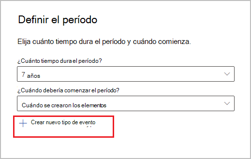
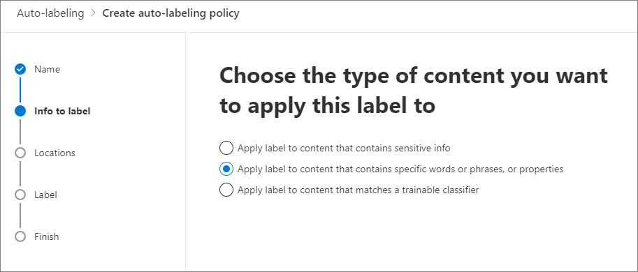

# <a name="use-retention-labels-to-manage-the-lifecycle-of-documents-stored-in-sharepoint"></a>Usar las etiquetas de retención para administrar el ciclo de vida de los documentos almacenados en SharePoint

>*[Instrucciones de licencias de Microsoft 365 para la seguridad y el cumplimiento](/office365/servicedescriptions/microsoft-365-service-descriptions/microsoft-365-tenantlevel-services-licensing-guidance/microsoft-365-security-compliance-licensing-guidance).*

En este artículo se describe cómo puede administrar el ciclo de vida de los documentos que se almacenan en SharePoint mediante el uso de etiquetas de retención aplicadas automáticamente y la retención basada en eventos.

La función de aplicación automática usa metadatos de SharePoint para la clasificación de documentos. El ejemplo en este artículo sirve para documentos relacionados con el producto, pero pueden usarse los mismos conceptos en otros escenarios. Por ejemplo, en la industria del petróleo y gas, podría usarla para administrar el ciclo de vida de los documentos sobre activos físicos, como plataformas petrolíferas, registros de pozos o licencias de producción. En la industria de servicios financieros, podría administrar documentos de cuentas bancarias, hipotecas y contratos de seguros. En el sector público, podría administrar los permisos de construcción o los formularios fiscales.

En este artículo, revisaremos la arquitectura de la información y la definición de las etiquetas de retención. Luego, clasificaremos documentos aplicando las etiquetas automáticamente. Por último, generaremos los eventos que inician el período de retención.

## <a name="information-architecture"></a>Arquitectura de la información

Nuestro escenario es una empresa de fabricación que usa SharePoint para almacenar todos los documentos sobre los productos que desarrolla la empresa. Estos documentos incluyen especificaciones del producto, acuerdos con proveedores y manuales del usuario. Cuando se almacenan estos documentos en SharePoint a través de las directivas de Administración de contenido empresarial, se definen los metadatos del documento y se usan para clasificarlos. Cada documento tiene las siguientes propiedades de metadatos:

- **Tipo de documento** (como, por ejemplo, especificaciones del producto, acuerdo o manual de usuario).

- **Nombre del producto**.

- **Estado** (borrador o final).

Estos metadatos forman un tipo de contenido base denominado *Documento de producción* para todos los documentos.


> [!NOTE]
> Las directivas de retención usan las propiedades **Tipo de documento** y **Estado** más tarde en este escenario para clasificar y aplicar automáticamente las etiquetas de retención.

Es posible que tengamos varios tipos de contenido que representen diferentes tipos de documentos, pero vamos a centrarnos en la documentación del producto.

En este escenario, usamos el servicio de metadatos administrados y el almacén de términos para crear un conjunto de términos para *Tipo de documento* y otro para *Nombre de producto*. Para cada conjunto de términos, creamos un término para cada valor. Tendría un aspecto similar a este en el almacén de términos de su organización de SharePoint:


*Tipo de contenido* se puede crear y publicar con el [Concentrador de tipo de contenido](https://support.office.com/article/manage-content-type-publishing-06f39ac0-5576-4b68-abbc-82b68334889b). También puede crear y publicar un tipo de contenido con herramientas de aprovisionamiento de sitios, como el [Marco de aprovisionamiento PnP](/sharepoint/dev/solution-guidance/pnp-provisioning-framework) o el [Esquema JSON de diseño de sitio](/sharepoint/dev/declarative-customization/site-design-json-schema#define-a-new-content-type).

Cada producto tiene un sitio de SharePoint dedicado que contiene una biblioteca de documentos con los tipos de contenido adecuados habilitados. Todos los documentos se almacenan en esta biblioteca de documentos.

[  ](../media/SPRetention3.png#lightbox)

> [!NOTE]
> En lugar de tener un sitio de SharePoint por producto, en este escenario, la empresa de fabricación podría usar un equipo de Microsoft Teams por producto para permitir la colaboración entre los miembros del equipo, como a través del chat persistente y el uso de la pestaña **Archivos** en Teams para la administración de documentos. En este artículo nos centraremos solo en los documentos, por lo tanto solo usaremos un sitio.

La siguiente es una vista de la biblioteca de documentos para el producto Spinning Widget:

[  ](../media/SPRetention4.png#lightbox)

Ahora que tenemos la arquitectura de información básica para la administración de documentos, echemos un vistazo a la estrategia de retención y eliminación de los documentos que usan los metadatos y cómo clasificamos esos documentos.

## <a name="retention-and-disposition"></a>Retención y disposición

Las directivas de cumplimiento y gobierno de datos de la empresa de fabricación definen cómo se conservan y eliminan los datos. Los documentos relacionados con el producto deben conservarse durante la fabricación del producto y durante un período adicional determinado. Este período adicional es diferente para especificaciones del producto, acuerdos y manuales de usuario. En la tabla siguiente se indican los requisitos de retención y disposición:

|   Tipo de documento            |   Retención                            |   Eliminación                                |
| -------------------------- | -------------------------------------- | -------------------------------------------- |
| Especificaciones del producto      | 5 años luego de detener la producción  | Eliminar                                       |
| Acuerdos del producto          | 10 años luego de detener la producción | Revisar                                       |
| Manuales de usuario                | 5 años luego de detener la producción  | Eliminar                                       |
| Cualquier otro tipo de documento | No conservar activamente  | Eliminar cuando el documento tenga una antigüedad de más de 3 años <br /><br /> Se considera que un documento tiene una antigüedad de más de 3 años si no se ha modificado en los últimos 3 años. |
|||

Se usa el Centro de cumplimiento de Microsoft 365 para crear las siguientes [etiquetas de retención](retention.md#retention-labels):

  - Especificaciones del producto

  - Acuerdo de producto

  - Manual de usuario

En este artículo, solo se mostrará cómo crear y aplicar automáticamente la etiqueta de retención Especificaciones del producto. Para implementar el escenario completo, también crearía y aplicaría automáticamente las etiquetas de retención a los otros dos tipos de documentos.

### <a name="settings-for-the-product-specification-retention-label"></a>Configuración de la etiqueta de retención Especificaciones del producto

Este es el [plan de archivo](file-plan-manager.md) para la etiqueta de retención de Especificaciones del producto:

- **Nombre:** Especificaciones del producto.

- **Descripción para los usuarios:** Conservar durante cinco años después de que se detenga la producción.

- **Descripción para administradores:** conservar cinco años después de que se detenga la producción, la eliminación automática, la retención basada en eventos, el tipo de evento es *Cese de producción*.

- **Acción de retención:** conservar y eliminar.

- **Duración de la retención:** 5 años (1 825 días).

- **Etiqueta de registro**: configure la etiqueta de retención para marcar los elementos como un [registro](records-management.md#records), lo que significa que los usuarios no podrán modificarlos ni eliminarlos.

- **Descriptores del plan de archivos:** para simplificar el escenario, no se proporcionan descriptores de archivo opcionales.

La siguiente captura de pantalla muestra la configuración al crear la etiqueta de retención Especificaciones del producto en el Centro de cumplimiento de Microsoft 365. Cuando cree la etiqueta de retención, puede crear el tipo de evento *Cese de producción*. Vea el procedimiento en la sección siguiente.


> [!NOTE]
> Para no tener que esperar 5 años para eliminar documentos, configure la duración de la retención en ***1 día*** si está creando este escenario en un entorno de prueba.

### <a name="create-an-event-type-when-you-create-a-retention-label"></a>Creación de un tipo de evento al crear una etiqueta de retención

1. Entre en la página **Definir la configuración de retención** del asistente para crear etiquetas de retención, después en **Iniciar el período de retención adecuado** y seleccione **Crear nuevo tipo de evento**:
    
    

3. En la página **Asignar un nombre al tipo de evento**, escriba **Cese de producción** y una descripción opcional. Luego, seleccione **Siguiente**, **Enviar** y **Hecho**.

4. Regrese a la página **Definir la configuración de retención**, para **Iniciar el período de retención adecuado**, utilice el cuadro desplegable para seleccionar el tipo de evento **Cese de producción** que creó.
    
    Este es el aspecto que tiene la configuración de la etiqueta de retención Especificaciones del producto: 
    
   

6. Seleccione **Crear etiqueta** y, en la siguiente página donde puede ver las opciones para publicarla, Después de crear la etiqueta y ver las opciones para publicar la etiqueta, aplicarla automáticamente o guardarla: seleccione **Solo guardar la etiqueta por ahora** y, a continuación, **Hecho**. 
    
    > [!TIP]
    > Para obtener instrucciones más detalladas, consulte [Crear una etiqueta cuyo período de retención se base en un evento](event-driven-retention.md#step-1-create-a-label-whose-retention-period-is-based-on-an-event).

Ahora, echemos un vistazo cómo aplicar automáticamente la etiqueta de retención al contenido de las especificaciones del producto.

## <a name="auto-apply-retention-labels-to-documents"></a>Aplicar automáticamente etiquetas de retención a documentos

Usaremos el lenguaje de consultas de palabras clave (KQL) para [aplicar automáticamente](apply-retention-labels-automatically.md) las etiquetas de retención que creamos. KQL es el lenguaje que se usa para crear consultas de búsqueda. En KQL, puede realizar búsquedas mediante palabras clave o propiedades administradas. Para obtener más información, vea [Referencia de sintaxis del lenguaje de consultas de palabras clave (KQL)](/sharepoint/dev/general-development/keyword-query-language-kql-syntax-reference).

Básicamente, queremos indicar a Microsoft 365 que "aplique la etiqueta de retención **Especificaciones del producto** a todos los documentos que contengan el **Estado** **Final** y un **Tipo de documento** de **Especificaciones del producto**". Recuerde que **Estado** y **Tipo de documento** son las columnas de sitio que definimos para el tipo de contenido de Documentación del producto en la sección [Arquitectura de información](#information-architecture). Para ello, debemos configurar el esquema de búsqueda.

Cuando SharePoint indexa contenido, genera automáticamente propiedades rastreadas para cada columna de sitio. Para este escenario, nos interesan las propiedades **Tipo de documento** y **Estado**. Necesitamos documentos en la biblioteca con el tipo de contenido correcto y las columnas de sitio rellenadas, para que la búsqueda pueda crear las propiedades rastreadas.

En el Centro de administración de SharePoint, abra la configuración de búsqueda y seleccionar **Administrar el esquema de búsqueda** para ver y configurar las propiedades rastreadas.


Si escribimos **status** _ en el cuadro _ *Propiedades rastreadas** y seleccionamos la flecha verde, deberíamos ver un resultado similar al siguiente:


La propiedad **ows\_\_Status** (con doble guión bajo) es la que nos interesa. Esta se asigna a la propiedad **Estado** del tipo de contenido de Documento de producción.

Ahora, si escribimos ***ows\_doc*** y seleccionamos la flecha verde, deberíamos ver algo así:


La propiedad **ows\_Doc\_x0020\_Type** es la segunda propiedad que nos interesa. Se asigna a la propiedad **Tipo de documento** del tipo de contenido de Documento de producción.

> [!TIP]
> Para identificar el nombre de una propiedad rastreada para este escenario, vaya a biblioteca de documentos que contiene los documentos de producción. A continuación, vaya a la configuración de la biblioteca. Para las **Columnas**, seleccione el nombre de la columna (por ejemplo, **Estado** o **Tipo de documento**) para abrir la página de columnas del sitio. El parámetro *Campo* en la dirección URL de la página contiene el nombre del campo. El nombre de este campo, con el prefijo "ows_", es el nombre de la propiedad rastreada. Por ejemplo, la dirección URL `https://tenantname.sharepoint.com/sites/SpinningWidget/_layouts/15/FldEdit.aspx?List=%7BC38C2F45-3BD6-4C3B-AA3B-EF5DF6B3D172%7D&Field=_Status` corresponde a la propiedad rastreada *ows\_\_Status*.

Si las propiedades rastreadas que está buscando no aparecen en la sección Administrar esquema de búsqueda en el Centro de administración de SharePoint:

- Tal vez los documentos no se han indexado. Puede forzar que se repita la indexación de la biblioteca en **Configuración de la biblioteca de documentos** > **Configuración avanzada**.

- Si la biblioteca de documentos está en un sitio moderno, asegúrese de que el administrador de SharePoint también es un administrador de la colección de sitios.

Para obtener más información sobre las propiedades rastreadas y administradas, vea [Crear automáticamente propiedades administradas en SharePoint Server](/sharepoint/technical-reference/automatically-created-managed-properties-in-sharepoint).

### <a name="map-crawled-properties-to-pre-defined-managed-properties"></a>Asignación de propiedades rastreadas a propiedades administradas previamente definidas

KQL no puede usar propiedades rastreadas en las consultas de búsqueda. Necesita usar una propiedad administrada. En un escenario de búsqueda típico, creamos una propiedad administrada y la asignamos a la propiedad rastreada que necesitamos. Sin embargo, para aplicar las etiquetas de retención automáticamente, solo se pueden especificar las propiedades administradas predefinidas en KQL y no las propiedades administradas personalizadas. Se puede usar un conjunto de propiedades administradas predefinidas en el sistema para las cadenas de *RefinableString00* a *RefinableString199*. Para obtener una lista completa, vea [Propiedades administradas sin usar predeterminadas](/sharepoint/manage-search-schema#default-unused-managed-properties). Estas propiedades administradas predeterminadas suelen usarse para definir refinadores de búsqueda.

Para que la consulta KQL aplique automáticamente la etiqueta de retención correcta en el contenido de documentos del producto, asignamos las propiedades rastreadas **ows\_Doc\_x0020\_Type* y *ows\_\_Status** a dos propiedades administradas que se pueden refinar. En nuestro entorno de prueba para este escenario, no se usan **RefinableString00** ni **RefinableString01**. Determinamos esto al analizar las **Propiedades administradas** en **Administrar esquema de búsqueda** en el Centro de administración de SharePoint.

[  ](../media/SPRetention12.png#lightbox)

Observe que la columna **Propiedades rastreadas asignadas** en la captura de pantalla anterior está vacía.

Para asignar la propiedad rastreada **ows\_Doc\_x0020\_Type**, siga estos pasos:

1. En el cuadro de filtro **Propiedad administrada**, escriba **_RefinableString00_**  y seleccione la flecha verde.

2. En la lista de resultados, seleccione el vínculo **RefinableString00** y desplácese hacia abajo hasta la sección **Asignaciones a propiedades rastreadas**.  

3. Seleccione **Agregar una asignación** y escriba **_ows\_Doc\_x0020\_Type_*_ en el cuadro _* Buscar un nombre de propiedad rastreada** en la ventana **Selección de propiedades rastreadas**. Seleccione **Buscar**.  

4. En la lista de resultados, seleccione **ows\_Doc\_x0020\_Type** y seleccione **Aceptar**.

   En la sección **Propiedades rastreadas asignadas**, verá algo parecido a esta captura de pantalla:

   [  ](../media/SPRetention13.png#lightbox)


5. Desplácese hasta la parte inferior de la página y seleccione **Aceptar** para guardar la asignación.

Repita estos pasos para asignar **RefinableString01** y **ows\_\_Status**.

Ahora debería haber dos propiedades administradas asignadas a las dos propiedades rastreadas:

[  ](../media/SPRetention14.png#lightbox)

Comprobemos que nuestra configuración es correcta mediante la ejecución de una búsqueda empresarial. En un explorador, vaya a *https://\<your_tenant>.sharepoint.com/search*. En el cuadro de búsqueda, escriba ***RefinableString00:"Especificaciones del producto"** _ y presione Entrar. Esta búsqueda debería devolver todos los documentos que tengan *Especificación del producto** como **_Tipo de documento_**.

Ahora, en el cuadro de búsqueda, escriba **RefinableString00:"Especificaciones del producto" AND RefinableString01:Final** y presione Entrar. Esta acción debería devolver todos los documentos que tengan **Especificaciones del producto** como **_Tipo de documento_*_ y un _* Estado** **_Final_**.

### <a name="create-auto-apply-label-policies"></a>Crear directivas de etiqueta de aplicación automática

Ahora que hemos comprobado que la consulta de KQL funciona, crearemos una directiva de etiqueta aplicable automáticamente que usa una consulta de KQL para aplicar de manera automática la etiqueta de retención Especificaciones del producto en los documentos correspondientes.

1. En el [Centro de cumplimiento](https://compliance.microsoft.com/homepage), vaya a **Administración de registros** > **Directivas de etiqueta** > **Aplicar automáticamente una etiqueta**.

   [  ](../media/SPRetention16.png#lightbox)

2. En el asistente para Crear directiva de etiquetado automático, en la página **Asignar un nombre a la directiva de etiquetado automático**, introduzca un nombre como **Aplicación automática de la etiqueta Especificación de producto** y una descripción opcional. Después, seleccione **Siguiente**.

3. En la página **Elegir el tipo de contenido al que quiere aplicar la etiqueta**, seleccione **Aplicar la etiqueta al contenido que tenga palabras, frases o propiedades específicas** y, a continuación, seleccione **Siguiente**.
    
   [  ](../media/SPRetention17.png#lightbox)
    
   Esta opción nos permite proporcionar la misma consulta de búsqueda de KQL que probamos en la sección anterior. La consulta devuelve todos los documentos de Especificaciones del producto que tienen el estado *Final*. Cuando usamos esta misma consulta en la directiva de etiqueta aplicada automáticamente, la etiqueta de retención de Especificaciones del producto se aplicará de manera automática a todos los documentos que coincidan con esta consulta.

4. En la página **Aplicar la etiqueta al contenido que coincida con esta consulta**, escriba **RefinableString00:"Especificaciones del producto" AND RefinableString01:Final** y seleccione **Siguiente**.

   

5. En la página **Elegir ubicaciones para aplicar la directiva**, seleccione las ubicaciones de contenido a las que desea aplicar la directiva. Para este escenario, solo aplicamos la directiva a las ubicaciones de SharePoint, ya que todos los documentos de producción se almacenan en las bibliotecas de documentos de SharePoint. Cambie el estado para el **Correo electrónico de Exchange**, las **cuentas de OneDrive** y los **Grupos de Microsoft 365** a **Desactivado**. Asegúrese de que el estado de los sitios de SharePoint esté **Activado** antes de seleccionar **Siguiente**: 
    
    
    
   > [!TIP]
   > En lugar de aplicar la directiva a todos los sitios de SharePoint, puede seleccionar **Elegir sitio** y agregar las direcciones URL de sitios específicos de SharePoint.

6. En la página **Elegir una etiqueta para aplicar automáticamente**, seleccione **Añadir etiqueta**.

7. En la lista de etiquetas de retención, seleccione **Especificación de producto**. Después, seleccione **Agregar** y **Siguiente**.

8. Revisar la configuración:

    

9. Seleccione **Enviar** para crear la directiva de etiqueta aplicable automáticamente.
    
   >[!NOTE]
   >Puede llevar hasta 7 días aplicar automáticamente la etiqueta de Especificaciones del producto a todos los documentos que coincidan con la consulta de búsqueda de KQL.

### <a name="verify-that-the-retention-label-was-automatically-applied"></a>Compruebe que la etiqueta de retención se aplicó automáticamente

Después de 7 días, utilice el [Explorador de actividad](data-classification-activity-explorer.md) del centro de cumplimiento para comprobar que la directiva de etiqueta aplicable automáticamente que creamos aplicó de manera automática las etiquetas de retención a los documentos de producto.

También examine las propiedades de los documentos en la biblioteca de documentos. En el panel de información, puede ver que la etiqueta de retención se ha aplicado a un documento seleccionado.

[  ](../media/SPRetention21.png#lightbox)

Puesto que las etiquetas de retención se aplicaron automáticamente a los documentos, esos documentos no se pueden eliminar porque la etiqueta de retención se configuró para declarar los documentos como *registros*. Como ejemplo de esta protección, al intentar eliminar uno de estos documentos, obtenemos el mensaje de error siguiente:

[  ](../media/SPRetention22.png#lightbox)

## <a name="generate-the-event-that-triggers-the-retention-period"></a>Generar el evento que desencadena el período de retención

Ahora que se aplicaron las etiquetas de retención, pasemos al evento que indicará el final de producción para un producto en particular. Este evento desencadena el inicio del período de retención definido en las etiquetas de retención. Por ejemplo, para los documentos de especificaciones de producto, el período de retención de 5 años comienza cuando se activa el evento "fin de producción".

Puede crear manualmente el evento en el Centro de cumplimiento de Microsoft 365 en **Administración de registros** > **Eventos**. Elija el tipo de evento, configure los Id. de activo correctos y escriba la fecha del evento. Para obtener más información, consulte [Iniciar la retención cuando se produzca un evento](event-driven-retention.md).

Pero para este escenario, generaremos automáticamente el evento desde un sistema de producción externo. El sistema es una lista de SharePoint simple que indica si un producto está en producción. Un flujo de [Power Automate](/flow/getting-started) que está asociado a la lista desencadenará el evento. En un escenario real, puede usar varios sistemas para generar el evento, como un sistema de RRHH o CRM. Power Automate contiene muchas interacciones listas para usarse y un bloque de creación para cargas de trabajo de Microsoft 365 como Microsoft Exchange, SharePoint, Teams y Dynamics 365, así como para aplicaciones de terceros como Twitter, Box, Salesforce y Workdays. Esta característica hace que sea fácil integrar Power Automate con varios sistemas. Para obtener más información, consulte [Retención automática controlada por eventos](./event-driven-retention.md#automate-events-by-using-a-rest-apiautomate-events-by-using-a-rest-api).

La siguiente captura de pantalla muestra la lista de SharePoint que se usará para desencadenar el evento:

[  ](../media/SPRetention23.png#lightbox)

Hay dos productos actualmente en producción, como indica el valor ***Sí** _ en la columna _ *En producción**. Cuando el valor de esta columna se establezca en ***_No_** para un producto, el flujo asociado con la lista generará automáticamente el evento. El evento desencadena el inicio del periodo de retención de la etiqueta de retención que se aplicó automáticamente a los documentos de producto correspondientes.

En este escenario, usamos el flujo siguiente para desencadenar el evento:

[  ](../media/SPRetention24.png#lightbox)

Para crear este flujo, parta de un conector de SharePoint y seleccione el desencadenador **Cuando se crea o modifica un elemento**. Especifique la dirección del sitio y el nombre de la lista. Luego, agregue una condición basada en que el valor de la columna de lista **En producción** se establezca en **_No_* _ (o que sea igual a _falso* en la tarjeta condicional). Después, agregue una acción basada en la plantilla HTTP integrada. Use los valores de la sección siguiente para configurar la acción HTTP. Puede copiar los valores de las propiedades **URI** y **Body** de la sección siguiente y pegarlos en la plantilla.

- **Método**: POST
- **URI**: `https://ps.compliance.protection.outlook.com/psws/service.svc/ComplianceRetentionEvent`
- **Headers**: Key = Content-Type, Value = application/atom+xml
- **Body**:
    
    ```xml
    <?xml version='1.0' encoding='utf-8' standalone='yes'>
    <entry xmlns:d='http://schemas.microsoft.com/ado/2007/08/dataservices' xmlns:m='http://schemas.microsoft.com/ado/2007/08/dataservices/metadata' xmlns='https://www.w3.org/2005/Atom'>
    <category scheme='http://schemas.microsoft.com/ado/2007/08/dataservices/scheme' term='Exchange.ComplianceRetentionEvent'>
    <updated>9/9/2017 10:50:00 PM</updated>
    <content type='application/xml'>
    <m:properties>
    <d:Name>Cessation Production @{triggerBody()?['Product_x0020_Name']?['Value']}</d:Name>
    <d:EventType>Product Cessation&lt;</d:EventType>
    <d:SharePointAssetIdQuery>ProductName:&quot;@{triggerBody()?['Product_x0020_Name']?['Value']}<d:SharePointAssetIdQuery>
    <d:EventDateTime>@{formatDateTime(utcNow(),'yyyy-MM-dd')}</d:EventDateTime>
    </m:properties>
    </content&gt>
    </entry>
    ```

Esta lista describe los parámetros de la propiedad **Body** de la acción que debe configurarse para este escenario:

- **Name**: este parámetro especifica el nombre del evento que se creará en el Centro de cumplimiento de Microsoft 365. Para este escenario, el nombre es "Cese de producción *xxx*", donde *xxx* es el valor de la propiedad administrada **NombreProducto** que creamos anteriormente.
- **EventType**: el valor de este parámetro corresponde al tipo de evento al que se aplicará el evento creado. Este tipo de evento se definió al crear la etiqueta de retención. Para este escenario, el tipo de evento es "Cese de producción".
- **SharePointAssetIdQuery**: este parámetro define el Id. de activo del evento. La retención basada en eventos necesita un identificador único para el documento. Podemos usar Id. de activo para identificar los documentos a los que se aplica un evento determinado, o bien, como se hace para este escenario, la columna de metadatos **NombreProducto**. Para ello, debemos crear una propiedad administrada **NombreProducto** nueva que pueda usarse en la consulta KQL. (También podríamos usar **RefinableString00** en lugar de crear una nueva propiedad administrada). También necesitamos asignar esta nueva propiedad administrada a la propiedad rastreada **ows_Product_x0020_Name**. Esta es una captura de pantalla de esta propiedad administrada.

    [  ](../media/SPRetention25.png#lightbox)

- **EventDateTime**: este parámetro define la fecha en la que se produce el evento. Usar el formato de fecha actual:<br/><br/>*formatDateTime(utcNow(),'aaaa-MM-dd'*)

### <a name="putting-it-all-together"></a>En conclusión

Ahora la etiqueta de retención se crea y se aplica automáticamente, y el flujo se configura y crea. Cuando el valor de la columna **En producción** del producto Spinning Widget en la lista de productos se cambia de **_Sí_*_ a _*_No_*_, el flujo se activa para crear el evento. Para ver este evento en el centro de cumplimiento, vaya a _* Administración de registros** > **Eventos**.

[  ](../media/SPRetention28.png#lightbox)

Seleccione el evento para ver los detalles en la página de control flotante. Observe que, aunque se creó el evento, el estado del evento muestra que no se han procesado documentos o sitios de SharePoint.


Pero luego de un retraso, el estado del evento muestra que se han procesado un sitio de SharePoint y un documento de SharePoint.  


 
Esto muestra que se ha iniciado el período de retención de la etiqueta aplicada al documento de producto de Spinning Widget, en base a la fecha del evento *Cese de producción de Spinning Widget*. Suponiendo que ha implementado el escenario en el entorno de prueba configurando un período de retención de un día, puede ir a la biblioteca de documentos de los documentos de su producto unos días después de crear el evento y comprobar que el documento se haya eliminado (después de que se haya ejecutado la eliminación de la tarea en SharePoint).

### <a name="more-about-asset-ids"></a>Más información sobre los Id. de activo

Como se explica en el artículo [Iniciar la retención cuando se produzca un evento](event-driven-retention.md), es importante entender la relación entre los tipos de eventos, las etiquetas de retención, los eventos y los id. de activo. El Id. de activo es simplemente una propiedad del documento en SharePoint y OneDrive. Le ayuda a identificar los documentos cuyo período de retención se desencadenará con el evento. De forma predeterminada, SharePoint tiene una propiedad **Id. de activo** que puede usar para la retención controlada por eventos:


Como se muestra en la siguiente captura de pantalla, la propiedad administrada Id. de activo se denomina **ComplianceAssetId**.

[  ](../media/SPRetention27.png#lightbox)

En lugar de usar la propiedad **Id. de activo** predeterminada, como hacemos en este escenario, puede usar cualquier otra propiedad. Pero es importante comprender que, si no especifica palabras clave o un Id. de activo para un evento, el evento desencadenará el período de retención de todo el contenido que tenga aplicada una etiqueta de ese tipo de evento.

### <a name="using-advanced-search-in-sharepoint"></a>Uso de la búsqueda avanzada en SharePoint

En la captura de pantalla anterior, puede ver que existe otra propiedad administrada relacionada con las etiquetas de retención denominada **ComplianceTag**, que se asigna a una propiedad rastreada. La propiedad administrada **ComplianceAssetId** también se asigna a una propiedad rastreada. Esto significa que puede usar estas propiedades administradas en la búsqueda avanzada para recuperar todos los documentos que se han etiquetado con una etiqueta de retención.