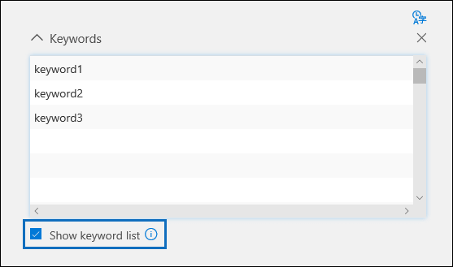

# Crear consultas de búsquedaBuild search queries

Al crear consultas de búsqueda, puede usar palabras clave para buscar contenido y condiciones específicos para reducir el ámbito de la búsqueda y devolver los elementos más relevantes para la investigación legal.When building search queries, you can use keywords to find specific content and conditions to narrow the scope of the search to return items that are most relevant to your legal investigation.

## Búsquedas de palabras claveKeyword searches

Escriba una consulta de palabra clave en el cuadro **palabras clave** en la consulta de búsqueda.Type a keyword query in the **Keywords** box in the search query. Puede especificar palabras clave, propiedades del mensaje de correo electrónico, como las fechas de envío y recepción, o propiedades del documento, como nombres de archivo o la fecha en que se modificó por última vez un documento.You can specify keywords, email message properties, such as sent and received dates, or document properties, such as file names or the date that a document was last changed. También puede usar consultas más complejas con operadores booleanos como **Y**, **O**, **NOT** y **NEAR**.You can use more complex queries that use a Boolean operator, such as **AND**, **OR**, **NOT**, and **NEAR**. También puede buscar información confidencial (por ejemplo, números de la seguridad social) en documentos de SharePoint y OneDrive (no en mensajes de correo electrónico), ni buscar documentos que se han compartido externamente.You can also search for sensitive information (such as social security numbers) in documents in SharePoint and OneDrive (not in email messages), or search for documents that have been shared externally. Si deja vacío el cuadro **palabras clave** , todo el contenido ubicado en las ubicaciones de contenido especificadas se encuentra en los resultados de la búsqueda.If you leave the **Keywords** box empty, all content located in the specified content locations is in the search results.
    
Como alternativa, puede activar la casilla de verificación **Mostrar lista de palabras clave** y escribir una palabra clave o frase de palabra clave en cada fila.Alternatively, you can select the **Show keyword list** check box and the type a keyword or keyword phrase in each row. Si hace esto, las palabras clave de cada fila están conectadas por un operador lógico (que se representa como *c:s* en la sintaxis de consulta de búsqueda) que es similar en funcionalidad al operador **or** en la consulta de búsqueda que se crea.If you do this, the keywords in each row are connected by a logical operator (which is represented as *c:s* in the search query syntax) that is similar in functionality to the **OR** operator in the search query that's created. Esto significa que los elementos que contienen cualquier palabra clave en cualquier fila se encuentran en los resultados de la búsqueda.This means items that contain any keyword in any row are in the search results.

¿Por qué usar la lista de palabras clave?Why use the keyword list? Puede obtener estadísticas que muestren cuántos elementos coinciden con cada palabra clave de la lista de palabras clave.You can get statistics that show how many items match each keyword in the keyword list. Esto puede ayudarle a identificar rápidamente las palabras clave más eficaces (y menos) efectivas.This can help you quickly identify the keywords that are the most (and least) effective. También puede usar una frase de palabras clave (entre paréntesis) en una fila de la lista de palabras clave.You can also use a keyword phrase (surrounded by parentheses) in a row in the keywords list. Para obtener más información acerca de las estadísticas de búsqueda, vea [estadísticas de búsqueda](search-statistics.md).For more information about search statistics, see [Search statistics](search-statistics.md).

> [!NOTE]
> Para ayudar a reducir los problemas causados por listas de palabras clave grandes, está limitado a un máximo de 20 filas en la lista de palabras clave.To help reduce issues caused by large keyword lists, you're limited to a maximum of 20 rows in the keyword list.

## CondicionesConditions
    
Puede agregar condiciones de búsqueda para restringir el ámbito de una búsqueda y devolver un conjunto de resultados más refinado.You can add search conditions to narrow the scope of a search and return a more refined set of results. Cada condición agrega una cláusula a la consulta de búsqueda que se crea y se ejecuta cuando se inicia la búsqueda.Each condition adds a clause to the search query that is created and run when you start the search. Una condición está conectada lógicamente a la consulta de palabra clave especificada en el cuadro de palabra clave por un operador lógico (que se representa como *c:c* en la sintaxis de la consulta de búsqueda) que es similar en funcionalidad al operador **and** .A condition is logically connected to the keyword query specified in the keyword box by a logical operator (which is represented as *c:c* in the search query syntax) that is similar in functionality to the **AND** operator. Esto significa que los elementos deben cumplir con la consulta de palabra clave y una o más condiciones que se van a incluir en los resultados de la búsqueda.That means that items have to satisfy both the keyword query and one or more conditions to be included in the search results. De esta manera, las condiciones permiten restringir los resultados.This is how conditions help to narrow your results. Para obtener una lista y una descripción de las condiciones que se pueden usar en una consulta de búsqueda, vea la sección "condiciones de búsqueda" en [consultas de palabras clave y condiciones de búsqueda](keyword-queries-and-search-conditions.md#search-conditions).For a list and description of conditions that you can use in a search query, see the "Search conditions" section in [Keyword queries and search conditions](keyword-queries-and-search-conditions.md#search-conditions).
