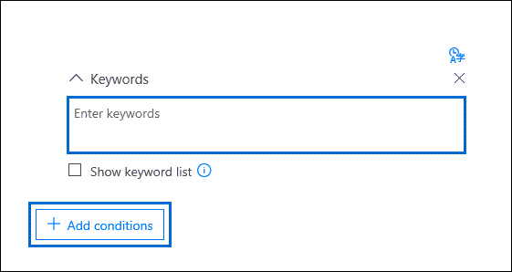

# Crear consultas de colecciones de búsqueda en eDiscovery avanzado

Al crear consultas de búsqueda para recopilar datos en un caso de eDiscovery avanzado, puede usar palabras clave para encontrar contenido y condiciones específicos para restringir el ámbito de la búsqueda para devolver los elementos más relevantes para su investigación legal.

## Búsquedas de palabras clave

Escriba una consulta de palabras clave en el **cuadro Palabras clave** de la consulta de búsqueda. Puede especificar palabras clave, propiedades de mensajes de correo electrónico, como fechas de envío y recibido, o propiedades de documento, como nombres de archivo o la fecha en la que se modificó por última vez un documento. También puede usar consultas más complejas con operadores booleanos como **Y**, **O**, **NOT** y **NEAR**. También puede buscar información confidencial (como números de la seguridad social) en documentos de SharePoint y OneDrive (no en mensajes de correo electrónico) o buscar documentos que se hayan compartido externamente. Si deja vacío el cuadro Palabras clave, todo el contenido ubicado en las ubicaciones de contenido especificadas se encuentra en los **resultados** de la búsqueda.

## Lista de palabras clave

Como alternativa, puede activar la casilla Mostrar lista de palabras **clave** y escribir una palabra clave o frase de palabra clave en cada fila. Las palabras clave de cada fila están conectadas por un operador lógico (que se representa como *c:s* en la sintaxis de consulta de búsqueda) que es similar en funcionalidad al operador **OR** en la consulta de búsqueda que se crea. Esto significa que los elementos que contienen cualquier palabra clave en cualquier fila están en los resultados de la búsqueda. Puede agregar hasta 180 filas en la lista de palabras clave en consultas de búsqueda avanzada de exhibición de documentos electrónicos.

¿Por qué usar la lista de palabras clave? Puede obtener estadísticas que muestran cuántos elementos coinciden con cada palabra clave en la lista de palabras clave. Esto puede ayudarle a identificar rápidamente las palabras clave que son más (y menos) eficaces. También puede usar una frase de palabra clave (entre paréntesis) en una fila de la lista de palabras clave. Para obtener más información acerca de las estadísticas de búsqueda, vea [Estadísticas de búsqueda.](search-statistics-in-advanced-ediscovery.md)

## Condiciones

Puede agregar condiciones de búsqueda para restringir el ámbito de una búsqueda y devolver un conjunto de resultados más refinado. Cada condición agrega una cláusula a la consulta de búsqueda que se crea y se ejecuta cuando se inicia la búsqueda. Una condición está conectada lógicamente a la consulta de palabras clave especificada en el cuadro de palabras clave por un operador lógico (que se representa como *c:c* en la sintaxis de consulta de búsqueda) que es similar en funcionalidad al operador **AND.** Esto significa que los elementos deben satisfacer tanto la consulta de palabras clave como una o más condiciones que se incluirán en los resultados de la búsqueda. De esta manera, las condiciones permiten restringir los resultados. Para obtener una lista y una descripción de las condiciones que puede usar en una consulta de búsqueda, vea la sección "Condiciones de búsqueda" en consultas de palabras clave y condiciones [de búsqueda.](keyword-queries-and-search-conditions.md#search-conditions)
