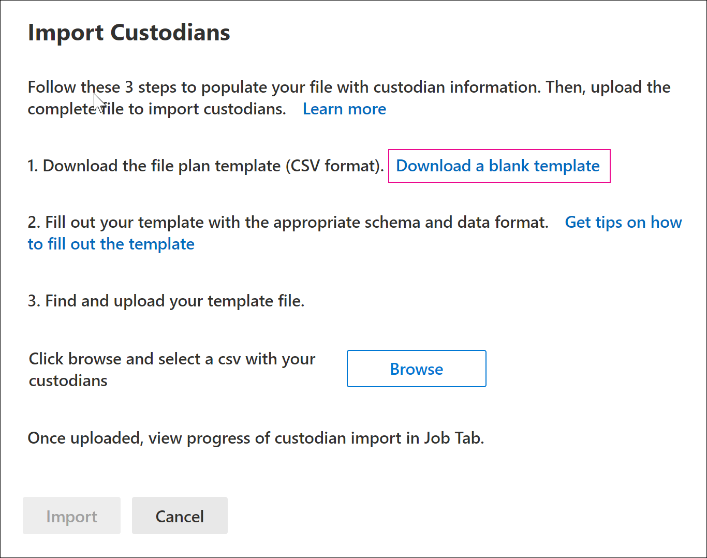

# Importar administradores a un caso de eDiscovery avanzado

Para los casos de eDiscovery avanzados en los que participan muchos administradores, puede importar varios administradores a la vez mediante un archivo CSV que contiene la información necesaria para agregarlos a un caso.

## Importar administradores

1. Abra el caso de eDiscovery avanzado y seleccione la **pestaña Orígenes de** datos.

2. Haga **clic en Agregar administradores de** importación de orígenes de  >  **datos.**

3. En la **página desplegable Importar administradores,** haga clic en Descargar una plantilla en blanco **para** descargar un archivo CSV de plantilla de administrador.

   

4. Agregue la información de custodia al archivo CSV y guárdela en el equipo local. Consulte la [sección archivo CSV de](#custodian-csv-file) administrador para obtener información sobre las propiedades necesarias en el archivo CSV.

5. Después de preparar el archivo CSV con la información  del administrador, vuelva a la pestaña Orígenes de datos y haga clic en Agregar administradores de importación de origen de datos de  >   nuevo.

6. En la **página desplegable Importar administradores,** haga clic en Examinar y, a continuación, cargue el archivo CSV que contiene la información del administrador. 

   Después de cargar el archivo CSV, se crea un trabajo denominado **BulkAddCustodian** y se muestra en la **pestaña** Trabajos. El trabajo valida los administradores y sus orígenes de datos asociados y, a continuación, los agrega a la página **Orígenes** de datos del caso.

## Archivo CSV de administrador

Después de descargar la plantilla de administrador csv, puede agregar administradores y su origen de datos en cada fila. Asegúrese de no cambiar los nombres de columna en la fila de encabezado. Use el tipo de carga de trabajo y las columnas de ubicación de carga de trabajo para asociar otros orígenes de datos a un administrador.

| Nombre de columna|Descripción|
|:------- |:------------------------------------------------------------|
|**Custodian contactEmail**     |La dirección de correo electrónico UPN del administrador. Por ejemplo, sarad@contoso.onmicrosoft.com.           |
|**Exchange habilitado** | Valor TRUE/FALSE para incluir o no incluir el buzón del administrador.      |
|**OneDrive habilitado** | Valor TRUE/FALSE para incluir o no incluir la cuenta de OneDrive para la Empresa del administrador. |
|**Is OnHold**        | Valor TRUE/FALSE para indicar si se deben poner en espera los orígenes de datos de administrador.       |
|**Tipo Workload1**         |Valor de cadena que indica el tipo de origen de datos que se asociará con el administrador. Los valores posibles son:  - ExchangeMailbox  - SharePointSite - TeamsMailbox - TeamsSite  - YammerMailbox - YammerSite |
|**Ubicación de carga de trabajo1**     | Según el tipo de carga de trabajo, esta sería la ubicación del origen de datos. Por ejemplo, la dirección de correo electrónico de un buzón de Exchange o la dirección URL de un sitio de SharePoint. |
|||

Este es un ejemplo de un archivo CSV con información de administrador:  

|Custodian contactEmail      | Exchange habilitado | OneDrive habilitado | Is OnHold | Tipo Workload1 | Ubicación de carga de trabajo1             |
| ----------------- | ---------------- | ---------------- | --------- | -------------- | ------------------------------ |
|robinc@onmicrosoft.contoso.com | TRUE             | TRUE             | TRUE      | SharePointSite | https://contoso.sharepoint.com |
|pillarp@onmicrosoft.contoso.com | TRUE             | TRUE             | TRUE      | |  |
||||||

## Validación de administrador y origen de datos

Después de cargar el archivo CSV de administrador, eDiscovery avanzado hace lo siguiente:

1. Valida los administradores y sus orígenes de datos.

2. Indiza todos los orígenes de datos de cada administrador y los pone en retención (si la propiedad **Is OnHold** del archivo CSV está establecida en TRUE).

### Validación de administrador

Actualmente, solo se admite la importación de administradores que se incluyen en Azure Active Directory (Azure AD) de su organización.

La herramienta de importación de administrador busca y valida a los administradores con el valor UPN de la columna **ContactEmail** del administrador en el archivo CSV. Los administradores que se validan se agregan automáticamente al caso y se enumeran en la pestaña **Orígenes** de datos del caso. Si no se puede validar un administrador, aparecen en el registro de errores del trabajo  BulkAddCustodian que aparece en la pestaña Trabajos en ese caso. Los administradores no confirmados no se agregan al caso ni aparecen en la **pestaña Orígenes de** datos.

### Validación de origen de datos

Después de que los administradores se validan y agregan al caso, se agregan cada buzón de correo principal y cuenta de OneDrive asociada con un administrador.

Sin embargo, si no se encuentra ninguno de los demás orígenes de datos (como sitios de SharePoint, Microsoft Teams, Grupos de Microsoft 365  o grupos de Yammer) asociados con un  administrador, ninguno de ellos se asigna al administrador y el valor No validado se muestra en la columna Estado junto al administrador en la pestaña Orígenes de datos. 

Para agregar orígenes de datos validados para un administrador:

1. En la **pestaña Orígenes de** datos, seleccione un administrador que contenga orígenes de datos que no se validan.

2. En la página desplegable de administrador, desplácese hasta la sección Ubicaciones de administrador para ver los orígenes de datos validados y no validados que están asociados con el administrador. 

3. Haga **clic en** Editar en la parte superior de la página desplegable para quitar orígenes de datos no válidos o agregar nuevos.

4. Después de quitar orígenes de datos sin validar o agregar uno  nuevo, el valor **Activo** se muestra en la columna Estado del administrador en la ficha **Orígenes de** datos. Para agregar orígenes que anteriormente aparecían como no válidos, siga los pasos de corrección siguientes para agregarlos manualmente a un administrador.

### Corrección de orígenes de datos no válidos

Para agregar y asociar manualmente un origen de datos que no era válido anteriormente:

1. En la **pestaña Orígenes de** datos, seleccione un administrador para agregar y asociar manualmente un origen de datos que no era válido anteriormente.

2. Haga **clic en** Editar en la parte superior de la página desplegable para asociar buzones, sitios, teams o grupos de Yammer al administrador. Para ello, haga **clic en Editar** junto al tipo de ubicación de datos adecuado.

3. Haga **clic en** Siguiente para mostrar la página de configuración **de** retención y configurar la configuración de retención para los orígenes de datos que agregó.

4. Haga **clic en** Siguiente para mostrar la página **Revisar** administradores y, a continuación, haga clic en Enviar **para** guardar los cambios.
