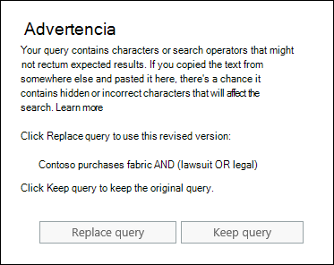

# Comprobar errores en la consulta de búsqueda de contenidoCheck your Content Search query for errors

Al crear o editar una búsqueda de contenido, puede hacer que Microsoft 365 Compruebe su consulta en busca de caracteres no admitidos y operadores booleanos en minúsculas.When you create or edit a Content Search, you can have Microsoft 365 check your query for unsupported characters and lowercase Boolean operators. ¿Cómo se hace?How? Solo tiene que hacer clic en **comprobar consulta si hay errores tipográficos** en la página consulta de una búsqueda de contenido.Just click **Check query for typos** on the query page of a Content Search. 
  

  
Esta es una lista de los caracteres no admitidos que se buscarán.Here's a list of the unsupported characters that we check for. Los caracteres no admitidos suelen estar ocultos y, por lo general, provocan un error de búsqueda o devuelven resultados no deseados.Unsupported characters are often hidden, and they typically cause a search error or return unintended results.
  
- Las comillas **tipográficas** : las comillas tipográficas sencillas y dobles (también denominadas comillas tipográficas) no son compatibles.**Smart quotation marks** - Smart single and double quotation marks (also called curly quotes) aren't supported. Solo pueden usarse las comillas tipográficas en una consulta de búsqueda.Only straight quotation marks can be used in a search query. 
    
- Los caracteres no **imprimibles y de control** (caracteres no imprimibles) y los caracteres de control no representan un símbolo escrito, como un carácter alfanumérico.**Non-printable and control characters** - Non-printable and control characters don't represent a written symbol, such as an alpha-numeric character. Los ejemplos de caracteres de control no imprimibles incluyen caracteres que aplican formato al texto o que separan líneas de texto.Examples of non-printable and control characters include characters that format text or separate lines of text. 
    
- **Marcas de izquierda a derecha y de derecha a izquierda** : estas marcas son caracteres de control usados para indicar la dirección del texto en los idiomas de izquierda a derecha (como el inglés y el español) y en los idiomas de derecha a izquierda (como el árabe y el hebreo).**Left-to-right and right-to-left marks** - These marks are control characters used to indicate text direction for left-to-right languages (such as English and Spanish) and right-to-left languages (such as Arabic and Hebrew).
    
- **Operadores booleanos en minúsculas** : Si usa un operador booleano, como **and**, **or**y **Not** en una consulta de búsqueda, debe estar en mayúsculas.**Lowercase Boolean operators** - If you use a Boolean operator, such as **AND**, **OR**, and **NOT** in a search query, it must be uppercase. Cuando comprobamos una consulta para comprobar si hay errores tipográficos, la sintaxis de la consulta suele indicar que se está usando un operador booleano, aunque se podrían usar operadores en minúsculas; por ejemplo, `(WordA or WordB) and (WordC or WordD)` .When we check a query for typos, the query syntax will often indicate that a Boolean operator is being used even though lowercase operators might be used; for example,  `(WordA or WordB) and (WordC or WordD)`.
    
## ¿Qué sucede si una consulta tiene un carácter no admitido?What happens if a query has an unsupported character?

Si se encuentran caracteres no admitidos en la consulta, se muestra un mensaje de advertencia que indica que se encontraron caracteres no admitidos y sugiere una alternativa.If unsupported characters are found in your query, a warning message is displayed that says unsupported characters were found and suggests an alternative. A continuación, tiene la opción de conservar la consulta original o reemplazarla por la consulta revisada sugerida.You then have the option keep the original query or replace it with the suggested revised query. Este es un ejemplo del mensaje de advertencia que se muestra después de hacer clic en **consultar consulta para ver si hay errores ortográficos** para la consulta de búsqueda en la captura de pantalla anterior.Here's an example of the warning message that's displayed after you click **Check query for typos** for the search query in the previous screenshot. Observe que la consulta original contiene comillas tipográficas y operadores booleanos en minúsculas.Notice that the original query contains smart quotes and lowercase Boolean operators. 
  

  
## Cómo evitar los caracteres no admitidos en las consultas de búsquedaHow to prevent unsupported characters in your search queries

Normalmente, los caracteres no admitidos se agregan a una consulta cuando se copia la consulta o partes de la consulta de otras aplicaciones (como Microsoft Word o Microsoft Excel) y se pegan en el cuadro palabra clave en la página consulta de una búsqueda de contenido.Unsupported characters are typically added to a query when you copy the query or parts of the query from other applications (such as Microsoft Word or Microsoft Excel) and paste them in the keyword box on the query page of a Content Search. La mejor manera de evitar los caracteres no admitidos es simplemente escribir la consulta en el cuadro de palabras clave.The best way to prevent unsupported characters is to just type the query in the keyword box. O bien, puede copiar una consulta desde Word o Excel y, a continuación, pegarla en un editor de texto sin formato, como el Bloc de notas de Microsoft.Or you can copy a query from Word or Excel, and then paste it in a plain text editor, such as Microsoft Notepad. Guarde el archivo de texto y seleccione **ANSI** en la lista desplegable **codificación** .Save the text file and select **ANSI** in the **Encoding** drop-down list. Esto quitará cualquier carácter no admitido y de formato.This will remove any formatting and unsupported characters. Después, podrá copiar y pegar la consulta del archivo de texto en el cuadro de consulta de palabras clave.Then you can copy and paste the query from the text file to the keyword query box. 
