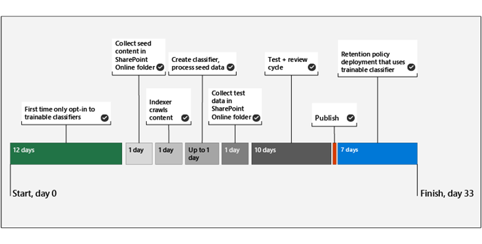
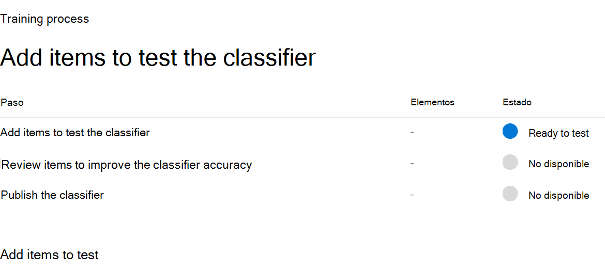
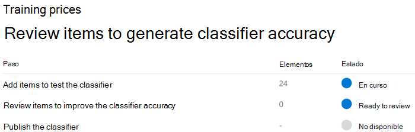
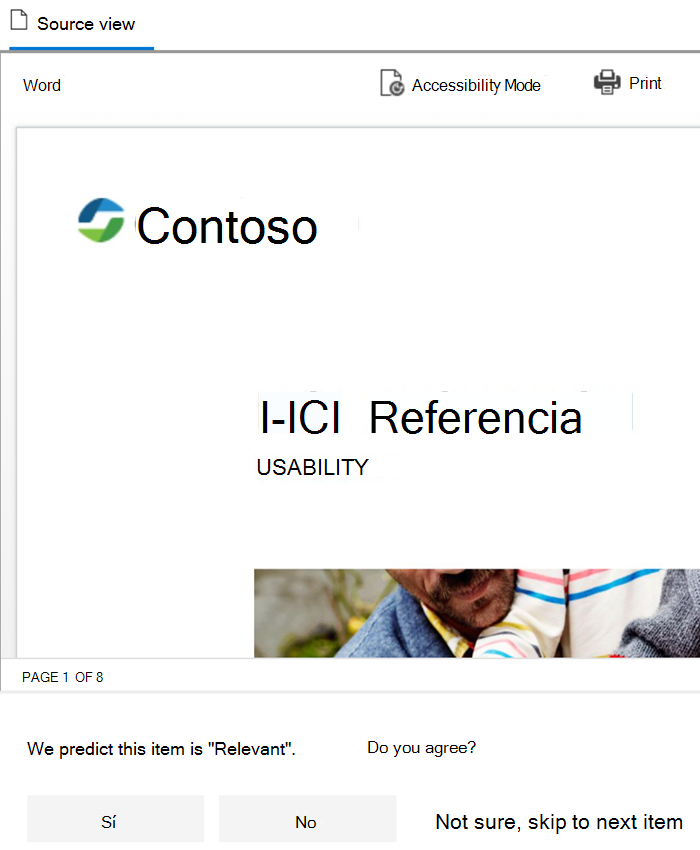
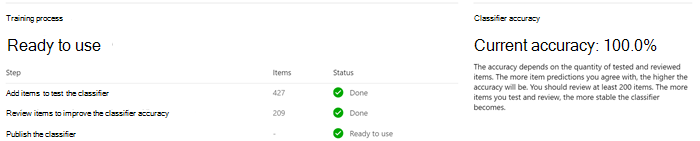

# Introducción a los clasificadores que se pueden entrenarGet started with trainable classifiers

Un clasificador que se puede entrenar de Microsoft 365 es una herramienta que puede entrenar para reconocer distintos tipos de contenido, ya que le proporciona ejemplos para que los vea.A Microsoft 365 trainable classifier is a tool you can train to recognize various types of content by giving it samples to look at. Una vez formado, puede usarlo para identificar el elemento para la aplicación de etiquetas de confidencialidad de Office, directivas de cumplimiento de comunicaciones y directivas de etiquetas de retención.Once trained, you can use it to identify item for application of Office sensitivity labels, Communications compliance policies, and retention label policies.

La creación de un clasificador personalizado que se puede entrenar primero implica darle muestras que son de selección humana y que coinciden positivamente con la categoría.Creating a custom trainable classifier first involves giving it samples that are human picked and positively match the category. A continuación, después de procesarlos, se prueba la capacidad de los clasificadores para predecir al darle una combinación de muestras positivas y negativas.Then, after it has processed those, you test the classifiers ability to predict by giving it a mix of positive and negative samples. En este artículo se muestra cómo crear y entrenar un clasificador personalizado y cómo mejorar el rendimiento de clasificadores y clasificadores formados previamente a lo largo de su ciclo de vida a través de la nueva formación.This article shows you how to create and train a custom classifier and how to improve the performance of custom trainable classifiers and pre-trained classifiers over their lifetime through retraining.

Para obtener más información acerca de los distintos tipos de clasificadores, vea [Learn about trainable classifiers](classifier-learn-about.md).To learn more about the different types of classifiers, see [Learn about trainable classifiers](classifier-learn-about.md).

## Requisitos previosPrerequisites

### Requisitos de licenciaLicensing requirements

Los clasificadores son una característica de cumplimiento de Microsoft 365 E5 o E5.Classifiers are a Microsoft 365 E5, or E5 Compliance feature. Debe tener una de estas suscripciones para poder usarlas.You must have one of these subscriptions to make use of them.

### PermissionsPermissions

Para obtener acceso a clasificadores en la interfaz de usuario:To access classifiers in the UI: 

- El administrador global debe participar para que el inquilino cree clasificadores personalizados.the Global admin needs to opt in for the tenant to create custom classifiers.
- El rol de administrador de cumplimiento es necesario para formar a un clasificador.Compliance Administrator role is required to train a classifier.

Necesitará cuentas con estos permisos para usar clasificadores en estos escenarios:You'll need accounts with these permissions to use classifiers in these scenarios:

- Escenario de directiva de etiquetas de retención: roles administración de registros y administración de retenciónRetention label policy scenario: Record Management and Retention Management roles 
- Escenario de directiva de etiqueta de confidencialidad: Administrador de seguridad, Administrador de cumplimiento, Administrador de datos de cumplimientoSensitivity label policy scenario: Security Administrator, Compliance Administrator, Compliance Data Administrator
- Escenario de directiva de cumplimiento de comunicaciones: administrador de administración de riesgos de Insider, administrador de revisión de supervisiónCommunication compliance policy scenario: Insider Risk Management Admin, Supervisory Review Administrator 

> [!IMPORTANT]
> De forma predeterminada, solo el usuario que crea un clasificador personalizado puede entrenar y revisar las predicción realizadas por ese clasificador.By default, only the user who creates a custom classifier can train and review predictions made by that classifier.

## Prepararse para un clasificador personalizado que se puede entrenarPrepare for a custom trainable classifier 

Es útil comprender lo que implica la creación de un clasificador personalizado que se puede entrenar antes de profundizar.It's helpful to understand what's involved in creating a custom trainable classifier before you dive in. 

### Escala de tiempoTimeline

Esta escala de tiempo refleja una implementación de ejemplo de clasificadores que se pueden entrenar.This timeline reflects a sample deployment of trainable classifiers.

> [!TIP]
> Es necesario participar por primera vez para clasificadores que se pueden entrenar.Opt-in is required the first time for trainable classifiers. Microsoft 365 tarda doce días en completar una evaluación de línea base del contenido de la organización.It takes twelve days for Microsoft 365 to complete a baseline evaluation of your organizations content. Póngase en contacto con el administrador global para iniciar el proceso de suscripción.Contact your global administrator to kick off the opt-in process.

### Flujo de trabajo generalOverall workflow

Para obtener más información sobre el flujo de trabajo general de creación de clasificadores que se pueden entrenar personalizados, vea Flujo de procesos para crear clasificadores que se pueden entrenar [para el cliente.](classifier-learn-about.md#process-flow-for-creating-custom-classifiers)To understand more about the overall workflow of creating custom trainable classifiers, see [Process flow for creating customer trainable classifiers](classifier-learn-about.md#process-flow-for-creating-custom-classifiers).

### Contenido de la ed.Seed content

Si desea que un clasificador que se pueda entrenar identifique de forma independiente y precisa un elemento como parte de una categoría concreta de contenido, primero debe presentarlo con muchos ejemplos del tipo de contenido que se encuentran en la categoría.When you want a trainable classifier to independently and accurately identify an item as being in particular category of content, you first have to present it with many samples of the type of content that are in the category. Esta alimentación de muestras al clasificador que se puede entrenar se conoce como *edificador.*This feeding of samples to the trainable classifier is known as *seeding*. Un ser humano selecciona el contenido de la edr., que representa la categoría de contenido.Seed content is selected by a human and is judged to represent the category of content.

> [!TIP]
> Debe tener al menos 50 muestras positivas y hasta 500.You need to have at least 50 positive samples and as many as 500. El clasificador que se puede entrenar procesará hasta las 500 muestras creadas más recientes (por marca de fecha y hora de creación de archivos).The trainable classifier will process up to the 500 most recent created samples (by file created date/time stamp). Cuando más muestras proporciones, más precisas serán las predicción que realizará el clasificador.The more samples you provide, the more accurate the predictions the classifier will make.

### Prueba de contenidoTesting content

Una vez que el clasificador que se puede entrenar ha procesado suficientes muestras positivas para crear un modelo de predicción, debes probar las predicción que realiza para ver si el clasificador puede distinguir correctamente entre los elementos que coinciden con la categoría y los elementos que no.Once the trainable classifier has processed enough positive samples to build a prediction model, you need to test the predictions it makes to see if the classifier can correctly distinguish between items that match the category and items that don't. Para ello, selecciona otro conjunto de contenido seleccionado humano, con suerte más grande, que consta de muestras que deben incluirse en la categoría y las muestras que no.You do this by selecting another, hopefully larger, set of human picked content that consists of samples that should fall into the category and samples that won't. Debes probar con datos diferentes de los datos iniciales de inicialización que proporcionaste por primera vez.You should test with different data than the initial seed data you first provided. Una vez que los procesa, se pasan manualmente por los resultados y se comprueba si cada predicción es correcta, incorrecta o no está seguro.Once it processes those, you manually go through the results and verify whether each prediction is correct, incorrect, or you aren't sure. El clasificador que se puede entrenar usa estos comentarios para mejorar su modelo de predicción.The trainable classifier uses this feedback to improve its prediction model.

> [!TIP]
> Para obtener mejores resultados, tenga al menos 200 elementos en el conjunto de muestras de prueba con una distribución uniforme de coincidencias positivas y negativas.For best results, have at least 200 items in your test sample set with an even distribution of positive and negative matches.

## Cómo crear un clasificador que se puede entrenarHow to create a trainable classifier

1. Recopile entre 50 y 500 elementos de contenido de ed.Collect between 50-500 seed content items. Solo deben ser ejemplos que representen de forma segura el tipo de contenido que desea que el clasificador que se pueda entrenar identifique de forma positiva como si se encontrara en la categoría de clasificación.These must be only samples that strongly represent the type of content you want the trainable classifier to positively identify as being in the classification category. Vea las extensiones de nombre de archivo rastreadas predeterminadas y los tipos de archivo analizadas [en SharePoint Server](https://docs.microsoft.com/sharepoint/technical-reference/default-crawled-file-name-extensions-and-parsed-file-types) para los tipos de archivo admitidos.See, [Default crawled file name extensions and parsed file types in SharePoint Server](https://docs.microsoft.com/sharepoint/technical-reference/default-crawled-file-name-extensions-and-parsed-file-types) for the supported file types.

   > [!IMPORTANT]
   > Los elementos de ejemplo de la ed y la prueba no deben estar cifrados y deben estar en inglés.The seed and test sample items must not be encrypted and they must be in English.

   > [!IMPORTANT]
   > Asegúrate de que los elementos del conjunto de elementos de la edr. sean **ejemplos seguros** de la categoría.Make sure the items in your seed set are **strong** examples of the category. Inicialmente, el clasificador que se puede entrenar crea su modelo en función de lo que se inicializa.The trainable classifier initially builds its model based on what you seed it with. El clasificador presupone que todas las muestras de la edar son positivos y no tiene forma de saber si una muestra es una coincidencia débil o negativa con la categoría.The classifier assumes all seed samples are strong positives and has no way of knowing if a sample is a weak or negative match to the category.

2. Coloque el contenido de la edr. en una carpeta de SharePoint Online dedicada a contener *solo el contenido de la edr.*Place the seed content in a SharePoint Online folder that is dedicated to holding *the seed content only*. Tome nota de la dirección URL del sitio, la biblioteca y la carpeta.Make note of the site, library, and folder URL.

   > [!TIP]
   > Si crea un nuevo sitio y una carpeta para los datos de edr, permita al menos una hora para que esa ubicación se indexe antes de crear el clasificador que se puede entrenar que usará los datos de edr.If you create a new site and folder for your seed data, allow at least an hour for that location to be indexed before creating the trainable classifier that will use that seed data.

3. Inicie sesión en el Centro de cumplimiento de Microsoft 365 con acceso al rol de administrador de seguridad o administrador de cumplimiento y abra el Centro de cumplimiento de **Microsoft 365** o la clasificación de datos del Centro de seguridad de **Microsoft 365.**  >  Sign in to Microsoft 365 compliance center with compliance admin or security admin role access and open **Microsoft 365 compliance center** or **Microsoft 365 security center** > **Data classification**.

4. Elija la **pestaña Clasificadores que se pueden entrenar.**Choose the **Trainable classifiers** tab.

5. Elija **Crear clasificador que se pueda entrenar.**Choose **Create trainable classifier**.

6. Rellene los valores adecuados para los campos y los campos de la categoría de elementos que desea que identifique `Name` `Description` este clasificador que se puede entrenar.Fill in appropriate values for the `Name` and `Description` fields of the category of items you want this trainable classifier to identify.

7. Elija la dirección URL del sitio, la biblioteca y la carpeta de SharePoint Online para el sitio de contenido de edr del paso 2.Pick the SharePoint Online site, library, and folder URL for the seed content site from step 2. Elija `Add` .Choose `Add`.

8. Revise la configuración y elija `Create trainable classifier` .Review the settings and choose `Create trainable classifier`.

9. En un plazo de 24 horas, el clasificador que se puede entrenar procesará los datos de la edr. y compilará un modelo de predicción.Within 24 hours the trainable classifier will process the seed data and build a prediction model. El estado del clasificador es `In progress` mientras procesa los datos de la ed.The classifier status is `In progress` while it processes the seed data. Cuando el clasificador termina de procesar los datos de la edr, el estado cambia a `Need test items` .When the classifier is finished processing the seed data, the status changes to `Need test items`.

10. Ahora puede ver la página de detalles eligiendo el clasificador.You can now view the details page by choosing the classifier.

    > [!div class="mx-imgBorder"]
    > 

11. Recopile al menos 200 elementos de contenido de prueba (10 000 como máximo) para obtener los mejores resultados.Collect at least 200 test content items (10,000 max) for best results. Estos deben ser una combinación de elementos que son positivos, negativos fuertes y algunos que son un poco menos obvios en su naturaleza.These should be a mix of items that are strong positives, strong negatives and some that are a little less obvious in their nature. Vea las extensiones de nombre de archivo rastreadas predeterminadas y los tipos de archivo analizadas [en SharePoint Server](https://docs.microsoft.com/sharepoint/technical-reference/default-crawled-file-name-extensions-and-parsed-file-types) para los tipos de archivo admitidos.See, [Default crawled file name extensions and parsed file types in SharePoint Server](https://docs.microsoft.com/sharepoint/technical-reference/default-crawled-file-name-extensions-and-parsed-file-types) for the supported file types.

    > [!IMPORTANT]
    > Los elementos de ejemplo no deben estar cifrados y deben estar en inglés.The sample items must not be encrypted and they must be in English.

12. Coloque el contenido de prueba en una carpeta de SharePoint Online dedicada a contener *solo el contenido de prueba.*Place the test content in a SharePoint Online folder that is dedicated to holding *the test content only*. Tome nota de la dirección URL del sitio, la biblioteca y la carpeta de SharePoint Online.Make note of the SharePoint Online site, library, and folder URL.

    > [!TIP]
    > Si crea un nuevo sitio y una carpeta para los datos de prueba, deje al menos una hora para que esa ubicación se indexe antes de crear el clasificador que se puede entrenar que usará los datos de edr.If you create a new site and folder for your test data, allow at least an hour for that location to be indexed before creating the trainable classifier that will use that seed data.

13. Elija `Add items to test` .Choose `Add items to test`.

14. Elija la dirección URL del sitio, la biblioteca y la carpeta de SharePoint Online para el sitio de contenido de prueba del paso 12.Pick the SharePoint Online site, library, and folder URL for the test content site from step 12. Elija `Add` .Choose `Add`.

15. Para finalizar el asistente, elija `Done` .Finish the wizard by choosing `Done`. El clasificador que se puede entrenar llevará hasta una hora procesar los archivos de prueba.Your trainable classifier will take up to an hour to process the test files.

16. Cuando el clasificador que se puede entrenar termine de procesar los archivos de prueba, el estado de la página de detalles cambiará a `Ready to review` .When the trainable classifier is done processing your test files, the status on the details page will change to `Ready to review`. Si necesitas aumentar el tamaño de la muestra de prueba, elige y permite que el clasificador que se puede `Add items to test` entrenar procese los elementos adicionales.If you need to increase the test sample size, choose `Add items to test` and allow the trainable classifier to process the additional items.

    > [!div class="mx-imgBorder"]
    > 

17. Elija `Tested items to review` la pestaña para revisar los elementos.Choose `Tested items to review` tab to review items.

18. Microsoft 365 presentará 30 elementos a la vez.Microsoft 365 will present 30 items at a time. Repase y, `We predict this item is "Relevant". Do you agree?` en el cuadro, elija `Yes` uno `No` o `Not sure, skip to next item` .Review them and in the `We predict this item is "Relevant". Do you agree?` box choose either `Yes` or `No` or `Not sure, skip to next item`. La precisión del modelo se actualiza automáticamente después de cada 30 elementos.Model accuracy is automatically updated after every 30 items.

    > [!div class="mx-imgBorder"]
    > 

19. Revise *al menos* 200 elementos.Review *at least* 200 items. Una vez que se ha estabilizado la puntuación de precisión, la opción **de** publicación estará disponible y el estado del clasificador dirá `Ready to use` .Once the accuracy score has stabilized, the **publish** option will become available and the classifier status will say `Ready to use`.

    > [!div class="mx-imgBorder"]
    > 

20. Publique el clasificador.Publish the classifier.

21. Una vez publicado, el clasificador estará disponible como una condición en el etiquetado automático de [Office](apply-sensitivity-label-automatically.md)con etiquetas de confidencialidad,  aplicar automáticamente la directiva de etiqueta de retención en función de una condición y en el cumplimiento de las [comunicaciones.](communication-compliance.md)Once published your classifier will be available as a condition in [Office auto-labeling with sensitivity labels](apply-sensitivity-label-automatically.md), [auto-apply retention label policy based on a condition](apply-retention-labels-automatically.md#configuring-conditions-for-auto-apply-retention-labels) and in [Communication compliance](communication-compliance.md).
