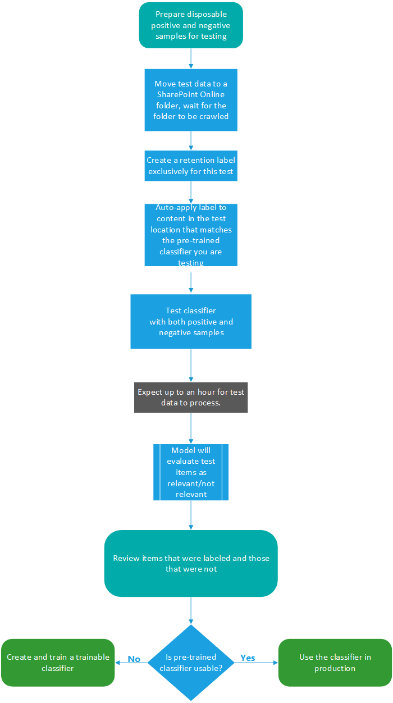

# Introducción al entrenamiento de clasificadores (vista previa)Getting started with trainable classifiers (preview)

La clasificación y la etiqueta del contenido para que se pueda proteger y administrar correctamente es el punto de partida de la disciplina de protección de la información.Classifying and labeling content so it can be protected and handled properly is the starting place for the information protection discipline. Microsoft 365 tiene tres formas de clasificar el contenido.Microsoft 365 has three ways to classify content.

## ManualmenteManually

Este método requiere la intervención humana y la acción.This method requires human judgment and action. Un administrador puede usar las etiquetas preexistentes y los tipos de información confidencial, o crear los suyos propios y, a continuación, publicarlos.An admin may either use the pre-existing labels and sensitive information types or create their own and then publish them. Los usuarios y los administradores los aplican al contenido a medida que lo encuentran.Users and admins apply them to content as they encounter it. A continuación, puede proteger el contenido y administrar su disposición.You can then protect the content and manage its disposition.

## Coincidencia de patrones automatizadaAutomated pattern matching

Esta categoría de mecanismos de clasificación incluye la búsqueda de contenido por:This category of classification mechanisms includes finding content by:

- Palabras clave o valores de metadatos (lenguaje de consulta de palabras clave).Keywords or metadata values (keyword query language).
- Uso de patrones identificados anteriormente de información confidencial, como seguridad social, números de tarjeta de crédito o cuenta bancaria [(definiciones de entidad de tipo información confidencial)](sensitive-information-type-entity-definitions.md).Using previously identified patterns of sensitive information like social security, credit card or bank account numbers [(Sensitive information type entity definitions)](sensitive-information-type-entity-definitions.md).
- Reconocimiento de un elemento porque es una variante de una plantilla [(impresión](document-fingerprinting.md)de los dedos de los documentos).Recognizing an item because it's a variation on a template [(document finger printing)](document-fingerprinting.md).
- Uso de la presencia de cadenas exactas [(coincidencia exacta de datos)](create-custom-sensitive-information-types-with-exact-data-match-based-classification.md).Using the presence of exact strings [(exact data match)](create-custom-sensitive-information-types-with-exact-data-match-based-classification.md).

Las etiquetas de confidencialidad y retención se pueden aplicar automáticamente para que el contenido esté disponible para su uso en las directivas de [prevención de pérdida de datos (DLP)](data-loss-prevention-policies.md) y de [aplicación automática para las etiquetas de retención](apply-retention-labels-automatically.md).Sensitivity and retention labels can then be automatically applied to make the content available for use in [data loss prevention (DLP)](data-loss-prevention-policies.md) and [auto-apply polices for retention labels](apply-retention-labels-automatically.md).

## Clasificadores capacitadosTrainable classifiers

Este método de clasificación es especialmente adecuado para el contenido que no se identifica fácilmente por los métodos de coincidencia de patrón manuales o automatizados.This classification method is particularly well suited to content that isn't easily identified by either the manual or automated pattern matching methods. Este método de clasificación es más sobre cómo entrenar a un clasificador para identificar un elemento en función de lo que es el elemento, no por los elementos que están en el elemento (coincidencia de modelos).This method of classification is more about training a classifier to identify an item based on what the item is, not by elements that are in the item (pattern matching). Un clasificador aprende a identificar un tipo de contenido mirando cientos de ejemplos del contenido que le interesa clasificar.A classifier learns how to identify a type of content by looking at hundreds of examples of the content you're interested in classifying. Empiece por alimentar los ejemplos que están en la categoría de forma indefinida.You start by feeding it examples that are definitely in the category. Una vez que los procesa, lo prueba mediante una combinación de ambos ejemplos que coinciden y no coinciden.Once it processes those, you test it by giving it a mix of both matching and non-matching examples. A continuación, el clasificador crea predicciones sobre si un elemento determinado pertenece a la categoría que se está creando.The classifier then makes predictions as to whether any given item falls into the category you're building. A continuación, se confirman los resultados, se ordenan los positivos, negativos, falsos positivos y falsos negativos para ayudar a aumentar la precisión de sus predicciones.You then confirm its results, sorting out the positives, negatives, false positives, and false negatives to help increase the accuracy of its predictions. Al publicar el clasificador entrenado, los elementos se ordenan en lugares como SharePoint Online, Exchange y OneDrive, y clasifican el contenido.When you publish the trained classifier, it sorts through items in locations like SharePoint Online, Exchange, and OneDrive, and classifies the content.

### Dónde puede usar clasificadores interexpertoWhere you can use trainable classifiers
Tanto los clasificadores integrados como los clasificadores que se pueden entrenar están disponibles como condición para [aplicar automáticamente una directiva de etiqueta de retención basada en una condición y el cumplimiento de la](apply-retention-labels-automatically.md#configuring-conditions-for-auto-apply-retention-labels) [comunicación](communication-compliance-configure.md).Both built-in classifiers and trainable classifiers are available as a condition for [auto-apply retention label policy based on a condition](apply-retention-labels-automatically.md#configuring-conditions-for-auto-apply-retention-labels) and [communication compliance](communication-compliance-configure.md). 

Las etiquetas de confidencialidad pueden usar clasificadores integrados y de creación propia como condiciones, vea [aplicar una etiqueta de confidencialidad a los contenidos automáticamente](apply-sensitivity-label-automatically.md).Sensitivity labels can use built-in and build-your-own classifiers as conditions, see [Apply a sensitivity label to content automatically](apply-sensitivity-label-automatically.md).

> [!IMPORTANT]
> Los clasificadores que se pueden entrenar solo funcionan con elementos que no están cifrados y que están en inglés.Trainable classifiers only work with items that are not encrypted and are in English.

### Requisitos de licenciaLicensing requirements

Los clasificadores que se pueden entrenar son una característica de cumplimiento de Microsoft 365 E5 o E5.Trainable classifiers are a Microsoft 365 E5, or E5 Compliance feature. Debe tener una de estas suscripciones para poder usarla.You must have one of these subscriptions to make use of them.

### Requisitos previosPre-requisites

Para acceder a los clasificadores que se puedan entrenar en la interfaz de usuario:To access trainable classifiers in the UI: 
- el administrador global debe participar en el inquilino.the Global admin needs to opt in for the tenant
- Se necesita el rol de administrador de cumplimiento o el administrador de datos de cumplimiento para entrenar un clasificadorCompliance admin role or Compliance Data Administrator is required to train a classifier

Necesitará cuentas con estos permisos para usar clasificadores que se puedan entrenar en estos escenarios:You'll need accounts with these permissions to use trainable classifiers in these scenarios:

- Escenario de directiva de etiqueta de retención: RecordManagement y roles de administración de retenciónRetention label policy scenario: RecordManagement and Retention Management roles 
- Escenario de directiva de etiqueta de confidencialidad: administrador de seguridad, administrador de cumplimiento, administrador de datos de cumplimientoSensitivity label policy scenario: Security Administrator, Compliance Administrator, Compliance Data Administrator
- Escenario de directiva de cumplimiento de comunicaciones: administrador de administración de riesgos de Insider, administrador de revisión de supervisiónCommunication compliance policy scenario: Insider Risk Management Admin, Supervisory Review Administrator 

## Tipos de clasificadoresTypes of classifiers

Hay clasificadores integrados y clasificadores que se pueden entrenar.There are built-in classifiers and trainable classifiers. La obtención de un clasificador capacitado en un estado editable requiere una inversión de tiempo para entrenarlo.Getting a trainable classifier to a publishable state requires a time investment to train it. Para ayudarle a empezar a usar clasificadores, Microsoft 365 incluye algunos clasificadores integrados.To help you get started using classifiers, Microsoft 365 comes with a few built-in classifiers.

> [!NOTE]
> Antes de usar un clasificador integrado en el flujo de trabajo de clasificación y etiquetado, debe probarlo con una muestra del contenido de la organización que considere que la categoría para comprobar que sus predicciones de clasificación satisfacen sus expectativas.Before using any built-in classifier in your classification and labeling workflow, you should test it against a sample of your organizations content that you feel fits the category to verify that its classification predictions meet your expectations.

### Descripción de los clasificadores integradosUnderstanding built-in classifiers

Microsoft 365 incluye cinco clasificadores integrados recomendados:Microsoft 365 comes with five recommended built-in classifiers:

> [!CAUTION]
> Estamos desaprobando el clasificador incorporado de **Lenguaje ofensivo** porque ha estado produciendo un alto número de falsos positivos.We are deprecating the **Offensive Language** built-in classifier because it has been producing a high number of false positives. No lo use y, si actualmente lo está usando, debería mover sus procesos de negocio fuera de él.Don't use it and if you are currently using it, you should move your business processes off of it. En su lugar, se recomienda usar los clasificadores de **amenaza**, **blasfemia**y **acoso** integrados.We recommend using the **Threat**, **Profanity**, and **Harassment** built-in classifiers instead.

- **Currículos**: detecta los elementos que son cuentas de texto de la cualificación personal, educativa, profesional, experiencia laboral y otra información de identificación personal del solicitante.**Resumes**: detects items that are textual accounts of an applicant's personal, educational, professional qualifications, work experience, and other personally identifying information
- **Código de origen**: detecta elementos que contienen un conjunto de instrucciones e instrucciones escritas en los 25 principales lenguajes de programación usados del equipo en github**Source Code**: detects items that contain a set of instructions and statements written in the top 25 used computer programming languages on GitHub

  |nombre del idiomalanguage name|||||
  |---------|---------|---------|---------|---------|
  |CódigoActionScript|CC        |C#C#       |+C++     |ClojureClojure  |
  |CoffeeScriptCoffeeScript|CSSCSS     |IrGo       |HaskellHaskell |HTMLHTML     |
  |JavaJava     |JavaScriptJavaScript|LuaLua      |MATLABMATLAB   |Objective-CObjective-C|
  |PerlPerl     |PHPPHP      |PythonPython   |RR        |RubyRuby     |
  |ScalaScala    |ConsolaShell    |RápidoSwift    |TexTex      |Script de VIMVim Script|

> [!NOTE]
> El código fuente está entrenado para detectar cuando la mayor parte del texto es código fuente.Source Code is trained to detect when the bulk of the text is source code. No detecta texto de código fuente intercalado con texto sin formato.It does not detect source code text that is interspersed with plain text.

- **Acosar**: detecta una categoría específica de elementos de texto de lenguaje ofensivo relacionados con la conducta ofensiva dirigida a uno o varios individuos en función de los siguientes rasgos: raza, étnico, religión, origen nacional, sexo, orientación sexual, edad, discapacidad**Harassment**: detects a specific category of offensive language text items related to offensive conduct targeting one or multiple individuals based on the following traits: race, ethnicity, religion, national origin, gender, sexual orientation, age, disability
- **Blasfemias**: detecta una categoría específica de elementos de texto de lenguaje ofensivo que contiene expresiones que avergonzan a la mayoría de las personas**Profanity**: detects a specific category of offensive language text items that contain expressions that embarrass most people
- **Amenaza**: detecta una categoría específica de elementos de texto de lenguaje ofensivo relacionados con amenazas para confirmar violencia o daño físico o daño a una persona o propiedad**Threat**: detects a specific category of offensive language text items related to threats to commit violence or do physical harm or damage to a person or property

Estos aparecen en la vista clasificación de datos del **centro de cumplimiento de Microsoft 365**  >  **(versión preliminar)**  >  vista de**clasificadores** que tienen el estado de `Ready to use` .These appear in the **Microsoft 365 compliance center** > **Data classification (preview)** > **Trainable classifiers** view with the status of `Ready to use`.

> [!IMPORTANT]
> Tenga en cuenta que el idioma ofensivo, el acoso, los términos blasfemos y los clasificadores de amenazas solo funcionan con texto que admite búsquedas no es exhaustivo o completo.Please note that the offensive language, harassment, profanity, and threat classifiers only work with searchable text are not exhaustive or complete.  Además, los estándares de idioma y culturales cambian continuamente y, teniendo en cuenta estas realidades, Microsoft se reserva el derecho de actualizar estos clasificadores según su criterio.Further, language and cultural standards continually change, and in light of these realities, Microsoft reserves the right to update these classifiers in its discretion. Aunque los clasificadores pueden ayudar a su organización a supervisar el uso ofensivo y otros idiomas, los clasificadores no abordan las consecuencias de ese lenguaje y no pretenden proporcionar a los únicos medios de supervisar o responder al uso de ese lenguaje en su organización.While the classifiers may assist your organization in monitoring offensive and other language used, the classifiers do not address consequences of such language and are not intended to provide your organization's sole means of monitoring or responding to the use of such language. Su organización, y no Microsoft o sus subsidiarias, sigue siendo responsable de todas las decisiones relacionadas con la supervisión, la aplicación, el bloqueo, la eliminación y la retención de cualquier contenido identificado por un clasificador previamente entrenado.Your organization, and not Microsoft or its subsidiaries, remains responsible for all decisions related to monitoring, enforcement, blocking, removal and retention of any content identified by a pre-trained classifier.

#### Flujo de proceso para usar clasificadores integradosProcess flow for using built-in classifiers

No es necesario entrenar a los clasificadores integrados, pero debe confirmar que identificarán los tipos de contenido que necesita antes de usarlos en las soluciones de cumplimiento.Built-in classifiers don't need to be trained, but you do need to confirm that they will identify the types of content that you need them to before you use them in compliance solutions. La prueba de un clasificador previamente preparado sigue este flujo.Testing a pre-trained classifier follows this flow.

### Descripción de los clasificadores que se capacitanUnderstanding trainable classifiers

Si los clasificadores integrados no satisfacen sus necesidades, puede crear y entrenar sus propios clasificadores.When the built-in classifiers don't meet your needs, you can create and train your own classifiers. Hay mucho más trabajo en lo que se refiere a la creación de los suyos, pero estarán más adaptados a las necesidades de su organización.There's significantly more work involved with creating your own, but they'll be much better tailored to your organizations needs. Para obtener más información sobre cómo usar un clasificador precapacitado, vea [usar un clasificador integrado](classifier-using-a-ready-to-use-classifier.md)For more detail on how to use a pre-trained classifier, see [Using a built-in classifier](classifier-using-a-ready-to-use-classifier.md)

> [!IMPORTANT]
> Solo el usuario que crea un clasificador capacitado puede entrenar y revisar las predicciones realizadas por ese clasificador.Only the user who creates a trainable classifier can train and review predictions made by that classifier.

#### Flujo de proceso para crear clasificadores que se capacitanProcess flow for creating trainable classifiers

La creación y publicación de un clasificador capacitable para su uso en las soluciones de cumplimiento, como las directivas de retención y la supervisión de la comunicación, sigue este flujo.Creating and publishing a trainable classifier for use in compliance solutions, such as retention policies and communication supervision, follows this flow. Para obtener más información sobre la creación de un clasificador capacitado, vea [crear un clasificador](classifier-creating-a-trainable-classifier.md)que se pudiera entrenar.For more detail on creating a trainable classifier see, [Creating a trainable classifier](classifier-creating-a-trainable-classifier.md).

## Recursos adicionalesSee also

- [Etiquetas de retenciónRetention labels](retention.md)
- [Prevención de pérdida de datos (DLP)Data loss prevention (DLP)](data-loss-prevention-policies.md)
- [Etiquetas de confidencialidadSensitivity labels](sensitivity-labels.md)
- [Definiciones de entidad de tipos de información confidencialSensitive information type entity definitions](sensitive-information-type-entity-definitions.md)
- [Impresión de los dedos del documentoDocument finger printing](document-fingerprinting.md)
- [Coincidencia exacta de datosExact data match](create-custom-sensitive-information-types-with-exact-data-match-based-classification.md)
