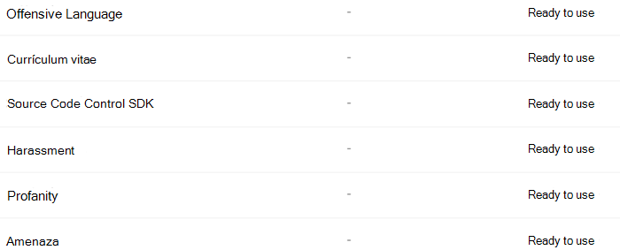

# Obtener información sobre los clasificadores

La clasificación y la etiqueta del contenido para que se pueda proteger y administrar correctamente es el punto de partida de la disciplina de protección de la información. Microsoft 365 tiene tres formas de clasificar el contenido.

## Manualmente

Este método requiere la intervención humana y la acción. Un administrador puede usar las etiquetas preexistentes y los tipos de información confidencial, o crear los suyos propios y, a continuación, publicarlos. Los usuarios y los administradores los aplican al contenido a medida que lo encuentran. A continuación, puede proteger el contenido y administrar su disposición.

## Coincidencia de patrones automatizada

Esta categoría de mecanismos de clasificación incluye la búsqueda de contenido por:

- Palabras clave o valores de metadatos (lenguaje de consulta de palabras clave).
- Uso de patrones identificados anteriormente de información confidencial, como seguridad social, números de tarjeta de crédito o cuenta bancaria [(definiciones de entidad de tipo información confidencial)](sensitive-information-type-entity-definitions.md).
- Reconocimiento de un elemento porque es una variante de una plantilla [(impresión](document-fingerprinting.md)de los dedos de los documentos).
- Uso de la presencia de cadenas exactas [(coincidencia exacta de datos)](create-custom-sensitive-information-types-with-exact-data-match-based-classification.md).

Las etiquetas de confidencialidad y retención se pueden aplicar automáticamente para que el contenido esté disponible para su uso en las directivas de [prevención de pérdida de datos (DLP)](data-loss-prevention-policies.md) y de [aplicación automática para las etiquetas de retención](apply-retention-labels-automatically.md).

## Clasificadores

Este método de clasificación es especialmente adecuado para el contenido que no se identifica fácilmente por los métodos de coincidencia de patrón manuales o automatizados. Este método de clasificación es más sobre cómo entrenar a un clasificador para identificar un elemento en función de lo que es el elemento, no por los elementos que están en el elemento (coincidencia de modelos). Un clasificador aprende a identificar un tipo de contenido mirando cientos de ejemplos del contenido que le interesa clasificar. Empiece por alimentar los ejemplos que están en la categoría de forma indefinida. Una vez que los procesa, lo prueba mediante una combinación de ambos ejemplos que coinciden y no coinciden. A continuación, el clasificador crea predicciones sobre si un elemento determinado pertenece a la categoría que se está creando. A continuación, se confirman los resultados, se ordenan los verdaderos positivos, los verdaderos negativos, los falsos positivos y falsos negativos para ayudar a aumentar la precisión de sus predicciones. 

Al publicar el clasificador, ordena por elementos en ubicaciones como SharePoint Online, Exchange y OneDrive, y clasifica el contenido. Después de publicar el clasificador, puede seguir entrenando mediante un proceso de comentarios similar al proceso de entrenamiento inicial.

### Dónde puede usar clasificadores interexperto
Tanto los clasificadores integrados como los clasificadores entrenados están disponibles como condición para el [etiquetado automático de Office con etiquetas de confidencialidad](apply-sensitivity-label-automatically.md), [aplicar automáticamente una directiva de etiqueta de retención basada en una condición](apply-retention-labels-automatically.md#configuring-conditions-for-auto-apply-retention-labels) y en el cumplimiento de la [comunicación](communication-compliance.md). 

Las etiquetas de confidencialidad pueden usar clasificadores como condiciones, vea [aplicar una etiqueta de confidencialidad a contenido automáticamente](apply-sensitivity-label-automatically.md).

> [!IMPORTANT]
> Los clasificadores solo funcionan con los elementos que no están cifrados y que están en inglés.

## Tipos de clasificadores

- **clasificadores preparados previamente** : Microsoft ha creado y ha entrenado previamente una serie de clasificadores que puede empezar a usar sin tener que entrenarlos. Estos clasificadores aparecerán con el estado de `Ready to use` .
- **clasificadores personalizados** : Si tiene necesidades de clasificación que se extienden más allá de lo que cubren los clasificadores preparados previamente, puede crear y entrenar sus propios clasificadores.

### Clasificadores preparados previamente

Microsoft 365 incluye cinco clasificadores preparados previamente:

> [!CAUTION]
> Estamos dejando de usar el clasificador preentrenado por **idioma ofensivo** porque ha producido un gran número de falsos positivos. No lo use y, si actualmente lo está usando, debería mover sus procesos de negocio fuera de él. En su lugar, se recomienda usar en su lugar los clasificadores de **amenazas**, **blasfemias** y **acoso** previamente entrenados.

- **Currículos**: detecta los elementos que son cuentas de texto de la cualificación personal, educativa, profesional, experiencia laboral y otra información de identificación personal del solicitante.
- **Código de origen**: detecta elementos que contienen un conjunto de instrucciones e instrucciones escritas en los 25 principales lenguajes de programación usados del equipo en github
    - Código
    - C
    - C#
    - +
    - Clojure
    - CoffeeScript
    - Ir
    - Haskell
    - Java
    - JavaScript
    - Lua
    - MATLAB
    - Objective-C
    - Perl
    - PHP
    - Python
    - R
    - Ruby
    - Scala
    - Consola
    - Rápido
    - Tex
    - Script de VIM

> [!NOTE]
> El código fuente está entrenado para detectar cuando la mayor parte del texto es código fuente. No detecta texto de código fuente intercalado con texto sin formato.

- **Acosar**: detecta una categoría específica de elementos de texto de lenguaje ofensivo relacionados con la conducta ofensiva dirigida a uno o varios individuos en función de los siguientes rasgos: raza, étnico, religión, origen nacional, sexo, orientación sexual, edad, discapacidad
- **Blasfemias**: detecta una categoría específica de elementos de texto de lenguaje ofensivo que contiene expresiones que avergonzan a la mayoría de las personas
- **Amenaza**: detecta una categoría específica de elementos de texto de lenguaje ofensivo relacionados con amenazas para confirmar violencia o daño físico o daño a una persona o propiedad

Estos aparecen en la vista clasificador de datos del **centro de cumplimiento de 365 de Microsoft**  >  y de clasificación de **datos**  >   con el estado de `Ready to use` .

> [!IMPORTANT]
> Tenga en cuenta que el idioma ofensivo, el acoso, los términos blasfemos y los clasificadores de amenazas solo funcionan con texto que admite búsquedas no es exhaustivo o completo.  Además, los estándares de idioma y culturales cambian continuamente y, teniendo en cuenta estas realidades, Microsoft se reserva el derecho de actualizar estos clasificadores según su criterio. Aunque los clasificadores pueden ayudar a su organización a supervisar el uso ofensivo y otros idiomas, los clasificadores no abordan las consecuencias de ese lenguaje y no pretenden proporcionar a los únicos medios de supervisar o responder al uso de ese lenguaje en su organización. Su organización, y no Microsoft o sus subsidiarias, sigue siendo responsable de todas las decisiones relacionadas con la supervisión, la aplicación, el bloqueo, la eliminación y la retención de cualquier contenido identificado por un clasificador previamente entrenado.

### Clasificadores personalizados

Cuando los clasificadores preparados de antemano no satisfagan sus necesidades, puede crear y entrenar sus propios clasificadores. Hay mucho más trabajo en lo que se refiere a la creación de los suyos, pero estarán más adaptados a las necesidades de su organización. 

Por ejemplo, podría crear clasificadores que se puedan entrenar para:
 
- Documentos legales, como privilegio de clientes de abogados, conjuntos de cierre, declaración de trabajo
- Documentos empresariales estratégicos: como comunicados de prensa, fusiones y adquisiciones, planes comerciales o de marketing, propiedad intelectual, patentes, documentos de diseño
- Información de precios: como facturas, ofertas de precios, órdenes de trabajo, documentos de pujas 
- Información financiera: por ejemplo, inversiones en la organización, resultados trimestrales o anuales    

#### Flujo de proceso para crear clasificadores personalizados

La creación y publicación de un clasificador para su uso en las soluciones de cumplimiento, como las directivas de retención y la supervisión de la comunicación, sigue este flujo. Para obtener más información sobre la creación de un clasificador que se pudiera personalizar, vea [crear un clasificador personalizado](classifier-get-started-with.md).

### Volver a entrenar clasificadores

Puede ayudar a mejorar la precisión de todos los clasificadores personalizados y algunos clasificadores preparados previamente proporcionándoles comentarios sobre la exactitud de la clasificación que realizan. Se denomina reentrenamiento y sigue este flujo de trabajo.

## Vea también

- [Etiquetas de retención](retention.md)
- [Prevención de pérdida de datos (DLP)](data-loss-prevention-policies.md)
- [Etiquetas de confidencialidad](sensitivity-labels.md)
- [Definiciones de entidad de tipos de información confidencial](sensitive-information-type-entity-definitions.md)
- [Impresión de los dedos del documento](document-fingerprinting.md)
- [Coincidencia exacta de datos](create-custom-sensitive-information-types-with-exact-data-match-based-classification.md)
