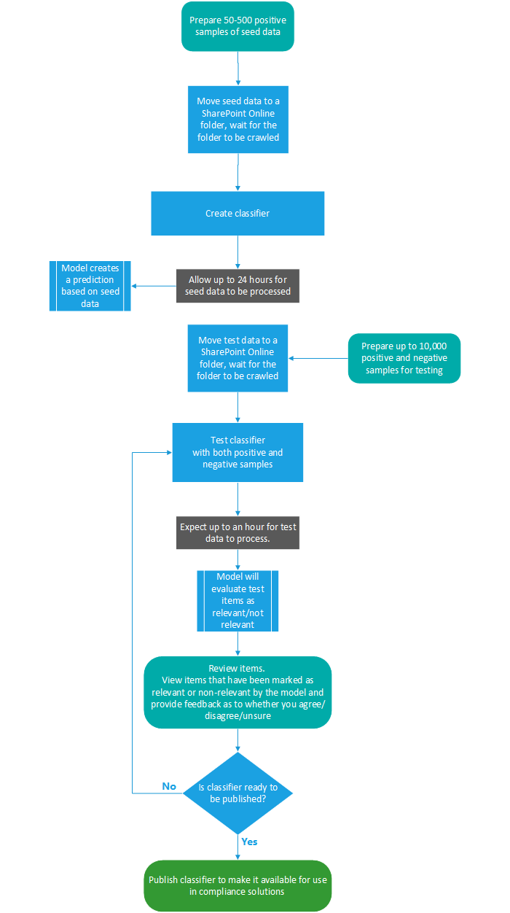

# Obtenga información sobre los clasificadores entrenables

Clasificar y etiquetar contenido para que pueda protegerse y controlarse correctamente es el punto de partida de la disciplina de protección de la información. Microsoft 365 tiene tres formas de clasificar contenido.

## Manualmente

Este método requiere criterio humano y acción. Un administrador puede usar las etiquetas existentes y los tipos de información confidencial o crear las suyas propias y luego publicarlas. Los usuarios y administradores los aplican al contenido cuando lo encuentran. A continuación, puede proteger el contenido y administrar su eliminación.

## Coincidencia de patrones automatizada

Esta categoría de mecanismos de clasificación incluye la búsqueda de contenido por:

- Palabras clave o valores de metadatos (lenguaje de consulta de palabras clave).
- Usar patrones identificados previamente de información confidencial como seguridad social, tarjeta de crédito o números de cuenta bancaria [(definiciones](sensitive-information-type-entity-definitions.md)de entidad de tipo de información confidencial).
- Reconocer un elemento porque es una variación en una plantilla [(impresión con el dedo del documento)](document-fingerprinting.md).
- Usar la presencia de cadenas exactas [(coincidencia exacta de datos)](create-custom-sensitive-information-types-with-exact-data-match-based-classification.md).

Las etiquetas de confidencialidad y retención se pueden aplicar automáticamente para que el contenido esté disponible para su uso en la prevención de pérdida de datos [(DLP)](data-loss-prevention-policies.md) y aplicar automáticamente directivas para [etiquetas de retención.](apply-retention-labels-automatically.md)

## Clasificadores

Este método de clasificación es especialmente adecuado para el contenido que no se identifica fácilmente mediante los métodos de coincidencia de patrones manuales o automatizados. Este método de clasificación consiste más en formar a un clasificador para identificar un elemento en función de lo que es el elemento, no de los elementos que están en el elemento (coincidencia de patrones). Un clasificador aprende a identificar un tipo de contenido consultando cientos de ejemplos del contenido que le interesa clasificar. Empieza por darle ejemplos que definitivamente están en la categoría. Una vez que los procese, prosébalo con una combinación de ejemplos de coincidencia y de no coincidencia. A continuación, el clasificador realiza predicción sobre si un elemento determinado entra en la categoría que estás creando. A continuación, confirma sus resultados, ordenando los verdaderos positivos, los verdaderos negativos, los falsos positivos y los falsos negativos para ayudar a aumentar la precisión de sus predicción. 

Cuando publica el clasificador, ordena los elementos en ubicaciones como SharePoint Online, Exchange y OneDrive, y clasifica el contenido. Después de publicar el clasificador, puede seguir entrenando con un proceso de comentarios similar al proceso de aprendizaje inicial.

### Dónde puede usar clasificadores que se pueden entrenar
Tanto los clasificadores integrados como los clasificadores que se pueden entrenar están disponibles como condición para la etiqueta automática de [Office](apply-sensitivity-label-automatically.md)con etiquetas de confidencialidad,  aplicar automáticamente la directiva de etiquetas de retención en función de una condición y en el cumplimiento de las [comunicaciones.](communication-compliance.md) 

Las etiquetas de confidencialidad pueden usar clasificadores como condiciones, vea [Aplicar automáticamente una etiqueta de confidencialidad al contenido.](apply-sensitivity-label-automatically.md)

> [!IMPORTANT]
> Los clasificadores solo funcionan con elementos que no están cifrados y están en inglés.

## Tipos de clasificadores

- **clasificadores previamente formados:** Microsoft ha creado y formado previamente una serie de clasificadores que puede empezar a usar sin entrenamiento. Estos clasificadores aparecerán con el estado de `Ready to use` .
- **clasificadores personalizados:** si tiene necesidades de clasificación que se extienden más allá de lo que cubren los clasificadores previamente formados, puede crear y entrenar a sus propios clasificadores.

### Clasificadores previamente formados

Microsoft 365 incluye cinco clasificadores previamente formados:

> [!CAUTION]
> Estamos desusando el clasificador de lenguaje ofensivo **previamente** formado porque ha estado produciendo un gran número de falsos positivos. No lo use y, si actualmente lo está usando, debe quitar los procesos de negocio. Se recomienda usar en **su** lugar  los clasificadores de amenazas, **blasfecciones** y acoso previamente formados.

- **Currículos:** detecta elementos que son cuentas textuales de la cualificación personal, educativa, profesional, experiencia profesional y otra información de identificación personal de un solicitante
- **Código fuente:** detecta elementos que contienen un conjunto de instrucciones e instrucciones escritas en los primeros 25 lenguajes de programación de equipos usados en GitHub
    - ActionScript
    - C
    - C#
    - C++
    - Abalorio
    - CoffeeScript
    - Ir
    - Haskell
    - Java
    - JavaScript
    - Lua
    - MATLAB
    - Objective-C
    - Perl
    - PHP
    - Python
    - R
    - Ruby
    - Scala
    - Consola
    - Swift
    - Texas
    - Vim Script

> [!NOTE]
> El código fuente está formado para detectar cuándo la mayor parte del texto es código fuente. No detecta texto de código fuente intercalado con texto sin formato.

- Acoso: detecta una categoría específica de elementos de texto de lenguaje ofensivo relacionados con la conducta ofensiva dirigida a una o varias personas en función de los siguientes rasgos: carrera, etnicidad, aria, origen nacional, género, orientación sexual, edad, discapacidad
- **Blasfismo:** detecta una categoría específica de elementos de texto de lenguaje ofensivo que contienen expresiones que enalteten a la mayoría de las personas.
- **Amenaza:** detecta una categoría específica de elementos de texto de lenguaje ofensivo relacionados con amenazas para cometir violencia o causar daños físicos a una persona o propiedad

Aparecen en la vista Clasificadores que se pueden entrenar del Centro de cumplimiento de **Microsoft 365**  >    >   con el estado de `Ready to use` .

> [!IMPORTANT]
> Tenga en cuenta que el lenguaje ofensivo, el acoso, la blasfedad y los clasificadores de amenazas solo funcionan con texto que permite búsquedas no son exhaustivos ni completos.  Además, los estándares culturales y de idioma cambian continuamente y, a la luz de estas realidades, Microsoft se reserva el derecho de actualizar estos clasificadores según su criterio. Aunque los clasificadores pueden ayudar a su organización a supervisar la ofensiva y otros idiomas usados, los clasificadores no abordan las consecuencias de dicho idioma y no están diseñados para proporcionar el único medio de supervisión o respuesta de su organización al uso de dicho idioma. Su organización, y no Microsoft o sus subsidiarias, sigue siendo responsable de todas las decisiones relacionadas con la supervisión, la aplicación, el bloqueo, la eliminación y la retención de cualquier contenido identificado por un clasificador formado previamente.

### Clasificadores personalizados

Cuando los clasificadores previamente formados no satisfacen sus necesidades, puede crear y entrenar a sus propios clasificadores. Hay mucho más trabajo implicado en la creación de los suyos propios, pero estarán mucho mejor adaptados a las necesidades de su organización. 

Por ejemplo, podría crear clasificadores que se puedan entrenar para:
 
- Documentos legales: como privilegios de cliente abogado, conjuntos de cierre, declaración de trabajo
- Documentos empresariales estratégicos: como comunicados de prensa, fusiones y adquisiciones, acuerdos, planes de negocio o marketing, propiedad intelectual, patentes, documentos de diseño
- Información sobre precios: como facturas, presupuestos, pedidos de trabajo, documentos de ofertas 
- Información financiera: como inversiones de la organización, resultados trimestrales o anuales    

#### Flujo de proceso para crear clasificadores personalizados

La creación y publicación de un clasificador para su uso en soluciones de cumplimiento, como directivas de retención y supervisión de comunicaciones, sigue este flujo. Para obtener más información sobre cómo crear un clasificador que se puede entrenar personalizado, vea Crear [un clasificador personalizado.](classifier-get-started-with.md)

### Volver a entrenar clasificadores

Puede ayudar a mejorar la precisión de todos los clasificadores personalizados y algunos clasificadores previamente formados proporcionando comentarios sobre la precisión de la clasificación que realizan. Esto se denomina volver a entrenar y seguir este flujo de trabajo.

## Vea también

- [Etiquetas de retención](retention.md)
- [Prevención de pérdida de datos (DLP)](data-loss-prevention-policies.md)
- [Etiquetas de confidencialidad](sensitivity-labels.md)
- [Definiciones de entidad de tipos de información confidencial](sensitive-information-type-entity-definitions.md)
- [Impresión con dedo de documento](document-fingerprinting.md)
- [Coincidencia exacta de datos](create-custom-sensitive-information-types-with-exact-data-match-based-classification.md)
