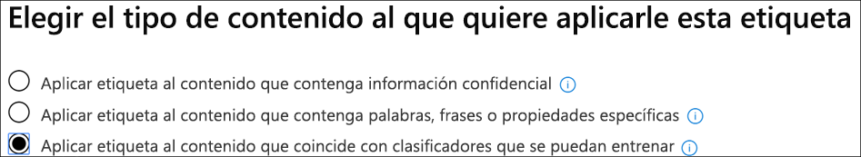

# Uso de un clasificador integrado (versión preliminar)Using a built-in classifier (preview)

Microsoft ha entrenado y probado cinco clasificadores con conjuntos de datos de ejemplo muy grandes, lo que puede ayudar a identificar determinadas categorías de contenido.Microsoft has trained and tested five classifiers using very large sample data sets, which can help to identify certain categories of content. Consulte [Introducción a los clasificadores capacitados (versión preliminar)](classifier-getting-started-with.md).See [Getting started with trainable classifiers (preview)](classifier-getting-started-with.md). Estos clasificadores se muestran en el `Ready to use` grupo de forma predeterminada.These classifiers show up in the `Ready to use` group by default.

Microsoft 365 incluye cinco clasificadores integrados recomendados:Microsoft 365 comes with five recommended built-in classifiers:

> [!CAUTION]
> Estamos descartando el clasificador integrado de **lenguaje ofensivo** porque ha generado un gran número de falsos positivos.We are deprecating the **Offensive Language** built-in classifier because it has been producing a high number of false positives. No lo use y, si actualmente lo está usando, debería mover sus procesos de negocio fuera de él.Don't use it and if you are currently using it, you should move your business processes off of it. En su lugar, se recomienda usar los clasificadores de **amenaza**, **blasfemia**y **acoso** integrados.We recommend using the **Threat**, **Profanity**, and **Harassment** built-in classifiers instead.

- **Currículos**: detecta los elementos que son cuentas de texto de la cualificación personal, educativa, profesional, experiencia laboral y otra información de identificación personal del solicitante.**Resumes**: detects items that are textual accounts of an applicant's personal, educational, professional qualifications, work experience, and other personally identifying information.
- **Código fuente**: detecta elementos que contienen un conjunto de instrucciones e instrucciones escritas en los 25 principales lenguajes de programación usados en github.**Source Code**: detects items that contain a set of instructions and statements written in the top 25 used computer programming languages on GitHub.

|nombre del idiomalanguage name|||||
|---------|---------|---------|---------|---------|
|CódigoActionScript|CC        |CA #C#       |+C++     |ClojureClojure  |
|CoffeeScriptCoffeeScript|CSSCSS     |IrGo       |HaskellHaskell |HTMLHTML     |
|JavaJava     |JavaScriptJavaScript|LuaLua      |MATLABMATLAB   |Objective-CObjective-C|
|PerlPerl     |PHPPHP      |PythonPython   |RR        |RubyRuby     |
|ScalaScala    |ConsolaShell    |RápidoSwift    |TexTex      |Script de VIMVim Script|

- **Acosar**: detecta una categoría específica de elementos de texto de lenguaje ofensivo relacionados con la conducta ofensiva dirigida a uno o varios individuos en función de los siguientes rasgos: raza, étnico, religión, origen nacional, sexo, orientación sexual, edad, discapacidad.**Harassment**: detects a specific category of offensive language text items related to offensive conduct targeting one or multiple individuals based on the following traits: race, ethnicity, religion, national origin, gender, sexual orientation, age, disability.
- **Blasfemias**: detecta una categoría específica de elementos de texto de lenguaje ofensivo que contiene expresiones que avergonzan a la mayoría de las personas.**Profanity**: detects a specific category of offensive language text items that contain expressions that embarrass most people.
- **Threat**: detecta una categoría específica de elementos de texto de lenguaje ofensivo relacionadas con amenazas para confirmar violencia o daño físico o daño a una persona o propiedad.**Threat**: detects a specific category of offensive language text items related to threats to commit violence or do physical harm or damage to a person or property,

> [!NOTE]
> Antes de usar clasificadores integrados en el flujo de trabajo de clasificación y etiquetado, debe probarlo con una muestra del contenido de la organización que considere que la categoría para comprobar que sus predicciones de clasificación satisfacen sus expectativas.Before using built-in classifiers in your classification and labeling workflow, you should test it against a sample of your organization's content that you feel fits the category to verify that its classification predictions meet your expectations.

> [!IMPORTANT]
> Tenga en cuenta que el idioma ofensivo, el acoso, los términos blasfemos y los clasificadores de amenazas solo funcionan con texto que admite búsquedas no es exhaustivo o completo.Please note that the offensive language, harassment, profanity, and threat classifiers only work with searchable text are not exhaustive or complete. Además, los estándares de idioma y culturales cambian continuamente y, teniendo en cuenta estas realidades, Microsoft se reserva el derecho de actualizar estos clasificadores según su criterio.Further, language and cultural standards continually change, and in light of these realities, Microsoft reserves the right to update these classifiers in its discretion. Aunque los clasificadores pueden ayudar a su organización a supervisar el uso ofensivo y otros idiomas, los clasificadores no abordan las consecuencias de ese lenguaje y no pretenden proporcionar a los únicos medios de supervisar o responder al uso de ese lenguaje en su organización.While the classifiers may assist your organization in monitoring offensive and other language used, the classifiers do not address consequences of such language and are not intended to provide your organization's sole means of monitoring or responding to the use of such language. Su organización, y no Microsoft o sus subsidiarias, sigue siendo responsable de todas las decisiones relacionadas con la supervisión, la aplicación, el bloqueo, la eliminación y la retención de cualquier contenido identificado por un clasificador previamente entrenado.Your organization, and not Microsoft or its subsidiaries, remains responsible for all decisions related to monitoring, enforcement, blocking, removal and retention of any content identified by a pre-trained classifier.

## Cómo preparar y usar un clasificador integradoHow to prepare for and use a built-in classifier

1. Recopile los elementos de contenido de pruebas desechables que considera que pertenecen a la categoría del clasificador integrado (coincidencias positivas) y los que no se deben incluir (coincidencias negativas) en la categoría que está probando.Collect disposable test content items that you feel belong in the category of the built-in classifier (positive matches) and ones that shouldn't be included (negative matches) in the category you're testing.

> [!IMPORTANT]
> Los elementos de ejemplo no deben estar cifrados y deben estar en inglés.The sample items must not be encrypted and they must be in English.

2. Cree una carpeta dedicada de SharePoint Online; espere al menos una hora para que la carpeta se agregue al índice de búsqueda.Create a dedicated SharePoint Online folder; wait at least an hour for the folder to be added to the search index. Anote la dirección URL de la carpeta.Make note of the folder URL.

3. Inicie sesión en el centro de cumplimiento de Microsoft 365 con el administrador de cumplimiento o el rol de administrador de seguridad y abra la ficha**directivas** de administración de registros del **Centro** > de cumplimiento de Microsoft 365 **(versión preliminar)** > .Sign in to Microsoft 365 compliance center with compliance admin or security admin role access and open **Microsoft 365 compliance center** > **Records management (preview)** > **Label policies** tab.

4. Elija `Auto-apply a label`.Choose `Auto-apply a label`.

5. Elija `Choose a label to auto-apply`.Choose `Choose a label to auto-apply`.

6. Elija `Create new labels` y cree una etiqueta para usarla sólo con esta prueba.Choose `Create new labels` and create a label for use just with this test. Cuando lo haga, deje `Retention` el valor en desactivado.When you do this, leave `Retention` set to off. No desea activar ninguna retención ni otras acciones.You don't want to turn on any retention or other actions. En este caso, utilizará la etiqueta de retención simplemente como una etiqueta de texto, sin aplicar ninguna acción.In this case, you'll be using the retention label simply as a text label, without enforcing any actions. Por ejemplo, puede crear una etiqueta de retención denominada "SourceCode Classifier test" sin ninguna acción y, a continuación, aplicar automáticamente esa etiqueta de retención a contenido que tiene clasificador de código fuente como condición.For example, you can create a retention label named "SourceCode classifier test" with no actions, and then auto-apply that retention label to content that has Source code classifier as a condition. Para obtener más información acerca de la creación de etiquetas de retención, consulte [Overview of Retention Labels](labels.md).To learn more about creating retention labels, see [Overview of retention labels](labels.md).
  
7. Elija `Auto-apply a label` y, `Choose a label to auto-apply`a continuación,.Choose `Auto-apply a label` and then `Choose a label to auto-apply`. Para obtener más información sobre el uso de la aplicación basada en condiciones, aplique automáticamente una etiqueta vea, [aplique automáticamente una directiva de etiqueta de retención basada en una condición](labels.md#applying-a-retention-label-automatically-based-on-conditions).To learn more about using condition based auto-apply a label see, [auto-apply retention label policy based on a condition](labels.md#applying-a-retention-label-automatically-based-on-conditions).

8. Elija su etiqueta de prueba de la lista y `Next`elija.Choose your test label from the list and choose `Next`.

9. Elija `Apply label to content that matches a trainable classifier`.Choose `Apply label to content that matches a trainable classifier`.

..

10. Elija su clasificador de la lista, en este caso`Source Code`Choose your classifier from the list, in this case `Source Code`

11. Asigne un nombre a la Directiva, por ejemplo, "prueba de clasificador del código fuente integrada".Name the policy, for example "Source code built-in classifier test".

12. Elija `Let me choose specific locations`.Choose `Let me choose specific locations`.

13. Desactive todas las ubicaciones `SharePoint sites` excepto y `Choose sites`elija.Turn off all locations except `SharePoint sites` and choose `Choose sites`.

14. Escriba la dirección URL del sitio en el paso 2.Enter the URL for the site from step 2.

15. Finaliza el asistente y elige`Auto-apply`Finish the wizard and choose `Auto-apply`

16. Ponga los elementos de prueba en la carpeta dedicada de SharePoint Online.Place the test items into the dedicated SharePoint Online folder.

17. Permite aplicar una hora para la etiqueta.Allow an hour for the label to be applied.

18. Compruebe las propiedades de los documentos para la etiqueta para ver si el clasificador incluyó y excluya el contenido de prueba tal como esperaba.Check the properties of the documents for the label to see if the classifier included and excluded the test content as you expected.

19. Revise los elementos etiquetados.Review the items that were labeled.

20. Elimine el contenido y la Directiva de etiqueta si ya ha terminado con las pruebas.Delete the content and the label policy if you're done with your testing.

Vea también:See also:

- [Introducción al entrenamiento de clasificadores (vista previa)Getting started with trainable classifiers (preview)](classifier-getting-started-with.md)
- [Introducción a las etiquetas de retenciónOverview of retention labels](labels.md)
- [Aplicar automáticamente una directiva de etiqueta de retención basada en una condiciónAuto-apply retention label policy based on a condition](labels.md#applying-a-retention-label-automatically-based-on-conditions)
