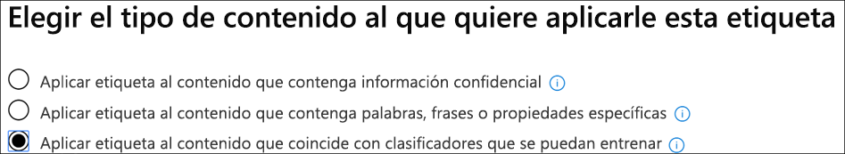

# Usar un clasificador listo para usar (vista previa)

Microsoft ha entrenado y probado varios clasificadores con conjuntos de datos de ejemplo muy grandes, lo que puede ayudar a identificar determinadas categorías de contenido. Consulte [Introducción a los clasificadores capacitados (versión preliminar)](classifier-getting-started-with.md). Estos clasificadores se muestran en el `Ready to use` grupo de forma predeterminada.

- **Lenguaje ofensivo**: detecta los elementos de texto que contienen palabras soeces, Slurs, taunts y expresiones disfrazadas (que son expresiones que tienen el mismo significado que un término más ofensivo).
- **Currículos**: detecta los elementos que son cuentas de texto de la cualificación personal, educativa, profesional, experiencia laboral y otra información de identificación personal del solicitante.
- **SourceCode**: detecta elementos que contienen un conjunto de instrucciones e instrucciones escritas en lenguajes de programación de equipos ampliamente usados.
- **Acosar**: detecta una categoría específica de elementos de texto de lenguaje ofensivo relacionados con la conducta ofensiva dirigida a uno o varios individuos en función de los siguientes rasgos: raza, étnico, religión, origen nacional, sexo, orientación sexual, edad, discapacidad.
- **Blasfemias**: detecta una categoría específica de elementos de texto de lenguaje ofensivo que contiene expresiones que avergonzan a la mayoría de las personas.
- **Threat**: detecta una categoría específica de elementos de texto de lenguaje ofensivo relacionadas con amenazas para confirmar violencia o daño físico o daño a una persona o propiedad.

> [!NOTE]
> Antes de usar los clasificadores listos para usar en el flujo de trabajo de clasificación y etiquetado, debe probarlo con una muestra del contenido de la organización que sienta que se ajusta a la categoría para comprobar que sus predicciones de clasificación satisfacen sus expectativas.

> [!IMPORTANT]
> Tenga en cuenta que el idioma ofensivo, el acoso, los términos blasfemos y los clasificadores de amenazas solo funcionan con texto que admite búsquedas no es exhaustivo o completo. Además, los estándares de idioma y culturales cambian continuamente y, teniendo en cuenta estas realidades, Microsoft se reserva el derecho de actualizar estos clasificadores según su criterio. Aunque los clasificadores pueden ayudar a su organización a supervisar el uso ofensivo y otros idiomas, los clasificadores no abordan las consecuencias de dicho lenguaje y no pretenden proporcionar a los únicos medios de supervisión de la organización o responder al uso de ese idioma. Su organización, y no Microsoft o sus subsidiarias, sigue siendo responsable de todas las decisiones relacionadas con la supervisión, la aplicación, el bloqueo, la eliminación y la retención de cualquier contenido identificado por un clasificador previamente entrenado.

## Cómo preparar y usar un clasificador listo para usar

1. Recopile los elementos de contenido de pruebas desechables que considera que pertenecen a la categoría del clasificador listo para usar (coincidencias positivas) y de los que no se deben incluir (coincidencias negativas) en la categoría que está probando.

> [!IMPORTANT]
> Los elementos de ejemplo no deben estar cifrados y deben estar en inglés.

2. Cree una carpeta dedicada de SharePoint Online; espere al menos una hora para que la carpeta se agregue al índice de búsqueda. Anote la dirección URL de la carpeta.

3. Inicie sesión en el centro de cumplimiento de Microsoft 365 con el administrador de cumplimiento o el rol de administrador de seguridad y abra la ficha**directivas** de administración de registros del **Centro** > de cumplimiento de Microsoft 365 **(versión preliminar)** > .

4. Elija `Auto-apply a label`.

5. Elija `Choose a label to auto-apply`.

6. Elija `Create new labels` y cree una etiqueta para usarla sólo con esta prueba. Cuando lo haga, deje `Retention` el valor en desactivado. No desea activar ninguna retención ni otras acciones. En este caso, utilizará la etiqueta de retención simplemente como una etiqueta de texto, sin aplicar ninguna acción. Por ejemplo, puede crear una etiqueta de retención denominada "SourceCode Classifier test" sin ninguna acción y, a continuación, aplicar automáticamente esa etiqueta de retención a contenido que tiene clasificador de código fuente como condición. Para obtener más información acerca de la creación de etiquetas de retención, consulte [Overview of Retention Labels](labels.md).
  
7. Elija `Auto-apply a label` y, `Choose a label to auto-apply`a continuación,. Para obtener más información sobre el uso de la aplicación basada en condiciones, aplique automáticamente una etiqueta vea, [aplique automáticamente una directiva de etiqueta de retención basada en una condición](labels.md#applying-a-retention-label-automatically-based-on-conditions).

8. Elija su etiqueta de prueba de la lista y `Next`elija.

9. Elija `Apply label to content that matches a trainable classifier`.

.

10. Elija su clasificador de la lista, en este caso`Source Code`

11. Asigne un nombre a la Directiva, por ejemplo, "código fuente preparado para usar la prueba de clasificador".

12. Elija `Let me choose specific locations`.

13. Desactive todas las ubicaciones `SharePoint sites` excepto y `Choose sites`elija.

14. Escriba la dirección URL del sitio en el paso 2.

15. Finaliza el asistente y elige`Auto-apply`

16. Ponga los elementos de prueba en la carpeta dedicada de SharePoint Online.

17. Permite aplicar una hora para la etiqueta.

18. Compruebe las propiedades de los documentos para la etiqueta para ver si el clasificador incluyó y excluya el contenido de prueba tal como esperaba.

19. Revise los elementos etiquetados.

20. Elimine el contenido y la Directiva de etiqueta si ya ha terminado con las pruebas.

Vea también:

- [Introducción al entrenamiento de clasificadores (vista previa)](classifier-getting-started-with.md)
- [Introducción a las etiquetas de retención](labels.md)
- [Aplicar automáticamente una directiva de etiqueta de retención basada en una condición](labels.md#applying-a-retention-label-automatically-based-on-conditions)
