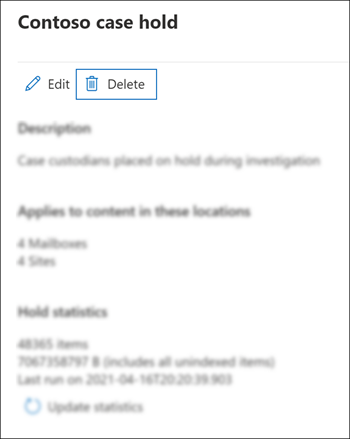

# Cerrar, volver a abrir y eliminar un caso de exhibición de documentos electrónicos principalClose, reopen, and delete a Core eDiscovery case

En este artículo se describe cómo cerrar, volver a abrir y eliminar los casos principales de exhibición de documentos electrónicos en Microsoft 365.This article describes how to close, reopen, and delete Core eDiscovery cases in Microsoft 365.

## Cerrar un casoClose a case

Cuando se complete el caso legal o la investigación admitida por un caso de exhibición de documentos electrónicos principales, puede cerrar el caso.When the legal case or investigation supported by a Core eDiscovery case is completed, you can close the case. Esto es lo que sucede al cerrar un caso:Here's what happens when you close a case:
  
- Si el caso contiene alguna retención de exhibición de documentos electrónicos, se desactivarán.If the case contains any eDiscovery holds, they will be turned off. Después de desactivar la retención, se aplica un período de gracia de 30 días (denominado retención de *retraso)* a las ubicaciones de contenido que estaban en espera.After the hold is turned off, a 30-day grace period (called a *delay hold*) is applied to content locations that were on hold. Esto ayuda a evitar que el contenido se elimine inmediatamente y proporciona a los administradores la oportunidad de buscar y restaurar contenido antes de que pueda eliminarse permanentemente después de que expire el período de retención de retraso.This helps prevent content from being immediately deleted and provides admins the opportunity to search for and restore content before it may be permanently deleted after the delay hold period expires. Para obtener más información, vea [Quitar ubicaciones de contenido de una retención de exhibición de documentos electrónicos](create-ediscovery-holds.md#removing-content-locations-from-an-ediscovery-hold).For more information, see [Removing content locations from an eDiscovery hold](create-ediscovery-holds.md#removing-content-locations-from-an-ediscovery-hold).

- Cerrar un caso solo desactiva las retenciones que están asociadas a ese caso.Closing a case only turns off the holds that are associated with that case. Si otras retenciones se colocan en una ubicación de contenido (como una retención por juicio, una directiva de retención o una retención de un caso de exhibición de documentos electrónicos principal diferente) esas retenciones se mantendrán.If other holds are placed on a content location (such as a Litigation Hold, a retention policy, or a hold from a different Core eDiscovery case) those holds will still be maintained.

- El caso sigue en la lista en la página eDiscovery principal del centro de Microsoft 365 cumplimiento.The case is still listed on the Core eDiscovery page in the Microsoft 365 compliance center. Se conservan los detalles, las retenciones, las búsquedas y los miembros de un caso cerrado.The details, holds, searches, and members of a closed case are retained.

- Puede editar un caso después de cerrarlo.You can edit a case after it's closed. Por ejemplo, puede agregar o quitar miembros, crear búsquedas y exportar resultados de búsqueda.For example, you can add or remove members, create searches, and export search results. La diferencia principal entre los casos activos y cerrados es que las retenciones de exhibición de documentos electrónicos se apagan cuando se cierra un caso.The primary difference between active and closed cases is that eDiscovery holds are turned off when a case is closed.

Para cerrar un caso:To close a case:
  
1. En el centro Microsoft 365 cumplimiento, haga clic en **eDiscovery** Core para mostrar la lista de casos principales de exhibición de documentos electrónicos  >   en su organización.In the Microsoft 365 compliance center, click **eDiscovery** > **Core** to display the list of Core eDiscovery cases in your organization.

2. Haga clic en el nombre del caso que desea cerrar.Click the name of the case that you want to close.

   

3. En la página principal, en **Estado**, haga clic **en Cerrar caso**.On the home page, under **Status**, click **Close case**.

    Se muestra una advertencia que dice que las retenciones asociadas con el caso se desactivarán.A warning is displayed saying that the holds associated with the case will be turned off.

4. Haga **clic en Sí** para cerrar el caso.Click **Yes** to close the case.

    El estado de la página principal del caso cambia **de Activo** a **Cierre**.The status on the case home page is changed from **Active** to **Closing**.

5. En la **página Exhibición de documentos electrónicos principal,** haga clic **en Actualizar** para actualizar el estado del caso cerrado.On the **Core eDiscovery** page, click **Refresh** to update the status of the closed case. El proceso de cierre puede tardar hasta 60 minutos en completarse.It might take up to 60 minutes for the closing process to complete.

    Una vez completado el proceso, el estado del caso cambia a **Cerrado** en la **página eDiscovery** principal.When the process is complete, the status of the case is changed to **Closed** on the **Core eDiscovery** page.

## Volver a abrir un caso cerradoReopen a closed case

Al volver a abrir un caso, las retenciones de exhibición de documentos electrónicos que estaban en su lugar cuando se cerró el caso no se restablecerán automáticamente.When you reopen a case, any eDiscovery holds that were in place when the case was closed won't be automatically reinstated. Una vez que se vuelva a abrir el caso, tendrás que ir a la página **Retenciones** y activar las retenciones anteriores.After the case is reopened, you'll have to go to the **Holds** page and turn on the previous holds. Para activar una retención, selecciónela para mostrar la página flotante y luego configure el interruptor de **Estado** en **Activado**.To turn on a hold, select it to display the flyout page, and then set the **Status** toggle to **On**.
  
1. En el centro Microsoft 365 cumplimiento, haga clic en **eDiscovery** Core para mostrar la lista de casos principales de exhibición de documentos electrónicos  >   en su organización.In the Microsoft 365 compliance center, click **eDiscovery** > **Core** to display the list of Core eDiscovery cases in your organization.

2. Haga clic en el nombre del caso que desea volver a abrir.Click the name of the case that you want to reopen.

   

3. En la página principal, en **Estado,** haga clic **en Abrir caso**.On the home page, under **Status**, click **Reopen case**.

    Se muestra una advertencia que dice que las retenciones asociadas con el caso cuando se cerró no se activarán automáticamente.A warning is displayed saying that the holds that were associated with the case when it was closed won't be turned on automatically.

4. Haga **clic en Sí** para volver a abrir el caso.Click **Yes** to reopen the case.

    El estado de la página principal del caso se cambia de **Cerrado** a **Activo.**The status on the case home page flyout page is changed from **Closed** to **Active**.

5. En la **página Exhibición de documentos electrónicos principal,** haga clic **en Actualizar** para actualizar el estado del caso reabrido.On the **Core eDiscovery** page, click **Refresh** to update the status of the reopened case. El proceso de reapertura puede tardar hasta 60 minutos en completarse.It might take up to 60 minutes for the reopening process to complete. 

    Una vez completado el proceso, el estado del caso cambia a **Activo** en la **página eDiscovery** principal.When the process is complete, the status of the case is changed to **Active** on the **Core eDiscovery** page.

6. (Opcional) Para activar las retenciones asociadas con  el caso reabierto, vaya a la  pestaña Retenciones, seleccione una retención y, a continuación, active la casilla en Estado en la página de control desplegable de retención.(Optional) To turn on any holds associated with the reopened case, go to **Holds** tab, select a hold, and then select the checkbox under **Status** on the hold flyout page.
  
## Eliminar un casoDelete a case

También puede eliminar los casos de exhibición de documentos electrónicos principales activos y cerrados.You can also delete active and closed Core eDiscovery cases. Al eliminar un caso, se eliminan todas las búsquedas y exportaciones del caso  y el caso se quita de la lista de casos de la página Exhibición de documentos electrónicos principal del centro de cumplimiento de Microsoft 365.When you delete a case, all searches and exports in the case are deleted, and the case is removed from the list of cases on the **Core eDiscovery** page in the Microsoft 365 compliance center. No puede volver a abrir un caso eliminado.You can't reopen a deleted case.

Para poder eliminar un caso (ya sea activo o cerrado), primero debe eliminar todas las retenciones de *exhibición* de documentos electrónicos asociadas con el caso.Before you can delete a case (whether it's active or closed), you must first delete *all* eDiscovery holds associated with the case. Esto incluye la eliminación de retenciones con el estado **Off**.That includes deleting holds with a status of **Off**. 

Para eliminar una retención de exhibición de documentos electrónicos:To delete an eDiscovery hold:

1. Vaya a la **pestaña Retenciones** en el caso de que desee eliminar.Go to the **Holds** tab in the case that you want to delete.

2. Seleccione la retención que desea eliminar.Select the hold that you want to delete.

3. En la página desplegable, haga clic en **Eliminar**.On the flyout page, click **Delete**.

      

Para eliminar un caso:To delete a case:

1. En el centro Microsoft 365 cumplimiento, haga clic en **eDiscovery** Core para mostrar la lista de casos principales de exhibición de documentos electrónicos  >   en su organización.In the Microsoft 365 compliance center, click **eDiscovery** > **Core** to display the list of Core eDiscovery cases in your organization.

2. Haga clic en el nombre del caso que desea eliminar.Click the name of the case that you want to delete.

3. En la página principal del caso, en **Estado**, haga clic **en Eliminar caso**.On the case home page, under **Status**, click **Delete case**.

      

Si el caso que intenta eliminar aún contiene retenciones de exhibición de documentos electrónicos, recibirá un mensaje de error.If the case you're trying to delete still contains eDiscovery holds, you'll receive an error message. Tendrás que eliminar todas las retenciones asociadas con el caso e intentar de nuevo eliminar el caso.You'll have to delete all holds associated with the case and then try again to delete the case.
