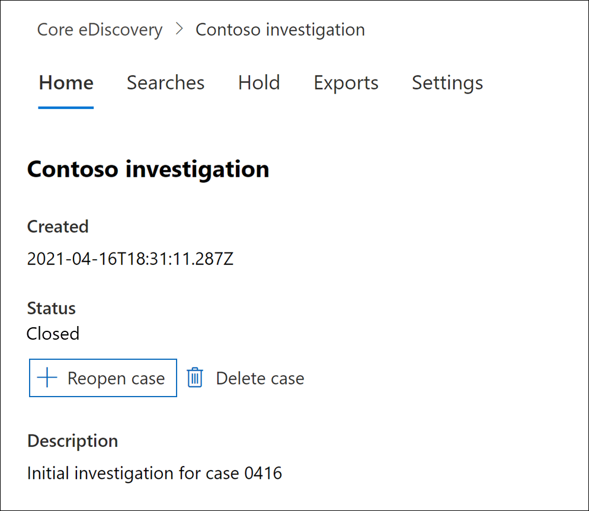

# Cerrar, volver a abrir y eliminar un caso de exhibición de documentos electrónicos (estándar)

[!include[Purview banner](../includes/purview-rebrand-banner.md)]

En este artículo se describe cómo cerrar, volver a abrir y eliminar casos de exhibición de documentos electrónicos (estándar) de Microsoft Purview en Microsoft 365.

## Cerrar un caso

Cuando se complete el caso legal o la investigación compatible con un caso de exhibición de documentos electrónicos (estándar), puede cerrar el caso. Esto es lo que ocurre al cerrar un caso:
  
- Si el caso contiene cualquier suspensión de eDiscovery, se desactivarán. Una vez desactivada la suspensión, se aplica un período de gracia de 30 días (denominado *suspensión de retraso*) a las ubicaciones de contenido que estaban en espera. Esto ayuda a evitar que el contenido se elimine inmediatamente y proporciona a los administradores la oportunidad de buscar y restaurar contenido antes de que se pueda eliminar permanentemente después de que expire el período de retención de retraso. Para obtener más información, vea [Eliminación de ubicaciones de contenido de una suspensión de eDiscovery](create-ediscovery-holds.md#removing-content-locations-from-an-ediscovery-hold).

- Cerrar un caso solo desactiva las retenciones que están asociadas a ese caso. Si otras retenciones se colocan en una ubicación de contenido (como una suspensión por juicio, una directiva de retención o una suspensión de un caso de exhibición de documentos electrónicos (estándar) diferente), esas retenciones se mantendrán.

- El caso sigue aparecen en la página eDiscovery (Estándar) del portal de cumplimiento de Microsoft Purview. Se conservan los detalles, las retenciones, las búsquedas y los miembros de un caso cerrado.

- Puede editar un caso después de cerrarlo. Por ejemplo, puede agregar o quitar miembros, crear búsquedas y exportar resultados de búsqueda. La principal diferencia entre los casos activos y cerrados es que las retenciones de eDiscovery se desactivan cuando se cierra un caso.

Para cerrar un caso:
  
1. En el portal de cumplimiento, haga clic en **eDiscoveryCore** >  para mostrar la lista de casos de exhibición de documentos electrónicos (estándar) de la organización.

2. Haga clic en el nombre del caso que desea cerrar.

   

3. En la página principal, en **Estado**, haga clic en **Cerrar caso**.

    Se muestra una advertencia que indica que se desactivarán las retenciones asociadas al caso.

4. Haga clic en **Sí** para cerrar el caso.

    El estado de la página principal del caso cambia de **Activo** a **Cierre**.

5. En la página **eDiscovery (Estándar),** haga clic en **Actualizar** para actualizar el estado del caso cerrado. El proceso de cierre puede tardar hasta 60 minutos en completarse.

    Una vez completado el proceso, el estado del caso cambia a **Cerrado** en la página **eDiscovery (Estándar).**

## Volver a abrir un caso cerrado

Al volver a abrir un caso, las retenciones de eDiscovery que estuvieran en su lugar cuando se cerró el caso no se restablecerán automáticamente. Una vez que se vuelva a abrir el caso, tendrá que ir a la página **Detenciones** y activar las retenciones anteriores. Para activar una retención, selecciónela para mostrar la página flotante y luego configure el interruptor de **Estado** en **Activado**.
  
1. En el portal de cumplimiento, haga clic en **eDiscoveryCore** >  para mostrar la lista de casos de exhibición de documentos electrónicos (estándar) de la organización.

2. Haga clic en el nombre del caso que desea volver a abrir.

   

3. En la página principal, en **Estado**, haga clic en **Volver a abrir caso**.

    Se muestra una advertencia que indica que las retenciones asociadas al caso cuando se cerró no se activarán automáticamente.

4. Haga clic en **Sí** para volver a abrir el caso.

    El estado de la página de control flotante de la página principal del caso cambia de **Cerrado** a **Activo**.

5. En la página **eDiscovery (Estándar),** haga clic en **Actualizar** para actualizar el estado del caso reabierto. El proceso de reapertura puede tardar hasta 60 minutos en completarse. 

    Una vez completado el proceso, el estado del caso cambia a **Activo** en la página **eDiscovery (Estándar).**

6. (Opcional) Para activar las retenciones asociadas al caso reabierto, vaya a la pestaña **Retenciones** , seleccione una suspensión y, a continuación, active la casilla en **Estado** en la página de control flotante de suspensión.
  
## Eliminar un caso

También puede eliminar casos de exhibición de documentos electrónicos activos y cerrados (estándar). Al eliminar un caso, se eliminan todas las búsquedas y exportaciones del caso y el caso se quita de la lista de casos de la página **eDiscovery (Estándar)** del portal de cumplimiento. No se puede volver a abrir un caso eliminado.

Para poder eliminar un caso (ya sea activo o cerrado), primero debe eliminar *todas las* retenciones de eDiscovery asociadas al caso. Esto incluye la eliminación de retenciones con el estado **Desactivado**. 

Para eliminar una suspensión de eDiscovery:

1. Vaya a la pestaña **Retenciones** en caso de que desee eliminar.

2. Seleccione la suspensión que desea eliminar.

3. En la página de control flotante, haga clic en **Eliminar**.

      

Para eliminar un caso:

1. En el portal de cumplimiento, haga clic en **eDiscoveryCore** >  para mostrar la lista de casos de exhibición de documentos electrónicos (estándar) de la organización.

2. Haga clic en el nombre del caso que desea eliminar.

3. En la página principal del caso, en **Estado**, haga clic en **Eliminar caso**.

      

Si el caso que intenta eliminar todavía contiene retenciones de exhibición de documentos electrónicos, recibirá un mensaje de error. Tendrá que eliminar todas las retenciones asociadas al caso e intentar de nuevo eliminar el caso.
