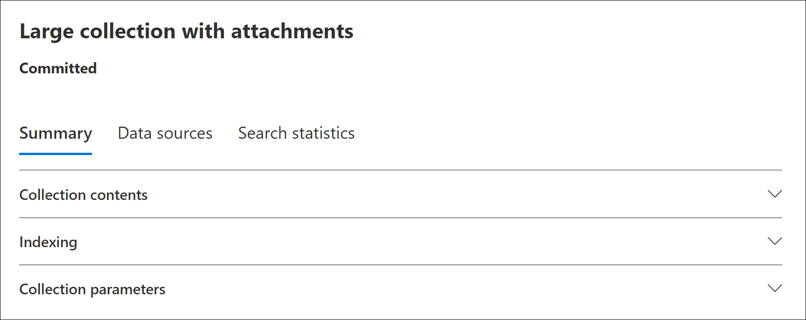

# Estadísticas e informes de recopilación en Microsoft Purview eDiscovery (Premium)

Después de crear una colección de borradores, puede ver estadísticas sobre los elementos recuperados, como las ubicaciones de contenido que contienen la mayoría de los elementos que coincidieron con los criterios de búsqueda y el número de elementos devueltos por la consulta de búsqueda. También puede obtener una vista previa de un subconjunto de los resultados.

Cuando haya identificado el conjunto de documentos que desea examinar más adelante, puede agregar los resultados de la búsqueda a un conjunto de revisión para recopilarlos y procesarlos.

## Estadísticas e informes para colecciones de borradores

En esta sección se describen las estadísticas disponibles para las colecciones de borradores. Estas estadísticas están disponibles en la pestaña **Buscar estadísticas** de la página de control flotante de una colección de borradores.

### Estimaciones de recopilación

En esta sección se muestra un resumen gráfico de los elementos estimados devueltos por la colección. Esto indica el número de elementos que coinciden con los criterios de búsqueda de la colección. Esta información proporciona una idea sobre el número estimado de elementos devueltos por la colección.

- **Elementos estimados por ubicaciones**: el número total de elementos estimados devueltos por la colección. También se muestra el número específico de elementos ubicados en buzones de correo y ubicados en sitios.

- **Ubicaciones estimadas con aciertos**: el número total de ubicaciones de contenido que contienen elementos devueltos por la colección. También se muestra el número específico de ubicaciones de buzón y de sitio.

- **Volumen de datos por ubicación (en MB):** tamaño total de todos los elementos estimados devueltos por la colección. También se muestra el tamaño específico de los elementos de buzón de correo y los elementos de sitio.

### Informe de condición

En esta sección se muestran estadísticas sobre la consulta de búsqueda de recopilación y el número de elementos estimados que coincidieron con diferentes partes de la consulta de búsqueda. Puede usar estas estadísticas para analizar el número de elementos que coinciden con cada componente de la consulta de búsqueda. Esto puede ayudarle a refinar los criterios de búsqueda de la colección y, si es necesario, restringir el ámbito de la colección.

- **Tipo de ubicación**: tipo de ubicación de contenido al que se aplican las estadísticas de consulta. El valor de **Exchange** indica una ubicación de buzón; Un valor de **SharePoint** indica una ubicación del sitio.

- **Parte**: la parte de la consulta de búsqueda a la que se aplican las estadísticas. **Principal** indica toda la consulta de búsqueda. **La palabra clave** indica que las estadísticas de la fila son para una palabra clave específica. Si usa una lista de palabras clave cuando para la consulta de búsqueda de la colección, las estadísticas de cada componente de la consulta se incluyen en esta tabla.

- **Condición**: componente real (palabra clave o condición) de la consulta de búsqueda que se ejecutó para la colección de borradores que devolvió las estadísticas mostradas en la fila correspondiente.

- **Ubicaciones con aciertos**: número de ubicaciones de contenido (especificadas por la columna **Tipo de ubicación** ) que contienen elementos que coinciden con la consulta principal o de palabra clave enumerada en la columna **Condición** .

- **Elementos**: el número de elementos (de la ubicación de contenido especificada) que coinciden con la consulta enumerada en la columna **Condición** . Como se explicó anteriormente, si un elemento contiene varias instancias de una palabra clave que se está buscando, solo se cuenta una vez en esta columna.

- **Tamaño (MB):** el tamaño total de todos los elementos que se encontraron (en la ubicación de contenido especificada) que coinciden con la consulta de búsqueda en la columna **Condición** .

### Ubicaciones principales

En esta sección se muestran estadísticas sobre las ubicaciones de contenido específicas con la mayoría de los elementos devueltos por la colección.

- Nombre del nombre de la ubicación (la dirección de correo electrónico de los buzones y la dirección URL de los sitios).

- Tipo de ubicación (un buzón o sitio).

- Número estimado de elementos en la ubicación de contenido devuelta por la colección.

- Tamaño total de los elementos estimados en cada ubicación de contenido.

## Estadísticas e informes para colecciones confirmadas

En esta sección se describen las estadísticas que están disponibles después de confirmar una colección en un conjunto de revisión, incluido el número real de elementos agregados al conjunto de revisión. Estas estadísticas (además de la información del conjunto de carga) proporcionan información histórica sobre el contenido agregado a un caso.

Después de confirmar una colección en un conjunto de revisión, se muestran las pestañas siguientes en la página de control flotante de la conexión confirmada. Cada una de estas pestañas contiene diferentes tipos de información sobre la colección.

### Contenido de la colección

Esta sección de la pestaña **Resumen** contiene estadísticas y otra información sobre los elementos recopilados de los orígenes de datos de la colección y agregados al conjunto de revisión.

- **Total de elementos extraídos**. Número total de elementos agregados al conjunto de revisión. Este número indica la suma de elementos primarios y secundarios agregados al conjunto de revisión.

  > [!TIP]
  > Mantenga el cursor sobre las barras de elementos primarios o secundarios para mostrar el número total de elementos primarios o secundarios.

- **Elementos primarios**. Número de elementos devueltos por la colección que se usó para recopilar los elementos que se agregaron al conjunto de revisión. Este número corresponde (y es igual a) el número estimado de elementos que se muestra en la sección **Parámetros** de colección. Número de elementos primarios que recopila información que se usó para recopilar los elementos que se agregaron al conjunto de revisión.
 
   Un elemento primario puede contener varios elementos secundarios. Por ejemplo, un mensaje de correo electrónico es un elemento primario si contiene un archivo adjunto o tiene datos adjuntos en la nube. En este caso, el archivo adjunto o el archivo de destino de los datos adjuntos en la nube se considera un elemento secundario. Al confirmar una colección, los elementos primarios y los elementos secundarios correspondientes (como archivos adjuntos y datos adjuntos en la nube) se agregan al conjunto de revisión como elementos o archivos individuales.

- **Elementos secundarios**. Número de elementos secundarios agregados al conjunto de revisión. Solo los elementos secundarios que son datos adjuntos de archivos y datos adjuntos en la nube se agregan al conjunto de revisión como archivos individuales. Otros tipos de elementos secundarios, como las firmas de correo electrónico y las imágenes, se extraen de un elemento primario y, a continuación, se procesan mediante reconocimiento óptico de caracteres (OCR) para extraer cualquier texto del elemento secundario. A continuación, el texto extraído de estos tipos de elementos secundarios se agrega a su elemento primario para que pueda verlo en el conjunto de revisión. Al no agregar elementos secundarios al conjunto de revisión como un archivo independiente, eDiscovery (Premium) ayuda a simplificar el proceso de revisión limitando el número de elementos potencialmente inmateriales en el conjunto de revisión.

- **Elementos únicos**. Número de elementos únicos agregados al conjunto de revisión. Los elementos únicos son únicos para el conjunto de revisión. Todos los elementos son únicos cuando se agrega la primera colección a un nuevo conjunto de revisión porque no había elementos anteriores en el conjunto de revisión.

- **Elementos duplicados identificados**. Número de elementos de la colección que no se agregaron al conjunto de revisión porque el mismo elemento ya existe en el conjunto de revisión. Las estadísticas sobre elementos duplicados pueden ayudar a explicar las diferencias entre el número de elementos estimados de una colección de borradores y el número real de elementos agregados al conjunto de revisión.

### Indización

La sección **Indexación de** la pestaña **Resumen** de un conjunto de revisión confirmado contiene información de indexación sobre los elementos agregados al conjunto de revisión.

**Nuevos elementos indexados**. Número de elementos que se indizaron recientemente antes de agregarlos al conjunto de revisión. Los ejemplos de un elemento recién indexado son elementos secundarios extraídos de un elemento primario y, a continuación, indizados antes de que se agreguen al conjunto de revisión. Además, los elementos que no se encuentran en orígenes de datos de custodia y ubicaciones de contenido que no son de custodia que aparecen en la pestaña **Orígenes de datos** en el caso se indexan antes de que se agreguen a la revisión. Por ejemplo, los elementos recién indexados incluirían elementos recopilados de ubicaciones adicionales.

**Elementos indexados actualizados**. Número de elementos indizados parcialmente que se indexaron correctamente y se agregaron al conjunto de revisión. Esta estadística indica los elementos indizados parcialmente de las ubicaciones de contenido custodial y no custodial **Pestaña Orígenes de datos** que se indexaron correctamente cuando la colección se ha confirmado en el conjunto de revisión.

**Errores de indexación**. Número de elementos indizados parcialmente que no se pudieron indexar antes de agregarlos al conjunto de revisión. Estos elementos pueden requerir la corrección de errores.

### Parámetros de colección

En esta sección se muestra la información de recopilación que se usó para recopilar los elementos que se agregaron al conjunto de revisión. Esta pestaña muestra información similar a la información de la pestaña **Estadísticas de búsqueda** . En esta sección se proporciona una captura rápida de la consulta de búsqueda usada por la colección, las ubicaciones de contenido que se buscaron y los resultados estimados de la colección. Como se explicó anteriormente, el número de elementos estimados de esta sección sería igual al número de elementos primarios que se muestran en la sección Contenido de la **colección** .

### Pestaña Estadísticas de búsqueda

Las estadísticas que se muestran en la pestaña **Buscar estadísticas** son las mismas estadísticas de la última vez que se ejecutó una colección de borradores. Esto incluye las estimaciones de recopilación, el informe de condición y las ubicaciones principales. Esta información se conserva de la colección de borradores como referencia histórica y se puede comparar con la colección real que se ha confirmado con el conjunto de revisión.

## Diferencias entre las estimaciones de la colección de borradores y la colección confirmada real

Al ejecutar una colección de borradores, se muestra una estimación del número de elementos (y su tamaño total) que cumplen los criterios de recopilación en la pestaña **Resumen** y en la sección **Estimaciones de colecciones** de la pestaña **Estadísticas de búsqueda** . Después de confirmar una colección de borradores en un conjunto de revisión, el número real de elementos (y su tamaño total) agregados al conjunto de revisión suele ser diferente de las estimaciones. En la mayoría de los casos, se agregan más elementos al conjunto de revisión de los estimados de la colección de borradores. En la lista siguiente se describen las razones más comunes de estas diferencias y sugerencias para identificarlas:

- **Elementos secundarios**. Elementos secundarios (como archivos adjuntos y datos adjuntos en la nube) que se extraen de sus elementos primarios y se agregan como archivos individuales. El número de elementos secundarios puede aumentar el número de elementos que se agregan realmente al conjunto de revisión. En general, el número de elementos primarios identificados en la sección Contenido de la **colección** de la pestaña **Resumen** de una colección confirmada debe ser igual al número de elementos estimados de la colección de borrador.

- **Elementos duplicados**. No se agregarán elementos de la colección de borradores que ya se hayan agregado al conjunto de revisión de una colección anterior. Como se explicó anteriormente, el número de elementos duplicados de la colección se muestra en la sección Contenido de la **colección** de la pestaña **Resumen** .

- **Opciones de configuración de recopilación**. Al confirmar una colección de borradores en un conjunto de revisión, tiene que incluir subprocesos de conversación, datos adjuntos en la nube y versiones de documentos. Cualquiera de estos elementos que se agregan al conjunto de revisión no se incluye en las estimaciones de la colección de borradores. Solo se identifican y recopilan cuando se confirma la colección. Seleccionar estas opciones probablemente aumentará el número de elementos agregados al conjunto de revisión. 

    Por ejemplo, no se incluyen varias versiones de documentos de SharePoint en la estimación de la colección de borradores. Pero si selecciona la opción para incluir todas las versiones del documento al confirmar una colección de borradores, el número real (y el tamaño total) de los elementos agregados al conjunto de revisión aumentará.

    Para obtener más información sobre estas opciones, consulte [Confirmación de una colección de borradores en un conjunto de revisión](commit-draft-collection.md#commit-a-draft-collection-to-a-review-set-in-ediscovery-premium).

Estas son otras razones por las que los resultados estimados de una colección de borradores pueden ser diferentes de los resultados confirmados reales.

- **La forma en que se calculan los resultados de las colecciones de borradores**. Una estimación de los resultados de búsqueda devueltos por una colección de borradores es simplemente esa, una estimación (y no un recuento real) de los elementos que cumplen los criterios de consulta de colección. Para compilar la estimación de los elementos de correo electrónico, se solicita a la base de datos de Exchange una lista de los identificadores de mensaje que cumplen los criterios de búsqueda. Pero al confirmar la colección en un conjunto de revisión, la colección se vuelve a ejecutar y los mensajes reales se recuperan de la base de datos de Exchange. Por lo tanto, las diferencias pueden dar lugar a cómo se determina el número estimado de elementos y el número real de elementos.

- **Cambios que se producen entre el momento en que se estiman y confirman colecciones de borradores**. Al confirmar una colección de borradores en un conjunto de revisión, la búsqueda se vuelve a ejecutar para recopilar los elementos más recientes del índice de búsqueda que cumplen los criterios de búsqueda. Es posible que se hayan creado, enviado o eliminado elementos adicionales que cumplan los criterios de búsqueda en el tiempo comprendido entre la última ejecución de la colección de borradores y la confirmación de la colección de borradores en un conjunto de revisión. También es posible que los elementos que estaban en el índice de búsqueda cuando se calcularon los resultados de la colección de borradores ya no estén allí porque se purgaron de un origen de datos antes de confirmar la colección. Una manera de mitigar este problema es especificar un intervalo de fechas para una colección. Otra manera es colocar una suspensión en las ubicaciones de contenido para que los elementos se conserven y no se puedan purgar.

- **Elementos sin indexar**. Si la colección de borradores incluía la búsqueda en todos los buzones de Exchange o en todos los sitios de SharePoint, solo se agregarán al conjunto de revisión los elementos sin indexar de ubicaciones de contenido que contengan elementos que coincidan con los criterios de recopilación. En otras palabras, si no se encuentra ningún resultado en un buzón de correo o sitio, los elementos sin indexar de ese buzón o sitio no se agregarán al conjunto de revisión. Sin embargo, los elementos sin indexar de todas las ubicaciones de contenido (incluso aquellos que no contienen elementos que coinciden con la consulta de colección) se incluirán en los resultados de la colección estimados.

- **Elementos indizados parcialmente**: la selección de esta opción agrega elementos parcialmente indizados de orígenes de datos adicionales al conjunto de revisión. Si la colección ha buscado orígenes de datos adicionales (como se especifica en la página **Ubicaciones adicionales** del Asistente para colecciones), es posible que haya elementos indizados parcialmente de estas ubicaciones que quiera agregar al conjunto de revisión. Los orígenes de datos custodios y no custodios normalmente no tienen elementos indizados parcialmente. Esto se debe a que el proceso de indexación avanzada vuelve a indexar elementos cuando se agregan orígenes de datos de custodia y no custodia a un caso. Además, agregar elementos parcialmente indizados aumentará el número de elementos agregados al conjunto de revisión. 
 Después de agregar elementos parcialmente indizados al conjunto de revisión, puede aplicar un filtro para ver específicamente estos elementos. Para obtener más información, vea [Filtrar elementos parcialmente indizados](review-set-search.md#filter-partially-indexed-items).

    Como alternativa, si la colección de borradores incluía ubicaciones de contenido específicas (lo que significa que se exportarán buzones o sitios específicos donde se especifiquen en la página **Ubicaciones adicionales** del Asistente para borradores de recopilación), se exportarán los elementos no indizados (que no se excluyen por los criterios de recopilación) de las ubicaciones de contenido especificadas en la búsqueda. En este caso, el número estimado de elementos sin indexar y el número de elementos no indexados que se agregan al conjunto de revisión deben ser los mismos.
