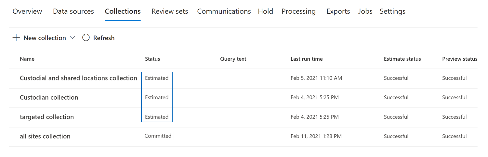

# Confirmar un borrador de colección en un conjunto de revisión en Advanced eDiscovery

Cuando esté satisfecho con los elementos que haya recopilado en una colección borrador y esté listo para analizarlos, etiquetarlos y revisarlos, puede agregar una colección a un conjunto de revisión en el caso. Cuando se confirma un borrador de colección en un conjunto de revisión, los elementos recopilados se copian de su ubicación de contenido original en Microsoft 365 a un conjunto de revisión. Un conjunto de revisión es una ubicación segura y proporcionada Azure Storage microsoft en la nube de Microsoft.

## Confirmar una colección de borrador en un conjunto de revisión

1. En el Centro de cumplimiento de Microsoft 365, abra el Advanced eDiscovery y, a continuación, seleccione la pestaña **Colecciones** para mostrar una lista de las colecciones en el caso.

   

   > [!TIP]
   > Un valor de en la columna Estado identifica las colecciones de borrador que se pueden `Estimated` agregar a un conjunto de revisión.  Un estado de indica que ya se ha agregado una colección `Committed` a un conjunto de revisión.

2. En la **página Colecciones,** seleccione el borrador de colección que desea confirmar en un conjunto de revisión.

3. En la parte inferior de la página desplegable, seleccione **Acciones**  >  **Editar colección**.

4. En el Asistente para editar colección, haga clic **en Siguiente** hasta que se muestre **la página** Guardar borrador o recopilar.

5. Configure las siguientes opciones:

   1. Seleccione **Recopilar elementos y agregar al conjunto de revisión**.

   2. Decida si desea agregar la colección a un nuevo conjunto de revisión (que se crea después de enviar la colección) o agregarla a un conjunto de revisión existente. Complete esta sección en función de su decisión.

   3. Configure las opciones de colección adicionales:

       - **Teams y Yammer:** seleccione esta opción para agregar subprocesos de conversación a la colección que incluyan los elementos de chat devueltos por la consulta de búsqueda en la colección. Esto significa que se reconstruye la conversación de chat que contiene elementos que coinciden con los criterios de búsqueda. Esto te permite revisar los elementos de chat en el contexto de la conversación de ida y vuelta. Para obtener más información, vea [Subprocesos de conversación en Advanced eDiscovery](conversation-review-sets.md).

       - **Datos adjuntos en la** nube: seleccione esta opción para incluir datos adjuntos modernos o archivos vinculados cuando los resultados de la colección se agregan al conjunto de revisión. Esto significa que el archivo de destino de un archivo adjunto o vinculado moderno se agrega al conjunto de revisión.

       - **SharePoint:** seleccione esta opción para habilitar la colección de todas las versiones de un documento SharePoint según los límites de versión y los parámetros de búsqueda de la colección. Si selecciona esta opción, aumentará significativamente el tamaño de los elementos que se agregan al conjunto de revisión.

   4. Configure las opciones para definir la escala de la colección que se agregará al conjunto de revisión:

      - **Agregar todos los resultados de la** colección: seleccione esta opción para agregar todos los elementos que coincidan con los criterios de búsqueda de la colección al conjunto de revisión.

      - **Agregar una muestra de los resultados** de la colección: seleccione esta opción para agregar una muestra de los resultados de la colección al conjunto de revisión en lugar de agregar todos los resultados. Si selecciona esta opción, haga clic **en Editar parámetros de ejemplo** y elija una de las siguientes opciones:

         - **Ejemplo basado en la confianza:** los elementos de la colección se agregan al conjunto de revisión se determinarán por los parámetros estadísticos que establezca. Si normalmente usa un nivel de confianza y un intervalo al muestrear los resultados, es preciso especificarlos en los cuadros desplegables. De lo contrario, use la configuración predeterminada.

         - **Ejemplo aleatorio:** los elementos de la colección se agregan al conjunto de revisión en función de una selección aleatoria del porcentaje especificado del número total de elementos devueltos por la búsqueda.

6. En la **página Revisar la colección,** puede revisar la configuración de la colección que configuró en la página anterior. Haga **clic en** Editar si desea cambiarlos.

7. Haga **clic en Enviar** para crear la colección borrador. Se muestra una página que confirma que se creó la colección.

## Qué sucede después de confirmar un borrador de colección

Cuando se confirma un borrador de colección en un conjunto de revisión, sucede lo siguiente:

- Si creó un nuevo conjunto de revisión para confirmar la colección, el conjunto de revisión se crea y se muestra en la pestaña **Conjuntos** de revisión en el caso. El estado del nuevo conjunto de revisión es **Ready**. Este valor de estado significa que se ha creado el conjunto de revisión; no significa que la colección se haya agregado al conjunto de revisión. El estado de agregar elementos de la colección al conjunto de revisión se muestra en la **pestaña Colecciones.**

- La consulta de búsqueda de colección se vuelve a ejecutar. Esto significa que los resultados de búsqueda reales copiados en el conjunto de revisión pueden ser diferentes de los resultados estimados que se devolvieron cuando se presentó la última ejecución de la búsqueda de colección.

- Todos los elementos de los resultados de la búsqueda se copian del origen de datos original en el servicio en directo y se copian en una ubicación Azure Storage segura en la nube de Microsoft.

- Todos los elementos (incluidos el contenido y los metadatos) que no se encuentran en orígenes de datos custodios o no custodios se reindexa (en un proceso denominado indización *profunda)* para que todos los datos del conjunto de revisión puedan buscarse completamente durante la revisión de los datos del caso. La reindexación del contenido de una colección da como resultado búsquedas exhaustivas y rápidas al buscar o filtrar el contenido del conjunto de revisión durante la investigación de casos.

- Los SharePoint y OneDrive documentos cifrados y los mensajes de correo electrónico adjuntos de archivos cifrados que se devuelven en los resultados de la búsqueda se descifran al confirmar la colección en un conjunto de revisión. Puede revisar y consultar los archivos descifrados en el conjunto de revisión. Para obtener más información, vea [Decryption in Microsoft 365 eDiscovery tools](ediscovery-decryption.md).

- La funcionalidad de reconocimiento óptico de caracteres (OCR) extrae texto de imágenes e incluye el texto de la imagen con el contenido que se agrega a un conjunto de opiniones. Para obtener más información, consulte la [sección Reconocimiento óptico de caracteres](#optical-character-recognition) de este artículo.

- Una vez completada correctamente la confirmación, el valor de la columna de estado de en la **ficha Colecciones** se cambia a `Committed` .

## Reconocimiento óptico de caracteres

Al confirmar una colección en un conjunto de revisión, la funcionalidad de reconocimiento óptico de caracteres (OCR) de Advanced eDiscovery extrae automáticamente texto de imágenes e incluye el texto de la imagen con el contenido que se agrega a un conjunto de opiniones. Puede ver el texto extraído en el visor de texto del archivo de imagen seleccionado en el conjunto de revisión. Esto le permite realizar más análisis y revisar el texto de las imágenes. OCR es compatible con archivos sueltos, datos adjuntos de correo electrónico e imágenes incrustadas. Para obtener una lista de los formatos de archivo de imagen compatibles con OCR, vea [Tipos de archivo admitidos en Advanced eDiscovery](supported-filetypes-ediscovery20.md#image).

Tiene que habilitar la funcionalidad de OCR para cada caso que cree en eDiscovery avanzado. Para obtener más información, vea [Configure search and analytics settings](configure-search-and-analytics-settings-in-advanced-ediscovery.md#optical-character-recognition-ocr).
