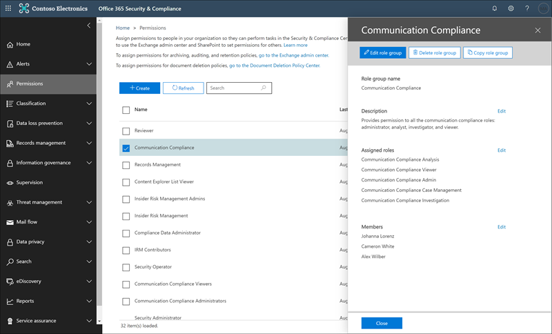

# Caso práctico-contoso configura rápidamente una directiva de lenguaje ofensivo para Microsoft Teams y Exchange Communications

El cumplimiento de la comunicación en Microsoft 365 ayuda a minimizar los riesgos de comunicación al ayudarle a detectar, capturar y realizar acciones de corrección para los mensajes inapropiados de su organización. Las directivas predefinidas y personalizadas le permiten analizar las comunicaciones internas y externas de las coincidencias de directivas para que puedan examinarlas los revisores designados. Los revisores pueden investigar el correo electrónico explorado, Microsoft Teams o las comunicaciones de terceros de la organización, y tomar las medidas de corrección adecuadas para asegurarse de que cumplen con los estándares de mensajes de la organización.

Contoso Corporation es una organización ficticia que necesita configurar rápidamente una directiva para supervisar el idioma ofensivo. Han estado usando Microsoft 365 principalmente para el correo electrónico y la asistencia de Microsoft Teams para sus empleados, pero tienen nuevos requisitos para aplicar la Directiva de la empresa alrededor del acoso del lugar de trabajo. Los administradores de TI de Contoso y los especialistas de cumplimiento tienen un conocimiento básico de los conceptos básicos del trabajo con Microsoft 365 y buscan una guía de un extremo a otro para empezar rápidamente con el cumplimiento de la comunicación.

Este caso práctico cubrirá los conceptos básicos para configurar rápidamente una directiva de cumplimiento de comunicaciones para supervisar las comunicaciones para un lenguaje ofensivo. Esta guía incluye:

- Paso 1: Planeación del cumplimiento de la comunicación
- Paso 2: acceso a la compatibilidad de la comunicación en Microsoft 365
- Paso 3: configurar los requisitos previos y crear una directiva de cumplimiento de la comunicación
- Paso 4: investigación y corrección de alertas

## Paso 1: Planeación del cumplimiento de la comunicación

Los administradores de TI de Contoso y los especialistas en línea han asistido por webinar en línea sobre soluciones de cumplimiento en Microsoft 365 y decidido que las directivas de cumplimiento de comunicaciones les ayudarán a cumplir los requisitos de la Directiva corporativa actualizada para reducir el área de trabajo. ACOS. Al trabajar juntos, han desarrollado un plan para crear y habilitar una directiva de cumplimiento de comunicaciones que supervisará el lenguaje ofensivo para los chats enviados en Microsoft Teams en mensajes de correo electrónico enviados en Exchange Online. Su plan incluye identificación:

- Los administradores de ti que necesitan tener acceso a las características de cumplimiento de comunicaciones.
- Los especialistas en cumplimiento que necesitan crear y administrar directivas de comunicación.
- Los especialistas en cumplimiento y otros compañeros de otros departamentos (recursos humanos, legales, etc.) que necesitan investigar y corregir las alertas de cumplimiento de comunicaciones.
- Los usuarios que estarán en el ámbito de la Directiva de lenguaje ofensivo para la conformidad con la comunicación.

### Licencias

El primer paso es confirmar que la licencia de Microsoft 365 de Contoso incluye soporte para la solución de cumplimiento de comunicaciones. Para acceder y usar el cumplimiento de la comunicación, los administradores de TI de Contoso necesitan comprobar que Contoso tiene uno de los siguientes elementos:

- Suscripción a Microsoft 365 E5 (versión de pago o de prueba)
- Licencia de Office 365 Enterprise E3 con el complemento de cumplimiento avanzado
- Suscripción a Office 365 Enterprise E5 (versión de pago o de prueba)

También deben confirmar que los usuarios incluidos en las directivas de cumplimiento de comunicaciones deben asignarse a una de las licencias enumeradas anteriormente.

Los administradores de TI de Contoso deben seguir estos pasos para comprobar la compatibilidad con licencias de Contoso:

1. Los administradores de ti inician sesión en el **centro de administración de 365 de Microsoft** [(https://admin.microsoft.com) ](https://admin.microsoft.com) y navegan a las**licencias**de**facturación** > del **Centro** > de administración de Microsoft 365.

2. Aquí se confirma que tienen una de las [Opciones de licencia](https://docs.microsoft.com/microsoft-365/compliance/communication-compliance-configure?view=o365-worldwide#before-you-begin) que incluye la compatibilidad con el cumplimiento de la comunicación.

### Permisos para el cumplimiento de la comunicación

De forma predeterminada, los administradores globales no tienen acceso a las características de cumplimiento de comunicaciones. [Los permisos deben configurarse](https://docs.microsoft.com/microsoft-365/compliance/communication-compliance-configure?view=o365-worldwide#step-1-required-enable-permissions-for-communication-compliance) para que los administradores de TI de Contoso y los especialistas en cumplimiento tengan acceso al cumplimiento de la comunicación.

1. Los administradores de TI de Contoso inician sesión en la página de permisos del **centro de seguridad y cumplimiento de Office 365** [(https://protection.office.com/permissions) ](https://protection.office.com/permissions) mediante credenciales para una cuenta de administrador global y seleccionan el vínculo para ver y administrar roles en Office 365.
2. Después de seleccionar **crear**, proporcionan al nuevo grupo de roles un nombre descriptivo de "cumplimiento de la*comunicación*" y seleccione **siguiente**.
3. Seleccionan **elegir roles** y, a continuación, seleccione **Agregar**. Para agregar los roles necesarios, active la casilla de verificación *Administrador de revisión de supervisión*, administración de *casos*, *Administrador de cumplimiento*y *revisión*y, a continuación, seleccione **Agregar**, **listo** y **siguiente**.

4. A continuación, los administradores de ti seleccionan seleccionar **miembros** y, a continuación, seleccione **Agregar**. Active la casilla de verificación para todos los usuarios y grupos que deseen crear directivas y administrar mensajes con coincidencias de directivas. Agregan los administradores de ti, especialistas de cumplimiento y otros compañeros de recursos humanos y departamentos jurídicos que identificaron en la planeación inicial y, a continuación, seleccionan **Agregar**, **listo**y **siguiente**.
5. Para finalizar los permisos, los administradores de ti seleccionan **Crear grupo de roles** para finalizar. Los roles tardarán alrededor de 30 minutos en ser efectivos en el servicio Microsoft 365 de contoso.

## Paso 2: acceso a la compatibilidad de la comunicación en Microsoft 365

Después de configurar los permisos para el cumplimiento de la comunicación, los administradores de TI de Contoso y los especialistas en cumplimiento definidos en el nuevo grupo de roles pueden tener acceso a la solución de cumplimiento de comunicaciones de Microsoft 365. Los administradores de TI de Contoso y los especialistas de cumplimiento tienen varias formas de obtener acceso al cumplimiento de la comunicación y empezar a crear una nueva Directiva:

- Comenzar directamente desde la solución de cumplimiento de comunicaciones
- Inicio desde el centro de cumplimiento de Microsoft 365
- Inicio desde el catálogo de soluciones de Microsoft 365
- Inicio desde el centro de administración de 365 de Microsoft

### Comenzar directamente desde la solución de cumplimiento de comunicaciones

La forma más rápida de tener acceso a la solución es iniciar sesión directamente en la solución de<https://compliance.microsoft.com/supervisoryreview>cumplimiento de la **comunicación** (). Mediante este vínculo, los administradores de TI de Contoso y los especialistas de cumplimiento se dirigirán al panel de información general sobre cumplimiento de comunicaciones, donde podrá revisar rápidamente el estado de las alertas y crear nuevas directivas a partir de las plantillas predefinidas.

### Inicio desde el centro de cumplimiento de Microsoft 365

Otra forma sencilla para que los administradores de TI de Contoso y los especialistas en cumplimiento tengan acceso a la solución de cumplimiento de la comunicación es iniciar sesión directamente en el **centro de cumplimiento de Microsoft 365** [https://compliance.microsoft.com)(](https://compliance.microsoft.com). Después de iniciar sesión, los usuarios simplemente deben seleccionar el control **Mostrar todos** los controles para mostrar todas las soluciones de cumplimiento y, a continuación, seleccionar la solución de cumplimiento de la **comunicación** para empezar.

### Inicio desde el catálogo de soluciones de Microsoft 365

Los administradores de TI de Contoso y los especialistas de cumplimiento también podrían elegir el acceso a la solución de cumplimiento de comunicaciones seleccionando el catálogo de soluciones de Microsoft 365. Al seleccionar **Catalog** en la sección de **soluciones** del panel de navegación izquierdo en el **centro de cumplimiento de Microsoft 365**, pueden abrir el catálogo de soluciones en el que se enumeran todas las soluciones de cumplimiento de Microsoft 365. Al desplazarse hasta la sección **Administración de riesgos de Insider** , los administradores de TI de Contoso pueden seleccionar el cumplimiento de la comunicación para empezar. Contoso los administradores de ti también deciden usar Mostrar en el control de navegación para anclar la solución de cumplimiento de comunicaciones en el panel de navegación izquierdo para obtener un acceso más rápido cuando inicien sesión en el futuro.

### Inicio desde el centro de administración de 365 de Microsoft

Para obtener acceso al cumplimiento de la comunicación al empezar desde el centro de administración de Microsoft 365, los administradores de TI de Contoso y los especialistas de cumplimiento inician sesión en el centro de administración de Microsoft 365 [https://admin.microsoft.com) (](https://admin.microsoft.com) y navegan hasta el > **cumplimiento**del **centro de administración de Microsoft 365**.

Se abrirá el **centro de seguridad y cumplimiento de Office 365**, que deben seleccionar el vínculo al **centro de cumplimiento de Microsoft 365** incluido en el encabezado de la parte superior de la página.

Una vez en el **centro de cumplimiento de Microsoft 365**, los administradores de TI de Contoso seleccionan **Mostrar todo** para mostrar la lista completa de soluciones de cumplimiento.

Después de seleccionar **Mostrar todo**, los administradores de TI de Contoso pueden tener acceso a la solución de cumplimiento de comunicaciones.

## Paso 3: configurar los requisitos previos y crear una directiva de cumplimiento de la comunicación

Para empezar a trabajar con una directiva de cumplimiento de comunicaciones, hay varios requisitos previos que los administradores de TI de Contoso deben configurar antes de configurar la nueva Directiva para supervisar el lenguaje ofensivo. Una vez completados estos requisitos previos, los administradores de TI de Contoso y los especialistas de cumplimiento pueden configurar los nuevos especialistas de directivas y cumplimiento pueden iniciar la investigación y corregir las alertas generadas.

### Habilitar la auditoría en Office 365

El cumplimiento de la comunicación requiere registros de auditoría para mostrar alertas y realizar un seguimiento de las acciones de corrección realizadas por los revisores. Los registros de auditoría son un resumen de todas las actividades asociadas con una directiva de organización definida o cada vez que hay un cambio en una directiva de cumplimiento de la comunicación.

Contoso los administradores de ti revisan y rellenan las [instrucciones paso a paso](https://docs.microsoft.com/microsoft-365/compliance/turn-audit-log-search-on-or-off) para activar la auditoría. Después de activar la auditoría, se muestra un mensaje que indica que se está preparando el registro de auditoría y que puede ejecutar una búsqueda en un par de horas después de que se complete la preparación. Los administradores de TI de Contoso solo tienen que realizar esta acción una vez.

### Configuración de un grupo para usuarios en el ámbito

Los especialistas de cumplimiento de Contoso quieren agregar todos los empleados a la Directiva de comunicación que supervisará el idioma ofensivo. Podrían decidir agregar cada cuenta de usuario de empleado a la Directiva por separado, pero han decidido que es mucho más fácil y ahorran mucho tiempo en usar un grupo de distribución de **todos los empleados** para los usuarios de esta Directiva.

Deben crear un nuevo grupo para incluir a todos los empleados de Contoso, por lo que deben seguir estos pasos:

1. Contoso administradores de ti inicie sesión en el centro de **Administración de 365** de Microsoft [(https://admin.microsoft.com) ](https://admin.microsoft.com) y vaya a la 365**Groups** > **grupos**del **Centro** > de administración de Microsoft).
2. Seleccionan **Agregar un grupo** y completan el Asistente para crear un nuevo grupo de *Office 365* o grupo de *distribución*.

3. Una vez creado el nuevo grupo, tiene que agregar todos los usuarios de Contoso al nuevo grupo. Abren el **centro de administración de Exchange** [(https://outlook.office365.com/ecp) ](https://outlook.office365.com/ecp) y navegan a los**grupos**de**destinatarios** > del **Centro** > de administración de Exchange. Los administradores de TI de Contoso seleccionan el área pertenencia y el nuevo grupo *todos los empleados* que han creado y seleccionan el control **Editar** para agregar todos los empleados de Contoso al nuevo grupo en el asistente.

### Crear la Directiva para supervisar el lenguaje ofensivo

Una vez completados todos los requisitos previos, los administradores de ti y los especialistas de cumplimiento de Contoso estarán preparados para configurar la Directiva de cumplimiento de comunicaciones para supervisar el lenguaje ofensivo. Mediante la nueva plantilla de directiva de lenguaje ofensivo, la configuración de esta directiva es sencilla y rápida.

1. Los administradores de TI de Contoso y los especialistas de cumplimiento inician sesión en el **centro de cumplimiento de Microsoft 365** y seleccionan cumplimiento de la **comunicación** en el panel de navegación izquierdo. Esta acción abre el panel de **información general** que contiene vínculos rápidos para plantillas de directiva de cumplimiento de comunicaciones. Para elegir la plantilla **supervisar para lenguaje ofensivo** **, seleccione Introducción a la** plantilla.

2. En el Asistente para plantillas de directivas, los administradores de ti y los especialistas de cumplimiento de Contoso trabajan juntos para completar los tres campos obligatorios: **nombre de directiva**, **usuarios o grupos para supervisar**y **revisores**.
3. Dado que el Asistente para directivas ya ha sugerido un nombre para la Directiva, los administradores de ti y los especialistas en cumplimiento deciden mantener el nombre sugerido y centrarse en los campos restantes. Seleccionan el grupo *todos los empleados* para el campo **usuarios o grupos que supervisan** y seleccionan los especialistas de cumplimiento que deben investigar y corregir las alertas de directiva para el campo **Reviewers** . El último paso para configurar la Directiva e iniciar la recopilación de información de alertas consiste en seleccionar **crear Directiva**.

## Paso 4: investigar y corregir las alertas

Ahora que la Directiva de cumplimiento de la comunicación para supervisar el lenguaje ofensivo está configurada, el siguiente paso para los especialistas de cumplimiento de Contoso será investigar y corregir cualquier alerta generada por la Directiva. La Directiva tardará hasta 24 horas en procesar completamente las comunicaciones en todos los canales de origen de comunicación y para que las alertas aparezcan en el **Panel de alertas**.

Una vez generadas las alertas, los especialistas de cumplimiento de Contoso seguirán las [instrucciones de flujo de trabajo](https://docs.microsoft.com/microsoft-365/compliance/communication-compliance-investigate-remediate) para investigar y corregir problemas de idiomas ofensivos.
