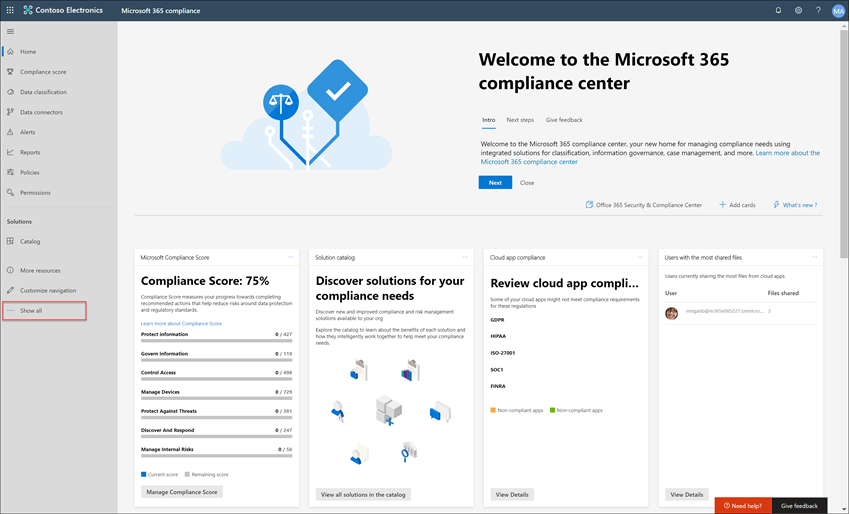

# Caso práctico-contoso configura rápidamente una directiva de lenguaje ofensivo para Microsoft Teams, Exchange y Yammer CommunicationsCase study - Contoso quickly configures an offensive language policy for Microsoft Teams, Exchange, and Yammer communications

El cumplimiento de la comunicación en Microsoft 365 ayuda a minimizar los riesgos de comunicación al ayudarle a detectar, capturar y actuar en mensajes inapropiados de la organización.Communication compliance in Microsoft 365 helps minimize communication risks by helping you detect, capture, and act on inappropriate messages in your organization. Las directivas predefinidas y personalizadas le permiten analizar las comunicaciones internas y externas de las coincidencias de directivas para que puedan examinarlas los revisores designados.Pre-defined and custom policies allow you to scan internal and external communications for policy matches so they can be examined by designated reviewers. Los revisores pueden investigar el correo electrónico explorado, Microsoft Teams, Yammer o las comunicaciones de terceros de la organización y tomar las medidas de corrección adecuadas para asegurarse de que cumplen con los estándares de mensajes de la organización.Reviewers can investigate scanned email, Microsoft Teams, Yammer, or third-party communications in your organization and take appropriate remediation actions to make sure they're compliant with your organization's message standards.

Contoso Corporation es una organización ficticia que necesita configurar rápidamente una directiva para supervisar el idioma ofensivo.The Contoso Corporation is a fictional organization that needs to quickly configure a policy to monitor for offensive language. Han estado usando Microsoft 365 principalmente para el correo electrónico, Microsoft Teams y la compatibilidad con Yammer para sus usuarios, pero tienen nuevos requisitos para aplicar la Directiva de la empresa alrededor del acoso del lugar de trabajo.They have been using Microsoft 365 primarily for email, Microsoft Teams, and Yammer support for their users but have new requirements to enforce company policy around workplace harassment. Los administradores de TI de Contoso y los especialistas de cumplimiento tienen un conocimiento básico de los conceptos básicos del trabajo con Microsoft 365 y buscan una guía de un extremo a otro para empezar rápidamente con el cumplimiento de la comunicación.Contoso IT administrators and compliance specialists have a basic understanding of the fundamentals of working with Microsoft 365 and are looking for end-to-end guidance for how to quickly get started with communication compliance.

Este caso práctico cubrirá los conceptos básicos para configurar rápidamente una directiva de cumplimiento de comunicaciones para supervisar las comunicaciones para un lenguaje ofensivo.This case study will cover the basics for quickly configuring a communication compliance policy to monitor communications for offensive language. Esta guía incluye:This guidance includes:

- Paso 1: Planeación del cumplimiento de la comunicaciónStep 1 - Planning for communication compliance
- Paso 2: acceso a la compatibilidad de la comunicación en Microsoft 365Step 2 - Accessing communication compliance in Microsoft 365
- Paso 3: configurar los requisitos previos y crear una directiva de cumplimiento de la comunicaciónStep 3 - Configuring prerequisites and creating a communication compliance policy
- Paso 4: investigación y corrección de alertasStep 4 - Investigation and remediation of alerts

## Paso 1: Planeación del cumplimiento de la comunicaciónStep 1: Planning for communication compliance

Los administradores de TI de Contoso y los especialistas en línea se han asistido por webinar en línea sobre soluciones de cumplimiento en Microsoft 365 y decidido que las directivas de cumplimiento de comunicaciones les ayudarán a cumplir los requisitos de la Directiva corporativa actualizada para reducir el acoso del lugar de trabajo.Contoso IT administrators and compliance specialists attended online webinars about compliance solutions in Microsoft 365 and decided that communication compliance policies will help them meet the updated corporate policy requirements for reducing workplace harassment. Juntos, han desarrollado un plan para crear y habilitar una directiva de cumplimiento de comunicaciones que supervisará el lenguaje ofensivo para los chats enviados en Microsoft Teams, mensajes privados y conversaciones de la comunidad en Yammer y en mensajes de correo electrónico enviados en Exchange Online.Working together, they've developed a plan to create and enable a communication compliance policy that will monitor for offensive language for chats sent in Microsoft Teams, private messages and community conversations in Yammer, and in email messages sent in Exchange Online. Su plan incluye identificación:Their plan includes identifying:

- Los administradores de ti que necesitan tener acceso a las características de cumplimiento de comunicaciones.The IT administrators that need access to communication compliance features.
- Los especialistas en cumplimiento que necesitan crear y administrar directivas de comunicación.The compliance specialists that need to create and manage communication policies.
- Los especialistas en cumplimiento y otros compañeros de otros departamentos (recursos humanos, legales, etc.) que necesitan investigar y corregir las alertas de cumplimiento de comunicaciones.The compliance specialists and other colleague in other departments (Human Resources, Legal, etc.) that need to investigate and remediate communication compliance alerts.
- Los usuarios que estarán en el ámbito de la Directiva de lenguaje ofensivo para la conformidad con la comunicación.The users that will be in-scope for the communication compliance offensive language policy.

### LicenciasLicensing

El primer paso es confirmar que la licencia de Microsoft 365 de Contoso incluye soporte para la solución de cumplimiento de comunicaciones.The first step is to confirm that Contoso's Microsoft 365 licensing includes support for the communication compliance solution. Para acceder y usar el cumplimiento de la comunicación, los administradores de TI de Contoso necesitan comprobar que Contoso tiene uno de los siguientes elementos:To access and use communication compliance, Contoso IT administrators need to verify that Contoso has one of the following:

- Suscripción a Microsoft 365 E5 (versión de pago o de prueba)Microsoft 365 E5 subscription (paid or trial version)
- Suscripción a Microsoft 365 E3 + complemento de cumplimiento de Microsoft 365 E5Microsoft 365 E3 subscription + the Microsoft 365 E5 Compliance add-on
- Suscripción a Microsoft 365 E3 + complemento Microsoft 365 E5 del servicio de administración de riesgos de InsiderMicrosoft 365 E3 subscription + the Microsoft 365 E5 Insider Risk Management add-on
- Suscripción a Microsoft 365 A5 (versión de pago o de prueba)Microsoft 365 A5 subscription (paid or trial version)
- Suscripción a Microsoft 365 a3 + complemento de cumplimiento A5 de Microsoft 365Microsoft 365 A3 subscription + the Microsoft 365 A5 Compliance add-on
- Suscripción a Microsoft 365 a3 + complemento de administración de riesgos de la A5 del Insider de Microsoft 365Microsoft 365 A3 subscription + the Microsoft 365 A5 Insider Risk Management add-on
- Suscripción a Microsoft 365 G5 (versión de pago o de prueba)Microsoft 365 G5 subscription (paid or trial version)
- Suscripción a Microsoft 365 G5 + complemento de cumplimiento de Microsoft 365 G5Microsoft 365 G5 subscription + the Microsoft 365 G5 Compliance add-on
- Suscripción a Microsoft 365 G5 + complemento de administración de riesgos de Insider de Microsoft 365 G5Microsoft 365 G5 subscription + the Microsoft 365 G5 Insider Risk Management add-on
- Suscripción a Office 365 Enterprise E5 (versión de pago o de prueba)Office 365 Enterprise E5 subscription (paid or trial version)
- Office 365 Enterprise E3 subscription + el complemento Office 365 Advanced Compliance (ya no está disponible para las nuevas suscripciones, vea note)Office 365 Enterprise E3 subscription + the Office 365 Advanced Compliance add-on (no longer available for new subscriptions, see note)

También deben confirmar que los usuarios incluidos en las directivas de cumplimiento de comunicaciones deben tener asignada una de las licencias anteriores.They must also confirm that users included in communication compliance policies must be assigned one of the licenses above.

>[!IMPORTANT]
>Office 365 Advanced Compliance ya no se vende como una suscripción independiente.Office 365 Advanced Compliance is no longer sold as a standalone subscription. Cuando expiren las suscripciones actuales, los clientes deben pasar a una de las suscripciones anteriores, que contienen las mismas características de cumplimiento o más.When current subscriptions expire, customers should transition to one of the subscriptions above, which contain the same or additional compliance features.

Los administradores de TI de Contoso deben seguir estos pasos para comprobar la compatibilidad con licencias de Contoso:Contoso IT administrators take the following steps to verify the licensing support for Contoso:

1. Los administradores de ti inician sesión en el **centro de administración de 365 de Microsoft** [( https://admin.microsoft.com) ](https://admin.microsoft.com) y navegan a las licencias de facturación del **centro de administración de Microsoft 365**  >  **Billing**  >  **Licenses**.IT administrators sign in to the **Microsoft 365 admin center** [(https://admin.microsoft.com)](https://admin.microsoft.com) and navigate to **Microsoft 365 admin center** > **Billing** > **Licenses**.

2. Aquí se confirma que tienen una de las [Opciones de licencia](https://docs.microsoft.com/microsoft-365/compliance/communication-compliance-configure?view=o365-worldwide#before-you-begin) que incluye la compatibilidad con el cumplimiento de la comunicación.Here they confirm that they have one of the [license options](https://docs.microsoft.com/microsoft-365/compliance/communication-compliance-configure?view=o365-worldwide#before-you-begin) that includes support for communication compliance.

### Permisos para el cumplimiento de la comunicaciónPermissions for communication compliance

Hay cinco grupos de roles usados para configurar los permisos para administrar las características de cumplimiento de comunicaciones.There are five role groups used to configure permissions to manage communication compliance features. Para que el cumplimiento de la **comunicación** esté disponible como una opción de menú en el centro de cumplimiento de Microsoft 365 y para continuar con estos pasos de configuración, los administradores de Contoso tienen asignado el rol de administrador de *cumplimiento de comunicaciones* .To make **Communication compliance** available as a menu option in Microsoft 365 compliance center and to continue with these configuration steps, Contoso administrators are assigned the *Communication Compliance Admin* role.

Contoso decide usar el grupo de funciones *cumplimiento de comunicaciones* para asignar todos los administradores de cumplimiento de comunicaciones, analistas, investigadores y visores al grupo.Contoso decides to use the *Communication Compliance* role group assign all the communication compliance administrators, analysts, investigators, and viewers  to the group. De este modo, es más fácil para contoso empezar rápidamente y se ajusta mejor a sus requisitos de administración de cumplimiento.This makes it easier for Contoso to get started quickly and best fits their compliance management requirements.

|**Rol****Role**|**Permisos de funciones****Role permissions**|
|:-----|:-----|
| **Cumplimiento de la comunicación****Communication Compliance** | Use este grupo de roles para administrar el cumplimiento de la comunicación de su organización en un único grupo.Use this role group to manage communication compliance for your organization in a single group. Al agregar todas las cuentas de usuario para administradores, analistas, investigadores y visores designados, puede configurar los permisos de cumplimiento de comunicaciones en un único grupo.By adding all user accounts for designated administrators, analysts, investigators, and viewers, you can configure communication compliance permissions in a single group. Este grupo de roles contiene todos los roles de permisos de cumplimiento de comunicaciones.This role group contains all the communication compliance permission roles. Esta configuración es la forma más sencilla de empezar rápidamente con el cumplimiento de la comunicación y es una buena opción para las organizaciones que no necesitan permisos separados definidos para grupos de usuarios independientes.This configuration is the easiest way to quickly get started with communication compliance and is a good fit for organizations that do not need separate permissions defined for separate groups of users. |
| **Administrador de cumplimiento de comunicaciones****Communication Compliance Admin** | Use este grupo de roles para configurar inicialmente el cumplimiento de comunicaciones y posteriormente para separar los administradores de cumplimiento de comunicaciones en un grupo definido.Use this role group to initially configure communication compliance and later to segregate communication compliance administrators into a defined group. Los usuarios asignados a este grupo de roles pueden crear, leer, actualizar y eliminar las directivas de cumplimiento de la comunicación, la configuración global y las asignaciones de grupos de roles.Users assigned to this role group can create, read, update, and delete communication compliance policies, global settings, and role group assignments. Los usuarios asignados a este grupo de roles no pueden ver los mensajes de alerta.Users assigned to this role group cannot view message alerts. |
| **Analista de cumplimiento de comunicaciones****Communication Compliance Analyst** | Use este grupo para asignar permisos a los usuarios que van a actuar como analistas de cumplimiento de comunicaciones.Use this group to assign permissions to users that will act as communication compliance analysts. Los usuarios asignados a este grupo de roles pueden ver las directivas en las que se asignan como revisores, ver los metadatos de los mensajes (no el contenido del mensaje), remitir a otros revisores o enviar notificaciones a los usuarios.Users assigned to this role group can view policies where they are assigned as Reviewers, view message metadata (not message content), escalate to additional reviewers, or send notifications to users. Los analistas no pueden resolver alertas pendientes.Analysts cannot resolve pending alerts. |
| **Investigador de cumplimiento de la comunicación****Communication Compliance Investigator** | Use este grupo para asignar permisos a los usuarios que actuarán como investigadores de cumplimiento de la comunicación.Use this group to assign permissions to users that will act as communication compliance investigators. Los usuarios asignados a este grupo de roles pueden ver el contenido y los metadatos de los mensajes, escalar a revisores adicionales, escalar a un caso de eDiscovery avanzado, enviar notificaciones a los usuarios y resolver la alerta.Users assigned to this role group can view message metadata and content, escalate to additional reviewers, escalate to an Advanced eDiscovery case, send notifications to users, and resolve the alert. |
| **Visor de cumplimiento de comunicaciones****Communication Compliance Viewer** | Use este grupo para asignar permisos a los usuarios que van a administrar los informes de comunicación.Use this group to assign permissions to users that will manage communication reports. Los usuarios asignados a este grupo de roles pueden tener acceso a todos los widgets de informes en la página de inicio de cumplimiento de comunicaciones y pueden ver todos los informes de cumplimiento de comunicaciones.Users assigned to this role group can access all reporting widgets on the communication compliance home page and can view all communication compliance reports. |

1. Los administradores de TI de Contoso inician sesión en la página de permisos del **centro de seguridad & cumplimiento de Office 365** [( https://protection.office.com/permissions) ](https://protection.office.com/permissions) usando credenciales para una cuenta de administrador global y seleccionan el vínculo para ver y administrar roles en Microsoft 365.Contoso IT administrators sign into the **Office 365 Security & Compliance center** permissions page [(https://protection.office.com/permissions)](https://protection.office.com/permissions) using credentials for a global administrator account and select the link to view and manage roles in Microsoft 365.
2. En el **centro de seguridad & cumplimiento**, van a **permisos** y seleccionan el vínculo para ver y administrar roles en Office 365.In the **Security & Compliance Center**, they go to **Permissions** and select the link to view and manage roles in Office 365.
3. Los administradores seleccionan el grupo de funciones *cumplimiento de comunicaciones* y, a continuación, seleccionan **Editar Grupo de roles**.The administrators select the *Communication Compliance* role group, then select **Edit role group**.
4. Los administradores seleccionan **elegir miembros** en el panel de navegación izquierdo y, a continuación, seleccione **Editar**.The administrators select **Choose members** from the left navigation pane, then select **Edit**.
5. Seleccionan **Agregar** y, a continuación, seleccionan la casilla para todos los usuarios de Contoso que administrarán las alertas de cumplimiento de comunicación, investigación y revisión.They select **Add** and then select the checkbox for all Contoso users that will manage communication compliance, investigate, and review alerts.
6. Los administradores seleccionan **Agregar**y, a continuación, selecciona **listo**.The administrators select **Add**, then select **Done**.
7. Seleccione **Guardar** para agregar usuarios de Contoso al grupo de roles.They select **Save** to add Contoso users to the role group. Seleccione **cerrar** para completar los pasos.They select **Close** to complete the steps.

## Paso 2: obtener acceso al cumplimiento de la comunicación en Microsoft 365Step 2: Accessing communication compliance in Microsoft 365

Después de configurar los permisos para el cumplimiento de la comunicación, los administradores de TI de Contoso y los especialistas en cumplimiento asignados al grupo de funciones de cumplimiento de comunicaciones pueden acceder a la solución de cumplimiento de comunicaciones en Microsoft 365.After configuring the permissions for communication compliance, Contoso IT administrators and compliance specialists assigned to the Communication Compliance role group can access the communication compliance solution in Microsoft 365. Los administradores de TI de Contoso y los especialistas de cumplimiento tienen varias formas de obtener acceso al cumplimiento de la comunicación y empezar a crear una nueva Directiva:Contoso IT administrators and compliance specialists have several ways to access communication compliance and get started creating a new policy:

- Comenzar directamente desde la solución de cumplimiento de comunicacionesStarting directly from the communication compliance solution
- Inicio desde el centro de cumplimiento de Microsoft 365Starting from the Microsoft 365 compliance center
- Inicio desde el catálogo de soluciones de Microsoft 365Starting from the Microsoft 365 solution catalog
- Inicio desde el centro de administración de 365 de MicrosoftStarting from the Microsoft 365 admin center

### Comenzar directamente desde la solución de cumplimiento de comunicacionesStarting directly from the communication compliance solution

La forma más rápida de tener acceso a la solución es iniciar sesión directamente en la solución de cumplimiento de la **comunicación** ( <https://compliance.microsoft.com/supervisoryreview> ).The quickest way to access the solution is to sign in directly to the **Communication compliance** (<https://compliance.microsoft.com/supervisoryreview>) solution. Mediante este vínculo, los administradores de TI de Contoso y los especialistas de cumplimiento se dirigirán al panel de información general sobre cumplimiento de comunicaciones, donde podrá revisar rápidamente el estado de las alertas y crear nuevas directivas a partir de las plantillas predefinidas.Using this link, Contoso IT administrators and compliance specialists will be directed to the communication compliance Overview dashboard where you can quickly review the status of alerts and create new policies from the pre-defined templates.

### Inicio desde el centro de cumplimiento de Microsoft 365Starting from the Microsoft 365 compliance center

Otra forma sencilla para que los administradores de TI de Contoso y los especialistas en cumplimiento tengan acceso a la solución de cumplimiento de la comunicación es iniciar sesión directamente en el **centro de cumplimiento de Microsoft 365** [ https://compliance.microsoft.com) (](https://compliance.microsoft.com).Another easy way for Contoso IT administrators and compliance specialists to access the communication compliance solution is to sign in directly to the **Microsoft 365 compliance center** [(https://compliance.microsoft.com)](https://compliance.microsoft.com). Después de iniciar sesión, los usuarios simplemente deben seleccionar el control **Mostrar todos** los controles para mostrar todas las soluciones de cumplimiento y, a continuación, seleccionar la solución de cumplimiento de la **comunicación** para empezar.After signing in, users simply need to select the **Show all** control to display all the compliance solutions and then select the **Communication compliance** solution to get started.

### Inicio desde el catálogo de soluciones de Microsoft 365Starting from the Microsoft 365 solution catalog

Los administradores de TI de Contoso y los especialistas de cumplimiento también podrían elegir el acceso a la solución de cumplimiento de comunicaciones seleccionando el catálogo de soluciones de Microsoft 365.Contoso IT administrators and compliance specialists could also choose to access the communication compliance solution by selecting the Microsoft 365 solution catalog. Al seleccionar **Catalog** en la sección de **soluciones** del panel de navegación izquierdo en el **centro de cumplimiento de Microsoft 365**, pueden abrir el catálogo de soluciones en el que se enumeran todas las soluciones de cumplimiento de Microsoft 365.By selecting **Catalog** in **Solutions** section of the left navigation while in the **Microsoft 365 compliance center**, they can open the solution catalog listing all Microsoft 365 compliance solutions. Al desplazarse hasta la sección **Administración de riesgos de Insider** , los administradores de TI de Contoso pueden seleccionar el cumplimiento de la comunicación para empezar.Scrolling down to the **Insider risk management** section, Contoso IT administrators can select Communication compliance to get started. Contoso los administradores de ti también deciden usar Mostrar en el control de navegación para anclar la solución de cumplimiento de comunicaciones en el panel de navegación izquierdo para obtener un acceso más rápido cuando inicien sesión en el futuro.Contoso IT administrators also decide to use the Show in navigation control to pin the communication compliance solution to the left-navigation pane for quicker access when they sign in going forward.

### Inicio desde el centro de administración de 365 de MicrosoftStarting from the Microsoft 365 admin center

Para obtener acceso al cumplimiento de la comunicación al empezar desde el centro de administración de Microsoft 365, los administradores de TI de Contoso y los especialistas de cumplimiento inician sesión en el centro de administración de Microsoft 365 [( https://admin.microsoft.com) ](https://admin.microsoft.com) y navegan hasta el cumplimiento del **centro de administración de Microsoft 365**  >  **Compliance**.To access communication compliance when starting from the Microsoft 365 admin center, Contoso IT administrators and compliance specialists sign in to the Microsoft 365 admin center [(https://admin.microsoft.com)](https://admin.microsoft.com) and navigate to **Microsoft 365 admin center** > **Compliance**.

Esta acción abre el **centro de seguridad y cumplimiento de Office 365**y debe seleccionar el vínculo al **centro de cumplimiento de Microsoft 365** incluido en el encabezado de la parte superior de la página.This action opens the **Office 365 Security and Compliance center**, and they must select the link to the **Microsoft 365 compliance center** provided in the banner at the top of the page.

Una vez en el **centro de cumplimiento de Microsoft 365**, los administradores de TI de Contoso seleccionan **Mostrar todo** para mostrar la lista completa de soluciones de cumplimiento.Once in the **Microsoft 365 compliance center**, Contoso IT administrators select **Show all** to display the full list of compliance solutions.

Después de seleccionar **Mostrar todo**, los administradores de TI de Contoso pueden tener acceso a la solución de cumplimiento de comunicaciones.After selecting **Show all**, the Contoso IT administrators can access the communication compliance solution.

## Paso 3: configurar los requisitos previos y crear una directiva de cumplimiento de la comunicaciónStep 3: Configuring prerequisites and creating a communication compliance policy

Para empezar a trabajar con una directiva de cumplimiento de comunicaciones, hay varios requisitos previos que los administradores de TI de Contoso deben configurar antes de configurar la nueva Directiva para supervisar el lenguaje ofensivo.To get started with a communication compliance policy, there are several prerequisites that Contoso IT administrators need to configure before setting up the new policy to monitor for offensive language. Una vez completados estos requisitos previos, los administradores de TI de Contoso y los especialistas de cumplimiento pueden configurar los nuevos especialistas de directivas y cumplimiento pueden iniciar la investigación y corregir las alertas generadas.After these prerequisites have been completed, Contoso IT administrators and compliance specialists can configure the new policy and compliance specialists can start investigation and remediating any generated alerts.

### Habilitación de la auditoría en Microsoft 365Enabling auditing in Microsoft 365

El cumplimiento de la comunicación requiere registros de auditoría para mostrar alertas y realizar un seguimiento de las acciones de corrección realizadas por los revisores.Communication compliance requires audit logs to show alerts and track remediation actions taken by reviewers. Los registros de auditoría son un resumen de todas las actividades asociadas con una directiva de organización definida o cada vez que hay un cambio en una directiva de cumplimiento de la comunicación.The audit logs are a summary of all activities associated with a defined organizational policy or anytime there is a change to a communication compliance policy.

Contoso los administradores de ti revisan y rellenan las [instrucciones paso a paso](https://docs.microsoft.com/microsoft-365/compliance/turn-audit-log-search-on-or-off) para activar la auditoría.Contoso IT administrators review and complete the [step-by-step instructions](https://docs.microsoft.com/microsoft-365/compliance/turn-audit-log-search-on-or-off) to turn on auditing. Después de activar la auditoría, se muestra un mensaje que indica que se está preparando el registro de auditoría y que puede ejecutar una búsqueda en un par de horas después de que se complete la preparación.After they turn on auditing, a message is displayed that says the audit log is being prepared and that they can run a search in a couple of hours after the preparation is complete. Los administradores de TI de Contoso solo tienen que realizar esta acción una vez.The Contoso IT administrators only have to do this action once.

### Configuración del espacio empresarial de Yammer para el modo nativoConfiguring Yammer tenant for Native Mode

El cumplimiento de la comunicación requiere que el inquilino de Yammer para una organización esté en modo nativo para supervisar el lenguaje ofensivo en mensajes privados y conversaciones públicas de la comunidad.Communication compliance requires that the Yammer tenant for an organization is in Native Mode to monitor for offensive language in private messages and public community conversations.

Contoso los administradores de ti Asegúrese de que revisan la información de la información [General del modo nativo de Yammer en el artículo 365 de Microsoft](https://docs.microsoft.com/yammer/configure-your-yammer-network/overview-native-mode) y siga los pasos para ejecutar la herramienta de migración en el artículo [configurar su red de Yammer para el modo nativo para Microsoft 365](https://docs.microsoft.com/yammer/configure-your-yammer-network/native-mode) .Contoso IT administrators make sure they review the information in the [Overview of Yammer Native Mode in Microsoft 365 article](https://docs.microsoft.com/yammer/configure-your-yammer-network/overview-native-mode) and follow the steps for running the migration tool in the [Configure your Yammer network for Native Mode for Microsoft 365](https://docs.microsoft.com/yammer/configure-your-yammer-network/native-mode) article.

### Configuración de un grupo para usuarios en el ámbitoSetting up a group for in-scope users

Los especialistas de cumplimiento de Contoso quieren agregar todos los usuarios a la Directiva de comunicación que va a supervisar en busca de lenguaje ofensivo.Contoso compliance specialists want to add all users to the communication policy that will monitor for offensive language. Podrían decidir agregar cada cuenta de usuario a la Directiva por separado, pero han decidido que es mucho más fácil y ahorra tiempo a usar un grupo de distribución de **todos los usuarios** para los usuarios de esta Directiva.They could decide to add each user account to the policy separately, but they've decided it is much easier and saves time to use an **All Users** distribution group for the users for this policy.

Deben crear un nuevo grupo para incluir a todos los usuarios de Contoso, por lo que deben seguir estos pasos:They need to create a new group to include all Contoso users, so they take the following steps:

1. Contoso administradores de ti inicie sesión en el **centro de administración de 365** de Microsoft [( https://admin.microsoft.com) ](https://admin.microsoft.com) y vaya a la 365 grupos del centro de administración de **Microsoft**)  >  **Groups**  >  **Groups**.Contoso IT administrators IT sign in to the **Microsoft 365 admin center** [(https://admin.microsoft.com)](https://admin.microsoft.com) and navigate to **Microsoft 365 admin center** > **Groups** > **Groups**.
2. Seleccionan **Agregar un grupo** y completan el Asistente para crear un nuevo grupo de *Microsoft 365* o grupo de *distribución*.They select **Add a group** and complete the wizard to create a new *Microsoft 365 group* or *Distribution group*.

    

3. Una vez creado el nuevo grupo, tiene que agregar todos los usuarios de Contoso al nuevo grupo.After the new group is created, they need to add all Contoso users to the new group. Abren el **centro de administración de Exchange** [ https://outlook.office365.com/ecp) (](https://outlook.office365.com/ecp) y navegan a los grupos de **Exchange admin center**  >  **destinatarios**del centro de administración de Exchange  >  **groups**.They open the **Exchange admin center** [(https://outlook.office365.com/ecp)](https://outlook.office365.com/ecp) and navigate to **Exchange admin center** > **recipients** > **groups**. Los administradores de TI de Contoso seleccionan el área pertenencia y el nuevo grupo *todos los empleados* que han creado y seleccionan el control **Editar** para agregar todos los usuarios de Contoso al nuevo grupo en el asistente.The Contoso IT administrators select the Membership area and the new *All Employees* group they created and select the **Edit** control to add all Contoso users to the new group in the wizard.

    

### Crear la Directiva para supervisar el lenguaje ofensivoCreating the policy to monitor for offensive language

Una vez completados todos los requisitos previos, los administradores de ti y los especialistas de cumplimiento de Contoso estarán preparados para configurar la Directiva de cumplimiento de comunicaciones para supervisar el lenguaje ofensivo.With all the prerequisites completed, the IT administrators and the compliance specialists for Contoso are ready to configure the communication compliance policy to monitor for offensive language. Mediante la nueva plantilla de directiva de lenguaje ofensivo, la configuración de esta directiva es sencilla y rápida.Using the new offensive language policy template, configuring this policy is simple and quick.

1. Los administradores de TI de Contoso y los especialistas de cumplimiento inician sesión en el **centro de cumplimiento de Microsoft 365** y seleccionan cumplimiento de la **comunicación** en el panel de navegación izquierdo.The Contoso IT administrators and compliance specialists sign into the **Microsoft 365 compliance center** and select **Communication compliance** from the left navigation pane. Esta acción abre el panel de **información general** que contiene vínculos rápidos para plantillas de directiva de cumplimiento de comunicaciones.This action opens the **Overview** dashboard that has quick links for communication compliance policy templates. Para elegir la plantilla **supervisar para lenguaje ofensivo** **, seleccione Introducción a la** plantilla.They choose the **Monitor for offensive language** template by selecting **Get started** for the template.

    

2. En el Asistente para plantillas de directivas, los administradores de ti y los especialistas de cumplimiento de Contoso trabajan juntos para completar los tres campos obligatorios: **nombre de directiva**, **usuarios o grupos para supervisar**y **revisores**.On the policy template wizard, the Contoso IT administrators and compliance specialists work together to complete the three required fields: **Policy name**, **Users or groups to supervise**, and **Reviewers**.
3. Dado que el Asistente para directivas ya ha sugerido un nombre para la Directiva, los administradores de ti y los especialistas en cumplimiento deciden mantener el nombre sugerido y centrarse en los campos restantes.Since the policy wizard has already suggested a name for the policy, the IT administrators and compliance specialists decide to keep the suggested name and focus on the remaining fields. Seleccionan el grupo *todos los usuarios* para el campo **usuarios o grupos para supervisar** y seleccionan los especialistas de cumplimiento que deben investigar y corregir las alertas de directiva para el campo **Reviewers** .They select the *All users* group for the **Users or groups to supervise** field and select the compliance specialists that should investigate and remediate policy alerts for the **Reviewers** field. El último paso para configurar la Directiva e iniciar la recopilación de información de alertas consiste en seleccionar **crear Directiva**.The last step to configure the policy and start gathering alert information is to select **Create policy**.

    

## Paso 4: investigar y corregir las alertasStep 4: Investigate and remediate alerts

Ahora que la Directiva de cumplimiento de la comunicación para supervisar el lenguaje ofensivo está configurada, el siguiente paso para los especialistas de cumplimiento de Contoso será investigar y corregir cualquier alerta generada por la Directiva.Now that the communication compliance policy to monitor for offensive language is configured, the next step for the Contoso compliance specialists will be to investigate and remediate any alerts generated by the policy. La Directiva tardará hasta 24 horas en procesar completamente las comunicaciones en todos los canales de origen de comunicación y para que las alertas aparezcan en el **Panel de alertas**.It will take up to 24 hours for the policy to fully process communications in all the communication source channels and for alerts to show up in the **Alert dashboard**.

Una vez generadas las alertas, los especialistas de cumplimiento de Contoso seguirán las [instrucciones de flujo de trabajo](https://docs.microsoft.com/microsoft-365/compliance/communication-compliance-investigate-remediate) para investigar y corregir problemas de idiomas ofensivos.After alerts are generated, Contoso compliance specialists will follow the [workflow instructions](https://docs.microsoft.com/microsoft-365/compliance/communication-compliance-investigate-remediate) to investigate and remediate offensive language issues.