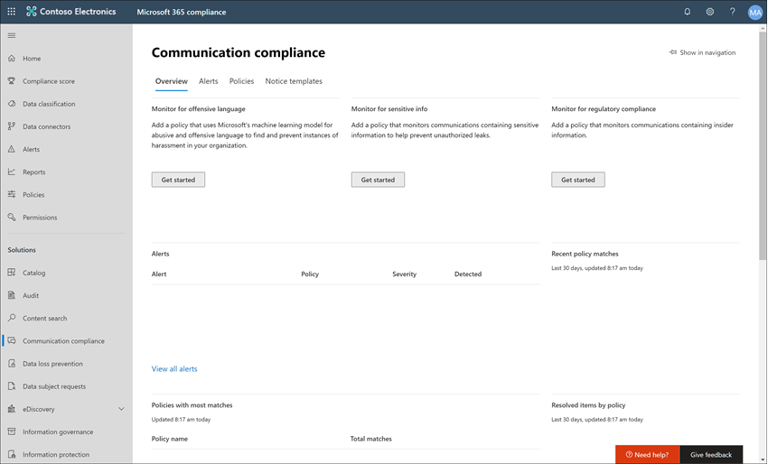

# Caso práctico: Contoso configura rápidamente una directiva de contenido inadecuado para Microsoft Teams, Exchange y Yammer comunicaciones

El cumplimiento de las Microsoft 365 ayuda a minimizar los riesgos de comunicación al ayudarle a detectar, capturar y actuar en mensajes con contenido inadecuado en su organización. El contenido inadecuado puede incluir palabras profanas, amenazas, hostigamiento e imágenes inapropiadas. Las directivas personalizadas y predefinidas le permiten examinar las comunicaciones internas y externas para ver las coincidencias de directivas y que los revisores designados puedan examinarlas. Los revisores pueden investigar el correo electrónico escaneado, Microsoft Teams, Yammer o comunicaciones de terceros en su organización y realizar las acciones de corrección adecuadas para asegurarse de que cumplen con los estándares de mensajes de su organización.

Contoso Corporation es una organización ficticia que necesita configurar rápidamente una directiva para supervisar el contenido inadecuado. Han estado usando Microsoft 365 principalmente para correo electrónico, Microsoft Teams y Yammer soporte técnico para sus usuarios, pero tienen nuevos requisitos para aplicar la directiva de la empresa en torno al acoso en el lugar de trabajo. Los administradores de TI de Contoso y los especialistas en cumplimiento tienen una comprensión básica de los conceptos básicos de trabajar con Microsoft 365 y están buscando instrucciones de un extremo a otro para empezar rápidamente con el cumplimiento de las comunicaciones.

En este caso práctico se tratarán los conceptos básicos para configurar rápidamente una directiva de cumplimiento de comunicaciones para supervisar las comunicaciones en busca de contenido inadecuado. Esta guía incluye:

- Paso 1: planificación del cumplimiento de comunicaciones
- Paso 2: acceso al cumplimiento de comunicaciones en Microsoft 365
- Paso 3: configuración de los requisitos previos y creación de una directiva de cumplimiento de comunicaciones
- Paso 4: investigación y corrección de alertas

## Paso 1: Planeación del cumplimiento de las comunicaciones

Los administradores de TI de Contoso y los especialistas en cumplimiento participaron en seminarios web en línea sobre soluciones de cumplimiento en Microsoft 365 y decidieron que las directivas de cumplimiento de comunicación les ayudarán a cumplir los requisitos de directivas corporativas actualizados para reducir el acoso en el lugar de trabajo. Al trabajar juntos, han desarrollado un plan para crear y habilitar una directiva de cumplimiento de comunicaciones que supervisará el contenido inadecuado para chats enviados en Microsoft Teams, mensajes privados y conversaciones de la comunidad en Yammer y en mensajes de correo electrónico enviados en Exchange Online. Su plan incluye identificar:

- Los administradores de TI que necesitan acceso a las características de cumplimiento de comunicaciones.
- Los especialistas en cumplimiento que necesitan crear y administrar directivas de comunicación.
- Los especialistas en cumplimiento y otros compañeros de otros departamentos (Recursos humanos, Legales, etc.) que necesitan investigar y corregir alertas de cumplimiento de comunicaciones.
- Los usuarios que estarán en el ámbito de la directiva de contenido inadecuado de cumplimiento de comunicaciones.

### Licencias

El primer paso es confirmar que las licencias de Microsoft 365 contoso incluyen compatibilidad con la solución de cumplimiento de comunicaciones. Para obtener acceso y usar el cumplimiento de las comunicaciones, los administradores de TI de Contoso deben comprobar que Contoso tiene uno de los siguientes elementos:

- Microsoft 365 E5 suscripción (versión de pago o de prueba)
- Microsoft 365 E3 suscripción + el Cumplimiento de Microsoft 365 E5 complemento
- Microsoft 365 E3 suscripción + el Microsoft 365 E5 de Administración de riesgos de Insider
- Microsoft 365 A5 suscripción (versión de pago o de prueba)
- Microsoft 365 A3 suscripción + el complemento Microsoft 365 A5 cumplimiento
- Microsoft 365 A3 suscripción + el Microsoft 365 A5 de administración de riesgos de Insider
- Suscripción a Microsoft 365 G5 (versión de pago o de prueba)
- Microsoft 365 de G5 + el Microsoft 365 de cumplimiento de G5
- Microsoft 365 de G5 + el complemento Microsoft 365 G5 Insider Risk Management
- Office 365 Enterprise de E5 (versión de pago o de prueba)
- Office 365 Enterprise suscripción a E3 + Cumplimiento avanzado de Office 365 complemento (ya no está disponible para nuevas suscripciones, vea la nota)

También deben confirmar que los usuarios incluidos en las directivas de cumplimiento de comunicaciones deben tener asignada una de las licencias anteriores.

> [!IMPORTANT]
> Cumplimiento avanzado de Office 365 ya no se vende como una suscripción independiente. Cuando expiran las suscripciones actuales, los clientes deben realizar la transición a una de las suscripciones anteriores, que contienen las mismas o adicionales características de cumplimiento.

Los administradores de TI de Contoso toman los siguientes pasos para comprobar la compatibilidad con licencias de Contoso:

1. Los administradores de TI inician sesión en el Centro de administración de Microsoft 365 <https://admin.microsoft.com> y van a Centro de administración de Microsoft 365 > licencias **de**  >  <a href="https://go.microsoft.com/fwlink/p/?linkid=842264" target="_blank">**facturación**</a>.

2. Aquí confirman que tienen una de las opciones de [licencia](communication-compliance-configure.md#subscriptions-and-licensing) que incluye compatibilidad con el cumplimiento de las comunicaciones.

### Permisos para el cumplimiento de comunicaciones

Hay cinco grupos de roles que se usan para configurar permisos para administrar las características de cumplimiento de comunicaciones. Para que **el cumplimiento de** la comunicación esté disponible como una opción de menú en Centro de cumplimiento de Microsoft 365 y para continuar con estos pasos de configuración, a los administradores de Contoso se les asigna el rol De administrador de cumplimiento *de* comunicaciones.

Contoso decide usar el grupo de roles *Cumplimiento* de comunicaciones para asignar al grupo todos los administradores de cumplimiento de comunicación, analistas, investigadores y visores. Esto facilita que Contoso pueda empezar a trabajar rápidamente y se adapte mejor a sus requisitos de administración de cumplimiento.

|**Rol**|**Permisos de funciones**|
|:-----|:-----|
| **Cumplimiento de comunicaciones** | Use este grupo de roles para administrar el cumplimiento de comunicaciones de su organización en un solo grupo. Al agregar todas las cuentas de usuario para administradores designados, analistas, investigadores y visores, puede configurar los permisos de cumplimiento de comunicaciones en un solo grupo. Este grupo de funciones contiene todos los roles de permisos de cumplimiento de comunicación. Esta configuración es la forma más sencilla de empezar rápidamente con el cumplimiento de las comunicaciones y es una buena opción para las organizaciones que no necesitan permisos independientes definidos para grupos independientes de usuarios. |
| **Administrador de cumplimiento de comunicaciones** | Use este grupo de roles para configurar inicialmente el cumplimiento de las comunicaciones y posteriormente para segregar a los administradores de cumplimiento de comunicaciones en un grupo definido. Los usuarios asignados a este grupo de roles pueden crear, leer, actualizar y eliminar directivas de cumplimiento de comunicación, configuración global y asignaciones de grupos de roles. Los usuarios asignados a este grupo de roles no pueden ver alertas de mensajes. |
| **Analista de cumplimiento de comunicaciones** | Use este grupo para asignar permisos a los usuarios que actuarán como analistas de cumplimiento de comunicaciones. Los usuarios asignados a este grupo de roles pueden ver directivas en las que se les asigna como revisores, ver metadatos de mensajes (no contenido del mensaje), escalar a revisores adicionales o enviar notificaciones a los usuarios. Los analistas no pueden resolver alertas pendientes. |
| **Investigador de cumplimiento de comunicaciones** | Use este grupo para asignar permisos a los usuarios que actuarán como investigadores de cumplimiento de comunicaciones. Los usuarios asignados a este grupo de roles pueden ver los metadatos y el contenido de los mensajes, escalar a revisores adicionales, escalar a un caso Advanced eDiscovery, enviar notificaciones a los usuarios y resolver la alerta. |
| **Visor de cumplimiento de comunicaciones** | Use este grupo para asignar permisos a los usuarios que administrarán informes de comunicación. Los usuarios asignados a este grupo de roles pueden tener acceso a todos los widgets de informes de la página principal de cumplimiento de comunicaciones y pueden ver todos los informes de cumplimiento de comunicaciones. |

1. Los administradores de TI de Contoso inician sesión en la [página Centro de cumplimiento de Microsoft 365](https://compliance.microsoft.com/permissions) permisos con credenciales para una cuenta de administrador global y seleccionan el vínculo para ver y administrar roles en Microsoft 365.
2. En el Centro de cumplimiento de Microsoft 365, van a <a href="https://go.microsoft.com/fwlink/p/?linkid=2173597" target="_blank">**Permisos**</a> y seleccionan el vínculo para ver y administrar roles en Office 365.
3. Los administradores seleccionan el grupo de roles *Cumplimiento* de comunicaciones y, a continuación, **selecciona Editar grupo de funciones**.
4. Los administradores **seleccionan Elegir miembros** en el panel de navegación izquierdo y, a continuación, selecciona **Editar**.
5. Seleccionan **Agregar y,** a continuación, seleccionan la casilla para todos los usuarios de Contoso que administrarán el cumplimiento de la comunicación, investigarán y revisarán las alertas.
6. Los administradores **seleccionan Agregar** y, a continuación, **listo.**
7. Seleccionan **Guardar para** agregar usuarios de Contoso al grupo de roles. Seleccionan **Cerrar para** completar los pasos.

## Paso 2: Obtener acceso al cumplimiento de las comunicaciones en Microsoft 365

Después de configurar los permisos para el cumplimiento de las comunicaciones, los administradores de TI de Contoso y los especialistas en cumplimiento asignados al grupo de roles Cumplimiento de comunicaciones pueden obtener acceso a la solución de cumplimiento de comunicaciones en Microsoft 365. Los administradores de TI de Contoso y los especialistas en cumplimiento tienen varias formas de obtener acceso al cumplimiento de comunicaciones y empezar a crear una nueva directiva:

- A partir directamente de la solución de cumplimiento de comunicaciones
- A partir del Centro de cumplimiento de Microsoft 365
- A partir del catálogo Microsoft 365 de soluciones
- A partir del Centro de administración de Microsoft 365

### A partir directamente de la solución de cumplimiento de comunicaciones

La forma más rápida de obtener acceso a la solución es iniciar sesión directamente en la solución **de cumplimiento de comunicaciones** ( <https://compliance.microsoft.com/supervisoryreview> ) . Con este vínculo, los administradores de TI de Contoso y los especialistas en cumplimiento se dirigirán al panel de información general sobre el cumplimiento de la comunicación, donde puede revisar rápidamente el estado de las alertas y crear nuevas directivas a partir de las plantillas predefinidas.

### A partir del Centro de cumplimiento de Microsoft 365

Otra forma fácil de que los administradores de TI de Contoso y los especialistas en cumplimiento accedan a la solución de cumplimiento de comunicaciones es iniciar sesión directamente en el [Centro de cumplimiento de Microsoft 365](https://compliance.microsoft.com). Después de iniciar sesión, los usuarios simplemente necesitan seleccionar el control **Mostrar todo** para que se muestren todas las soluciones de cumplimiento y, después, seleccionar la solución **Cumplimiento de comunicaciones** para empezar.

### A partir del catálogo Microsoft 365 de soluciones

Los administradores de TI de Contoso y los especialistas en cumplimiento también podrían elegir tener acceso a la solución de cumplimiento de comunicaciones seleccionando el catálogo Microsoft 365 soluciones. Al seleccionar **Catálogo** en la sección **Soluciones** de la navegación izquierda mientras se encuentra en la **Centro de cumplimiento de Microsoft 365,** pueden abrir el catálogo de soluciones que enumera todas las Microsoft 365 cumplimiento normativo. Desplazándose hacia abajo a la sección de administración de riesgos de **Insider,** los administradores de TI de Contoso pueden seleccionar Cumplimiento de comunicaciones para empezar. Los administradores de TI de Contoso también deciden usar el control Mostrar en navegación para anclar la solución de cumplimiento de comunicaciones al panel de navegación izquierdo para un acceso más rápido cuando inicien sesión en adelante.

### A partir del Centro de administración de Microsoft 365

Para obtener acceso al cumplimiento de comunicaciones al comenzar desde la Centro de administración de Microsoft 365, los administradores de TI de Contoso y los especialistas en cumplimiento inician sesión en el Centro de administración de Microsoft 365 [( https://admin.microsoft.com) ](https://admin.microsoft.com) y van a [ Centro de cumplimiento de Microsoft 365](https://compliance.microsoft.com)

Esta acción abre el **centro Office 365 seguridad** y cumplimiento y  deben seleccionar el vínculo al Centro de cumplimiento de Microsoft 365 que se proporciona en el banner en la parte superior de la página.

Una vez en **el Centro de cumplimiento de Microsoft 365,** los administradores de TI de Contoso seleccionan **Mostrar** todo para mostrar la lista completa de soluciones de cumplimiento.

Después de seleccionar **Mostrar todo,** los administradores de TI de Contoso pueden tener acceso a la solución de cumplimiento de comunicaciones.

## Paso 3: Configuración de requisitos previos y creación de una directiva de cumplimiento de comunicaciones

Para empezar con una directiva de cumplimiento de comunicaciones, hay varios requisitos previos que los administradores de TI de Contoso deben configurar antes de configurar la nueva directiva para supervisar el contenido inadecuado. Una vez completados estos requisitos previos, los administradores de TI de Contoso y los especialistas de cumplimiento pueden configurar la nueva directiva y los especialistas de cumplimiento pueden iniciar la investigación y la corrección de las alertas generadas.

### Habilitar la auditoría en Microsoft 365

El Cumplimiento de comunicaciones requiere registros de auditoría para mostrar alertas y realizar un seguimiento de las acciones de corrección realizadas por los revisores. Los registros de auditoría son un resumen de todas las actividades asociadas con una directiva organizativa definida o los cambios que se realicen en la directiva de cumplimiento de comunicaciones.

Los administradores de TI de Contoso revisan y completan las [instrucciones paso a paso](turn-audit-log-search-on-or-off.md) para activar la auditoría. Después de activar la auditoría, se muestra un mensaje que dice que el registro de auditoría se está preparando y que puede ejecutar una búsqueda en un par de horas después de que se complete la preparación. Los administradores de TI de Contoso solo tienen que realizar esta acción una vez.

### Configuración de Yammer inquilino para el modo nativo

El cumplimiento de la comunicación requiere que Yammer inquilino de una organización esté en modo nativo para supervisar el contenido inadecuado en mensajes privados y conversaciones de la comunidad pública.

Los administradores de TI de Contoso se asegura de revisar la información del artículo Información general sobre el modo nativo de Yammer en [Microsoft 365](/yammer/configure-your-yammer-network/overview-native-mode) y seguir los pasos para ejecutar la herramienta de migración en el artículo Configurar la red [de Yammer](/yammer/configure-your-yammer-network/native-mode) para el modo nativo para Microsoft 365.

### Configuración de un grupo para usuarios en el ámbito

Los especialistas en cumplimiento de Contoso desean agregar todos los usuarios a la directiva de comunicación que supervisará el contenido inadecuado. Podrían decidir agregar cada cuenta de usuario a la directiva por separado, pero han  decidido que es mucho más fácil y ahorra tiempo para usar un grupo de distribución Todos los usuarios para los usuarios para esta directiva.

Deben crear un nuevo grupo para incluir a todos los usuarios de Contoso, por lo que deben seguir los pasos siguientes:

1. Los administradores de TI de Contoso inician sesión en el Centro de administración de Microsoft 365 [( https://admin.microsoft.com)](https://admin.microsoft.com) y ve a Centro de administración de Microsoft 365 > **Grupos de**  >  <a href="https://go.microsoft.com/fwlink/p/?linkid=2052855" target="_blank">**servidores**</a>.
2. Seleccionan **Agregar un grupo y** completan el asistente para crear un nuevo grupo de Microsoft 365 *o* grupo *de distribución.*

    

3. Una vez creado el nuevo grupo, necesitan agregar todos los usuarios de Contoso al nuevo grupo. Abren el centro **Exchange de administración** [ https://outlook.office365.com/ecp) (](https://outlook.office365.com/ecp) y navegan a **Exchange grupos** de destinatarios del Centro de  >    >  **administración**. Los administradores de TI de Contoso  seleccionan el área Pertenencia y el nuevo grupo Todos los empleados que crearon y seleccionan el **control** Editar para agregar todos los usuarios de Contoso al nuevo grupo en el asistente.

    

### Creación de la directiva para supervisar el contenido inadecuado

Una vez completados todos los requisitos previos, los administradores de TI y los especialistas en cumplimiento de Contoso están listos para configurar la directiva de cumplimiento de comunicaciones para supervisar el contenido inadecuado. Con la nueva plantilla de directiva de contenido inadecuado, la configuración de esta directiva es sencilla y rápida.

1. Los administradores de TI y los especialistas de cumplimiento de Contoso inician sesión en el **Centro de cumplimiento de Microsoft 365** y seleccionan **Cumplimiento de comunicaciones** en el panel de navegación izquierdo. Esta acción abre el panel **Información general** que tiene vínculos rápidos para las plantillas de directiva de cumplimiento de comunicaciones. Para elegir la **plantilla Supervisar para contenido inadecuado,** seleccione **Introducción** a la plantilla.

    

2. En el asistente para plantillas de directiva, los administradores de TI de Contoso y los especialistas de cumplimiento trabajan conjuntamente para completar los tres campos necesarios: **Nombre de directiva**, **Usuarios o grupos para supervisar** y **Revisores**.
3. Dado que el asistente para directivas ya ha sugerido un nombre para la directiva, los administradores de TI y especialistas de cumplimiento deciden mantener el nombre sugerido y centrarse en los campos restantes. Seleccionan el *grupo Todos* los usuarios para que los usuarios o grupos supervisen el campo y seleccionan los especialistas en cumplimiento que deben investigar y corregir alertas de directiva para el **campo Revisores.**  El último paso para configurar la directiva y empezar a recopilar información de alerta es seleccionar **Crear directiva**.

    

## Paso 4: Investigar y corregir alertas

Ahora que está configurada la directiva de cumplimiento de comunicaciones para supervisar el contenido inadecuado, el siguiente paso para los especialistas en cumplimiento de Contoso será investigar y corregir las alertas generadas por la directiva. Pueden ser necesarias hasta 24 horas para que las comunicaciones en todos los canales de origen de la comunicación se procesen por completo y las alertas se muestren en el **Panel de alertas**.

Una vez generadas las alertas,  los especialistas en cumplimiento de Contoso seguirán las instrucciones del flujo de trabajo para investigar y corregir problemas de contenido inadecuados.