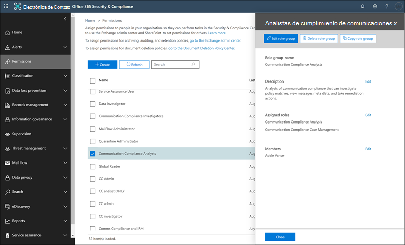

# Introducción al cumplimiento de las comunicacionesGet started with communication compliance

Use las directivas de cumplimiento de comunicaciones para identificar las comunicaciones de los usuarios con el fin de examinarlas por los revisores externos o internos.Use communication compliance policies to identify user communications for examination by internal or external reviewers. Para obtener más información sobre cómo las directivas de cumplimiento de comunicaciones pueden ayudarle a supervisar las comunicaciones en su organización, consulte [directivas de cumplimiento de comunicaciones en Microsoft 365](communication-compliance.md).For more information about how communication compliance policies can help you monitor communications in your organization, see [communication compliance policies in Microsoft 365](communication-compliance.md). Si desea revisar cómo contoso ha configurado rápidamente una directiva de cumplimiento de comunicaciones para supervisar el lenguaje ofensivo en Microsoft Teams, Exchange Online y Yammer Communications, consulte este [caso práctico](communication-compliance-case-study.md).If you'd like to review how Contoso quickly configured a communication compliance policy to monitor for offensive language in Microsoft Teams, Exchange Online, and Yammer communications, check out this [case study](communication-compliance-case-study.md).

## Antes de empezarBefore you begin

Antes de empezar con el cumplimiento de la comunicación, debe confirmar la [suscripción de Microsoft 365](https://www.microsoft.com/microsoft-365/compare-all-microsoft-365-plans) y los complementos.Before you get started with communication compliance, you should confirm your [Microsoft 365 subscription](https://www.microsoft.com/microsoft-365/compare-all-microsoft-365-plans) and any add-ons. Para acceder y usar el cumplimiento de las comunicaciones, su organización debe tener una de las siguientes suscripciones o complementos:To access and use communication compliance, your organization must have one of the following subscriptions or add-ons:

- Suscripción a Microsoft 365 E5 (versión de pago o de prueba)Microsoft 365 E5 subscription (paid or trial version)
- Suscripción a Microsoft 365 E3 + complemento de cumplimiento de Microsoft 365 E5Microsoft 365 E3 subscription + the Microsoft 365 E5 Compliance add-on
- Suscripción a Microsoft 365 E3 + complemento Microsoft 365 E5 del servicio de administración de riesgos de InsiderMicrosoft 365 E3 subscription + the Microsoft 365 E5 Insider Risk Management add-on
- Suscripción a Microsoft 365 A5 (versión de pago o de prueba)Microsoft 365 A5 subscription (paid or trial version)
- Suscripción a Microsoft 365 a3 + complemento de cumplimiento A5 de Microsoft 365Microsoft 365 A3 subscription + the Microsoft 365 A5 Compliance add-on
- Suscripción a Microsoft 365 a3 + complemento de administración de riesgos de la A5 del Insider de Microsoft 365Microsoft 365 A3 subscription + the Microsoft 365 A5 Insider Risk Management add-on
- Suscripción a Microsoft 365 G5 (versión de pago o de prueba)Microsoft 365 G5 subscription (paid or trial version)
- Suscripción a Microsoft 365 G5 + complemento de cumplimiento de Microsoft 365 G5Microsoft 365 G5 subscription + the Microsoft 365 G5 Compliance add-on
- Suscripción a Microsoft 365 G5 + complemento de administración de riesgos de Insider de Microsoft 365 G5Microsoft 365 G5 subscription + the Microsoft 365 G5 Insider Risk Management add-on
- Suscripción a Office 365 Enterprise E5 (versión de pago o de prueba)Office 365 Enterprise E5 subscription (paid or trial version)
- Office 365 Enterprise E3 subscription + el complemento Office 365 Advanced Compliance (ya no está disponible para las nuevas suscripciones, vea note)Office 365 Enterprise E3 subscription + the Office 365 Advanced Compliance add-on (no longer available for new subscriptions, see note)

Los usuarios incluidos en las directivas de cumplimiento de comunicaciones deben tener asignada una de las licencias anteriores.Users included in communication compliance policies must be assigned one of the licenses above.

>[!IMPORTANT]
>Office 365 Advanced Compliance ya no se vende como una suscripción independiente.Office 365 Advanced Compliance is no longer sold as a standalone subscription. Cuando expiren las suscripciones actuales, los clientes deben pasar a una de las suscripciones anteriores, que contienen las mismas características de cumplimiento o más.When current subscriptions expire, customers should transition to one of the subscriptions above, which contain the same or additional compliance features.

Si no tiene un plan de Office 365 Enterprise E5 existente y desea probar la administración de riesgos de Insider, puede [Agregar Microsoft 365](https://docs.microsoft.com/office365/admin/try-or-buy-microsoft-365) a la suscripción existente o [registrarse para obtener una versión de prueba](https://www.microsoft.com/microsoft-365/enterprise) de Office 365 Enterprise E5.If you don't have an existing Office 365 Enterprise E5 plan and want to try insider risk management, you can [add Microsoft 365](https://docs.microsoft.com/office365/admin/try-or-buy-microsoft-365) to your existing subscription or [sign up for a trial](https://www.microsoft.com/microsoft-365/enterprise) of Office 365 Enterprise E5.

## Paso 1 (obligatorio): habilitar permisos para el cumplimiento de la comunicaciónStep 1 (required): Enable permissions for communication compliance

>[!Important]
>De forma predeterminada, los administradores globales no tienen acceso a las características de cumplimiento de comunicaciones.By default, Global Administrators do not have access to communication compliance features. Los roles asignados en este paso son necesarios antes de que se pueda tener acceso a las características de cumplimiento de la comunicación.The roles assigned in this step are required before any communication compliance features will be accessible.

Hay cinco funciones que se usan para configurar los permisos para administrar las características de cumplimiento de comunicaciones.There are five roles used to configure permissions to manage communication compliance features. Para que el cumplimiento de la **comunicación** esté disponible como una opción de menú en el centro de cumplimiento de Microsoft 365 y para continuar con estos pasos de configuración, debe tener asignado el rol de administrador de *cumplimiento de comunicaciones* .To make **Communication compliance** available as a menu option in Microsoft 365 compliance center and to continue with these configuration steps, you must be assigned the *Communication Compliance Admin* role.

En función de cómo desee administrar las directivas y alertas de comunicación, tendrá que crear uno o más grupos de roles nuevos para los administradores, revisores e investigadores.Depending on how you wish to manage communication policies and alerts, you'll need to create one or more new role groups for administrators, reviewers, and investigators. Tiene la opción de asignar usuarios a grupos de roles específicos para administrar diferentes áreas de características de cumplimiento de comunicaciones.You have the option to assign users to specific role groups to manage different areas of communication compliance features. O bien, puede decidir crear un grupo de roles y asignar todos los roles de cumplimiento de comunicaciones al grupo.Or you may decide to create one role group and assign all the communication compliance roles to the group. Cree un grupo de roles único o varios grupos de roles que se ajusten mejor a los requisitos de administración de cumplimiento.Create a single role group or multiple role groups to best fit your compliance management requirements.

Elija entre estas opciones de rol al configurar los grupos de funciones de cumplimiento de la comunicación:Choose from these role options when configuring your communication compliance role groups:

|**Rol****Role**|**Permisos de funciones****Role permissions**|
|:-----|:-----|
| **Administrador de cumplimiento de comunicaciones****Communication Compliance Admin** | Los usuarios que tienen asignado este rol pueden crear, leer, actualizar y eliminar las directivas de cumplimiento de la comunicación, la configuración global y las asignaciones del grupo de roles.Users assigned this role can create, read, update, and delete communication compliance policies, global settings, and role group assignments. Los usuarios asignados a esta función no pueden ver los mensajes de alerta.Users assigned this role cannot view message alerts. |
| **Análisis de cumplimiento de comunicaciones****Communication Compliance Analysis** | Los usuarios que tienen asignado este rol pueden ver las directivas en las que se asignan como revisores, ver los metadatos de los mensajes (no el contenido del mensaje), remitir a otros revisores o enviar notificaciones a los usuarios.Users assigned this role can view policies where they are assigned as Reviewers, view message metadata (not message content), escalate to additional reviewers, or send notifications to users. Los analistas no pueden resolver alertas pendientes.Analysts cannot resolve pending alerts. |
| **Investigación de cumplimiento en la comunicación****Communication Compliance Investigation** | Los usuarios que tienen asignado este rol pueden ver el contenido y los metadatos de los mensajes, escalar a revisores adicionales, escalar a un caso de exhibición de documentos electrónicos avanzado, enviar notificaciones a los usuarios y resolver la alerta.Users assigned this role can view message metadata and content, escalate to additional reviewers, escalate to an Advanced eDiscovery case, send notifications to users, and resolve the alert. |
| **Visor de cumplimiento de comunicaciones****Communication Compliance Viewer** | Los usuarios a los que se les asigna esta función pueden tener acceso a todos los widgets de informes en la Página principal de cumplimiento de comunicaciones y pueden ver todos los informes de cumplimiento de comunicaciones.Users assigned this role can access all reporting widgets on the communication compliance home page and can view all communication compliance reports. |
| **Administración de casos de cumplimiento de comunicaciones****Communication Compliance Case Management** | Los usuarios que tienen asignado este rol pueden administrar casos y actuar en alertas.Users assigned this role can manage cases and act on alerts. Este rol es necesario para cuando se crean grupos de roles personalizados para administradores, analistas e investigadores.This role is required for when creating custom role groups for administrators, analysts, and investigators. Los grupos personalizados para visores no necesitan esta función asignada.Custom groups for viewers do not need this role assigned. |

### Opción 1: crear un nuevo grupo de roles con todos los roles de cumplimiento de la comunicaciónOption 1: Create a new role group with all communication compliance roles

1. Inicie sesión [https://protection.office.com/permissions](https://protection.office.com/permissions) con las credenciales de una cuenta de administrador en la organización de Microsoft 365.Sign into [https://protection.office.com/permissions](https://protection.office.com/permissions) using credentials for an admin account in your Microsoft 365 organization.

2. En el centro de seguridad &amp; y cumplimiento, vaya a **permisos**.In the Security &amp; Compliance Center, go to **Permissions**. Seleccione el vínculo para ver y administrar roles en Office 365.Select the link to view and manage roles in Office 365.

3. Seleccione **Crear**.Select **Create**.

4. En el campo **nombre** , asigne un nombre descriptivo al nuevo grupo de roles.In the **Name** field, give the new role group a friendly name. Seleccione **Siguiente**.Select **Next**.

5. Seleccione **elegir roles** y, después, haga clic en **Agregar**.Select **Choose roles** and then select **Add**. Marque las casillas de verificación de los roles siguientes:Select the checkboxes for the following roles:

    - Administrador de cumplimiento de comunicacionesCommunication Compliance Admin
    - Análisis de cumplimiento de comunicacionesCommunication Compliance Analysis
    - Investigación de cumplimiento en la comunicaciónCommunication Compliance Investigation
    - Visor de cumplimiento de comunicacionesCommunication Compliance Viewer
    - Administración de casos de cumplimiento de comunicacionesCommunication Compliance Case Management

    

6. Seleccione **Agregar** y **listo**y, después, haga clic en **siguiente** para continuar.select **Add** and **Done**, then select **Next** to continue.

7. Seleccione **elegir miembros** y, a continuación, seleccione **Agregar**.Select **Choose members** and then select **Add**. Marque la casilla de verificación para todos los usuarios y grupos que desee que creen directivas y administre los mensajes con coincidencias de directivas y, a continuación, seleccione **Agregar** y **listo**.Select the checkbox for all the users and groups you want create policies and manage messages with policy matches, then select **Add** and **Done**. Seleccione **Siguiente**.Select **Next**.

8. Seleccione **Crear grupo de funciones** para finalizar.Select **Create role group** to finish.

### Opción 2: crear nuevos grupos de roles con diferentes roles de cumplimiento de comunicaciónOption 2: Create new role groups with different communication compliance roles

Cree varios grupos de roles para segmentar el acceso y las responsabilidades del cumplimiento de comunicaciones entre los distintos usuarios de la organización.Create multiple role groups to segment communication compliance access and responsibilities among different users in your organization. Para cada nuevo grupo de roles, asignará diferentes roles de cumplimiento de comunicaciones.For each new role group, you'll assign different communication compliance roles.

1. Inicie sesión [https://protection.office.com/permissions](https://protection.office.com/permissions) con las credenciales de una cuenta de administrador en la organización de Microsoft 365.Sign into [https://protection.office.com/permissions](https://protection.office.com/permissions) using credentials for an admin account in your Microsoft 365 organization.

2. En el centro de seguridad &amp; y cumplimiento, vaya a **permisos**.In the Security &amp; Compliance Center, go to **Permissions**. Seleccione el vínculo para ver y administrar roles en Office 365.Select the link to view and manage roles in Office 365.

3. Seleccione **Crear**.Select **Create**.

4. En el campo **nombre** , asigne un nombre descriptivo al nuevo grupo de roles.In the **Name** field, give the new role group a friendly name. Seleccione **Siguiente**.Select **Next**.

5. Seleccione **elegir roles** y, después, haga clic en **Agregar**.Select **Choose roles** and then select **Add**. Marque la casilla de verificación de los roles de cumplimiento de comunicaciones que desee asignar a este grupo.Select the checkbox for the communication compliance roles you want to assign to this group. Por ejemplo, si este grupo de roles es para los analistas de cumplimiento de su organización, debe seleccionar los roles de *Administración de casos* de *análisis* y cumplimiento normativo de comunicaciones.For example, if this role group is for compliance analysts in your organization, you would select the *Communication Compliance Analysis* and *Communication Compliance Case Management* roles. Si este grupo de roles es para investigadores de cumplimiento, debe seleccionar los roles de administración de *casos* de investigación de cumplimiento de *comunicaciones* y de cumplimiento de comunicaciones.If this role group is for compliance investigators, you would select the *Communication Compliance Investigation* and *Communication Compliance Case Management* roles.

    

6. Seleccione **Agregar** y **listo**y, después, haga clic en **siguiente** para continuar.Select **Add** and **Done**, then select **Next** to continue.

7. Seleccione **elegir miembros** y, a continuación, seleccione **Agregar**.Select **Choose members** and then select **Add**. Marque la casilla de verificación para todos los usuarios y grupos que desee que creen directivas y administre los mensajes con coincidencias de directivas y, a continuación, seleccione **Agregar** y **listo**.Select the checkbox for all the users and groups you want create policies and manage messages with policy matches, then select **Add** and **Done**. Seleccione **Siguiente**.Select **Next**.

8. Seleccione **Crear grupo de funciones** para finalizar.Select **Create role group** to finish.

9. Cree grupos de roles de cumplimiento de comunicación adicionales según sea necesario.Create additional communication compliance role groups as needed.

Para obtener más información acerca de los grupos de roles y los permisos, consulte [Permissions in the Compliance Center](../security/office-365-security/protect-against-threats.md).For more information about role groups and permissions, see [Permissions in the Compliance Center](../security/office-365-security/protect-against-threats.md).

## Paso 2 (obligatorio): habilitar el registro de auditoríaStep 2 (required): Enable the audit log

El cumplimiento de la comunicación requiere registros de auditoría para mostrar alertas y realizar un seguimiento de las acciones de corrección realizadas por los revisores.Communication compliance requires audit logs to show alerts and track remediation actions taken by reviewers. Los registros de auditoría son un resumen de todas las actividades asociadas con una directiva de organización definida o cada vez que cambia una directiva de cumplimiento de la comunicación.The audit logs are a summary of all activities associated with a defined organizational policy or anytime a communication compliance policy changes.

Para obtener instrucciones paso a paso para activar la auditoría, vea [activar o desactivar la búsqueda de registros de auditoría](turn-audit-log-search-on-or-off.md).For step-by-step instructions to turn on auditing, see [Turn audit log search on or off](turn-audit-log-search-on-or-off.md). Después de activar la auditoría, se muestra un mensaje que indica que se está preparando el registro de auditoría y que puede ejecutar una búsqueda en un par de horas después de que se complete la preparación.After you turn on auditing, a message is displayed that says the audit log is being prepared and that you can run a search in a couple of hours after the preparation is complete. Solo tiene que realizar esta acción una vez.You only have to do this action once. Para obtener más información acerca del uso del registro de auditoría, vea [Buscar en el registro de auditoría](search-the-audit-log-in-security-and-compliance.md).For more information about the using the audit log, see [Search the audit log](search-the-audit-log-in-security-and-compliance.md).

## Paso 3 (opcional): configurar grupos para el cumplimiento de la comunicaciónStep 3 (optional): Set up groups for communication compliance

 Al crear una directiva de cumplimiento de la comunicación, se define quién ha revisado sus comunicaciones y quién realiza las revisiones.When you create a communication compliance policy, you define who has their communications reviewed and who performs reviews. En la Directiva, usará direcciones de correo electrónico para identificar personas o grupos de personas.In the policy, you'll use email addresses to identify individuals or groups of people. Para simplificar la configuración, puede crear grupos para los usuarios que tengan su comunicación revisada y grupos para los usuarios que revisen dichas comunicaciones.To simplify your setup, you can create groups for people who have their communication reviewed and groups for people who review those communications. Si está usando grupos, es posible que necesite varios.If you're using groups, you may need several. Por ejemplo, si desea supervisar las comunicaciones entre dos grupos de personas distintas o si desea especificar un grupo que no va a supervisarse.For example, if you want to monitor communications between two distinct groups of people or if you want to specify a group that isn't going to be supervised.

Use el siguiente gráfico para ayudarle a configurar los grupos de su organización para las directivas de cumplimiento de comunicaciones:Use the following chart to help you configure groups in your organization for communication compliance policies:

| **Miembro de la Directiva****Policy Member** | **Grupos admitidos****Supported Groups** | **Grupos no admitidos****Unsupported Groups** |
|:-----|:-----|:-----|
|Usuarios supervisadosSupervised users   Usuarios no supervisadosNon-supervised users | Grupos de distribuciónDistribution groups   Grupos de Microsoft 365Microsoft 365 Groups | Grupos de distribución dinámicosDynamic distribution groups |
| ReviewersReviewers | NoneNone | Grupos de distribuciónDistribution groups   Grupos de distribución dinámicosDynamic distribution groups   Grupos de seguridad habilitados para correoMail-enabled security groups |
  
Cuando se asigna un grupo de distribución en la Directiva, la Directiva supervisa todos los mensajes de correo de cada usuario en el grupo de distribución.When you assign a distribution group in the policy, the policy monitors all emails from each user in distribution group. Cuando asigna un grupo de Microsoft 365 en la Directiva, la Directiva supervisa todos los mensajes de correo electrónico enviados a ese grupo, no los mensajes de correo electrónico individuales recibidos por cada miembro del grupo.When you assign a Microsoft 365 group in the policy, the policy monitors all emails sent to that group, not the individual emails received by each group member.

Si es una organización con una implementación local de Exchange o un proveedor de correo electrónico externo y desea supervisar los chats de Microsoft Teams para los usuarios, debe crear un grupo de distribución para los usuarios con buzones locales o externos para supervisar.If you're an organization with an Exchange on-premises deployment or an external email provider and you want to monitor Microsoft Teams chats for your users, you must create a distribution group for the users with on-premises or external mailboxes to monitor. Más adelante en estos pasos, asignará este grupo de distribución como la selección de **usuarios y grupos supervisados** en el Asistente para directivas.Later in these steps, you'll assign this distribution group as the **Supervised users and groups** selection in the policy wizard.

>[!IMPORTANT]
>Debe archivar una solicitud con soporte técnico de Microsoft para permitir que su organización use la interfaz gráfica de usuario del centro de seguridad & cumplimiento para buscar los datos de chat de Microsoft Teams para los usuarios locales.You must file a request with Microsoft Support to enable your organization to use the graphical user interface in the Security & Compliance Center to search for Teams chat data for on-premises users. Para obtener más información, vea [Buscar buzones de correo basados en la nube para usuarios locales](search-cloud-based-mailboxes-for-on-premises-users.md).For more information, see [Searching cloud-based mailboxes for on-premises users](search-cloud-based-mailboxes-for-on-premises-users.md).

Para obtener más información acerca de la configuración de grupos, vea:For more information about setting up groups, see:

- [Crear y administrar grupos de distribuciónCreate and manage distribution groups](https://docs.microsoft.com/Exchange/recipients-in-exchange-online/manage-distribution-groups/manage-distribution-groups)
- [Información general de los grupos de 365 de MicrosoftOverview of Microsoft 365 Groups](https://docs.microsoft.com/office365/admin/create-groups/office-365-groups?view=o365-worldwide)

## Paso 4 (opcional): comprobar que el inquilino de Yammer está en modo nativoStep 4 (optional): Verify your Yammer tenant is in Native Mode

En el modo nativo, todos los usuarios de Yammer están en Azure Active Directory (AAD), todos los grupos son Grupos de Office 365 y todos los archivos se almacenan en SharePoint Online.In Native Mode, all Yammer users are in Azure Active Directory (AAD), all groups are Office 365 Groups, and all files are stored in SharePoint Online. El inquilino de Yammer debe estar en modo nativo para que las directivas de cumplimiento de comunicaciones analicen e identifiquen conversaciones peligrosas en mensajes privados y conversaciones de la comunidad en Yammer.Your Yammer tenant must be in Native Mode for communication compliance policies to scan and identify risky conversations in private messages and community conversations in Yammer.

Para obtener más información acerca de la configuración de Yammer en modo nativo, consulte:For more information about configuring Yammer in Native Mode, see:

- [Información general sobre el modo nativo de Yammer en Microsoft 365Overview of Yammer Native Mode in Microsoft 365](https://docs.microsoft.com/yammer/configure-your-yammer-network/overview-native-mode)
- [Configurar su red de Yammer para el Modo nativo para Microsoft 365Configure your Yammer network for Native Mode for Microsoft 365](https://docs.microsoft.com/yammer/configure-your-yammer-network/native-mode)

## Paso 5 (obligatorio): crear una directiva de cumplimiento de la comunicaciónStep 5 (required): Create a communication compliance policy
  
>[!Important]
>No se admite el uso de PowerShell para crear y administrar directivas de cumplimiento de comunicaciones.Using PowerShell to create and manage communication compliance policies is not supported. Para crear y administrar estas directivas, debe usar los controles de administración de directivas de la [solución Microsoft 365 Communication Compliance](https://compliance.microsoft.com/supervisoryreview).To create and manage these policies, you must use the policy management controls in the [Microsoft 365 communication compliance solution](https://compliance.microsoft.com/supervisoryreview).

1. Inicie sesión [https://compliance.microsoft.com](https://compliance.microsoft.com) con las credenciales de una cuenta de administrador en la organización de Microsoft 365.Sign into [https://compliance.microsoft.com](https://compliance.microsoft.com) using credentials for an admin account in your Microsoft 365 organization.

2. En el centro de cumplimiento de Microsoft 365, seleccione **cumplimiento de comunicaciones**.In the Microsoft 365 compliance center, select **Communication compliance**.
  
3. Seleccione la pestaña **directivas** .Select the **Policies** tab.

4. Seleccione **crear Directiva** para crear y configurar una nueva Directiva a partir de una plantilla o para crear y configurar una directiva personalizada.Select **Create policy** to create and configure a new policy from a template or to create and configure a custom policy.

    Si elige una plantilla de directiva para crear una directiva, deberá:If you choose a policy template to create a policy, you will:

    - Confirme o actualice el nombre de la Directiva.Confirm or update the policy name. Los nombres de las directivas no se pueden cambiar una vez creada la Directiva.Policy names cannot be changed once the policy is created.
    - Elija los usuarios o grupos que desea supervisar, incluida la elección de los usuarios o grupos que quiera excluir.Choose the users or groups to supervise, including choosing users or groups you'd like to exclude.
    - Elija los revisores para la Directiva.Choose the reviewers for the policy. Los revisores son usuarios individuales y todos los revisores deben tener buzones hospedados en Exchange Online.Reviewers are individual users and all reviewers must have mailboxes hosted on Exchange Online. Los revisores agregados aquí son los revisores que puede elegir al escalar una alerta en el flujo de trabajo de investigación y corrección.Reviewers added here are the reviewers that you can choose from when escalating an alert in the investigation and remediation workflow. Cuando se agregan revisores a una directiva, reciben automáticamente un mensaje de correo electrónico que les notifica la asignación a la Directiva y proporciona vínculos a la información sobre el proceso de revisión.When reviewers are added to a policy, they automatically receive an email message that notifies them of the assignment to the policy and provides links to information about the review process.
    - Elija un campo de condición limitada, normalmente un tipo de información confidencial o un diccionario de palabras clave que se aplicará a la Directiva.Choose a limited condition field, usually a sensitive info type or keyword dictionary to apply to the policy.

    Si decide usar el Asistente para directivas para crear una directiva personalizada, deberá:If you choose to use the policy wizard to create a custom policy, you will:

    - Asigne un nombre y una descripción a la Directiva.Give the policy a name and description. Los nombres de las directivas no se pueden cambiar una vez creada la Directiva.Policy names can't be changed once the policy is created.
    - Elija los usuarios o grupos que desea supervisar, incluidos todos los usuarios de la organización, usuarios y grupos específicos, u otros usuarios y grupos que quiera excluir.Choose the users or groups to supervise, including all users in your organization, specific users and groups, or other users and groups you'd like to exclude.
    - Elija los revisores para la Directiva.Choose the reviewers for the policy. Los revisores son usuarios individuales y todos los revisores deben tener buzones hospedados en Exchange Online.Reviewers are individual users and all reviewers must have mailboxes hosted on Exchange Online. Los revisores agregados aquí son los revisores que puede elegir al escalar una alerta en el flujo de trabajo de investigación y corrección.Reviewers added here are the reviewers that you can choose from when escalating an alert in the investigation and remediation workflow. Cuando se agregan revisores a una directiva, reciben automáticamente un mensaje de correo electrónico que les notifica la asignación a la Directiva y proporciona vínculos a la información sobre el proceso de revisión.When reviewers are added to a policy, they automatically receive an email message that notifies them of the assignment to the policy and provides links to information about the review process.
    - Elija los canales de comunicación para analizar, incluidos Exchange, Microsoft Teams, Yammer o Skype empresarial.Choose the communication channels to scan, including Exchange, Microsoft Teams, Yammer, or Skype for Business. También elige analizar los orígenes de terceros si ha configurado un conector en Microsoft 365.You'll also choose to scan third-party sources if you've configured a connector in Microsoft 365.
    - Elija la dirección de comunicación que se va a supervisar, incluidas las comunicaciones entrantes, salientes o internas.Choose the communication direction to monitor, including inbound, outbound, or internal communications.
    - Definir las [condiciones](communication-compliance-feature-reference.md#ConditionalSettings)de la Directiva de cumplimiento de comunicaciones.Define the communication compliance policy [conditions](communication-compliance-feature-reference.md#ConditionalSettings). Puede elegir entre la dirección del mensaje, la palabra clave, los tipos de archivo y las condiciones de coincidencia de tamaño.You can choose from message address, keyword, file types, and size match conditions.
    - Elija si le gustaría incluir tipos de información confidencial.Choose if you'd like to include sensitive information types. En este paso puede seleccionar los tipos de información confidencial predeterminada y personalizado.This step is where you can select default and custom sensitive info types. Elija entre los tipos de información confidencial existentes o los diccionarios de palabras clave personalizados en el Asistente para la Directiva de cumplimiento de comunicaciones.Pick from existing custom sensitive information types or custom keyword dictionaries in the communication compliance policy wizard. Puede crear estos elementos antes de ejecutar el asistente si es necesario.You can create these items before running the wizard if needed. También puede crear nuevos tipos de información confidencial desde el Asistente para directivas de cumplimiento de comunicaciones.You can also create new sensitive information types from within the communication compliance policy wizard.
    - Elija si le gustaría habilitar los clasificadores.Choose if you'd like to enable classifiers. Los clasificadores pueden detectar lenguaje e imágenes inapropiados que se envían o reciben en el cuerpo de los mensajes de correo electrónico u otros tipos de texto.Classifiers can detect inappropriate language and images sent or received in the body of email messages or other types of text. Puede elegir los siguientes clasificadores integrados: *amenaza*, *blasfemia*, *acoso dirigido*, *imágenes para adultos*, imágenes de *racy*e imágenes de *Gory*.You can choose the following built-in classifiers: *Threat*, *Profanity*, *Targeted harassment*, *Adult images*, *Racy images*, and *Gory images*.

    >[!CAUTION]
    >Estamos desaprobando el clasificador incorporado de **Lenguaje ofensivo** porque ha estado produciendo un alto número de falsos positivos.We are deprecating the **Offensive Language** built-in classifier because it has been producing a high number of false positives. No lo use y, si actualmente lo está usando, debería mover sus procesos de negocio fuera de él.Don't use it and if you are currently using it, you should move your business processes off of it. En su lugar, se recomienda usar en su lugar los clasificadores integrados **Threats**, **blasfemias**y los de **acoso específicos** .We recommend using the **Threat**, **Profanity**, and **Targeted harassment** built-in classifiers instead.

    - Definir el porcentaje de comunicaciones que se van a revisar.Define the percentage of communications to review.
    - Revise las selecciones de la Directiva y cree la Directiva.Review your policy selections and create the policy.

5. Seleccione **crear Directiva** al usar las plantillas o **Enviar** cuando se use el Asistente para directivas personalizadas.Select **Create policy** when using the templates or **Submit** when using the custom policy wizard.

6. La página se **ha creado la Directiva** se muestra con instrucciones sobre cuándo se activará la Directiva y qué comunicaciones se capturarán.The **Your policy was created** page is displayed with guidelines on when policy will be activated and which communications will be captured.

## Paso 6 (opcional): crear plantillas de aviso y configurar anonymization de usuarioStep 6 (optional): Create notice templates and configure user anonymization

Si desea tener la opción de responder a una alerta de Directiva mediante el envío de un aviso de aviso al usuario asociado, deberá crear al menos una plantilla de aviso en la organización.If you want to have the option of responding to a policy alert by sending a reminder notice to the associated user, you'll need to create at least one notice template in your organization. Los campos de plantilla de aviso son editables antes de que se envíen como parte del proceso de corrección de alertas y se recomienda crear una plantilla de notificación personalizada para cada directiva de cumplimiento de la comunicación.The notice template fields are editable before they're sent as part of the alert remediation process, and creating a customized notice template for each communication compliance policy is recommended.

También puede optar por habilitar anonymization para los nombres de usuario mostrados al investigar las coincidencias de directivas y realizar acciones en los mensajes.You can also choose to enable anonymization for displayed usernames when investigating policy matches and taking action on messages.

1. Inicie sesión [https://compliance.microsoft.com](https://compliance.microsoft.com) con las credenciales de una cuenta de administrador en la organización de Microsoft 365.Sign into [https://compliance.microsoft.com](https://compliance.microsoft.com) using credentials for an admin account in your Microsoft 365 organization.

2. En el centro de cumplimiento de Microsoft 365, vaya a **cumplimiento de comunicaciones**.In the Microsoft 365 compliance center, go to **Communication compliance**.

3. Para configurar anonymization para los nombres de usuario, seleccione la pestaña **privacidad** .To configure anonymization for usernames, select the **Privacy** tab.

4. Para habilitar anonymization, seleccione **Mostrar anonimizan versiones de los nombres de usuario**.To enable anonymization, select **Show anonymized versions of usernames**.

5. Seleccione **Guardar**.Select **Save**.

6. Vaya a la ficha **plantillas de notificación** y, a continuación, seleccione **Crear plantilla de notificación**.Navigate to the **Notice templates** tab and then select **Create notice template**.

7. En la página **modificar una plantilla de notificación** , complete los campos siguientes:On the **Modify a notice template** page, complete the following fields:

    - Nombre de plantilla (obligatorio)Template name (required)
    - Enviar desde (obligatorio)Send from (required)
    - CC y CCO (opcional)Cc and Bcc (optional)
    - Asunto (obligatorio)Subject (required)
    - Cuerpo del mensaje (obligatorio)Message body (required)

8. Seleccione **Guardar** para crear y guardar la plantilla de aviso.Select **Save** to create and save the notice template.

## Paso 7 (opcional): probar la Directiva de cumplimiento de la comunicaciónStep 7 (optional): Test your communication compliance policy

Después de crear una directiva de cumplimiento de comunicaciones, es una buena idea probarla para asegurarse de que la Directiva aplica correctamente las condiciones definidas.After you create a communication compliance policy, it's a good idea to test it to make sure that the conditions you defined are being properly enforced by the policy. Es posible que también desee [probar sus directivas de prevención de pérdida de datos (DLP)](create-test-tune-dlp-policy.md) si las directivas de cumplimiento de comunicaciones incluyen tipos de información confidencial.You may also want to [test your data loss prevention (DLP) policies](create-test-tune-dlp-policy.md) if your communication compliance policies include sensitive information types. Asegúrese de dar tiempo a las directivas de activación para que se capturen las comunicaciones que desea probar.Make sure you give your policies time to activate so that the communications you want to test are captured.

Siga estos pasos para probar la Directiva de cumplimiento de la comunicación:Follow these steps to test your communication compliance policy:

1. Abra un cliente de correo electrónico, Microsoft Teams o Yammer mientras ha iniciado sesión como un usuario supervisado definido en la Directiva que desea probar.Open an email client, Microsoft Teams, or Yammer while signed in as a supervised user defined in the policy you want to test.
2. Envíe un correo electrónico, un chat de Microsoft Teams o un mensaje de Yammer que cumpla los criterios que haya definido en la Directiva de cumplimiento de la comunicación.Send an email, Microsoft Teams chat, or Yammer message that meets the criteria you've defined in the communication compliance policy. Esta prueba puede ser una palabra clave, el tamaño de los datos adjuntos, el dominio, etc. Asegúrese de determinar si la configuración condicional configurada en la Directiva es demasiado restrictiva o demasiado flexible.This test can be a keyword, attachment size, domain, etc. Make sure you determine if your configured conditional settings in the policy are too restrictive or too lenient.

    > [!NOTE]
    > Las comunicaciones en todos los canales de origen pueden tardar hasta 24 horas en procesarse completamente en una directiva.Communications in all source channels can take up to 24 hours to fully process in a policy.

3. Inicie sesión en Microsoft 365 como revisor designado en la Directiva de cumplimiento de la comunicación.Sign in to Microsoft 365 as a reviewer designated in the communication compliance policy. Navegue a **Communication compliance**  >  **alertas** de cumplimiento de comunicaciones para ver las alertas de las directivas.Navigate to **Communication compliance** > **Alerts** to view the alerts for your policies.

4. Corrija la alerta con los controles de corrección y compruebe que la alerta se haya resuelto correctamente.Remediate the alert using the remediation controls and verify that the alert is properly resolved.

## Pasos siguientesNext steps

Una vez que haya completado estos pasos para crear su primera Directiva de cumplimiento de comunicaciones, empezará a recibir alertas de los indicadores de actividad después de unas 24 horas.After you've completed these steps to create your first communication compliance policy, you'll start to receive alerts from activity indicators after about 24 hours. Configure directivas adicionales según sea necesario siguiendo las instrucciones del paso 5 de este artículo.Configure additional policies as needed using the guidance in Step 5 of this article.

Para obtener más información sobre cómo investigar las alertas de cumplimiento de comunicaciones, consulte [investigar y corregir las alertas de cumplimiento de comunicaciones](communication-compliance-investigate-remediate.md).To learn more about investigating communication compliance alerts, see [Investigate and remediate communication compliance alerts](communication-compliance-investigate-remediate.md).
