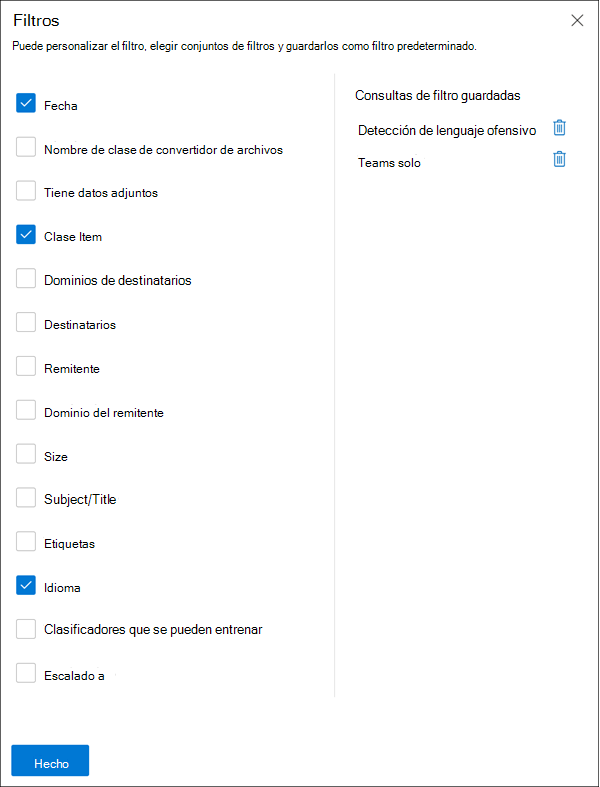
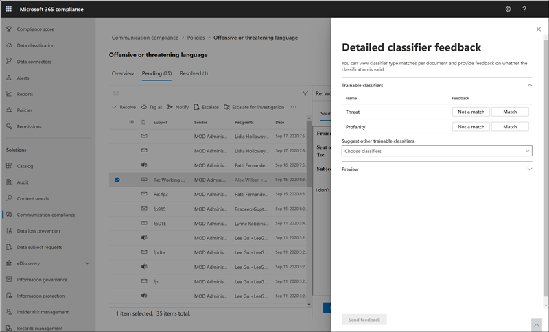

# Investigar y corregir las alertas de cumplimiento de las comunicaciones

Después de configurar las directivas de cumplimiento de comunicaciones, empezará a recibir alertas en el Centro de cumplimiento de Microsoft 365 para los problemas de mensajes que coincidan con las condiciones de la directiva. Siga las instrucciones de flujo de trabajo aquí para investigar y corregir problemas de alerta.

## Investigar alertas

El primer paso para investigar los problemas detectados por las directivas es revisar las alertas de cumplimiento de comunicaciones en el Centro de cumplimiento de Microsoft 365. Hay varias áreas en el área de solución de cumplimiento de comunicaciones que le ayudarán a investigar rápidamente las alertas, en función de cómo prefiera ver la agrupación de alertas:

- **Página de directiva** de cumplimiento de comunicaciones: cuando inicie sesión para usar credenciales para una cuenta de administrador en su organización de [https://compliance.microsoft.com](https://compliance.microsoft.com) Microsoft 365, seleccione Cumplimiento de comunicaciones para mostrar la página Directiva de cumplimiento **de** comunicaciones.  Esta página muestra las directivas de cumplimiento de comunicaciones configuradas para su organización de Microsoft 365 y vínculos a plantillas de directiva recomendadas. Cada directiva enumerada incluye el recuento de alertas que necesitan revisión, el número de elementos escalados y resueltos, el estado de la directiva y la fecha y hora del último examen de directiva. Al seleccionar una directiva, se muestran todas las alertas pendientes de coincidencias con la directiva, se selecciona una alerta específica para iniciar la página de detalles de la directiva y para iniciar acciones de corrección.
- **Alertas:** vaya a **Alertas de cumplimiento** de comunicaciones para mostrar los últimos 30 días de alertas  >   agrupadas por coincidencias de directiva. Esta vista le permite ver rápidamente qué directivas de cumplimiento de comunicaciones generan la mayoría de las alertas ordenadas por gravedad. Para iniciar acciones de corrección, seleccione la directiva asociada a la alerta para iniciar la **página detalles de la** directiva. Desde  la página Detalles de la directiva, puede  revisar un resumen de las actividades  de la página Información general,  revisar y actuar sobre los mensajes de alerta en la página Pendiente o revisar el historial de alertas cerradas en la página Resuelto.
- **Informes:** vaya a Informes **de cumplimiento de**  >  **comunicaciones** para mostrar widgets de informes de cumplimiento de comunicaciones. Cada widget proporciona información general sobre las actividades y los estados de cumplimiento de las comunicaciones, incluido el acceso a información más detallada sobre las coincidencias de directivas y las acciones de corrección.

### Uso de filtros

El siguiente paso es ordenar los mensajes para que sea más fácil investigar alertas. Desde la **página Detalles de** la directiva, el cumplimiento de comunicaciones admite el filtrado de varios niveles para varios campos de mensajes para ayudarle a investigar y revisar rápidamente los mensajes con coincidencias de directiva. El filtrado está disponible para los elementos pendientes y resueltos para cada directiva configurada. Puede configurar consultas de filtro para una directiva o configurar y guardar consultas de filtro personalizadas y predeterminadas para su uso en cada directiva específica. Después de configurar campos para un filtro, verá los campos de filtro que se muestran en la parte superior de la cola de mensajes de alerta que puede configurar para valores de filtro específicos.

Para obtener una lista completa de filtros y detalles de campo, consulte [Filtros en](communication-compliance-feature-reference.md#filters) el artículo de referencia de características.

#### Para configurar un filtro

1. Inicie sesión [https://compliance.microsoft.com](https://compliance.microsoft.com) con las credenciales de una cuenta de administrador de su organización de Microsoft 365.

2. En el Centro de cumplimiento de Microsoft 365, vaya a **Cumplimiento de comunicaciones.**

3. Seleccione la **pestaña Directivas** y, a continuación, seleccione una directiva para investigación y haga doble clic para abrir la **página** Directiva.

4. En la **página Directiva,** seleccione la pestaña **Pendiente** o **Resuelto** para mostrar los elementos para filtrar.

5. Seleccione el control **Filtros** para abrir la **página Detalles** de filtros.

6. Selecciona una o más casillas para habilitar filtros para estas alertas. Puede elegir entre varios filtros, *incluidos Date*, *Sender*, *Subject/Title*, *Clasificadores* y mucho más.

7. Si desea guardar el filtro seleccionado como filtro predeterminado, seleccione **Guardar como predeterminado.** Si desea usar este filtro como filtro guardado, seleccione **Listo.**

8. Si desea guardar los filtros seleccionados como una consulta de filtro, seleccione Guardar **el** control de consulta después de configurar al menos un valor de filtro. Escriba un nombre para la consulta de filtro y seleccione **Guardar**. Este filtro solo está disponible para esta directiva y aparece en la sección Consultas de **filtro guardadas** de la **página Detalles** de filtros.

    

### Uso de análisis duplicados cercanos y exactos

Las directivas de cumplimiento de comunicaciones analizan automáticamente y agrupan previamente duplicados de mensajes cercanos y exactos sin pasos de configuración adicionales. Esta vista le permite actuar rápidamente en mensajes similares uno a uno o como un grupo, lo que reduce la carga de investigación de mensajes para los revisores. A medida que se detectan duplicados, los controles **Duplicados cercanos** o **Duplicados exactos** se muestran en la barra de herramientas de acciones de corrección. Esta vista no está disponible si no se encuentran duplicados cercanos o exactos.

#### Para corregir duplicados

1. Inicie sesión [https://compliance.microsoft.com](https://compliance.microsoft.com) con las credenciales de una cuenta de administrador de su organización de Microsoft 365.

2. En el Centro de cumplimiento de Microsoft 365, vaya a **Cumplimiento de comunicaciones.**

3. Seleccione la **pestaña Directivas** y, a continuación, seleccione una directiva para investigación y haga doble clic para abrir la **página** Directiva.

4. En la **página Directiva,** seleccione la pestaña **Pendiente** o **Resuelto** para mostrar mensajes duplicados.

5. Seleccione los **controles Duplicados cercanos** **o Duplicados exactos** para abrir la página de detalles de duplicados.

6. Seleccione uno o más mensajes para corregir los controles de acción de estos mensajes.

7. Seleccione **Resolver**, **Notificar,** **Escalar** o **Descargar** para aplicar la acción a los mensajes duplicados seleccionados como filtro predeterminado.

8. Seleccione **Cerrar** después de completar las acciones de corrección en los mensajes.

    

## Corregir alertas

Independientemente de dónde empieces a revisar las alertas o el filtrado que configures, el siguiente paso es tomar medidas para corregir la alerta. Inicie la corrección de alertas con el siguiente flujo de trabajo en las **páginas Directiva** **o** Alertas.

### Paso 1: Examinar los conceptos básicos del mensaje

 A veces es obvio desde el origen o el asunto que un mensaje se puede corregir inmediatamente. Puede ser que el mensaje es falso o coincide incorrectamente con una directiva y debe resolverse como un falso positivo. Seleccione el **control Falso positivo** para resolver inmediatamente la alerta y quitarla de la cola de alertas pendientes. A partir de la información de origen o remitente, es posible que ya sepa cómo se debe enrutar o controlar el mensaje en estas circunstancias. Considere la posibilidad de usar los controles **Tag como** o **Escalate** para asignar una etiqueta a los mensajes aplicables o enviar mensajes a un revisor designado.

### Paso 2: Examinar los detalles del mensaje

Después de revisar los conceptos básicos del mensaje, es el momento de abrir un mensaje para examinar los detalles y determinar otras acciones de corrección. Seleccione un mensaje para ver la información completa del encabezado y el cuerpo del mensaje. Hay varias vistas diferentes disponibles para ayudarle a decidir el curso de acción correcto:

- **Vista de origen:** esta vista es la vista de mensajes estándar que se ve habitualmente en la mayoría de las plataformas de mensajería basadas en web. La información del encabezado tiene el formato de estilo normal y el cuerpo del mensaje admite archivos gráficos con formato y texto ajustado por palabras.
- **Vista de** texto: la vista de texto muestra una vista de solo texto numerado de línea del mensaje e incluye resaltado de palabras clave en mensajes y datos adjuntos para los términos coincidentes en la directiva de cumplimiento de comunicaciones asociada. El resaltado de palabras clave puede ayudarle a examinar rápidamente mensajes largos y datos adjuntos para el área de interés. En algunos casos, el texto resaltado puede estar solo en los datos adjuntos de los mensajes que coincidan con las condiciones de la directiva. Los archivos incrustados no se muestran y la numeración de líneas de esta vista resulta útil para hacer referencia a detalles pertinentes entre varios revisores.
- **Vista anotada:** esta vista permite a los revisores agregar anotaciones directamente en el mensaje que se guardan en la vista del mensaje.
- **Historial de usuarios:** la vista Historial de usuarios muestra todas las demás alertas generadas por cualquier directiva de cumplimiento de comunicaciones para el usuario que envía el mensaje.
- **Vista de detalles del mensaje:** vista avanzada de los metadatos del mensaje y la información de configuración.
- **Notificación de patrón detectado:** muchas acciones de acoso y acoso a lo largo del tiempo e implican instancias recurrentes del mismo comportamiento por parte de un usuario. La *notificación de patrón* detectado se muestra en los detalles de la alerta y llama la atención sobre la alerta. La detección de patrones se hace por directiva y evalúa el comportamiento de los últimos 30 días cuando un remitente envía al mismo destinatario al menos dos mensajes. Los investigadores y revisores pueden usar esta notificación para identificar comportamientos repetidos para evaluar la alerta según corresponda.
- **Mostrar vista traducir:** esta vista convierte automáticamente el texto  del mensaje de alerta en el idioma configurado en la configuración de idioma mostrado en la suscripción de Microsoft 365 para cada revisor. La vista Traducir ayuda a ampliar la compatibilidad de investigación para organizaciones con usuarios multilingües y elimina la necesidad de servicios de traducción adicionales fuera del proceso de revisión del cumplimiento de las comunicaciones. Con los servicios de Traducción de Microsoft, la vista Traducir puede estar activada y desactivada según sea necesario y admite una amplia variedad de idiomas. Para obtener una lista completa de los idiomas admitidos, vea [Microsoft Translator Languages](https://www.microsoft.com/translator/business/languages/). Los idiomas que aparecen en *la lista de idiomas* del traductor se admiten en la vista Traducir.

    

### Paso 3: Decidir una acción de corrección

Ahora que ha revisado los detalles del mensaje para la alerta, puede elegir varias acciones de corrección:

- **Resolver:** al seleccionar el control **Resolver** se  quita inmediatamente el mensaje de la cola de alertas pendientes y no se puede realizar ninguna otra acción en el mensaje. Al seleccionar **Resolver,** básicamente ha cerrado la alerta sin clasificación adicional y no se puede volver a abrir para realizar más acciones. Todos los mensajes resueltos se muestran en la **pestaña** Resuelto.
- **Falso positivo:** siempre puede resolver un mensaje como falso positivo en cualquier momento durante el flujo de trabajo de revisión de mensajes. El falso positivo significa que la alerta no era procesable o que el proceso de alerta generó incorrectamente la alerta. El mensaje no se puede volver a abrir y todos los mensajes falsos positivos se muestran en la **pestaña** Resuelto.
- **Power Automate (versión preliminar):** use un flujo de Power Automate para automatizar las tareas de proceso de un mensaje de alerta. De forma predeterminada,  el cumplimiento de las comunicaciones incluye el administrador de notificaciones cuando un usuario tiene una plantilla de flujo de alertas de cumplimiento de comunicaciones que los revisores pueden usar para automatizar el proceso de notificación para los usuarios con alertas de mensajes. Para obtener más información acerca de la creación y administración de flujos de Power Automate en el cumplimiento de las comunicaciones, vea el artículo de referencia de la característica de cumplimiento [de](communication-compliance-feature-reference.md#power-automate-flows) comunicaciones.
- **Etiqueta como:** etiquete el *mensaje* como *compatible,* no compatible o tan *cuestionable* como se relaciona con las directivas y estándares de su organización. Agregar etiquetas y comentarios de etiquetado le ayuda a microfiltrar alertas de directiva para escalaciones o como parte de otros procesos de revisión interna. Una vez completada la etiqueta, también puede decidir resolver el mensaje para moverlo fuera de la cola de revisión pendiente.
- **Notificar:** puede usar el control **Notificar** para asignar una plantilla de aviso personalizada a la alerta y enviar un aviso de advertencia al usuario. Elija la plantilla de  aviso adecuada configurada  en el área de configuración de cumplimiento de comunicaciones y seleccione Enviar un aviso por correo electrónico al usuario que envió el mensaje y para resolver el problema.
- **Escala:** con el control **Escalate,** puede elegir quién más de su organización debe revisar el mensaje. Elija una lista de revisores configurados en la directiva de cumplimiento de comunicaciones para enviar una notificación por correo electrónico solicitando una revisión adicional de la alerta del mensaje. El revisor seleccionado puede usar un vínculo en la notificación por correo electrónico para ir directamente a los elementos escalados a ellos para su revisión.
- **Escala para investigación:** con **el escalamiento** para el control de investigación, puede crear un nuevo caso de [eDiscovery](overview-ediscovery-20.md) avanzado para uno o varios mensajes. Proporcionará un nombre y notas para el nuevo caso, y el usuario que envió el mensaje que coincide con la directiva se asigna automáticamente como administrador del caso. No necesita ningún permiso adicional para administrar el caso. La creación de un caso no resuelve ni crea una nueva etiqueta para el mensaje. Puede seleccionar un total de 100 mensajes al crear un caso de eDiscovery avanzado durante el proceso de corrección. Se admiten los mensajes de todos los canales de comunicación supervisados por el cumplimiento de las comunicaciones. Por ejemplo, puede seleccionar 50 chats de Microsoft Teams, 25 mensajes de correo electrónico de Exchange Online y 25 mensajes de Yammer al abrir un nuevo caso de eDiscovery avanzado para un usuario.
- **Mejorar la clasificación (versión preliminar):** es posible que las alertas creadas a partir de coincidencias de tipo clasificador necesiten comentarios para ayudar a minimizar los falsos positivos en la organización. Use el control **mejorar la** clasificación para proporcionar comentarios sobre si la clasificación de cumplimiento de comunicaciones es válida o para sugerir otros clasificadores que se pueden entrenar para este tipo de coincidencia. Puedes confirmar que los clasificadores  son una coincidencia o no una *coincidencia,* o sugerir otros clasificadores que se puedan entrenar para asociar con este tipo de actividad de alerta en el futuro.

    1. Seleccione un mensaje de la lista de alertas.
    2. Elija los puntos suspensivos y seleccione **Mejorar clasificación.**
    3. En el **panel comentarios del clasificador** detallado, si el elemento es un verdadero positivo, elija **Coincidir**.  Si el elemento se incluyó incorrectamente en la categoría como falso positivo, elija **No coincidir.**
    4. Si hay otro clasificador que sería más apropiado para el elemento, elirálo en la lista Sugerir otros clasificadores que se **puedan entrenar.** Este comentario desencadena el otro clasificador para evaluar el elemento.

    > [!TIP]
    > Puedes proporcionar comentarios sobre varios elementos simultáneamente eligiendo todos ellos y, a continuación, eligiendo **Proporcionar** comentarios detallados en la barra de comandos.

    5. Elige **Enviar comentarios** para enviar  tu  evaluación de las clasificaciones de coincidencia y no de coincidencia y sugerir otros clasificadores que se puedan entrenar. Cuando has proporcionado 30 instancias de comentarios a un clasificador, se vuelve a entrenar automáticamente. La readaptación puede tardar de 1 a 4 horas en completarse. Los clasificadores solo se pueden volver a entrenar dos veces al día.

    > [!IMPORTANT]
    > Esta información va al clasificador de su espacio empresarial, **no vuelve a Microsoft.**

    Para obtener más información sobre el clasificador de reciclaje para el cumplimiento de las comunicaciones, vea el artículo Sobre cómo volver a entrenar un clasificador en el cumplimiento [de las](classifier-how-to-retrain-comms-compliance.md) comunicaciones.

    

- **Quitar mensaje en Teams:** con el control Quitar mensaje en **Teams,** puede bloquear mensajes inapropiados y contenido identificado en alertas de los canales de Microsoft Teams y chats de grupo y 1:1. Los mensajes y el contenido eliminados se reemplazan por una sugerencia de directiva que explica que está bloqueado y la directiva que se aplica a su eliminación de la vista. A los destinatarios se les proporciona un vínculo en la sugerencia de directiva para obtener más información sobre la directiva aplicable y el proceso de revisión. El remitente recibe una sugerencia de directiva para el mensaje y el contenido bloqueados, pero puede revisar los detalles del mensaje bloqueado y el contenido para obtener contexto sobre la eliminación.

    

### Paso 4: Determinar si los detalles del mensaje deben archivarse fuera del cumplimiento de las comunicaciones

Los detalles del mensaje se pueden exportar o descargar si necesita archivar los mensajes en una solución de almacenamiento independiente. Al seleccionar el control **descargar,** se agregan automáticamente los mensajes seleccionados a un archivo . Archivo ZIP que se puede guardar en almacenamiento fuera de Microsoft 365.
